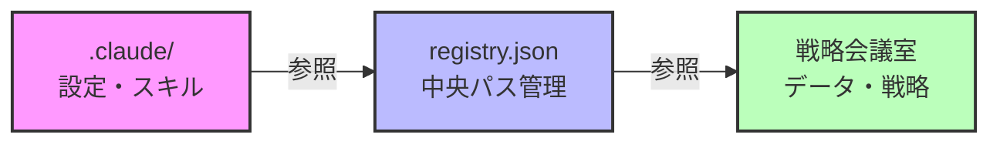
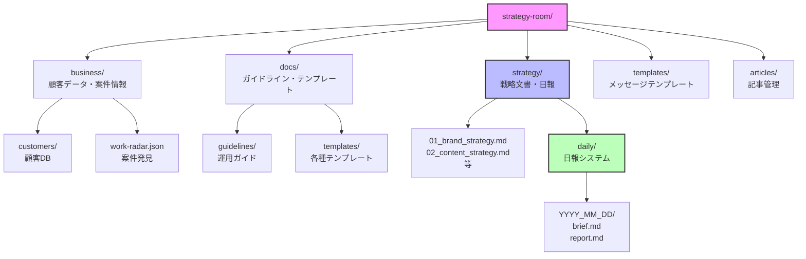
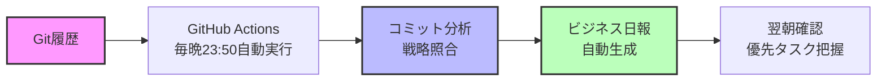

# Claude Code、実はこんなことまでできる

Claude Codeをプログラミング補助だけに使っていませんか？実はこんなことまでできます:

- **プログラミング** — コード生成、バグ修正、リファクタリング、テスト作成
- **記事執筆** — note、Zenn、ブログ記事を自動生成
- **ドキュメント管理** — PRD、設計書、議事録を体系的に管理
- **経理業務** — 経費精算、請求書作成、帳簿管理
- **日報・進捗管理** — Git履歴から自動で日報生成、戦略分析付き
- **マーケティング** — エゴサーチ自動化、SNS効果分析
- **情報収集** — 業界動向の自動スクリーニング、ビジネスチャンス発見

つまり、**仕事におけるあらゆるドキュメントワークをClaude Codeで完結できる**んです。

# でも、運用が続かない理由

こんなに可能性があるのに、実際にやってみると壁にぶつかります:

- **ファイルがごちゃごちゃ** — 日報、記事、戦略、テンプレート...どこに何を置けばいいか分からない
- **対話で書いた文章を毎回コピペ** — AIが出力した日報やレポートをいちいち自分でファイルに保存
- **結局続かない** — 手間がかかりすぎて、結局やめてしまう
- **実践的じゃない** — 運用方法が確立されてなくて、試行錯誤の連続

# 現役エンジニアが考えた解決策

大丈夫、**現役エンジニアの私が実践的な運用方法**を考えました。

それが「**戦略会議室アプローチ**」です。`.claude`とは別に専用フォルダを作ることで、どんなことでも効率よく、しかも継続的に運用できます。

名前の由来？正直、**かっこいいからロマンでつけました**（笑）。AIと一緒に戦略を練る場所、という意味です。`ai-workspace`でも良かったんですが、愛着が湧く名前にしたかったんです。

# この記事で実現できること

戦略会議室アプローチを導入すると、こんな革命が起きます:

| Before | After |
|--------|-------|
| テンプレート変更に1-2時間 | **1分で完了**（体感で半分以下の工数） |
| 日報を手動で書く（面倒で続かない） | **Git履歴から自動生成**（戦略分析付き） |
| エゴサーチを手動で実施 | **週1回AIが自動実行**（効果分析レポート付き） |
| 業界情報を手動で収集 | **毎日AIが要約**（ビジネスチャンス発見） |
| やみくもに作業 | **To Doリストを書くだけで戦略的な1日**（AIが秘書のように働く） |

**フリーランス・ひとり社長**にとって、これはまさに革命です。「めんどくさい」と思っていた作業が全て自動化され、**戦略的・戦術的な毎日**を簡単に送れるようになります。

:::message
**この記事の内容**
- `.claude`だけでは足りない理由
- 戦略会議室の設計思想（Interface/Implementation分離）
- 実装方法（15分で完了）
- 4つのメリット（テンプレート一元管理・戦略共有・AI秘書化・メンテナンス性）
- 実践例（私のstrategy-room構成）
:::

# 前提知識: Claude Code CLI の基本

本記事は[Claude Code CLI](https://github.com/anthropics/claude-code)がインストール済みで、以下を理解している方を対象としています:

- `.claude`フォルダの基本構造
- [スキル・エージェント・コマンド](https://code.claude.com/docs/en/skills)の概念

# なぜ.claudeだけでは足りないのか

`.claude`フォルダだけで運用すると、こんな問題が出てきます:

- **隠しファイルで編集が面倒**、肥大化すると可読性が低下
- **テンプレートをスキル内に埋め込む**とメンテナンス性が低い（変更のたびに全スキルを編集）
- **AIに戦略・目標を共有する仕組みがない**
- **日報や進捗管理の場所がない**

特に「**戦略を共有できない**」のが致命的でした。開発方針（クリーンアーキテクチャ採用、TDD重視）や記事戦略（ターゲット読者、月間投稿目標）をAIに理解させたい。でも、`.claude`にはそんな場所がありません。

# 戦略会議室の設計思想: 3つのフォルダで役割分担

では、具体的にどのような構成にするのか見ていきましょう。

## 役割分担

| フォルダ | 役割 | 変更頻度 | 例 |
|---------|------|---------|-----|
| **`.claude/`** | スキル・エージェント・コマンド定義 | 低（機能追加時のみ） | スキル定義、エージェント定義 |
| **戦略会議室** | ビジネスデータ、テンプレート、ガイドライン、日報 | 高（日々更新） | 顧客データ、戦略文書、テンプレート、日報 |
| **`registry.json`** | 両者を接続するインターフェース | 低（パス変更時のみ） | パス管理 |

## アーキテクチャ図: registry.json が中心



:::message
**ポイント**: `.claude`と戦略会議室は直接参照せず、`registry.json`を経由します。これにより、パス変更時は`registry.json`1箇所の修正で済みます。
:::

# 実装方法: 15分で完了する3ステップ

実装は驚くほど簡単です。しかも、**フォルダ作成もスキル作成もClaude Codeに任せればOK**。あなたは設計を理解して、プロンプトを打つだけです。

## ステップ1: 戦略会議室フォルダを作成

まず、`.claude`とは別に専用フォルダを作ります。`~/Projects/strategy-room`という名前で作成しますが、名前は自由に変更できます。

**設計のポイント:**
- ビジネスデータ（顧客情報、案件情報）
- ドキュメント（ガイドライン、テンプレート）
- 戦略（年間目標、月間計画、日報）
- メッセージテンプレート（営業文、提案書）

これらを整理して配置します。

:::details Claude にフォルダ作成を依頼するプロンプト例
```
以下のディレクトリ構成で戦略会議室フォルダを作成してください:

~/Projects/strategy-room/
├── business/customers/      # 顧客データ
├── docs/guidelines/         # ガイドライン
├── docs/templates/          # テンプレート
├── strategy/                # 戦略文書
│   └── daily/               # 日報
└── templates/customer-messages/  # 顧客向けメッセージ

各ディレクトリに .gitkeep を配置して、Git管理できるようにしてください。
```

Claudeがbashコマンドを実行して、フォルダ構成を自動で作ってくれます。
:::

**手動で作る場合:**

```bash
mkdir -p ~/Projects/strategy-room
cd ~/Projects/strategy-room

# 基本ディレクトリを作成
mkdir -p business/customers      # 顧客データ
mkdir -p docs/guidelines         # ガイドライン
mkdir -p docs/templates          # テンプレート
mkdir -p strategy/daily          # 日報
mkdir -p templates/customer-messages  # 顧客向けメッセージ
```

## ステップ2: registry.json でパス管理

次に、`.claude`と戦略会議室を接続する`registry.json`を作成します。これが**Interface/Implementation分離**の要です。

**設計のポイント:**
- 左辺（キー名）は固定インターフェース → スキルから参照
- 右辺（ファイルパス）は自由に変更可能 → パス変更時も左辺は変わらない
- パス変更時は`registry.json`1箇所だけ修正すればOK

:::message alert
**重要**: `registry.json`は公式のClaude Code機能ではなく、本記事で提案する独自の設計パターンです。公式のClaude Codeは[`settings.json`、`settings.local.json`、`.mcp.json`](https://code.claude.com/docs/en/settings)を使用します。この設計パターンを採用する場合は、自己責任で実装してください。
:::

:::details Claude に registry.json 作成を依頼するプロンプト例
```
~/.claude/registry.json を以下の内容で作成してください:

{
  "strategy": {
    "brand": "~/Projects/strategy-room/strategy/01_brand_strategy.md",
    "content": "~/Projects/strategy-room/strategy/02_content_strategy.md",
    "daily": "~/Projects/strategy-room/strategy/daily/"
  },
  "docs": {
    "templates": {
      "customerMessages": "~/Projects/strategy-room/templates/customer-messages/"
    }
  }
}

ファイルを作成後、内容を確認してください。
```

Claudeがファイルを作成し、内容を表示してくれます。
:::

**手動で作る場合（最小限の例）:**

```json:~/.claude/registry.json
{
  "strategy": {
    "brand": "~/Projects/strategy-room/strategy/01_brand_strategy.md",
    "content": "~/Projects/strategy-room/strategy/02_content_strategy.md",
    "daily": "~/Projects/strategy-room/strategy/daily/"
  },
  "docs": {
    "templates": {
      "customerMessages": "~/Projects/strategy-room/templates/customer-messages/"
    }
  }
}
```

:::details registry.jsonの完全な例
本格的な運用では、以下のような構成になります:

```json:~/.claude/registry.json（完全版）
{
  "sources": {
    "customers": {
      "metadata": "~/Projects/strategy-room/business/customers/metadata.json",
      "sensitive": "~/Projects/strategy-room/business/customers/sensitive.json"
    },
    "articles": {
      "inbox": "~/Projects/strategy-room/articles/00_Inbox/",
      "note": "~/Projects/strategy-room/articles/03_note/",
      "zenn": "~/Projects/strategy-room/articles/04_Zenn/",
      "coconara": "~/Projects/strategy-room/articles/02_Coconara/"
    },
    "projects": "~/Projects/strategy-room/projects/projects.json",
    "workRadar": "~/Projects/strategy-room/business/work-radar.json"
  },
  "docs": {
    "templates": {
      "customerMessages": "~/Projects/strategy-room/templates/customer-messages/",
      "reports": "~/Projects/strategy-room/docs/templates/reports/",
      "steering": "~/Projects/strategy-room/docs/templates/steering/"
    },
    "guidelines": {
      "claude": {
        "naming": "~/Projects/strategy-room/docs/guidelines/claude/naming-rules.md",
        "development": "~/Projects/strategy-room/docs/guidelines/claude/development-guidelines.md"
      },
      "customer": {
        "management": "~/Projects/strategy-room/docs/guidelines/customer/management-rules.md"
      },
      "workDiscovery": {
        "scoring": "~/Projects/strategy-room/docs/guidelines/work-discovery/scoring-criteria.md"
      }
    }
  },
  "strategy": {
    "brand": "~/Projects/strategy-room/strategy/01_brand_strategy.md",
    "content": "~/Projects/strategy-room/strategy/02_content_strategy.md",
    "platform": "~/Projects/strategy-room/strategy/03_platform_strategy.md",
    "annualGoals": "~/Projects/strategy-room/strategy/04_annual_goals_2026.md",
    "daily": "~/Projects/strategy-room/strategy/daily/"
  },
  "reports": {
    "security": "~/Projects/strategy-room/reports/security/",
    "improvements": "~/Projects/strategy-room/reports/improvements/",
    "customerAnalysis": "~/Projects/strategy-room/reports/customer-analysis/",
    "workDiscovery": "~/Projects/strategy-room/reports/work-discovery/"
  }
}
```

**ポイント:**
- 必要な部分だけ定義すればOK（段階的に拡張可能）
- 左辺（キー名）は固定インターフェース
- 右辺（パス）は自由に変更可能
:::

:::details Interface/Implementation分離の詳細
**設計原則**: registry.jsonの左辺（キー名）は固定、右辺（ファイルパス）は柔軟に変更可能

**良い例:**
```json
{
  "reconnect": "~/templates/customer-messages/reconnect-v2.md"
}
```

バージョン情報はvalue（ファイル名）に含める。keyはインターフェースとして固定。

**悪い例:**
```json
{
  "reconnectV2": "~/templates/customer-messages/reconnect.md"
}
```

バージョン情報をkeyに含めると、バージョンアップ時にスキル側の参照も変更が必要になる。

**メリット:**
- スキル側は`registry.json`の`.docs.templates.reconnect`を参照するだけ
- ファイル名変更時は`registry.json`1箇所の修正で完結
- スキル定義の修正が不要
:::

## ステップ3: スキルで registry.json を参照

最後に、各スキルが`registry.json`からパスを取得するように設定します。これが**Phase 0パターン**です。

**設計のポイント:**
- 全スキルの最初（Phase 0）で`registry.json`を読み込む
- 必要なパスだけを変数に格納
- ハードコードされたパスは一切書かない

これにより、パス変更時は`registry.json`1箇所の修正で全スキルに反映されます。

:::details Claude にスキル作成を依頼するプロンプト例
```
~/.claude/skills/daily-report-skill/SKILL.md を作成してください。

このスキルは以下の機能を持ちます:
- Git履歴から日報を自動生成
- 戦略文書と照らし合わせて分析
- registry.jsonからパスを取得（Phase 0パターン）

Phase 0で以下のパスを読み込んでください:
- .strategy.daily → DAILY_REPORTS_PATH
- .strategy.brand → BRAND_STRATEGY_PATH

Phase 1以降で実装してください:
1. Git履歴を取得（昨日のコミット）
2. 戦略文書を読み込み
3. Git履歴と戦略を照らし合わせて日報生成
4. DAILY_REPORTS_PATH に保存

スキル定義を作成してください。
```

Claudeがスキル定義ファイルを作成してくれます。
:::

**手動で作る場合（Phase 0パターンの例）:**

```markdown:~/.claude/skills/customer-reconnect-skill/SKILL.md
## Phase 0: 初期化【必須】

Read toolで `~/.claude/registry.json` を読み込み、必要なパスを取得。

**読み込むパス:**
- `.sources.customers.metadata` → CUSTOMERS_METADATA_PATH
- `.docs.templates.customerMessages` → CUSTOMER_MESSAGES_PATH

**パス展開:**
- `~` → `$HOME` で絶対パス変換
  - 例: `~/Projects/strategy-room/` → `/Users/username/Projects/strategy-room/`

**進行判定:**
- registry.json正常読み込み → 次へ
- キーが存在しない → エラー報告して中断
```

このパターンにより:
- 全スキルで統一されたパス取得方法
- パス変更時は`registry.json`1箇所のみ修正
- スキル定義にハードコードされたパスが存在しない

**これで実装完了！** あとは戦略ドキュメントを書いたり、テンプレートを配置したりするだけです。

# 実践例: 私の strategy-room 構成

私の実際の運用例を紹介します。

## ディレクトリ構成

戦略会議室の主要なディレクトリ構成は以下の通りです:



:::details 詳細なディレクトリツリー
```
~/Projects/strategy-room/
├── business/              # ビジネスデータ
│   ├── customers/         # 顧客データベース
│   │   ├── metadata.json  # 顧客基本情報（LLM送信可）
│   │   └── sensitive.json # 機密情報（LLM送信禁止）
│   └── work-radar.json    # 案件発見データ
├── docs/                  # ドキュメント・テンプレート
│   ├── guidelines/        # ガイドライン
│   │   ├── claude/        # Claude Code開発ガイド
│   │   ├── customer/      # 顧客管理ガイド
│   │   └── work-discovery/ # 案件発見ガイド
│   └── templates/         # テンプレート
│       ├── claude/        # 開発テンプレート
│       ├── message/       # メッセージ生成
│       ├── reports/       # レポート
│       └── steering/      # タスク管理
├── strategy/              # 戦略・方針
│   ├── 01_brand_strategy.md    # ブランド戦略
│   ├── 02_content_strategy.md  # コンテンツ戦略
│   ├── 03_platform_strategy.md # プラットフォーム戦略
│   ├── 04_annual_goals_2026.md # 年間目標
│   └── daily/             # デイリーシステム
│       └── 2026_01_11/    # 日付別フォルダ
│           ├── brief.md   # モーニング・ブリーフ
│           └── report.md  # ビジネス日報
├── templates/             # メッセージテンプレート
│   └── customer-messages/ # 顧客向けメッセージ
│       ├── reconnect-v2.md      # リコンタクト営業
│       ├── proposal.md          # 提案書
│       └── support.md           # サポート返信
└── articles/              # 記事管理
    ├── 00_Inbox/          # 下書き
    ├── 03_note/           # note記事
    └── 04_Zenn/           # Zenn記事
```
:::

## 戦略ドキュメントの例

戦略文書の例（プログラム開発の場合）:

```markdown:strategy/01_development_strategy.md
---
type: strategy
category: development
title: 開発戦略書
version: 1.0
status: active
---

## 設計方針
- **アーキテクチャ**: クリーンアーキテクチャを採用
- **テスト**: テスト駆動開発（TDD）を重視、カバレッジ80%以上
- **コード品質**: ESLintでの静的解析、Prettierでの自動整形

## 技術スタック
- **フロントエンド**: React + TypeScript
- **バックエンド**: Node.js + Express
- **データベース**: PostgreSQL
- **インフラ**: Docker + AWS ECS

## 今月の開発目標
- ユーザー認証機能の実装完了
- APIエンドポイント10個追加
- パフォーマンス最適化（レスポンス時間30%改善）
```

記事作成の場合:

```markdown:strategy/02_content_strategy.md
---
type: strategy
category: content
title: コンテンツ戦略書
---

## コンテンツ方針
- **ターゲット読者**: 中級エンジニア（実務経験1-3年）
- **SEO戦略**: ロングテールキーワード重視
- **更新頻度**: 週1本以上

## 今月の投稿目標
- 技術記事: 4本
- チュートリアル: 2本
- トラブルシューティング: 2本
```

これらの戦略書は`registry.json`で管理され、Claude Codeの各スキルから参照されます。

:::message
**戦略共有の効果**: Claudeが「クリーンアーキテクチャ採用」「TDD重視」といった開発方針を理解し、それに沿ったコード提案をしてくれます。記事作成では「ターゲット読者は中級者」を考慮した文章を自動生成します。
:::

## 日報システムの例: Git 履歴から自動生成

毎朝自動生成される「モーニング・ブリーフ」の一部（Git履歴から自動抽出）:

```markdown:strategy/daily/2026_01_11/brief.md
## 📋 前日の振り返り（Git履歴から自動生成）

### 実行した戦術
- ユーザー認証APIの実装完了（コミット3件、+250行）
- ユニットテスト20ケース追加（コミット2件、+180行）
- ドキュメント更新（コミット1件、+30行）

### 戦略的分析（AIの指摘）
✅ ユーザー認証APIは今月目標に直結。優先度高い作業。
⚠️ ドキュメント更新は重要だが、今は優先度低。来週まとめて対応推奨。
💡 ユニットテストは目標カバレッジ80%に向けて順調。残り15%。

## 🎯 今日の優先タスク（AI推奨）

| 優先度 | タスク | 根拠 |
|--------|--------|------|
| 最高 | パフォーマンス最適化 | 月間目標「レスポンス時間30%改善」の達成に向けて |
| 高 | 技術記事執筆 | 今月の投稿目標4本のうち未達2本 |

## 📊 戦略進捗スナップショット

| 指標 | 年間目標 | 今月目標 | 現在 | 達成率 |
|------|---------|---------|------|--------|
| APIエンドポイント | 100個 | 10個 | 7個 | 70% |
| テストカバレッジ | 80% | 80% | 65% | 81% |
| 記事投稿 | 52本 | 4本 | 2本 | 50% |
```

**あなたがやること**: 朝起きてTo Doリストを書くだけ。AIが勝手にGit履歴を分析して、戦略的な視点で「昨日の作業」を評価してくれます。

# 4つのメリット: テンプレート一元管理・戦略共有・AI秘書化・メンテナンス性

戦略会議室アプローチによる具体的なメリットをまとめます。

## メリット1: テンプレート一元管理で品質担保

**Before（スキル内埋め込み）:**
```markdown
# customer-reconnect-skill/SKILL.md
テンプレート: いつもお世話になっております...

# message-skill/SKILL.md
テンプレート: いつもお世話になっております...（同じ内容が重複）
```

変更時に全スキルを編集する必要があり、メンテナンス性が低い。

**After（テンプレート外部化）:**
```markdown
# templates/customer-messages/reconnect-v2.md
いつもお世話になっております...

# registry.json
"customerMessages": "~/templates/customer-messages/"

# 各スキルのPhase 0
Read registry.json → テンプレートパスを取得 → 参照
```

テンプレート変更時は1ファイルのみ修正すればOK。全スキルで品質が統一されます。

:::details メンテナンス工数の実測（筆者環境）
**筆者環境での実測結果（スキル10個の場合）:**

**従来方式（スキル内埋め込み）:**
- テンプレート変更時: 10スキルを順番に編集 → 約50分
- 動作確認: 各スキルで確認 → 約30分
- 合計: **約80分**

**戦略会議室方式:**
- テンプレート変更: 1ファイルのみ編集 → 約5分
- 動作確認: 1回のみ → 約3分
- 合計: **約8分**

**体感として90%程度の工数削減**を実感しています（環境により異なります）。
:::

## メリット2: 戦略・目標共有で AI が目標指向に

戦略会議室に`01_development_strategy.md`や`02_content_strategy.md`を配置すると、Claudeが以下を理解します:

- **設計方針**: クリーンアーキテクチャ、TDD重視
- **今月の目標**: APIエンドポイント10個追加、記事4本投稿
- **ターゲット読者**: 中級エンジニア（実務経験1-3年）

この結果、Claudeの提案が「目標指向」になります:

**Before:**
```
ユーザー: 今週のタスクを教えて
Claude: 開発タスクをこなしましょう
```

**After:**
```
ユーザー: 今週のタスクを教えて
Claude: 今月の目標「APIエンドポイント10個追加」に向けて、
残り3個の実装が必要です。優先順位は以下の通りです:
1. ユーザープロファイル取得API（依存関係あり）
2. 認証トークン更新API
3. ...

また、記事投稿目標4本のうち2本が未達です。
今週中に1本執筆を完了させましょう。
```

戦略を共有することで、AIが「開発パートナー」として機能します。

## メリット3: AI が秘書になる — 日報・エゴサーチ・業界情報を自動化

戦略会議室の最大の革命は、**AIが秘書のように働いてくれる**ことです。

### Git 履歴から日報を自動生成

今まで「だるくて難しかった」日々の振り返りが、AIの自動化で激変します:



**生成される日報の内容例:**

```markdown
## やったこと（自動生成）
- ユーザー認証APIの実装完了（コミット3件）
- ユニットテスト20ケース追加（コミット2件）
- ドキュメント更新（コミット1件）

## 戦略的分析（AIの指摘）
✅ ユーザー認証APIは今月目標に直結。優先度高い作業。
⚠️ ドキュメント更新は重要だが、今は優先度低。来週まとめて対応推奨。
💡 ユニットテストは目標カバレッジ80%に向けて順調。残り15%。
```

**あなたがやること**: To Doリストを朝書くだけ。あとはAIが勝手に分析してくれます。

### エゴサーチ自動化（SNS投稿効果分析）

自社サービスをマーケティングしている人向け。週1回、AIが勝手にエゴサーチして効果分析:

```markdown
## エゴサーチ結果（2026-01-11）
- X投稿「AIキャラクター」: 15いいね、3リポスト → 平均以上
- note記事「Claude運用術」: 500PV → 目標達成
- Zenn記事「戦略会議室」: 100いいね → 想定の2倍

## 戦略的提案
✅ 「Claude運用術」系の記事は反響良好。月2本に増やす推奨。
⚠️ X投稿の頻度が週1回。目標は週3回。投稿増やすべき。
💡 Zenn記事が予想以上の反響。技術記事に力を入れる方向性が正解。
```

**API料金も最小限**: 週1回実行で月4回、コスト効率も抜群です。

### 業界情報の自動スクリーニング

AI/プログラミング系の最新情報を毎日自動で要約:

```markdown
## 業界動向レポート（2026-01-11）
1. Claude 4.5リリース — マルチモーダル強化
2. Next.js 15のApp Router最適化 — パフォーマンス30%向上
3. GitHub Copilot Workspaceベータ版 — AI開発環境統合

## ビジネスチャンス
💡 Claude 4.5のマルチモーダル対応 → AIキャラクター事業に画像認識追加検討
💡 Next.js 15最適化 → 自社Webアプリのパフォーマンス改善に導入
```

**ビジネスチャンスを逃さない**: 毎日の情報収集をAIに任せ、あなたは意思決定に集中できます。

### AI と戦略を共有 — もう1つの客観的意見として

AIのレポートを「鵜呑み」にするのではなく、**もう1つの客観的な意見**として活用できるのが素晴らしい点です:

| あなたの課題 | AIの支援 |
|------------|---------|
| やることが多すぎて優先順位が不明 | 戦略目標から逆算して優先タスクを提示 |
| 進捗が見えず不安 | 毎朝、目標達成率を可視化 |
| 孤独な意思決定 | 戦略的レポートで客観的な視点を提供 |
| めんどくさくてやみくもに作業 | 戦略的・戦術的に基づいた毎日へ変革 |

特に**フリーランス・ひとり社長**にとって、AIが秘書のように戦略的レポートを出してくれることで、生産的な毎日を簡単に送れるようになります。

:::message alert
GitHub Actionsで自動化する場合は、API KeyのSecrets登録と`.gitignore`設定が必須です。詳細は下記を展開してください。
:::

:::details セキュリティ設定（GitHub Actions利用時・必須）
GitHub Actionsで日報・エゴサーチ・業界情報を自動化する場合、以下のセキュリティ設定が必要です:

**1. API Keyの登録:**
- `ANTHROPIC_API_KEY`を[Anthropic Console](https://docs.anthropic.com/)で取得
- GitHubリポジトリの Settings > Secrets and variables > Actions で登録
- **絶対にコードに直接書かない**

**2. .gitignoreの設定:**
機密情報をGitに含めないよう、以下を`.gitignore`に追加:
```gitignore
# 顧客機密情報
business/customers/sensitive.json

# API Keys・環境変数
*.env
.env.local
**/secrets/

# ローカル設定
settings.local.json
```

**3. データ分離:**
- 顧客データは`metadata.json`（LLM送信可）と`sensitive.json`（送信禁止）を明確に分離
- `sensitive.json`には氏名・メールアドレス・電話番号など個人情報を格納
- `metadata.json`には顧客ID・購入履歴・統計情報のみ

**4. 公式ドキュメント:**
詳細は[Claude Code GitHub Actions公式ドキュメント](https://code.claude.com/docs/en/github-actions)を参照してください。
:::

## メリット4: メンテナンス性が飛躍的に向上

**パス変更時の修正箇所（筆者環境での実測）:**

| 方式 | 修正箇所 | 工数 |
|------|---------|------|
| ハードコード | 全スキル（約30箇所） | 1-2時間 |
| registry.json | 1箇所のみ | 1分未満 |

筆者環境では、パス変更時の工数が**体感として半分以下**になりました。

Interface/Implementation分離により、実装詳細（ファイルパス）を柔軟に変更できます。詳しくは[カスタマイズガイド](https://alexop.dev/posts/claude-code-customization-guide-claudemd-skills-subagents/)を参照してください。

# まとめ: 戦略会議室で AI 運用が革命的に変わる

本記事では、Claude運用を劇的に改善する「戦略会議室アプローチ」を紹介しました。

## 学んだこと

1. **`.claude`とは別に戦略会議室フォルダを作る** → ビジネスデータと設定を分離
2. **registry.jsonでInterface/Implementation分離** → メンテナンス性が大幅向上
3. **Git履歴から日報を自動生成** → だるかった振り返りが自動化
4. **エゴサーチ・業界情報を自動化** → ビジネスチャンスを逃さない
5. **AIを秘書として活用** → To Doリストを書くだけで戦略的な1日がスタート

筆者環境では、テンプレート変更が**体感として半分以下**になり、日報・エゴサーチ・業界情報スクリーニングが完全自動化されました。今まで「めんどくさい」と思ってやみくもに作業していた人も、**戦略的・戦術的な毎日**を簡単に送れるようになります。これは個人開発者やフリーランスにとって、まさに革命です。

戦略会議室アプローチで、あなたのClaude運用を次のレベルへ。

この記事が参考になったら、ぜひあなたの戦略会議室の構成もシェアしてください！

https://coconala.com/users/1772507