## はじめに

Claude Codeで大規模機能を実装していた時、気づいたら1000行のファイルが10個できていた。

「このコード、何やってるんだっけ？」と途方に暮れた僕は、全て手作業で直す羽目になった。何のためのAIだったのか。

しかし、ある設計思想に出会ってから、全てが変わった。それが **「AIを組織として扱う」** という発想です。

:::message
**本記事の想定読者**: Claude Codeの基本的な使い方を理解している方。AI組織化の全体像を把握したい方。
:::

## 本記事の核心

私のClaude Code運用の核心は、 **「全ての開発をコマンド経由で実行する」** ことです。

### Command → Skill → Sub Agent の明示的な呼び出し

Claude Codeでは、Command経由で明示的にSkillを呼べるようにするべきです。Skillは複数のサブエージェントを並列で操作できるように、参照データと権限を与えます。

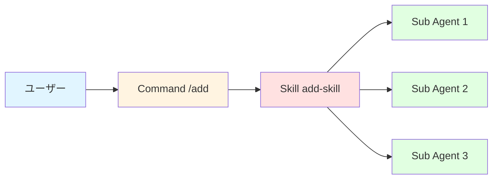

これにより、 **1つのコマンドで再現性よく、特定の専門的な作業を素早くAIに任せる** ことができます。

### 開発フローは2段階のみ

私の運用では、開発は **計画と実装の2段階のみ** です。

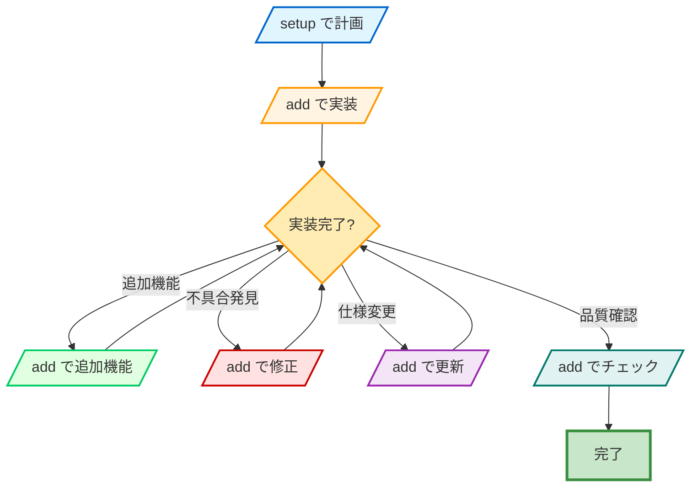

1. **最初に計画を立てる**: `/setup` コマンドで6つの設計書を作成
2. **計画に沿って開発**: 以降は全て `/add` コマンドから実装

**追加機能、修正、更新、チェックは全て `/add` コマンドから実行** します。

### `/add` コマンドの仕組み

`/add` コマンドは `add-skill` を呼び出します。`add-skill` の中身は以下の通りです：

```
Phase 1: 分析【3つ並列】
  ├─ Phase1-1: コード探索（code-explorer）
  ├─ Phase1-2: アーキテクチャ分析（Plan）
  └─ Phase1-3: テスト分析（code-explorer）

Phase 2: 実装【Main Agent単独】
  └─ 設計に従って実装

Phase 3: 検証【3つ並列】
  ├─ Phase3-1: テスト実行（implementation-checker）
  ├─ Phase3-2: コードレビュー（code-reviewer）
  └─ Phase3-3: 型チェック（implementation-checker）
```

これにより、 **再現性のある高品質な実装** が可能になります。

## AI組織化とは何か

従来のAIコーディングツールは「単一エージェント」として動作します。ユーザーが指示を出すと、AIが1人で考えて1人で実装する。まるで「1人のエンジニア」のように。

しかし、現実のソフトウェア開発では、1人のエンジニアが全てを担当することは稀です。実装者、レビュアー、テスター、アーキテクトなど、複数の役割が協働してプロダクトを作ります。

**AI組織化** とは、この「複数の役割」をAI内部で再現する設計思想です。

**従来型（単一エージェント）**
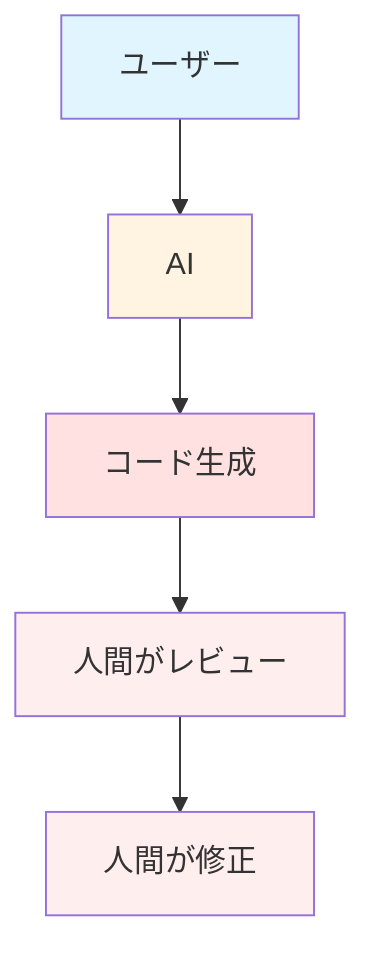

**AI組織化（Main × Sub Agent）**
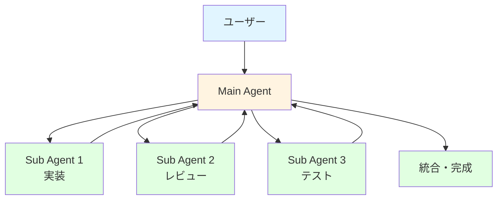

| 項目 | 従来型（単一エージェント） | AI組織化（Main × Sub） |
|------|--------------------------|----------------------|
| 実装 | AIが1人で実装 | Sub Agentが並列実装 |
| レビュー | 人間が手作業でレビュー | Sub Agent（レビュアー）が自動レビュー |
| 修正 | 人間が手作業で修正 | Main Agentが指示、Sub Agentが修正 |
| 統合 | 人間が最終確認 | Main Agentが統合・最終判断 |
| 処理時間 | 長い（直列処理） | 短い（並列処理） |

### なぜ並列化で50%削減できるのか

理屈は単純です。2つの独立したタスクを並列実行すれば、時間は約半分になります。

**従来（直列実行）**
```
Sub Agent A: [====================] 20分
Sub Agent B:                       [====================] 20分
            ↑                      ↑                      ↑
           0分                    20分                   40分
合計: 40分
```

**AI組織化（並列実行）**
```
Sub Agent A: [====================] 20分
Sub Agent B: [====================] 20分
            ↑                      ↑
           0分                    20分
合計: 20分（最も遅いタスクの時間）
```

:::message
**削減率の計算**: (40分 - 20分) / 40分 = **50%削減**

3つ並列なら66%削減、4つ並列なら75%削減と、並列数に応じて削減率が上がります。
:::

## 1. Claude Codeの3層設計

AI組織化を実現するには、まず「基盤となる構造」を理解する必要があります。私は以下の3層設計を採用しています。

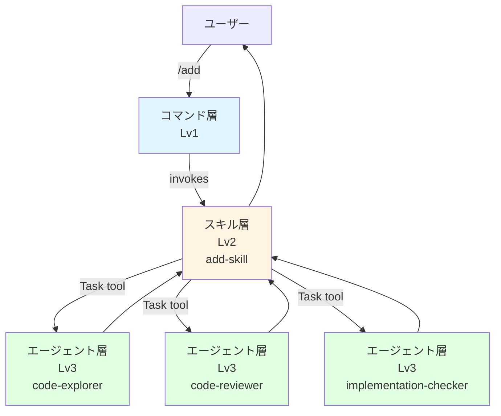

### 各層の役割

| 層 | 役割 | 例 |
|---|------|-----|
| **コマンド層** | ユーザーが呼び出すインターフェース | `/add`, `/write-note` |
| **スキル層** | 処理ロジックを定義 | `add-skill/`, `write-note-skill/` |
| **エージェント層** | 局所的なタスク実行 | `code-explorer`, `code-reviewer` |

:::details 3層構造の実装例（クリックで展開）
```
~/.claude/
├── commands/
│   └── workflows/
│       └── add.md          # コマンド層: /add
├── skills/
│   └── add-skill/
│       └── SKILL.md        # スキル層: 処理ロジック
└── agents/
    ├── code-explorer.md    # エージェント層: コード探索
    ├── code-reviewer.md    # エージェント層: コードレビュー
    └── implementation-checker.md  # エージェント層: テスト実行
```
:::

### 循環参照禁止の理由

3層構造の最大の特徴は、矢印が **下向きのみ** であることです。これにより、以下の問題を防ぎます：

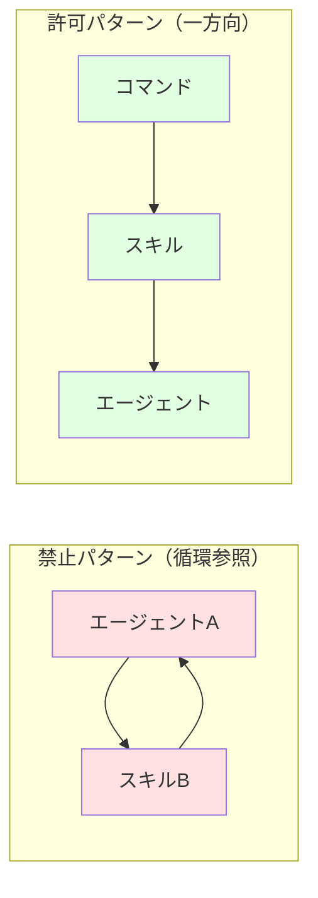

:::message alert
**循環参照を禁止する理由**:
- 無限ループを防ぐ
- 依存関係を単純化
- デバッグを容易に
:::

### 命名規則

| 対象 | 命名規則 | 例 |
|------|---------|-----|
| スキル | `{name}-skill/` | `add-skill/`, `write-note-skill/` |
| エージェント | `{name}.md`（役割サフィックス必須） | `code-explorer.md`, `article-reviewer.md` |

## 2. AI組織化を実現する技術仕様

3層構造を理解したら、次は **「どうやって動かすか」** を学びましょう。AI組織化を実現するための技術仕様を解説します。

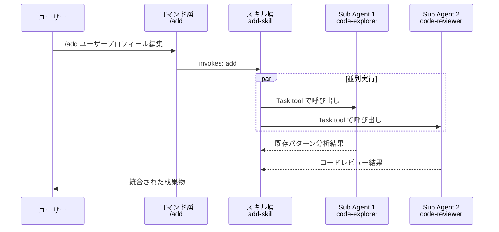

### invokesフィールド（コマンド→スキル参照）

コマンドファイルのフロントマターに `invokes` フィールドを追加することで、確実にスキルを呼び出せます。

```yaml:commands/workflows/add.md
---
description: 新機能を既存パターンに従って完全自動実装
type: workflow
invokes: add
---
```

### Task tool（スキル→エージェント呼び出し）

スキル内でエージェントを呼び出すには、 **Task tool** を使用します。

```markdown:skills/add-skill/SKILL.md
Task tool を使って以下のサブエージェントを実行:

1. **Phase1-1: コード探索（code-explorer）**
   - 既存コード構造・依存関係・パターンを分析
```

### PhaseN-M形式（並列実行明示）

並列実行する際は、 **PhaseN-M形式** で明示します。

```
Phase 1: 分析【3つ並列実行】
  ├─ Phase1-1: コード探索（code-explorer）
  ├─ Phase1-2: アーキテクチャ分析（Plan）
  └─ Phase1-3: 既存テスト分析（code-explorer）
```

:::message
**PhaseN-M形式の必須要素**:
1. `PhaseN-M` 形式のID（例: Phase1-1, Phase2-3）
2. 処理名の明記
3. サブエージェント名を括弧で記載
4. 【X つ並列実行】の表記
:::

### パス明記とサブエージェント認識

スキル内でファイルを参照する際、 **必ず相対パス** を使用します。

```markdown
@~/.claude/skills/add-skill/SKILL.md
@~/.claude/agents/code-explorer.md
@~/.claude/CLAUDE.md
```

:::details CLAUDE.mdでのサブエージェント定義例
```markdown:CLAUDE.md
## Available Subagents

### コード関連
- `code-explorer` - ファイル構造把握、実装箇所特定
- `code-reviewer` - コードレビュー（品質・セキュリティ）
- `implementation-checker` - テスト実行・品質検証
```

プロジェクトの `CLAUDE.md` に明記することで、Claudeがサブエージェントを確実に認識します。
:::

## 3. スペック駆動開発との統合

AI組織化の技術仕様を理解したら、次は **「どうやってAIの出力品質を安定させるか」** を学びましょう。


### スペック駆動開発の基本概念

スペック駆動開発では、 **コードより先にドキュメントを書く** フローを採用します。

:::message
**メリット**:
- ドキュメントが常に最新
- 設計書という「正解」があるため、実装がブレない
- AIにドキュメントを見せるだけで、意図が正確に伝わる
:::

### `/setup`コマンドで6つのドキュメント自動生成

私の運用では、 **`/setup`コマンド** でスペック駆動開発の基盤を自動構築しています。

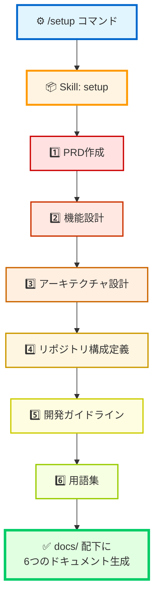

:::details 生成される6つのドキュメント
| ドキュメント | 内容 | 役割 |
|------------|------|------|
| `product-requirements.md` | プロダクトの目的・背景 | 「なぜ」を定義 |
| `functional-design.md` | 各機能の詳細仕様 | 「何を」を定義 |
| `architecture-design.md` | システム構成図・技術スタック | 「どう」を定義 |
| `repository-structure.md` | ディレクトリ構成・命名規則 | 「どこに」を定義 |
| `development-guidelines.md` | コーディング規約・テスト方針 | 「どうやって」を定義 |
| `glossary.md` | プロジェクト固有の用語定義 | 「何を指すか」を定義 |
:::

### CLAUDE.mdでドキュメント参照

プロジェクトの `CLAUDE.md` に以下を記載します：

```markdown:CLAUDE.md
## 設計ドキュメント

- @docs/product-requirements.md（PRD）
- @docs/functional-design.md（機能設計）
- @docs/architecture-design.md（アーキテクチャ設計）
- @docs/repository-structure.md（リポジトリ構成）
- @docs/development-guidelines.md（開発ガイドライン）
- @docs/glossary.md（用語集）
```

### AIの出力がブレなくなる理由

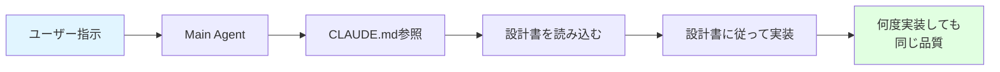

:::message
**AIは「コンテキスト」が全て** です。設計書という明確なコンテキストを与えることで、AIの出力がブレなくなります。

**結果**: 設計書という「正解」があるため、AIが何度実装しても同じ品質になる
:::

## 4. EPDCAによる自律実装サイクル

AI組織化の最後のピースは、 **EPDCA** です。従来のPDCA（Plan → Do → Check → Action）に **Explore（探索）** を加えることで、Plan（計画）の精度が飛躍的に向上します。

### EPDCAの5フェーズ

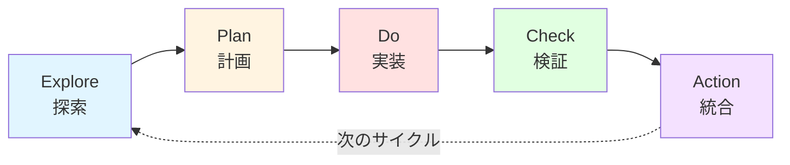

| フェーズ | Main Agentの役割 | Sub Agentの役割 |
|---------|----------------|----------------|
| **Explore** | 調査方針の決定 | `code-explorer`: コードベース分析 |
| **Plan** | 実装方針の決定 | `Plan`: アーキテクチャ設計提案 |
| **Do** | 実装の統括 | Main Agent自身が実装 |
| **Check** | 検証結果の統合 | `implementation-checker`, `code-reviewer`: 並列検証 |
| **Action** | 最終判断・リリース | `security-operator`: セキュリティ承認 |

### なぜExplore（探索）が必要か

従来のPDCAでは、 **Plan（計画）** から始まりますが、以下の問題があります：

:::message alert
**問題点**:
- 既存のコードパターンを知らずに計画すると、実装が既存と整合しない
- 「何が既にあるか」を把握せずに計画すると、重複実装が発生
- テスト戦略を事前に把握しないと、後からテストを追加する羽目になる
:::

:::message
**解決策: Explore（探索）フェーズを事前に実行**:
- 既存のコードパターンを全検索
- アーキテクチャを分析
- テスト戦略を事前に把握

**結果**: Plan（計画）の精度が飛躍的に向上し、実装がスムーズに進む
:::

### 並列実行による時間削減

同じ時間軸で2パターンを比較すると、時間削減効果が一目瞭然です。

```
時間軸:              0分             15分            30分            45分
                    ↓               ↓               ↓               ↓

【従来（直列実行）】
コード探索:          [===============]
アーキテクチャ分析:                   [===============]
テスト分析:                                            [===============]
合計: 45分

【改良版（並列実行）】
コード探索:          [===============]
アーキテクチャ分析:  [===============]
テスト分析:          [===============]
合計: 15分（最も遅いタスクの時間）
```

:::message
**従来（直列）**: 15分 + 15分 + 15分 = 45分
**改良版（並列）**: max(15分, 15分, 15分) = 15分

**削減率**: (45分 - 15分) / 45分 = **66%削減**
:::

### `/add`コマンドでの実装例

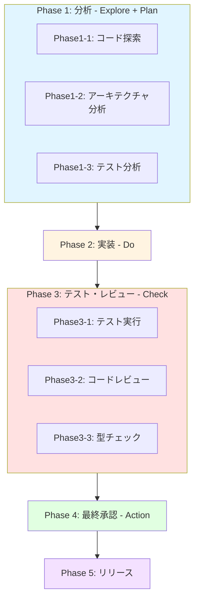

:::details 各フェーズの詳細（クリックで展開）
**Phase 1（Explore + Plan）**: 3つのSub Agentが並列実行
- Phase1-1: コード探索（code-explorer）
- Phase1-2: アーキテクチャ分析（Plan）
- Phase1-3: テスト分析（code-explorer）

**Phase 2（Do）**: Main Agent単独で実装

**Phase 3（Check）**: 3つのSub Agentが並列実行
- Phase3-1: テスト実行（implementation-checker）
- Phase3-2: コードレビュー（code-reviewer）
- Phase3-3: 型チェック（implementation-checker）

**Phase 4（Action）**: security-operatorが最終承認
:::

## おわりに

実装が速いAIはもう珍しくない。どのツールを使っても、それなりに速くコードが出てくる時代になりました。

次は何で差がつくのか。 **「AIをどう組織化するか」** だと思っています。

あなたのプロジェクトでも、AIを「1人の作業者」から「組織」へと進化させてみませんか。

## このシリーズの全記事

1. **【この記事】AI組織化とは？｜Main×Sub Agent設計で実装時間50%削減!?**
2. Claude Codeの3層設計｜コマンド→スキル→エージェントで循環参照を防ぐ技術仕様
3. Claude CodeでAI組織化を実現する技術仕様｜Task tool・PhaseN-M形式・パス明記の実装パターン
4. AI組織化×スペック駆動開発｜コードより先にドキュメントを書く設計術
5. AI組織化のEPDCAサイクル｜Explore追加で自律的に実装が回る仕組み
