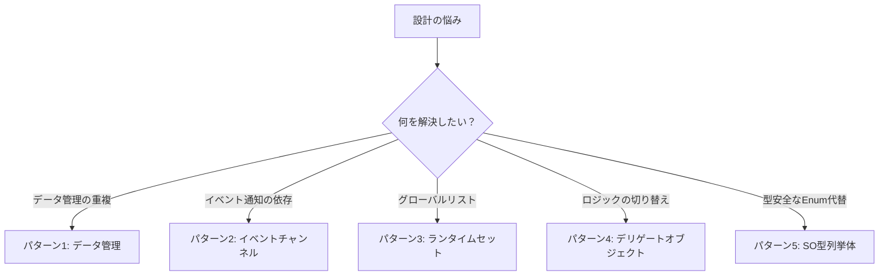

## はじめに

「モンスターのHPをMonoBehaviourに直書きしていたら、プレハブをコピーするたびに値がバラバラになってしまった」という経験はないでしょうか。あるいは、シーンをまたいでデータを渡したくてSingletonを作ったはいいものの、依存関係が複雑になって手がつけられなくなった、なんてことも。

こうした問題の多くは、**データとロジックを同じコンポーネントに詰め込んでいること**が原因です。ScriptableObjectを使うと、このデータ設計の悩みをすっきり解消できます。

## ScriptableObjectとは

ScriptableObjectは、**シーンやゲームオブジェクトに依存しないデータ専用のアセット**です。MonoBehaviourはGameObjectにアタッチして使いますが、ScriptableObjectはプロジェクトウィンドウに.assetファイルとして保存されます。

シーンが切り替わってもデータが消えず、デザイナーがインスペクターから直接パラメータを編集できる点が大きなメリットです。

:::message
ScriptableObjectの最大のメリットは「データをプレハブやシーンから切り離せること」。変更がアセット1つに集約されるため、チーム開発でのパラメータ調整が格段に楽になります。
:::

`CreateAssetMenu`属性を付けると、Unityエディターの右クリックメニューからアセットを作成できるようになります。

```csharp:ItemData.cs
[CreateAssetMenu(fileName = "NewItem", menuName = "GameData/Item")]
public class ItemData : ScriptableObject
{
    public string itemName;
    public int price;
    public Sprite icon;
}
```

## パターン1: ゲームデータ管理パターン（データコンテナ）

アイテム・キャラクター・スキルなど、**ゲームの静的データをScriptableObjectアセットとして管理する**基本パターン。MonoBehaviourにデータをべた書きすると、同じ「スライム」が100体いてもデータが100個メモリに乗ります。SOで管理すれば全員が同一アセットを参照するため、Flyweightパターンと同等のメモリ効率が得られます。

```csharp:CharacterData.cs
[CreateAssetMenu(fileName = "NewCharacter", menuName = "GameData/Character")]
public class CharacterData : ScriptableObject
{
    [Header("基本ステータス")]
    public string characterName;
    public int maxHealth = 100;      // 最大HP
    public float moveSpeed = 5f;     // 移動速度（m/s）
    public float attackPower = 10f;  // 攻撃力

    [Header("ビジュアル")]
    public Sprite portrait;
    public RuntimeAnimatorController animatorController;
}
```

各キャラクターコンポーネントはSOアセットを参照するだけでよいです。

```csharp:Character.cs
public class Character : MonoBehaviour
{
    [SerializeField] private CharacterData data; // Inspectorでアセットをアサイン

    private float currentHealth;

    private void Start()
    {
        currentHealth = data.maxHealth; // SOから初期値を取得
    }
}
```

:::message
**適用シナリオ**: 敵・アイテム・スキルの種類が多く、デザイナーが頻繁にパラメータを調整するプロジェクト。Inspectorから直感的に編集できるため、エンジニアを介さずにバランス調整が完結します。
:::

## パターン2: イベントチャンネルパターン

Ryan Hipple氏がUnite Austin 2017で提案したアーキテクチャ。SOにUnityActionを持たせ、オブジェクト同士が直接参照せずにイベントをブロードキャストできます。**シングルトン不要で、シーンをまたいだ疎結合な通信が実現できる**のが最大の特徴です。

```csharp:VoidEventChannel.cs
using UnityEngine.Events;
using UnityEngine;

[CreateAssetMenu(menuName = "Events/VoidEvent")]
public class VoidEventChannel : ScriptableObject
{
    public UnityAction OnEventRaised;

    public void RaiseEvent()
    {
        OnEventRaised?.Invoke();
    }
}
```

受信側はSOアセットを参照してOnEnable/OnDisableでサブスクライブします。

```csharp:PlayerDeathListener.cs
public class PlayerDeathListener : MonoBehaviour
{
    [SerializeField] private VoidEventChannel onPlayerDeath; // SOアセットを参照

    private void OnEnable()
    {
        onPlayerDeath.OnEventRaised += HandlePlayerDeath; // イベント購読
    }

    private void OnDisable()
    {
        onPlayerDeath.OnEventRaised -= HandlePlayerDeath; // 購読解除（メモリリーク防止）
    }

    private void HandlePlayerDeath()
    {
        // ゲームオーバー処理
    }
}
```

:::message
**適用シナリオ**: UIとゲームロジックの分離、シーン間通知（プレイヤー死亡でゲームオーバーUIを表示するなど）。送信側・受信側どちらも同じSOアセットだけを知っていればよく、互いの存在を意識しない設計になります。
:::

## パターン3: ランタイムセットパターン

Ryan Hipple氏がUnite Austin 2017で提唱した設計で、**ScriptableObjectにオブジェクトのListを持たせてシーン上のオブジェクト群をグローバル管理する**手法です。`FindObjectOfType`やSingletonを使わずに「現在シーンにいる全敵」などの動的な集合を扱えます。

```csharp:RuntimeSet.cs
public abstract class RuntimeSet<T> : ScriptableObject
{
    [SerializeField] private List<T> _items = new List<T>();

    public IReadOnlyList<T> Items => _items; // 外部からの直接変更を防ぐ

    public void Add(T item)
    {
        if (!_items.Contains(item))
            _items.Add(item);
    }

    public void Remove(T item)
    {
        if (_items.Contains(item))
            _items.Remove(item);
    }
}
```

```csharp:EnemyRuntimeSet.cs
[CreateAssetMenu(menuName = "RuntimeSets/EnemySet")]
public class EnemyRuntimeSet : RuntimeSet<Enemy> { }
```

各オブジェクトが自分自身を登録・解除します。

```csharp:Enemy.cs
public class Enemy : MonoBehaviour
{
    [SerializeField] private EnemyRuntimeSet runtimeSet;

    private void OnEnable() => runtimeSet.Add(this);
    private void OnDisable() => runtimeSet.Remove(this);
}
```

あとは `runtimeSet.Items` を参照するだけで、スポーン・デスポーンが自動的に反映された最新のリストを取得できます。

:::message alert
ScriptableObjectはPlayモード終了後もListが残存します。これはUnityの既知の動作です。`OnEnable`/`OnDisable`の自己登録パターンを徹底し、シーンロード時に古い参照が残らないよう設計してください。
:::

## パターン4: デリゲートオブジェクトパターン（Strategyパターン）

SOに「ロジック」をカプセル化し、実行時に交換可能にするパターンです。**敵AI行動・攻撃スキル・パワーアップ効果など、挙動を差し替えたい場面に最適です。**

```csharp:AttackBase.cs
public abstract class AttackBase : ScriptableObject
{
    public abstract void Execute(GameObject user);
}
```

```csharp:MeleeAttack.cs
[CreateAssetMenu(menuName = "Attacks/Melee")]
public class MeleeAttack : AttackBase
{
    public float damage = 10f;
    public float range = 1.5f;

    public override void Execute(GameObject user)
    {
        // 指定半径内の全コライダーを検出
        var hits = Physics2D.OverlapCircleAll(user.transform.position, range);
        foreach (var hit in hits)
        {
            hit.GetComponent<IDamageable>()?.TakeDamage(damage);
        }
    }
}
```

```csharp:Weapon.cs
public class Weapon : MonoBehaviour
{
    [SerializeField] private AttackBase attackSO; // Inspectorで差し替え可能

    public void Attack()
    {
        attackSO.Execute(gameObject);
    }
}
```

:::message
`attackSO` フィールドをInspectorで差し替えるだけで、コードを一切変更せずに攻撃挙動を切り替えられます。デザイナーがロジックをカスタマイズできる環境を作れるのが最大の利点です。
:::

## パターン5: SO型列挙体パターン（Type-safe Enum）

C#の `enum` をSOで置き換えるパターンです。**マジックナンバーや文字列比較を排除しつつ、enumでは不可能なデータ・ロジックの付加が可能になります。**

```csharp:ItemCategory.cs
[CreateAssetMenu(menuName = "Types/ItemCategory")]
public class ItemCategory : ScriptableObject
{
    [SerializeField] private string displayName;
    [SerializeField] private Color uiColor;

    public string DisplayName => displayName;
    public Color UIColor => uiColor;
}
```

```csharp:ItemData.cs
[CreateAssetMenu(menuName = "GameData/Item")]
public class ItemData : ScriptableObject
{
    public string itemName;
    public ItemCategory category; // SOアセットを直接参照
    public int price;
}
```

```csharp:InventoryUI.cs
// enumではなくSOの参照比較（型安全）
if (item.category == weaponCategory)
{
    ShowWeaponStats(item);
}
```

:::message
新しいカテゴリの追加はSOアセットを作成するだけで完結し、コード変更は不要です。カテゴリごとにUIカラーや表示名などのメタデータを持たせられる点も、enumにはない強みです。
:::

## パターン選択ガイド

どのパターンをいつ使うかを整理します。

| パターン | 適用場面 | 解決する課題 |
|---------|---------|------------|
| ゲームデータ管理 | アイテム・キャラクターのパラメータ | プレハブごとに同じデータが重複 |
| イベントチャンネル | シーン間のイベント通知 | Singleton / FindObjectOfType 依存 |
| ランタイムセット | シーン上のオブジェクト群の管理 | 敵リストの取得にFindを使っている |
| デリゲートオブジェクト | 差し替え可能なAI・スキルロジック | 条件分岐だらけの巨大なswitch文 |
| SO型列挙体 | 型安全なカテゴリ・タイプ管理 | 文字列比較・マジックナンバー |



## まとめ

本記事で紹介した5パターンは、Ryan Hipple が Unite Austin 2017 で発表した設計哲学「Scriptable Objects: Theory and Practice」を実践に落とし込んだものです。

https://www.youtube.com/watch?v=raQ3iHhE_Kk

5つのパターンはそれぞれ独立しているように見えて、**組み合わせることで真価を発揮します**。たとえば「ゲームデータ管理」で定義したアイテムSOを「イベントチャンネル」で通知し、「ランタイムセット」で対象を絞る、という構成は実際のプロジェクトで頻繁に登場します。

まずはパターン1（ゲームデータ管理）とパターン2（イベントチャンネル）から試してみてください。この2つを導入するだけで、コードの結合度が大きく下がり、シーン構成の自由度が一気に高まります。

:::message
**公式サンプルプロジェクト**
Unity公式の「PaddleGameSO」リポジトリでは、本記事で紹介した5パターン全てが実装されています。コードリーディングの教材としても最適です。

https://github.com/UnityTechnologies/PaddleGameSO
:::
