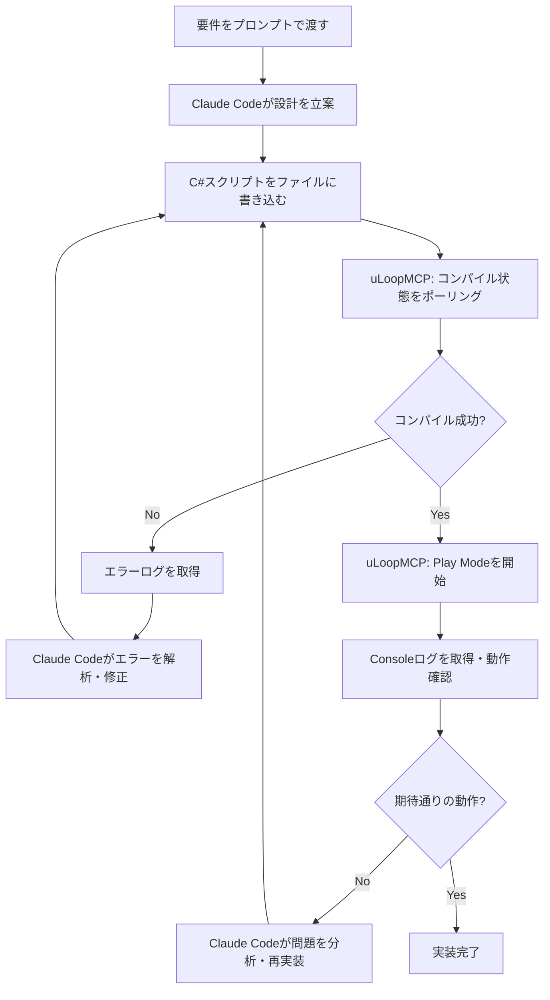

Unity開発でコードを書くたびに「コンパイル待ち → エディタ確認 → 修正 → また待ち」という繰り返しに時間を取られていた。このループをClaude Code + uLoopMCPに丸ごと任せてみたところ、実装速度が体感で3倍近く上がった。この記事では、その構築手順と実際に使って気づいたポイントを書いていく。

## uLoopMCPとは

uLoopMCPはUnity Editor向けのMCP（Model Context Protocol）サーバー実装だ。MCPはAnthropicが策定したLLMとツール群を接続するプロトコルで、Claude Codeはこの仕組みを使って外部ツールを呼び出せる。

uLoopMCPがやっていることをひとことで言うと、「Unity Editorをリモートコントロールできる口を開ける」ことだ。具体的には以下の操作をClaude Code経由で実行できるようになる。

- スクリプトのコンパイル状態の取得
- コンパイルエラーログの取得
- Play Modeの開始・停止
- Scene内のGameObject操作
- Consoleログの取得

これらを組み合わせると、コードを書いた後にUnity側の反応を確認しながら次の判断を下す、という自律ループが成立する。

## uLoopMCPのセットアップ手順

### パッケージのインストール

Unity Package ManagerのAdd package from git URLから以下を追加する。

```
https://github.com/notargs/uLoopMCP.git?path=Packages/uLoopMCP
```

Unity 2022.3以降が対象。インストール後、Unity Editorを再起動するとMCPサーバーがバックグラウンドで起動状態になる。デフォルトのポートは `3000` だ。

### Claude Codeへの登録

プロジェクトルートの `.claude/settings.json` に以下を追記する。

```json
{
  "mcpServers": {
    "uLoopMCP": {
      "type": "http",
      "url": "http://localhost:3000/mcp"
    }
  }
}
```

設定後、Claude Codeを再起動すると `/mcp` コマンドでuLoopMCPのツール一覧が確認できる。

:::message
`mcpServers` の設定はプロジェクト単位の `.claude/settings.json` と、グローバルの `~/.claude/settings.json` のどちらにも書ける。複数のUnityプロジェクトで使い分けるならプロジェクト単位に書くのが無難だ。
:::

接続確認はClaude Codeで以下を実行するだけでいい。

```
Unity Editorのコンパイル状態を確認して
```

`isCompiling: false` のようなレスポンスが返ってきたら接続成功だ。

## 自律開発サイクルの構築

uLoopMCPとClaude Codeを組み合わせると、以下のサイクルをAIが自律的に回せるようになる。



このサイクルのポイントは、Claude Codeがコンパイル結果とランタイムログの両方を取得できる点だ。コンパイルエラーだけでなく、「NullReferenceExceptionが出ていた」「Physics挙動がおかしい」といった実行時の問題も自律的に発見・修正できる。

実際にこのループを回してみると、単純なコンポーネント実装なら人間が一切手を動かさずに完成まで持っていけるケースが多い。複雑な実装でも「ここから先は確認して」というポイントを絞り込む作業をAIが担ってくれる。

## 実践：Playerコントローラーの自動実装

### プロンプト例

以下のようなプロンプトをClaude Codeに渡した。

```
PlayerControllerをInputSystemを使って実装してほしい。
要件:
- WASD/左スティックで移動（CharacterController使用）
- Spaceキー/南ボタンでジャンプ
- 移動速度5.0f、ジャンプ力8.0f
- 実装後はコンパイルエラーがないこと、Play Modeで動作確認すること
uLoopMCPを使ってUnityEditorの状態を確認しながら進めて
```

### 生成されたC#コード

Claude Codeが自律的に生成・修正を繰り返した結果、以下のようなコードが出力された。

```csharp
using UnityEngine;
using UnityEngine.InputSystem;

[RequireComponent(typeof(CharacterController))]
public class PlayerController : MonoBehaviour
{
    [SerializeField] private float moveSpeed = 5.0f;
    [SerializeField] private float jumpForce = 8.0f;
    [SerializeField] private float gravity = -20.0f;

    private CharacterController _characterController;
    private InputAction _moveAction;
    private InputAction _jumpAction;
    private Vector3 _velocity;

    private void Awake()
    {
        _characterController = GetComponent<CharacterController>();

        var actionMap = new InputActionMap("Player");

        _moveAction = actionMap.AddAction("Move", InputActionType.Value);
        _moveAction.AddCompositeBinding("2DVector")
            .With("Up", "<Keyboard>/w")
            .With("Down", "<Keyboard>/s")
            .With("Left", "<Keyboard>/a")
            .With("Right", "<Keyboard>/d");
        _moveAction.AddBinding("<Gamepad>/leftStick");

        _jumpAction = actionMap.AddAction("Jump", InputActionType.Button);
        _jumpAction.AddBinding("<Keyboard>/space");
        _jumpAction.AddBinding("<Gamepad>/buttonSouth");

        actionMap.Enable();
    }

    private void Update()
    {
        bool isGrounded = _characterController.isGrounded;

        if (isGrounded && _velocity.y < 0f)
            _velocity.y = -2f;

        Vector2 moveInput = _moveAction.ReadValue<Vector2>();
        Vector3 move = new Vector3(moveInput.x, 0f, moveInput.y);
        move = transform.TransformDirection(move);
        _characterController.Move(move * moveSpeed * Time.deltaTime);

        if (_jumpAction.WasPressedThisFrame() && isGrounded)
            _velocity.y = jumpForce;

        _velocity.y += gravity * Time.deltaTime;
        _characterController.Move(_velocity * Time.deltaTime);
    }
}
```

このコードはClaude Codeが最初に出力したものではなく、コンパイルエラーと実行確認を2〜3回繰り返して落ち着いた版だ。InputActionMapをAwakeで動的に構築するアプローチはuLoopMCPがassetファイルを直接操作しにくいという制約から自然に選ばれた形だった。

uLoopMCPでPlay Modeを起動してConsoleログを確認、問題なければ「実装完了」と報告してくるまで、このサイクルで約3分だった。

## ハマりポイントと解決策

### コンパイルエラーのループを防ぐ

最初に試したとき、Claude Codeがコンパイルエラーを修正するたびに別のエラーを生むループに入った。原因は「エラーを1件ずつ修正しようとする」動作だった。

対策として、プロンプトに以下を明示するようにした。

```
コンパイルエラーが出た場合は全エラーログを確認してから修正すること。
1エラー修正 → 確認 という細かいループはしないで、
全エラーを把握したうえで一括修正してほしい。
```

これだけでループが大幅に減った。uLoopMCPのコンパイルエラー取得ツールは全エラーをまとめて返すので、Claude Code側がそれを使い切る指示を出すことが大事だった。

### MCPサーバーの接続が切れる問題

Unity EditorをDomain ReloadするとuLoopMCPのサーバープロセスが再起動されるケースがあった。これはスクリプトの変更後に毎回発生する。

Claude Codeはこの状態を「接続エラー」として検知するが、そのままリトライしないことがあった。

対処法は2つある。

1つ目は、プロンプトに「接続エラーが出たら10秒待ってリトライ」という指示を入れること。Domain Reloadはだいたい5〜10秒で完了するのでこれで安定した。

2つ目は、Unity Projectの `Edit > Project Settings > Editor > Enter Play Mode Settings` で `Reload Domain` をオフにすること。Domain Reloadを無効にすることでuLoopMCPの再起動自体が起きなくなる。ただしこれは静的フィールドのリセットが起きなくなるなどの副作用があるので、プロジェクトの状況に応じて判断してほしい。

:::message alert
Domain Reload無効化はプロジェクト全体に影響する設定変更だ。既存コードで静的フィールドを初期化に使っている場合は動作が変わる可能性があるので注意が必要。
:::

## まとめ

uLoopMCP + Claude Codeの組み合わせで実現したこと:

- コード修正 → コンパイル確認 → Play確認のサイクルをAIが自律実行
- 単純なコンポーネント実装ならプロンプト1回で完成まで到達
- コンパイルエラーの解析・修正をAIに委譲できるので実装者は設計に集中できる

現時点での限界としては、Play Modeでのビジュアル確認（カメラに映っているかどうか）はスクリーンショット取得などの追加ツールが必要で、uLoopMCP単体ではConsoleログ確認止まりだ。物理挙動の感触やUI配置の微調整は人間が判断する必要がある。

とはいえ「実装して動くようにする」フェーズにかかる時間が大幅に減ったのは確かで、残った時間を「どう動かすか」の設計に使えるようになった。Unityの開発体験として、これはかなり変化だった。
