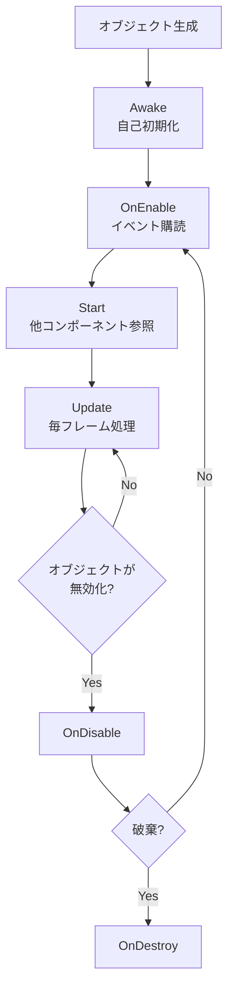

Unity学習2週間〜3ヶ月の人がハマりやすい5つの罠を実コードで解説します。コンパイルエラーの原因、NullReferenceException、原因不明のパフォーマンス低下——これらに心当たりがある人は、この記事を読めば同種のトラブルを3割以上減らせるはずです。

## 初心者がつまづきやすい背景

Unityは「とりあえず動く」コードが書きやすいエンジンです。MonoBehaviourを継承してStart/Updateに処理を書けば、画面上で何かが動き始めます。しかしその手軽さの裏に、**Unityが独自に定めた動作仕様**がいくつも存在します。

一般的なC#プログラミングの知識だけでは気づきにくいUnity固有のルールは、学習初期に「なぜか動かない」「なぜかエラーが出る」の原因になりがちです。ここで紹介する5つの罠は、どれもUnity特有の仕様に起因するものです。実際に書いたコードと照らし合わせながら読んでください。

## 罠1: ファイル名とクラス名の不一致

### 何が問題か

MonoBehaviourを継承したクラスをGameObjectにアタッチしようとしたとき、次のエラーを見たことはないでしょうか。

```text
Can't add script component 'PlayerController' because the script class cannot be found.
Make sure that there are no compile errors and that the file name and class name match.
```

このエラーの原因は、ファイル名とクラス名が一致していないことです。Unityでは、MonoBehaviourを継承したクラスはファイル名とクラス名を必ず一致させる必要があります。

```csharp
// BAD: ファイル名は PlayerController.cs だが、クラス名が異なる
using UnityEngine;

public class Player : MonoBehaviour
{
    void Start()
    {
        Debug.Log("Start");
    }
}
```

```csharp
// GOOD: ファイル名 PlayerController.cs とクラス名を一致させる
using UnityEngine;

public class PlayerController : MonoBehaviour
{
    void Start()
    {
        Debug.Log("Start");
    }
}
```

### なぜUnityがそう要求するか

UnityはC#スクリプトをシリアライズ（保存・復元）するとき、ファイル名を元にクラスを特定します。Inspector上でスクリプトコンポーネントがどのクラスに対応するかを判断する際、ファイル名 = クラス名というルールが前提になっています。

このルールはUnity固有のものであり、純粋なC#プロジェクトでは要求されません。「C#ではファイル名と一致させなくてもコンパイルが通る」という知識がかえって罠になるケースです。Unityでは **MonoBehaviourを継承するクラスは1ファイル1クラス、かつファイル名と一致させる** という原則を守ってください。

## 罠2: AwakeとStartのライフサイクル混同

### 何が問題か

Unityには複数の初期化メソッドがあります。AwakeとStartの違いを意識せずに書くと、NullReferenceExceptionが発生します。

```csharp
// BAD: Awakeで他のGameObjectを検索しようとしてNullReferenceException
using UnityEngine;

public class EnemyManager : MonoBehaviour
{
    private PlayerController _player;

    void Awake()
    {
        // Awake実行時点では他のオブジェクトがまだ初期化されていないことがある
        _player = GameObject.Find("Player").GetComponent<PlayerController>();
        Debug.Log(_player.name); // NullReferenceException の可能性
    }
}
```

```csharp
// GOOD: Startで他コンポーネントを参照する、またはSerializeFieldで注入する
using UnityEngine;

public class EnemyManager : MonoBehaviour
{
    // SerializeField: Inspectorから直接セット（最も安全）
    [SerializeField] private PlayerController _player;

    void Start()
    {
        // Start実行時点では全オブジェクトのAwakeが完了している
        if (_player == null)
        {
            _player = GameObject.Find("Player").GetComponent<PlayerController>();
        }
    }
}
```

### Awake / OnEnable / Startの実行順

| メソッド | 実行タイミング | 推奨用途 |
|----------|--------------|----------|
| Awake | オブジェクト生成直後（他のAwakeより先でも後でもありえる） | 自分自身の内部変数・コンポーネントの初期化 |
| OnEnable | オブジェクトが有効化されるたびに実行 | イベント購読・状態リセット |
| Start | 全オブジェクトのAwake完了後、最初のUpdateの前 | 他のコンポーネント・オブジェクトへの参照取得 |

### ライフサイクルの実行順序



**「Awakeは自分自身の初期化、Startは他コンポーネントを参照する初期化」** というルールを守るだけで、大半のライフサイクル起因のNullReferenceExceptionは防げます。

## 罠3: Update内で毎フレームFind/GetComponentを呼ぶ

### 何が問題か

動作確認のために書いた検索処理をUpdate内に書いたまま放置すると、深刻なパフォーマンス問題を引き起こします。

```csharp
// BAD: Update内で毎フレームFindObjectOfTypeを呼ぶ
using UnityEngine;

public class UIController : MonoBehaviour
{
    void Update()
    {
        // これが60FPSで実行されるたびに全オブジェクトをスキャンする
        var scoreManager = FindObjectOfType<ScoreManager>();
        if (scoreManager != null)
        {
            Debug.Log(scoreManager.Score);
        }
    }
}
```

```csharp
// GOOD: StartでキャッシュしてUpdateで再利用する
using UnityEngine;

public class UIController : MonoBehaviour
{
    private ScoreManager _scoreManager;

    void Start()
    {
        // 1回だけ検索してフィールドに保持する
        _scoreManager = FindObjectOfType<ScoreManager>();
    }

    void Update()
    {
        // キャッシュ済みの参照を使う
        if (_scoreManager != null)
        {
            Debug.Log(_scoreManager.Score);
        }
    }
}
```

### 数字で見るパフォーマンスコスト

`FindObjectOfType` はシーン上の全MonoBehaviourをスキャンします。たとえば60FPSのゲームで100個のGameObjectがある場合、1秒あたり **6,000回** のスキャンが走ります。これは直接フレームレートの低下につながります。

`GetComponent` も同様です。Startでキャッシュしたコンポーネントをフィールドに持つことで、**検索コストをゼロにできます**。Updateメソッドは1フレームに1回必ず呼ばれるため、その中に置く処理は徹底的に軽くする必要があります。

## 罠4: null参照の誤解（破棄済みオブジェクトとnullの違い）

### 何が問題か

Unityでは `Destroy()` で破棄したオブジェクトに対して `== null` でチェックすると `true` が返りますが、C# 6以降の `?.`（null条件演算子）や `is null` パターンマッチングでは `false` になります。

```csharp
// BAD: is null や ?. を使うとDestroyされたオブジェクトをnullと認識しない
using UnityEngine;

public class ObjectTracker : MonoBehaviour
{
    private GameObject _target;

    void Start()
    {
        _target = new GameObject("Target");
        Destroy(_target);
    }

    void Update()
    {
        // is null はUnityの==演算子オーバーロードを使わないため、
        // Destroy済みオブジェクトをnullと判定しない
        if (_target is null)
        {
            Debug.Log("nullです"); // 実行されない（Destroyされていてもfalse）
        }

        // ?. も同様の問題がある
        _target?.SetActive(false); // MissingReferenceExceptionが発生しうる
    }
}
```

```csharp
// GOOD: UnityのGameObjectチェックは == null を使う
using UnityEngine;

public class ObjectTracker : MonoBehaviour
{
    private GameObject _target;

    void Start()
    {
        _target = new GameObject("Target");
        Destroy(_target);
    }

    void Update()
    {
        // Unityの == null はDestroyされたオブジェクトもnullとして扱う
        if (_target == null)
        {
            Debug.Log("nullまたはDestroyされています");
            return;
        }

        _target.SetActive(false);
    }
}
```

### Unity独自の仕様として理解する

**UnityはGameObjectの `==` 演算子をオーバーロードしています。** `Destroy()` されたオブジェクトは、内部的には「ネイティブ側のオブジェクトが破棄されたが、C#側のラッパーオブジェクトはまだ残っている」という状態になります。

Unity独自の `==` はこの状態を `null` として扱いますが、C#ランタイムネイティブの `is null` や `?.` はC#側のラッパーオブジェクトの存在しか見ないため、nullと判定されません。MonoBehaviourやGameObjectに対するnullチェックは **必ず `== null` を使う** のがUnityでの正しい作法です。

## 罠5: SerializeFieldとpublicの使い分けミス

### 何が問題か

Inspectorにフィールドを表示したいだけの目的で `public` を使うと、クラス外から自由に書き換えられるフィールドが増え続け、予期しないバグの温床になります。

```csharp
// BAD: InspectorへのExpose目的でpublicを乱用する
using UnityEngine;

public class PlayerStats : MonoBehaviour
{
    public float speed = 5f;       // 他クラスから直接書き換え放題
    public int health = 100;       // アクセス制御ゼロ
    public float jumpForce = 8f;   // どこからでも変更可能
}
```

```csharp
// GOOD: SerializeFieldでInspectorに出しつつprivateに保つ
using UnityEngine;

public class PlayerStats : MonoBehaviour
{
    [SerializeField] private float _speed = 5f;
    [SerializeField] private int _health = 100;
    [SerializeField] private float _jumpForce = 8f;

    // 外部からの読み取りが必要な場合はプロパティで公開する
    public float Speed => _speed;
    public int Health => _health;

    // 書き込みは専用メソッド経由に限定する
    public void TakeDamage(int amount)
    {
        _health -= amount;
        if (_health < 0) _health = 0;
    }
}
```

### SerializeFieldを使う理由

`[SerializeField]` は `private` フィールドをUnityのInspectorに表示するための属性です。**「Inspectorで値を設定したい」と「外部から書き換えを許可する」は別の要件です。** この2つを混同して `public` を使い続けると、フィールドがどこで書き換えられているかを追跡できなくなります。

プロジェクトが大きくなるほど、意図しない書き換えによるデバッグコストは高くなります。Inspectorへの公開は `[SerializeField] private` で行い、外部への公開が必要なときだけプロパティやメソッドを追加するパターンが、Unity開発における標準的なアクセス制御です。

## まとめ

今回紹介した5つの罠を整理します。

- 罠1: MonoBehaviourを継承するクラスはファイル名とクラス名を必ず一致させる
- 罠2: Awakeは自己初期化、Startは他コンポーネントへの参照取得に使い分ける
- 罠3: FindObjectOfTypeやGetComponentはStartでキャッシュし、Update内では呼ばない
- 罠4: UnityのGameObjectに対するnullチェックは `== null` を使い、`is null` や `?.` は使わない
- 罠5: Inspectorへの公開は `[SerializeField] private` で行い、`public` の乱用を避ける

どれも「知っていれば数分で解決できるが、知らなければ何時間も悩む」類のトラブルです。これらをチェックリストとして手元に置いておくだけで、開発初期のストレスは大幅に減ります。

次に確認してほしい公式ドキュメントは以下の2つです。MonoBehaviourのライフサイクル全体像と、スクリプト実行順の詳細が記載されています。

https://docs.unity3d.com/Manual/ExecutionOrder.html

https://docs.unity3d.com/ScriptReference/MonoBehaviour.html
