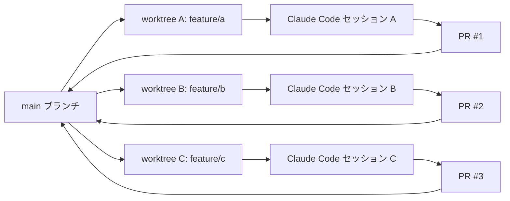

Unity で Claude Code を使い始めてから開発速度は上がったものの、1機能ずつ逐次実装しているとある問題に気づいた。Claude がコンパイル待ちやレビュー待ちでブロックされる時間が実時間の40%近くに達していた。複数機能を並列で走らせれば解決できるが、ブランチを切り替えるたびに Library/ フォルダが再生成され、Unity Editor が固まる「再コンパイル地獄」でそのアプローチは成立しなかった。git worktree でプロジェクトを物理的に3面展開することで、この問題を解決した3日間の記録を共有する。

## なぜブランチ切り替えだと Unity 並列開発は破綻するのか

Unity プロジェクトは `Library/` `Temp/` `obj/` といったディレクトリにコンパイル済みアセットを大量にキャッシュする。ブランチを切り替えるたびにこれらが再生成されるため、体感で2〜5分のロスが発生する。

さらに厄介なのが Claude Code との相性だ。Claude Code がファイルを編集している最中にブランチ切り替えが発生すると、diff が壊れてセッションを立て直す必要が生じる。結果として「Claudeが作業中 → ブランチ切り替え待ち → 再コンパイル待ち → Claudeが作業再開」という非効率なサイクルに陥る。

以下に「ブランチ切り替え」と「worktree」の実用上の差を整理した。

| 項目 | ブランチ切り替え | git worktree |
|------|--------------|-------------|
| Library/ の扱い | 切り替えごとに再生成 | worktreeごとに独立 |
| Unity Editor 起動数 | 1インスタンスのみ | 複数インスタンス可 |
| Claude Code セッション | 1セッションで順番待ち | worktreeごとに独立 |
| コンパイル待ち時間 | 毎回2〜5分 | 初回のみ（以降はキャッシュ有効） |
| diff の安全性 | 編集中の切り替えで破壊リスク | ファイルシステムが分離 |

並列開発を本気でやるなら、ブランチ切り替えという選択肢は最初から外れる。

## git worktree で Unity プロジェクトを3面展開する手順

まず `.gitignore` に以下が含まれていることを確認する。Unity プロジェクトの標準設定であれば既に除外されているはずだ。

```text
Library/
Temp/
Logs/
UserSettings/
obj/
```

これらが除外されていないと、worktree をまたいでキャッシュが共有されてしまい、Editor が競合する原因になる。

確認できたら、メインリポジトリの直下で worktree を3本追加する。

```bash
# メインリポジトリ直下で実行
git worktree add ../game-feature-a feature/a
git worktree add ../game-feature-b feature/b
git worktree add ../game-feature-c feature/c

# 展開結果を確認
git worktree list
```

実行後は以下のようなディレクトリ構成になる。

```text
~/workspace/
├── game-main/          # メインリポジトリ
├── game-feature-a/     # worktree A（feature/a ブランチ）
├── game-feature-b/     # worktree B（feature/b ブランチ）
└── game-feature-c/     # worktree C（feature/c ブランチ）
```

各 worktree は `.git` ファイル（ディレクトリではなくファイル）でメインリポジトリを参照するため、ブランチ履歴は共有しつつファイルシステムは完全に独立している。`Library/` はそれぞれの worktree に生成されるため、Unity Editor を3インスタンス同時に起動できる。初回の import 処理は各 worktree で1度だけ発生するが、以降はキャッシュが有効になる。

## Claude Code を worktree ごとに独立セッションで起動する

ターミナルを3分割し、各 worktree で `claude` コマンドを起動する。

```bash
# Terminal 1（feature/a 担当）
cd ~/workspace/game-feature-a && claude

# Terminal 2（feature/b 担当）
cd ~/workspace/game-feature-b && claude

# Terminal 3（feature/c 担当）
cd ~/workspace/game-feature-c && claude
```

各 worktree の直下に `CLAUDE.md` を配置しておくと、セッションごとに独立したコンテキストを持てる。たとえば `game-feature-a/CLAUDE.md` には「このセッションは戦闘システムの実装を担当する。`Assets/Scripts/Combat/` のみを編集する。UI や Data 層には触れない」と書いておく。これでセッション間の意図しない干渉を防げる。

さらに `settings.local.json` で作業範囲をファイルシステム側から絞ることもできる。

```json
{
  "permissions": {
    "allow": [
      "Read(**)",
      "Write(Assets/Scripts/Combat/**)",
      "Bash(git *)"
    ]
  }
}
```

セッション間でファイルシステムが完全に分離しているため、複数の Claude Code が同じファイルを同時編集してコンフリクトが発生する、という事態は構造的に起きない。

## 並列開発のフロー全体像



3つのセッションが完全に独立して動くため、セッション A がコンパイル待ちの間にセッション B と C は作業を継続できる。この「並列消化」こそが待ち時間を40%から10%に削減した主因だ。

## マージ戦略：3本同時PRでコンフリクトを最小化する

並列開発の最大のリスクはマージコンフリクトだ。これを最小化するために、PR の分割単位を「機能」ではなく「触るディレクトリ」で切る。

```text
feature/a → Assets/Scripts/Combat/ のみ変更
feature/b → Assets/Scripts/UI/     のみ変更
feature/c → Assets/Scripts/Data/   のみ変更
```

C# 側では名前空間を使ってディレクトリの独立性をコード構造でも表現しておく。

```csharp
// Assets/Scripts/Combat/CombatSystem.cs
namespace Game.Combat
{
    public class CombatSystem : MonoBehaviour
    {
        // 戦闘ロジック。UI層・Data層への直接参照は禁止
    }
}

// Assets/Scripts/UI/HudController.cs
namespace Game.UI
{
    public class HudController : MonoBehaviour
    {
        // UIロジック。Combat層への直接参照は禁止
    }
}
```

名前空間でレイヤーを分けると、コンパイルエラーが「意図しない依存関係の追加」の検知器として機能する。Claude Code に「`Game.Combat` 名前空間の外への参照は追加しないこと」と `CLAUDE.md` に明記しておくと、セッションが勝手に他のディレクトリを変更しにくくなる。

3本の PR を同時に出した場合、最初にマージされたブランチを残りの2本が rebase で取り込む。ディレクトリが水平分割されていればコンフリクトはほぼ発生しない。共有の `Assets/Scripts/Core/` や `Assets/ScriptableObjects/` を触る場合は、その変更を別の PR として先行マージしてから並列作業を開始する、という手順にしている。

## 3日運用した結果と数値

逐次実装と並列実装を比較した結果を記録している。

| 指標 | 逐次（worktreeなし） | 並列（worktree 3面） |
|------|-------------------|-------------------|
| 1日あたりの完了機能数 | 1機能 | 3機能 |
| Claude Code の待ち時間比率 | 実時間の約40% | 実時間の約10% |
| ブランチ切り替えによるコンパイル待ち | 1回あたり2〜5分、1日5〜8回発生 | ゼロ |
| worktree 初回 import 時間 | — | 1面あたり約3分（初回のみ） |

機能の実装規模にもよるが、1機能を「スクリプト5〜10ファイル・ScriptableObject 1〜3個」と定義したときの数値だ。

## まとめ

git worktree でプロジェクトを物理的に3面展開することで、Library/ の再生成コストを完全に排除できた。Claude Code セッションを worktree ごとに分離して並列起動することで、コンパイル待ちの時間が実時間の40%から10%まで低下した。ディレクトリを水平分割してマージ単位を決めておけば、3本同時 PR でもコンフリクトはほぼ発生しない。Unity + Claude Code の組み合わせで逐次処理の壁に当たっている場合、この構成が突破口になる。
