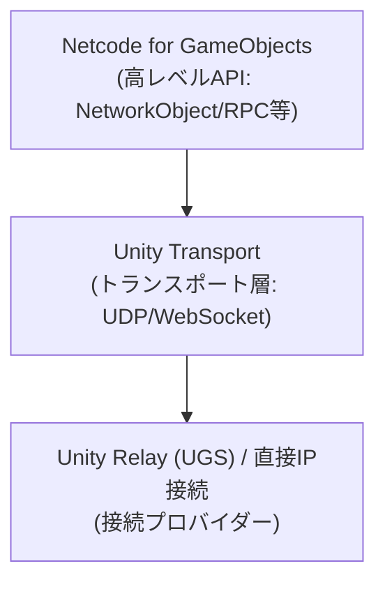
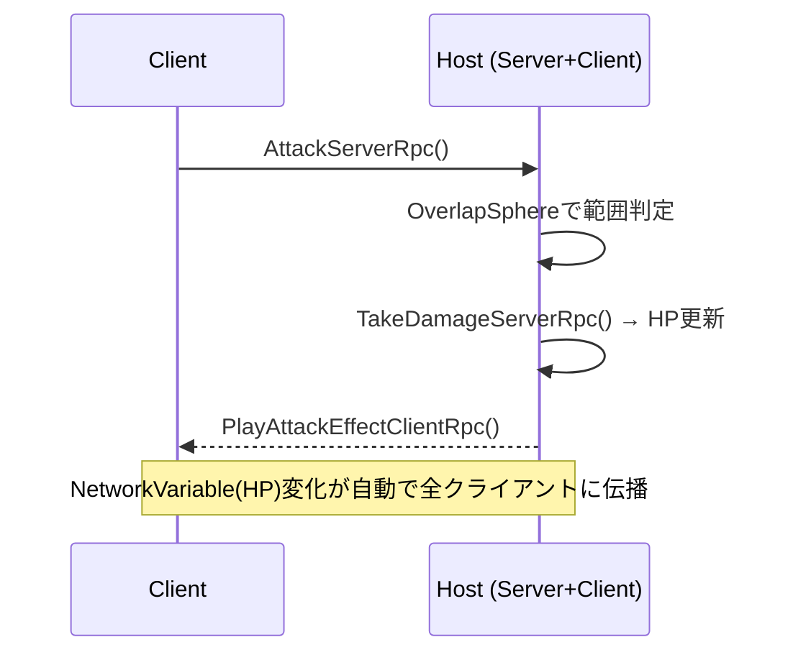

## はじめに

「Unityでマルチプレイゲームを作りたいけど、何から始めればいい？」——この疑問を持つ開発者は多い。単純なシングルプレイと違い、マルチプレイには「誰の操作か」「いつ同期するか」「誰がサーバーか」といった複雑な問題が次々と立ちはだかる。

同期処理の設計、ホスト/クライアント構造の理解、RPC通信の実装……どれも独力で学ぼうとすると、断片的なドキュメントの海に溺れがちだ。特にUnityのマルチプレイ周辺は長年サードパーティ依存が強く、「どのライブラリを選ぶべきか」という選定コストまで発生する。

そこで本記事では、**Unity公式が提供する Netcode for GameObjects（NGO）を使って、オンライン対戦の基礎骨格を5ステップで構築する方法**を解説する。コードは最小限に絞り、各ステップで「なぜそうするか」を明確にしながら進める。

:::message
**対象読者・使用環境**

- 対象: Unity C# の基礎がある方（MonoBehaviour・コルーチンを触ったことがある程度）
- 使用環境: Unity 6.x / Netcode for GameObjects 1.12.0
:::

## Netcode for GameObjectsとは

Netcode for GameObjects（以下 NGO）は、**Unity公式が開発・メンテナンスするマルチプレイヤーSDK**だ。Package Manager から直接インストールでき、追加の外部依存なしに動作する。

サードパーティの Mirror と比較したとき、NGO の最大の利点は公式サポートとアップデートの継続性にある。Mirror はコミュニティ主導で優れた安定性を持つが、Unity のバージョンアップへの追随はコミュニティの活動に依存する。NGO であれば Unity 本体のリリースサイクルに合わせて更新が提供される。

Unity 6 における注意点として、以前は単体パッケージだった Unity Relay が非推奨となり、統合された **Multiplayer Services パッケージ**への移行が推奨されている。本記事では NAT 越えが不要なローカル環境での直接IP接続を使用するため、この変更の影響は受けない。

NGO のアーキテクチャは以下の3層で構成される。



高レベル API（NetworkObject・RPC など）がトランスポート層を抽象化しているため、接続プロバイダーを Relay に切り替えてもゲームロジック側のコードはほぼ変更不要だ。

## Step 1: パッケージをインストールする

Window > Package Manager を開き、左上のドロップダウンを **Unity Registry** に切り替える。検索ボックスに「Netcode for GameObjects」と入力し、表示されたパッケージの **Install** ボタンをクリックする。

インストールが完了すると、Unity エディタのメニューバーに **Component > Netcode** のサブメニューが追加される。これがインストール成功の確認サインだ。

:::message
**推奨バージョン**

Unity 6 では Netcode for GameObjects **1.12.0 以上**を使用すること。1.11 以前は Unity 6 との API 互換性に一部問題があるケースが報告されている。
:::

## Step 2: NetworkManagerを設定する

NetworkManager は **NGO の司令塔**だ。接続の開始・終了、プレイヤーの生成、クライアントの管理をすべてここが担う。シーンに必ず1つだけ配置する。

設定手順は以下のとおりだ。

1. 空の GameObject を作成し、名前を `NetworkManager` に変更する
2. Component > Netcode > **Network Manager** を追加する
3. Component > Netcode > Transports > **Unity Transport** を追加する
4. NetworkManager の Inspector を開き、**Network Transport** フィールドに追加した UnityTransport を参照セットする
5. **Player Prefab** フィールドに Step 3 で作成するプレハブを登録する

接続ボタンのシンプルな UI 制御スクリプトも追加しておこう。

```csharp:Assets/Scripts/NetworkManagerBootstrap.cs
using Unity.Netcode;
using UnityEngine;

/// <summary>
/// ゲーム開始時にホスト/クライアントを起動するシンプルなUI制御
/// </summary>
public class NetworkManagerBootstrap : MonoBehaviour
{
    private void OnGUI()
    {
        GUILayout.BeginArea(new Rect(10, 10, 300, 300));

        if (!NetworkManager.Singleton.IsClient && !NetworkManager.Singleton.IsServer)
        {
            if (GUILayout.Button("ホストとして開始"))
                NetworkManager.Singleton.StartHost();

            if (GUILayout.Button("クライアントとして接続"))
                NetworkManager.Singleton.StartClient();

            if (GUILayout.Button("サーバーとして起動"))
                NetworkManager.Singleton.StartServer();
        }
        else
        {
            GUILayout.Label($"Mode: {(NetworkManager.Singleton.IsHost ? "Host" : "Client")}");
            GUILayout.Label($"ClientId: {NetworkManager.Singleton.LocalClientId}");
        }

        GUILayout.EndArea();
    }
}
```

:::message alert
`NetworkManager.Singleton` はシーンに1つのみ存在すること。DontDestroyOnLoad でシーンをまたぐ場合、シーン遷移のたびに Duplicate が生成されることがある。Awake で既存インスタンスを確認して重複を破棄する処理を必ず入れること。
:::

## Step 3: NetworkObjectでプレイヤーを生成・同期する

NetworkObject は、**「このオブジェクトがネットワーク上の誰のものか」を管理するコンポーネント**だ。NetworkObject が付いていないオブジェクトは NGO の管理外となり、同期されない。

Player Prefab の作成手順は以下のとおりだ。

1. Capsule などのオブジェクトを作成し `Player` と命名する
2. Component > Netcode > **Network Object** を追加する
3. Component > Netcode > **Network Transform** を追加する（位置・回転を自動同期）
4. 以下の PlayerController スクリプトを追加する
5. Assets/Prefabs/Player.prefab として保存し、NetworkManager の Player Prefab フィールドに登録する

```csharp:Assets/Scripts/PlayerController.cs
using Unity.Netcode;
using UnityEngine;

public class PlayerController : NetworkBehaviour
{
    [SerializeField] private float moveSpeed = 5f;

    private void Update()
    {
        // 自分のオブジェクトだけ操作する（IsOwner チェック必須）
        if (!IsOwner) return;

        float h = Input.GetAxis("Horizontal");
        float v = Input.GetAxis("Vertical");
        Vector3 direction = new Vector3(h, 0f, v).normalized;

        transform.position += direction * moveSpeed * Time.deltaTime;
    }
}
```

:::message
**IsOwner とは何か**

NGO では全クライアントが全プレイヤーオブジェクトをインスタンス化する。`IsOwner` が `true` のオブジェクトだけが「自分のキャラクター」であり、そのクライアントだけが入力を受け付ける。`IsOwner` チェックを忘れると、全クライアントが全プレイヤーを同時に操作してしまう。
:::

## Step 4: ServerRpc/ClientRpcで攻撃アクションを同期する

位置や回転は NetworkTransform が自動で同期してくれるが、**攻撃などの「イベント」はRPCで明示的に伝える**必要がある。RPC には2種類ある。

- **ServerRpc**: クライアントが呼び出す → サーバーで実行される
- **ClientRpc**: サーバーが呼び出す → 全クライアントで実行される

:::message
**NGO バージョンと RPC 属性の対応**

| バージョン | ServerRpc | ClientRpc |
|-----------|----------|----------|
| NGO 1.x（本記事） | `[ServerRpc]` | `[ClientRpc]` |
| NGO 2.x 以降 | `[Rpc(SendTo.Server)]` | `[Rpc(SendTo.ClientsAndHost)]` |

NGO 2.x から `[Rpc]` 属性に統一された。既存プロジェクトの 1.x 系では旧属性が引き続き動作するが、新規プロジェクトは公式ドキュメントで最新 API を確認すること。
:::

攻撃処理の実装例を以下に示す。

```csharp:Assets/Scripts/PlayerCombat.cs
using Unity.Netcode;
using UnityEngine;

public class PlayerCombat : NetworkBehaviour
{
    [SerializeField] private float attackRange = 2f;
    [SerializeField] private int attackDamage = 10;

    private void Update()
    {
        if (!IsOwner) return;

        if (Input.GetKeyDown(KeyCode.Space))
        {
            AttackServerRpc();
        }
    }

    // [ServerRpc] = クライアントが呼ぶ → サーバーで実行される
    [ServerRpc]
    private void AttackServerRpc()
    {
        Debug.Log($"[Server] Player {OwnerClientId} が攻撃！");

        Collider[] hits = Physics.OverlapSphere(transform.position, attackRange);
        foreach (var hit in hits)
        {
            if (hit.TryGetComponent<PlayerHealth>(out var health))
            {
                if (health.OwnerClientId != OwnerClientId)
                {
                    // サーバー上では RPC を経由せず直接メソッドを呼ぶ
                    // （ServerRpc をサーバー上から呼ぶと余分なラウンドトリップが発生する）
                    health.ApplyDamage(attackDamage);
                }
            }
        }

        PlayAttackEffectClientRpc();
    }

    // [ClientRpc] = サーバーが呼ぶ → 全クライアントで実行される
    [ClientRpc]
    private void PlayAttackEffectClientRpc()
    {
        Debug.Log($"[Client] 攻撃エフェクト再生");
        // ParticleSystem.Play() など
    }
}
```

:::details PlayerHealth スクリプト（NetworkVariable で HP を全クライアントに自動同期）

```csharp:Assets/Scripts/PlayerHealth.cs
using Unity.Netcode;
using UnityEngine;

public class PlayerHealth : NetworkBehaviour
{
    // NetworkVariable はサーバーが書き込み、全クライアントに自動同期される
    private NetworkVariable<int> currentHealth = new NetworkVariable<int>(
        100,
        NetworkVariableReadPermission.Everyone,
        NetworkVariableWritePermission.Server
    );

    public override void OnNetworkSpawn()
    {
        currentHealth.OnValueChanged += OnHealthChanged;
    }

    // 必ずペアで解除する（多重登録防止）
    public override void OnNetworkDespawn()
    {
        currentHealth.OnValueChanged -= OnHealthChanged;
    }

    private void OnHealthChanged(int previous, int current)
    {
        Debug.Log($"HP: {previous} → {current}");
        // UIスライダー更新などをここに
    }

    // RequireOwnership = false: 攻撃者（OwnerでないClient）から呼べるようにする
    // ※ NGO 2.x では [Rpc(SendTo.Server, InvokePermission = RpcInvokePermission.Everyone)] に移行
    [ServerRpc(RequireOwnership = false)]
    public void TakeDamageServerRpc(int damage)
    {
        currentHealth.Value -= damage;
        if (currentHealth.Value <= 0)
        {
            Debug.Log($"Player {OwnerClientId} が倒された！");
        }
    }

    // サーバー上から直接呼ぶ用（RPC を経由しないため高効率）
    public void ApplyDamage(int damage)
    {
        if (!IsServer) return;
        currentHealth.Value -= damage;
        if (currentHealth.Value <= 0)
        {
            Debug.Log($"Player {OwnerClientId} が倒された！");
        }
    }
}
```

:::

攻撃処理の通信フローを以下のシーケンス図で整理する。



**NetworkVariable を使うと、値の変更を購読ベースで全クライアントに伝播できる**。HP のような「常に最新値を全員が知るべき状態」には NetworkVariable が適している。一方で「このタイミングで何かが起きた」というイベント通知には RPC を使う、という使い分けが基本だ。

## Step 5: IPアドレス指定で接続する

最後に、ローカルネットワーク上の別 PC から接続できるようにする。NGO の接続先 IP とポートは `UnityTransport.SetConnectionData()` で指定する。

```csharp:Assets/Scripts/ConnectionUI.cs
using Unity.Netcode;
using Unity.Netcode.Transports.UTP;
using UnityEngine;

public class ConnectionUI : MonoBehaviour
{
    private string ipAddress = "127.0.0.1";
    private string port = "7777";

    private void OnGUI()
    {
        GUILayout.BeginArea(new Rect(10, 10, 350, 400));

        if (!NetworkManager.Singleton.IsClient && !NetworkManager.Singleton.IsServer)
        {
            GUILayout.Label("接続設定");
            GUILayout.Label("IPアドレス:");
            ipAddress = GUILayout.TextField(ipAddress, 100);
            GUILayout.Label("ポート:");
            port = GUILayout.TextField(port, 10);

            var transport = NetworkManager.Singleton.GetComponent<UnityTransport>();

            if (GUILayout.Button("ホストとして開始"))
            {
                transport.SetConnectionData("0.0.0.0", ushort.Parse(port));
                NetworkManager.Singleton.StartHost();
            }

            if (GUILayout.Button("クライアントとして接続"))
            {
                transport.SetConnectionData(ipAddress, ushort.Parse(port));
                NetworkManager.Singleton.StartClient();
            }
        }
        else
        {
            GUILayout.Label($"自分のClientId: {NetworkManager.Singleton.LocalClientId}");

            if (GUILayout.Button("切断"))
                NetworkManager.Singleton.Shutdown();
        }

        GUILayout.EndArea();
    }
}
```

:::message
**ローカル接続テスト**

1台の PC で2つの Unity エディタを起動する場合、一方をホスト、もう一方をクライアントとして同じ IP アドレス + ポートで接続できる。Unity 6 では **Multiplayer Play Mode** を使うと1プロジェクト内で複数クライアントをシミュレートできるため、より効率的にテストが行える。
:::

## まとめと次のステップ

5ステップで学んだ内容を整理する。

| ステップ | 内容 | 使用コンポーネント |
|--------|------|-----------------|
| Step 1 | パッケージインストール | Package Manager |
| Step 2 | ネットワーク管理 | NetworkManager, UnityTransport |
| Step 3 | プレイヤー同期 | NetworkObject, NetworkTransform |
| Step 4 | アクション同期 | ServerRpc, ClientRpc, NetworkVariable |
| Step 5 | 接続処理 | SetConnectionData |

ここまでの実装でローカル環境でのオンライン対戦の基礎骨格が完成した。**次のステップとして以下の3つに取り組むと、実際にリリースできるレベルに近づく。**

- **Unity Relay / Multiplayer Services を使ってNATを越えた接続を実現**する（インターネット越しに別宅の友人と遊べるようになる）
- **Lobby API でマッチメイキングを実装**する（ルーム作成・検索・参加フローを構築できる）
- **Interest Management でパフォーマンスを最適化**する（大規模マップで画面外オブジェクトの同期を省略してトラフィックを削減できる）

https://docs-multiplayer.unity3d.com/netcode/current/about/
https://learn.unity.com/tutorial/get-started-with-netcode-for-gameobjects
