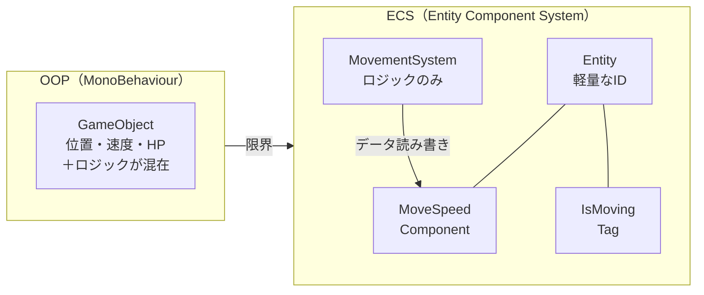
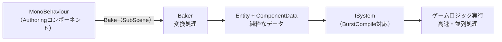

## はじめに

1000体の敵キャラクターをMonoBehaviourで動かしたとき、FPSが一桁台に落ちた経験はないでしょうか。**OOP（オブジェクト指向）ベースのMonoBehaviourは、大量オブジェクトの一括処理が苦手**です。位置・速度・HPといったデータとロジックが1つのクラスに混在し、キャッシュミスが頻発するため、オブジェクト数が増えるほどパフォーマンスが劣化します。

この問題を根本から解決するアーキテクチャが **ECS（Entity Component System）** です。DOTS（Data-Oriented Technology Stack）の中核技術で、データとロジックを分離しCPUキャッシュを最大限に活用します。特定シナリオでは10倍以上の処理速度改善が報告されています。



:::message
Unity 6.4 から Entities パッケージ（v6.4.0）がコアパッケージに昇格し、Package Manager からの個別インストールが不要になりました。ECS導入の敷居が大きく下がったタイミングです。
:::

本記事では、MonoBehaviourは使えるがECSは未経験という方を対象に、**環境構築からSystem実装まで5ステップで完走できる実践ガイド**を提供します。

## ECSの基本概念：3つの要素を理解する

ECSはEntity・Component・Systemの3要素で構成されます。OOPと最も大きく異なるのは、**データとロジックを完全に分離する**という設計思想です。

| 概念 | OOP（MonoBehaviour） | ECS |
|------|---------------------|-----|
| データ+ロジック | 同じクラスに混在 | 完全分離 |
| オブジェクト | データ+ロジックを持つGameObject | 軽量なIDのみのEntity |
| 状態管理 | MonoBehaviourのフィールド | IComponentData（struct） |
| 処理 | MonoBehaviourのUpdate | System（ISystem/SystemBase） |

### Entity（エンティティ）

GameObjectの代替となる軽量なIDです。それ自体はデータを持たず、Componentへの参照点として機能します。EntityManagerが作成・破棄を管理します。

### Component（コンポーネント）

IComponentDataを実装したstructで、**ロジックを持たない純粋なデータコンテナ**です。MoveSpeed・Health・Positionのように、1つのComponentには1つの責務だけを持たせます。

### System（システム）

ComponentDataを読み書きするロジックの実行単位です。ISystem（Burst対応・推奨）またはSystemBaseを選択でき、毎フレームOnUpdate()が呼ばれます。

:::message
ECSが高速な理由はData-Oriented Design（DOD）にあります。同じ型のComponentデータをメモリ上に連続配置（SoA構造）することで、CPUキャッシュの効率が大幅に向上します。MonoBehaviourのようにオブジェクトが散在するAoS構造と比べ、大量エンティティの一括処理で圧倒的な差が生まれます。
:::

## ステップ1：環境構築

### Unity 6.4以降（推奨）

Unity 6.4からEntitiesはコアパッケージとして統合されました。**Package Managerでの追加インストールは不要**で、プロジェクトを作成した時点でEntities 6.4.0が利用できます。

### Unity 2022.3 LTS / Unity 6.2以前の場合

Package Managerから手動でインストールします。

1. メニューバーから「Window → Package Manager」を開く
2. 左上の「+」→「Add package by name」を選択
3. `com.unity.entities` を入力してインストール

:::message alert
バージョンの対応関係に注意してください。Unity 2022.3ではEntities 1.3.x、Unity 6.4以降はEntities 6.4.0（コアパッケージ）が使用されます。バージョンを誤るとAPIの非互換が発生するため、Unityエディタのバージョンと合わせて確認してください。
:::

### SubSceneを作成する

ECSのEntityはGameObject Sceneに直置きできません。SubSceneが必要です。

1. HierarchyウィンドウでGameObjectを新規作成
2. Inspectorで「Add Component → New Sub Scene」を選択
3. 保存場所を指定してSubSceneファイルが生成される

作成したSubSceneの内部に配置したGameObjectだけがECSのEntityとして扱われます。

## ステップ2：Componentを定義する

ECSのComponentはデータだけを持つstructです。`IComponentData` インターフェースを実装して定義します。

```csharp:MoveComponents.cs
using Unity.Entities;
using Unity.Mathematics;

// 移動速度コンポーネント（データのみ）
public struct MoveSpeed : IComponentData
{
    public float Value;
}

// タグコンポーネント（フラグとして使用・フィールドなし）
public struct IsMovingTag : IComponentData { }
```

3点を押さえてください。

- `float` や `float3`（Unity.Mathematics）など **blittable型のみ**フィールドに使えます。通常のC#クラスは持てません
- タグコンポーネントはフィールドを持たないstructです。「このEntityは移動中である」といったフラグとして機能します
- **classではなくstructで定義する**ことが必須です。Entityデータはアーキタイプ単位のメモリ上にチャンクとして連続配置されるため、参照型ではなく値型でなければなりません

:::message
`IComponentData` はデータのみ。ロジックはSystemに委譲し、ComponentはSingle Responsibilityを守ります。
:::

## ステップ3：Entityを生成する（Bakingシステム）

MonoBehaviourからECSへの変換には **Baker を使う** のが基本の流れです。SubScene に配置した GameObject が Bake されて Entity に変換されます。

```csharp:MoveAuthoringAndBaker.cs
using Unity.Entities;
using UnityEngine;

// 1. Authoringコンポーネント（MonoBehaviourとしてGameObjectに付ける）
public class MoveAuthoring : MonoBehaviour
{
    public float speed = 5f;
}

// 2. Bakerを別クラスとして定義
public class MoveSpeedBaker : Baker<MoveAuthoring>
{
    public override void Bake(MoveAuthoring authoring)
    {
        // 対応するEntityを取得
        Entity entity = GetEntity(authoring, TransformUsageFlags.Dynamic);

        // ECSコンポーネントを追加（データ変換）
        AddComponent(entity, new MoveSpeed { Value = authoring.speed });
        AddComponent(entity, new IsMovingTag());
    }
}
```

`MoveAuthoring` を SubScene 内の GameObject にアタッチします。Playモード開始時に Baker が実行され、`MoveSpeed` と `IsMovingTag` を持つ Entity が生成されます。`TransformUsageFlags.Dynamic` は「動くオブジェクトである」ことを ECS に伝えるフラグです。

## ステップ4：Systemを実装する（ISystem）

ISystem は Burst Compiler に対応した、現在推奨の書き方です。

```csharp:MoveSystem.cs
using Unity.Burst;
using Unity.Entities;
using Unity.Mathematics;
using Unity.Transforms;

// BurstCompileでネイティブコードに変換（高速化）
[BurstCompile]
public partial struct MoveSystem : ISystem
{
    [BurstCompile]
    public void OnUpdate(ref SystemState state)
    {
        float deltaTime = SystemAPI.Time.DeltaTime;

        // IsMovingTagを持つEntityのみMoveSpeedとLocalTransformを処理
        foreach (var (transform, speed) in
            SystemAPI.Query<RefRW<LocalTransform>, RefRO<MoveSpeed>>()
                .WithAll<IsMovingTag>())
        {
            // Z方向に移動（例）
            transform.ValueRW.Position +=
                new float3(0, 0, speed.ValueRO.Value * deltaTime);
        }
    }
}
```

`RefRW<T>` は書き込み可能な参照、`RefRO<T>` は読み取り専用の参照です。書き込まないコンポーネントには `RefRO` を指定すると、ECSのスケジューリング最適化が効きます。

:::message
**ISystem vs SystemBase**: `ISystem`はBurst対応で高速。`SystemBase`は通常のC#クラスが使えますが速度が劣ります。新規実装は基本的に **ISystem を使う** のが2026年時点の推奨です。
:::

## ステップ5：MonoBehaviourから操作する（ハイブリッド連携）

既存のOOPコード（UI・入力・音声など）からECSのEntityを操作する場合は、`EntityManager`経由でアクセスします。

```csharp:GameManager.cs
using Unity.Entities;
using Unity.Transforms;
using UnityEngine;

public class GameManager : MonoBehaviour
{
    void Start()
    {
        // デフォルトWorldのEntityManagerを取得
        var em = World.DefaultGameObjectInjectionWorld.EntityManager;

        // 直接Entityを作成する例（Bakingを使わない場合）
        Entity enemy = em.CreateEntity();
        // LocalTransformを必ず追加（MoveSystemのクエリ対象になるため）
        em.AddComponentData(enemy, LocalTransform.Identity);
        em.AddComponentData(enemy, new MoveSpeed { Value = 3f });
        em.AddComponentData(enemy, new IsMovingTag());

        Debug.Log($"Entity created: {enemy}");
    }
}
```

:::message alert
**注意**: `EntityManager`での構造的変更（エンティティ作成・削除・コンポーネント追加）はメインスレッドのみで実行可能です。Systemのジョブ内で同様の操作が必要な場合は `EntityCommandBuffer` を使います。
:::

## まとめ：次のステップへ

本記事では、Unity ECS（Entities 6.4.0）を5ステップで学びました。

- **Step 1:** 環境構築 — Unity 6.4ではPackage Manager不要でECSが利用可能
- **Step 2:** Component定義 — `IComponentData` + `struct` でデータを純粋に表現
- **Step 3:** Entity生成 — BakingシステムでシーンオブジェクトをEntityに変換
- **Step 4:** System実装 — `ISystem` + `[BurstCompile]` で高速なゲームロジックを実現
- **Step 5:** MonoBehaviour連携 — ハイブリッドアーキテクチャで既存資産を活かしながら段階的移行

**ECSの本質は「データとロジックの完全な分離」にあり**、これが並列処理とBurst最適化の基盤になります。



### 次のステップ

ECSに慣れてきたら、以下のテーマに取り組むとさらに理解が深まります。

- **EntityCommandBuffer** — ジョブ内での構造的変更（Entity追加・削除）を安全に実行
- **Archetypeとメモリレイアウト** — チャンク構造を理解してキャッシュ効率を最大化
- **ECS Graphics** — `RenderMeshArray` を活用した描画最適化

https://docs.unity3d.com/Packages/com.unity.entities@6.4/manual/index.html

---

╭━━━━━━━━━━━━━━━━━━╮
　まずは、チェック！無料相談も受付中！
╰━ｖ━━━━━━━━━━━━━━━━╯

▼ ゲーム・AI開発の無料相談 ▼
https://coconala.com/services/2610064
