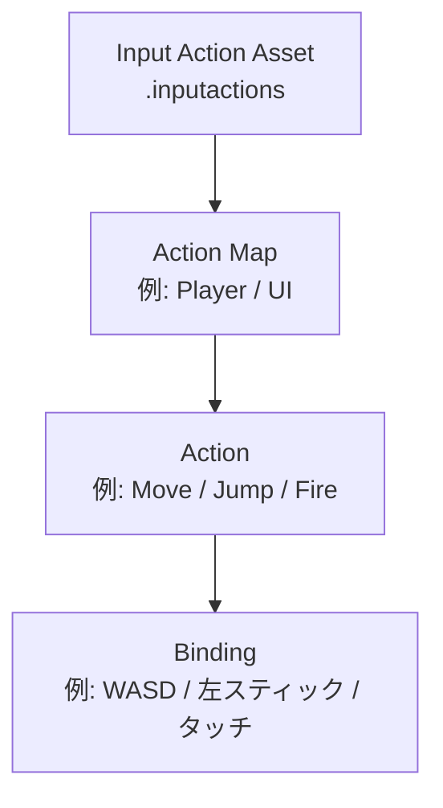

## なぜ旧 Input Manager では限界を感じるのか

ゲームパッド対応やローカルマルチプレイヤーを実装しようとしたとき、旧来の `Input.GetAxis` や `Input.GetKey` の煩雑さに気づいた経験はないでしょうか。デバイスごとに分岐コードを書き足し、キーボード・コントローラー・タッチそれぞれに対応するうちにスクリプトが肥大化していく——これは Input Manager の設計上避けられない問題です。

**Unity Input System はこの課題をアーキテクチャから解決します。** マルチデバイスへの自動対応、ポーリングではなくイベント駆動での入力受け取り、そしてローカルマルチプレイヤーを標準機能として扱える `PlayerInputManager` の提供——旧来の方法では手書きしていた処理が、宣言的な設定に置き換わります。

:::message
この記事では、旧 Input Manager から Input System（com.unity.inputsystem 1.8以降 / Unity 2019.4 以上対応）への移行を **5 ステップで完結** させる手順を解説します。パッケージ導入・`Active Input Handling` の切り替えから、`PlayerInput` コンポーネントを使ったマルチデバイス対応まで、順を追って進めます。
:::

## 旧InputManagerの限界とInput Systemの設計思想

Unity 2017以前から使われてきた旧InputManagerは、シンプルなキーボード・マウス入力には十分でした。しかしモダンなゲーム開発では、3つの構造的な限界が顕在化します。

第一に **ゲームパッド対応の煩雑さ** です。コントローラーの各ボタンをProject Settingsで手動マッピングする必要があり、PlayStation / Xbox / Switchの差異を吸収するコードを開発者が個別に実装しなければなりません。

第二に **ローカルマルチプレイの困難さ** です。旧InputManagerはデバイスを区別する仕組みを持っておらず、入力の振り分けを自前で実装する必要がありました。

第三に **ポーリング型アーキテクチャの制約** です。`Update()` で毎フレーム `Input.GetButtonDown()` を呼び出す方式は、イベント駆動設計とも相性が悪い構造です。

:::message
旧InputManagerは削除されておらず、Package ManagerでInput Systemをインストール後も「Both」モードを選べば並用できます。ただし新規プロジェクトでは Input System 一本化を推奨します。
:::

## Input Systemの3層構造

Input Systemはこれらの問題を、**アセットベースの階層構造** で解決します。入力定義をコードから切り離し、`.inputactions` ファイルに集約することで、プラットフォーム差異を抽象化します。

構造は下図のように4階層で整理されます。



- **Input Action Asset** — 入力定義ファイル全体。プロジェクトに1〜複数配置できます。
- **Action Map** — 状況ごとの入力グループ。`Player`（ゲームプレイ中）と `UI`（メニュー操作中）を切り替えることで、同じキーに異なる意味を持たせられます。
- **Action** — 「ジャンプ」「移動」など意味のある操作単位。型として `Value`（軸）/ `Button`（押す）/ `PassThrough` を選択します。
- **Binding** — Actionと物理デバイスの紐付け。Control Schemeを使うと「キーボード＆マウス」「ゲームパッド」を一括管理できます。

## 旧InputManager vs Input System 比較

| 比較項目 | 旧 Input Manager | 新 Input System |
|---------|-----------------|----------------|
| 移動入力 | `Input.GetAxis("Horizontal")` | `moveAction.ReadValue<Vector2>()` |
| ゲームパッド | 手動マッピングが煩雑 | Control Schemeで統一管理 |
| ローカルマルチ | 困難（自前実装が必要） | PlayerInputManagerで標準対応 |
| 入力方式 | ポーリング型のみ | イベント駆動＋ポーリング両対応 |

## Step 1: Input Systemパッケージのインストール

`Window > Package Manager` を開き、`com.unity.inputsystem` を検索してインストールします。

インストール後、`Edit > Project Settings > Player > Other Settings` で **Active Input Handling を「Input System Package (New)」に変更します**。

:::message alert
Active Input Handling を変更するとエディタが再起動します。保存してから行いましょう。
:::

再起動後、旧InputManagerのAPIは無効化されます。`Input.GetAxis()` 等を使用しているコードはコンパイルエラーになるため、移行前に影響範囲を確認しておきましょう。

## Step 2: Input Action Assetの作成

Project ビュー上で右クリックし、`Create > Input Actions` を選択します。ファイル名は `PlayerInputActions` などわかりやすい名前にしておくとよいでしょう。

作成した `.inputactions` ファイルをダブルクリックすると専用エディタが開きます。

1. 「Add Action Map」で `Player` マップを作成
2. 以下のアクションを追加する

| アクション名 | Action Type | Control Type |
|------------|-------------|--------------|
| Move | Value | Vector2 |
| Jump | Button | （デフォルト） |

Moveアクションには `Add Binding` から **2D Vector Composite** を選択し、W/A/S/Dキーと Left Stick（ゲームパッド）を両方割り当てます。**キーボードとゲームパッドを同一アクションに統合できる点が、新Input Systemの最大の強みです。**

## Step 3: PlayerInputコンポーネントの設定

プレイヤーGameObjectに `Add Component > Input > Player Input` を追加します。

`Actions` フィールドに `.inputactions` アセットをドラッグして割り当て、`Behaviour` を **「Send Messages」** に設定します（初心者向けに最もシンプル）。

| モード | 通知方法 | 向いている場面 |
|--------|---------|--------------|
| Send Messages | SendMessage() で同一GOへ | シンプルな単体キャラ |
| Broadcast Messages | 子階層全体に配信 | 階層が深いプレイヤー |
| Invoke Unity Events | インスペクタで接続 | 設計時に接続先を決めたい場合 |
| Invoke C# Events | コードでコールバック登録 | 柔軟な制御が必要な場合 |

Send Messages モードでは、PlayerInputと同じGameObjectのスクリプトに `On + Action名` のメソッドを定義するだけで入力を受け取れます。

```csharp:PlayerInputSample.cs
using UnityEngine;
using UnityEngine.InputSystem;

public class PlayerInputSample : MonoBehaviour
{
    private Vector2 moveInput;

    // Action名が "Move" → OnMove が自動で呼ばれる
    public void OnMove(InputValue value)
    {
        moveInput = value.Get<Vector2>();
    }

    // Action名が "Jump" → OnJump が自動で呼ばれる（引数なし）
    public void OnJump()
    {
        Debug.Log("Jump!");
    }
}
```

## Step 4: C#スクリプトで入力を受け取る（完全実装）

移動＋ジャンプを実装した完全版です。`PlayerInput` コンポーネントと同じ GameObject にアタッチしてください。

:::details PlayerController.cs（移動＋ジャンプ完全版）
```csharp:PlayerController.cs
using UnityEngine;
using UnityEngine.InputSystem;

[RequireComponent(typeof(Rigidbody))]
[RequireComponent(typeof(PlayerInput))]
public class PlayerController : MonoBehaviour
{
    [SerializeField] private float moveSpeed = 5f; // 単位: m/秒
    [SerializeField] private float jumpForce = 10f;

    private Rigidbody rb;
    private Vector2 moveInput;
    private bool isGrounded;

    void Awake()
    {
        rb = GetComponent<Rigidbody>();
    }

    // PlayerInput が自動呼び出し（Action 名が Move → OnMove）
    public void OnMove(InputValue value)
    {
        moveInput = value.Get<Vector2>();
    }

    // Button アクションは引数なしで「押した瞬間」のみ呼ばれる
    public void OnJump()
    {
        if (isGrounded)
        {
            rb.AddForce(Vector3.up * jumpForce, ForceMode.Impulse);
        }
    }

    void FixedUpdate()
    {
        Vector3 movement = new Vector3(moveInput.x, 0, moveInput.y) * moveSpeed;
        rb.MovePosition(rb.position + movement * Time.fixedDeltaTime);
    }

    void OnCollisionEnter(Collision col)
    {
        if (col.gameObject.CompareTag("Ground")) isGrounded = true;
    }

    void OnCollisionExit(Collision col)
    {
        if (col.gameObject.CompareTag("Ground")) isGrounded = false;
    }
}
```
:::

実装のポイントは3つです。

- `OnMove` が呼ばれるタイミングは「値が変化したとき」のみ。移動処理は `FixedUpdate` に委ねることで、入力取得と物理演算の責務が切り離せます
- `public void OnJump()` は引数なしで定義。Button アクションは「押した瞬間（started）」のみで呼ばれるため、`isPressed` の確認は不要です
- `[RequireComponent]` を付けることで、`Rigidbody` や `PlayerInput` の設定漏れをエディタが警告してくれます

## Step 5: ゲームパッド・マルチデバイス自動対応

Input Action Asset のエディタで Control Scheme を設定すると、デバイス切り替えが自動化されます。

1. 上部「No Control Schemes」→「Add Control Scheme」
2. 「Keyboard&Mouse」と「Gamepad」の2つを追加
3. 各 Action の Binding に両デバイスのキーを登録する

PlayerInput がデバイスの接続を自動検出し、キーボード・PSコントローラー・Xboxコントローラーを透過的に処理します。ゲームパッドに直接アクセスしたい場面では `Gamepad.current` を使います。

```csharp:GamepadCheck.cs
using UnityEngine;
using UnityEngine.InputSystem;

public class GamepadCheck : MonoBehaviour
{
    void Update()
    {
        if (Gamepad.current != null)
        {
            Vector2 leftStick = Gamepad.current.leftStick.ReadValue();
            bool jump = Gamepad.current.buttonSouth.wasPressedThisFrame;
            Debug.Log($"LeftStick: {leftStick}, Jump: {jump}");
        }
    }
}
```

:::message
`buttonSouth` は Xbox の A・PlayStation の Cross に対応しています（Nintendo Switch Pro では B ボタンになるため、Switch対応時はレイアウト差異に注意が必要です）。PlayerInput と Control Scheme を使えば、各コントローラーへの対応は追加実装なしで完了します。
:::

## まとめ

| ステップ | 内容 |
|--------|------|
| Step 1 | Package Managerでインストール + Active Input Handling変更 |
| Step 2 | Input Action Asset作成（Move/Jump等のAction定義） |
| Step 3 | PlayerInputコンポーネント追加・Asset割り当て |
| Step 4 | C#スクリプトでOnMove/OnJumpを実装 |
| Step 5 | Control Scheme設定でマルチデバイス自動対応 |

### よくある落とし穴3選

**1. Active Input Handlingを変えていない**
デフォルト設定のままでは新APIが正しく動きません。`Project Settings > Player > Active Input Handling` を `Input System Package (New)` に変更してください。

**2. InvalidOperationExceptionが発生する**
旧 `Input.GetKey()` がコード内に残っていると例外が出ます。設定を `Both` にするか、コードを全て新APIに移行してください。

**3. EventSystemがクリックに反応しなくなる**
UGUIのEventSystemに `InputSystemUIInputModule` が必要です。Hierarchy で EventSystem を選択し `Replace with InputSystemUIInputModule` を実行します。

:::message alert
この3つは移行後に必ず確認してください。特に3番のUIイベントは見落としがちです。
:::

次のステップとして、`PlayerInputManager` によるローカルマルチプレイヤー対応や、ランタイムリバインド（プレイヤーが自分でキー設定を変更できる機能）に取り組むとさらに応用が広がります。

公式マニュアル: https://docs.unity3d.com/Packages/com.unity.inputsystem@1.8/manual/index.html
移行ガイド: https://docs.unity3d.com/Packages/com.unity.inputsystem@1.11/manual/Migration.html
