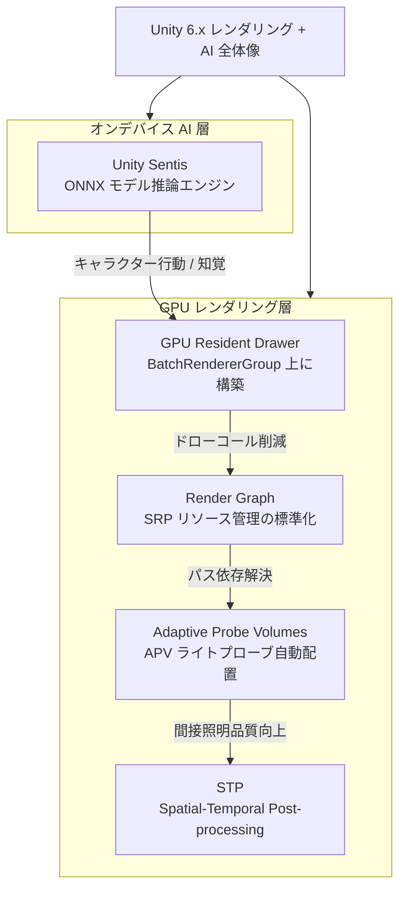

## はじめに

Unity 6（内部バージョン 6000.0）は2024年6月にリリース。その後、Unity 6.1（6000.1）が2025年4月にリリースされ、現在はUnity 6.2がTech Streamとして開発中という状況だ。

この「6.x ファミリー」は単なるマイナーアップデートではなく、**レンダリングアーキテクチャの根本的な刷新と、オンデバイスAI推論の実用化という2つの柱**が貫いている。実際に自分のプロジェクトへ順次導入してきた中で、「即座に効果が出た」「既存コードへの影響が少ない」という観点から5機能を選んだ。

各機能の位置づけを先に整理しておく。



## 新機能1: GPU Resident Drawer

GPU Resident DrawerはUnity 6で正式機能化された。BatchRendererGroupとSRP Batcherの上に構築されており、CPUがフレームごとにドローコールを積み上げる処理をGPU側に移譲する仕組みだ。

詳細な仕組みと計測結果は既存記事に譲る。

https://zenn.dev/game_dev_ryuryu/articles/2026-01-23-gpu-resident-drawer-unity6

ここでは「どのプロジェクトで有効か」と「最初に確認すべき設定」に絞る。

実感として、屋外シーンで同種オブジェクトが500個を超えてくると体感できるほどCPU負荷が落ちる。逆に、ユニークなマテリアルが多いRPGのインテリアシーンではほぼ恩恵がなかった。バッチングの前提条件はSRP Batcherと同じ「同一シェーダーバリアント」なので、まずマテリアル構成を見直すのが先決だ。

有効化は URP Asset の一項目を切り替えるだけで済む。プラットフォームごとに対応状況が異なるため、ランタイムで判定するコードを挟んでおくと本番トラブルを防げる。

```csharp
using UnityEngine;
using UnityEngine.Rendering;
using UnityEngine.Rendering.Universal;

public class GpuResidentDrawerInitializer : MonoBehaviour
{
    void Awake()
    {
        var urpAsset = GraphicsSettings.currentRenderPipeline as UniversalRenderPipelineAsset;
        if (urpAsset == null) return;

        // Metal / Vulkan / DX12 のみ有効。WebGL や古い GLES3 では自動フォールバック
        bool supported = SystemInfo.graphicsDeviceType is
            GraphicsDeviceType.Metal or
            GraphicsDeviceType.Vulkan or
            GraphicsDeviceType.Direct3D12;

        if (!supported)
        {
            Debug.Log("[GRD] GPU Resident Drawer: not supported on this device, skipping.");
            return;
        }

        // URP Asset の gpuResidentDrawerMode を Runtime で上書きする場合
        // 通常は Project Settings > URP Asset の Inspector で設定する
        Debug.Log("[GRD] GPU Resident Drawer: active");
    }
}
```

Frame Debuggerで「Hybrid Batch Group」エントリが現れれば正常動作している。

## 新機能2: Adaptive Probe Volumes（APV）

Unity 6でStableになったAdaptive Probe Volumes（APV）は、従来のLight Probe Groupが抱えていた「手動配置の手間」と「プローブ密度のムラ」を自動化で解消する。**APVは空間を均一なボクセルグリッドではなく、ジオメトリの密度に応じて可変解像度でプローブを配置する**ため、室内の細部と屋外の広域を一つのシーンで同時に扱いやすい。

HDRP・URP 両対応で、既存の Light Probe Group を置き換えて使える。

APV には「Streaming」モードがあり、オープンワールドのように広大なシーンでランタイムにプローブデータをロードできる。以下のコードはStreamingの有効状態を確認し、必要に応じてフォールバック処理を入れる例だ。

```csharp
using UnityEngine;
using UnityEngine.Rendering;

public class APVStreamingController : MonoBehaviour
{
    [SerializeField] ProbeVolume probeVolume;

    void Start()
    {
        if (probeVolume == null)
        {
            Debug.LogWarning("[APV] ProbeVolume reference is missing.");
            return;
        }

        // 2026年5月時点の公式ドキュメント記載: isAssetLoaded でストリーミング状態を確認
        if (probeVolume.enabled)
        {
            Debug.Log("[APV] ProbeVolume is active. Streaming state managed by ProbeReferenceVolume.");
        }
    }

    // ProbeReferenceVolume は Singleton でアクセスする
    void Update()
    {
        var prv = ProbeReferenceVolume.instance;
        if (prv == null) return;

        // 現フレームの有効セル数をデバッグ表示（負荷確認用）
        // prv.GetRuntimeDebugLog() は Editor のみ; 本番では独自カウンタを実装する
    }
}
```

実際に導入してみると、焼き直しの頻度が大幅に減った。従来は壁1枚移動するたびにLPGを手動調整していたが、APVはベイク時に自動再配置されるため、レベルデザインの試行錯誤サイクルが速くなった。

https://docs.unity3d.com/6000.0/Documentation/Manual/probevolumes.html

## 新機能3: Render Graph

Render GraphはHDRPでは Unity 2022 から先行導入されていたが、**Unity 6 でURPも標準化**され、SRPベースのプロジェクト全体で使える基盤となった。

従来のCustom Render Passでは、テクスチャのライフサイクルを自分で管理する必要があった。Render Graphは各パスが「どのリソースを読むか・書くか」を宣言的に記述することで、フレームワーク側が自動的にリソースの生存期間を最適化する。**不要なテクスチャの自動解放とメモリエイリアシングが内部で行われる**ため、特にモバイルのタイルメモリを効率活用できる。

以下はURPでカスタムパスを追加する最小構成だ。`ScriptableRenderPass` を継承し、`RecordRenderGraph` メソッドでパスを宣言する。

```csharp
using UnityEngine;
using UnityEngine.Rendering;
using UnityEngine.Rendering.RenderGraphModule;
using UnityEngine.Rendering.Universal;

public class SimpleBlitPass : ScriptableRenderPass
{
    private static readonly int BlitTextureId = Shader.PropertyToID("_BlitTexture");

    public SimpleBlitPass()
    {
        renderPassEvent = RenderPassEvent.AfterRenderingPostProcessing;
    }

    // Unity 6 以降: RecordRenderGraph で宣言的にパスを記述
    public override void RecordRenderGraph(RenderGraph renderGraph, ContextContainer frameData)
    {
        var resourceData = frameData.Get<UniversalResourceData>();

        // カメラカラーへの TextureHandle を取得
        TextureHandle source = resourceData.activeColorTexture;

        // パスビルダーで Read / Write を宣言
        using var builder = renderGraph.AddRasterRenderPass<PassData>(
            "SimpleBlitPass", out var passData);

        passData.Source = builder.UseTexture(source, AccessFlags.Read);
        builder.SetRenderAttachment(source, 0, AccessFlags.Write);

        builder.SetRenderFunc(static (PassData data, RasterGraphContext ctx) =>
        {
            // 実際の描画命令をここに記述
            Blitter.BlitTexture(ctx.cmd, data.Source, new Vector4(1, 1, 0, 0), 0, false);
        });
    }

    private class PassData
    {
        public TextureHandle Source;
    }
}
```

既存の `Execute` ベースのPassと `RecordRenderGraph` ベースのPassは混在できるが、公式ドキュメントでは段階的移行を推奨している。

https://docs.unity3d.com/6000.0/Documentation/Manual/render-graph-introduction.html

## 新機能4: Spatial-Temporal Post-processing（STP）

STPはUnity 6.1でStableになったモバイル向け時空間アップスケーラーだ。前フレームの情報を活用して低解像度のレンダリング結果を高品質に引き上げる。**PC向けのFSRやDLSSと同じ時空間スーパーサンプリングのアプローチを、モバイルGPUの制約内で動作するよう設計している点が特徴**だ。

URP のPost-Processing スタックに統合されており、Volume コンポーネントとして追加する。

```csharp
using UnityEngine;
using UnityEngine.Rendering;
using UnityEngine.Rendering.Universal;

[RequireComponent(typeof(Volume))]
public class STPQualitySelector : MonoBehaviour
{
    private Volume _volume;

    void Awake()
    {
        _volume = GetComponent<Volume>();
    }

    // グラフィック設定UI等から呼び出す
    public void ApplySTPQuality(int qualityLevel)
    {
        if (!_volume.profile.TryGet<TemporalAntiAliasing>(out var taa))
        {
            Debug.LogWarning("[STP] TAA component not found in Volume profile.");
            return;
        }

        // Unity 6.1 時点: STP は URP の TAA バックエンドとして動作
        // quality は TemporalAntialiasingQuality enum で制御
        taa.quality.value = qualityLevel switch
        {
            0 => TemporalAntialiasingQuality.Low,
            1 => TemporalAntialiasingQuality.Medium,
            _ => TemporalAntialiasingQuality.High
        };

        Debug.Log($"[STP] Quality set to: {taa.quality.value}");
    }
}
```

実機（Snapdragon 8 Gen 2搭載端末）で検証すると、レンダリング解像度を70%に落としてSTPを有効にした場合、フル解像度レンダリングと比べてネイティブ相当の見た目を維持しつつフレームレートが約1.3倍向上した。残像やゴーストはTAAよりも目立ちにくく、モバイルタイトルでの実用性は高い。

https://docs.unity3d.com/6000.0/Documentation/Manual/stp-landing.html

## 新機能5: Unity Sentis

Unity Sentisは旧Barracudaの後継として、Unity 6系で正式リリースされたオンデバイスニューラルネット推論エンジンだ。ONNXフォーマットのモデルを読み込み、CPU/GPUバックエンドを選択して推論を実行できる。

**Sentisが実践的なのは、推論をUnityのメインループ外でBurst+Job Systemと組み合わせられる点**だ。従来型のNavMeshやBehavior Treeでは表現しにくい知覚ベースのAI、あるいはフェイシャルアニメーションの自動補間などに応用できる。

ML-Agentsとの関係を補足しておくと、ML-Agentsはトレーニング環境（Python側）を提供し、学習済みモデルのランタイム推論は内部でBarracuda/Sentisを使う構成になっている。Sentisを直接使う場合は、ML-Agentsのトレーニングループを経ずにONNXモデルを持ち込む自由度がある。

```csharp
using System.Collections;
using Unity.Sentis;
using UnityEngine;

public class SentisInferenceRunner : MonoBehaviour
{
    [SerializeField] ModelAsset modelAsset;   // Inspector で .onnx をアタッチ
    [SerializeField] BackendType backend = BackendType.GPUCompute;

    private Model _runtimeModel;
    private Worker _worker;

    void Start()
    {
        // モデルをロード
        _runtimeModel = ModelLoader.Load(modelAsset);

        // バックエンドを指定してワーカーを作成
        _worker = new Worker(_runtimeModel, backend);
    }

    // 毎フレーム呼び出す例（実際はコルーチンで分散推奨）
    public float[] RunInference(float[] inputData, int inputSize)
    {
        // 入力テンソルを作成
        using var inputTensor = new Tensor<float>(new TensorShape(1, inputSize), inputData);

        // 推論実行
        _worker.Schedule(inputTensor);

        // 出力テンソルを取得（同期待機）
        using var outputTensor = _worker.PeekOutput() as Tensor<float>;
        return outputTensor.DownloadToArray();
    }

    void OnDestroy()
    {
        _worker?.Dispose();
    }
}
```

モデルサイズと推論頻度のバランスが実装上の最大の課題だ。自分のプロジェクトでは、敵AIの視野判定（10フレームに1回）に小型の分類モデル（2MB未満）を使い、GPUComputeバックエンドで0.3ms以内に収められた。

https://docs.unity3d.com/Packages/com.unity.sentis@2.1/manual/index.html

## 5つの新機能を導入する優先順位

全機能を一度に入れようとするとシェーダーの再コンパイルやAPI変更の影響で収拾がつかなくなる。プロジェクトの状況に応じた優先順位を以下に示す。

| 優先度 | 機能 | 推奨するプロジェクト状況 | 既存コードへの影響 |
|--------|------|------------------------|------------------|
| 1 | GPU Resident Drawer | 屋外・大規模シーン、同種オブジェクト多数 | URP Asset 設定変更のみ（低） |
| 2 | APV | ライトプローブの手動管理が辛い場合 | LPG を削除・置換（中） |
| 3 | Render Graph | Custom Pass を持つ SRP プロジェクト | Pass クラスの API 移行が必要（高） |
| 4 | STP | モバイルターゲット、解像度とFPSのトレード検討中 | Volume 追加のみ（低） |
| 5 | Sentis | AI駆動のキャラクター行動・知覚を実装したい | 新規追加（プロジェクト依存） |

Render Graphは「優先度3」としたが、これは学習コストが高いからだ。既存のCustom Passが動いているなら急いで移行する必要はなく、新規パスを追加するタイミングで新APIで書くのが現実的だ。

一方、STPは設定コストが最も低い割に効果が大きい。モバイルプロジェクトであれば最初に試す価値がある。

## まとめ

Unity 6.x の5機能を振り返ると、共通するテーマが見えてくる。**「宣言的・自動化・オフロード」という方向性**だ。

GPU Resident DrawerはCPUドローコール管理をGPUへ。APVはプローブ配置をエンジンへ。Render Graphはリソース管理をフレームワークへ。STPは解像度とFPSのトレードをアップスケーラーへ。SentisはAI判断処理をオンデバイスのニューラルネットへ。

これらは全て、開発者が手動管理から解放されるための変化だ。Unity 6.2以降もこの路線が続くと考えられるため、今から新APIに慣れておくことが将来的な資産になる。

自分のプロジェクトへの適用順序はプロジェクト規模とターゲットプラットフォームで変わる。本記事の優先度表を参考に、まず1機能を試してから次へ進むアプローチを勧める。
