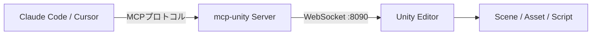

自然言語でUnityエディタを操作できる時代が、実際にやってきた。

「WASDキー対応の移動スクリプト付きプレイヤーキャラクターを配置して」と話しかけるだけで、GameObjectの生成からC#スクリプトの作成、コンポーネントのアタッチまでが自動で走る。2026年5月、Unity AIがMCP Server（Model Context Protocol）への公式対応を発表したことで、Claude CodeやCursorといったAIコーディングツールをUnityエディタに直接接続できるようになった。

**AIがUnityの「手」を持った**、というのが正直な印象だ。

:::message
この記事では、5ステップでClaude CodeをUnityエディタに接続するまでの手順を解説する。Unity 2022.3 LTS以降・Claude Code導入済みの環境を前提とする。
:::

## MCP Serverとは何か

MCP（Model Context Protocol）は、Anthropicが提唱するオープンプロトコルだ。「AIツールとの接続をUSB-Cのように規格統一する」という設計思想のもとに作られており、AIクライアントとツール群のあいだに共通言語を与える。

従来、AIとIDEやエディタを連携させるには、ツールごとに専用の拡張機能やAPIラッパーを実装する必要があった。MCPはその問題を解消し、一度プロトコルに対応すれば、Claude CodeやCursorといった複数のAIクライアントからシームレスにツールを呼び出せる。

Unityとの連携では、AIクライアントがMCPプロトコルでMCP Serverにリクエストを送り、ServerがWebSocket経由でUnity Editorを操作するという流れになる。mcp-unityはWebSocket（デフォルトポート: 8090）を使用している。



このアーキテクチャにより、**自然言語の指示がそのままUnity操作に変換される**パイプラインが成立する。

## 公式版 vs コミュニティ版の選び方

Unity向けMCP Serverには、公式とコミュニティの両系統が存在する。

| 区分 | 名称 | 特徴 | 料金 |
|------|------|------|------|
| 公式 | Unity AI Assistant | AI Gateway対応、Unity Hub直接統合 | サブスクリプション依存 |
| コミュニティ（主流） | mcp-unity（CoderGamester） | MIT、Claude Code/Cursor/Windsurf対応 | 無料 |
| コミュニティ | unity-mcp（CoplayDev） | HTTP接続方式、多数のStars | 無料 |
| コミュニティ | Unity-MCP（IvanMurzak） | 100以上のツール搭載、C#拡張可能 | 無料 |

公式版はUnity独自のAI Gatewayを経由するため、Unityのサブスクリプションプランに統合されている。一方で、Claude CodeやCursorといったサードパーティクライアントとの直接接続に対応していない。

コミュニティ版のなかでも **mcp-unity（CoderGamester）** は、Claude Code・Cursor・Windsurfとの互換性が明示されており、MITライセンスで商用利用も問題ない。この記事では mcp-unity を使って環境構築を進める。

:::message
公式版はUnity独自エコシステムに閉じた構成だ。Claude CodeやCursorから直接Unityを操作したい場合は、コミュニティ版を選ぶのが現実的な選択肢になる。
:::

## 5ステップでClaude CodeをUnityに接続する

接続手順そのものは難しくない。パッケージを1つ追加し、コマンドを1つ実行するだけで動く。ただし手順を飛ばすと接続が通らないので、順番通りに進めてほしい。

### Step 1: 前提条件を確認する

作業前に以下の3つが揃っているか確認する。

- Unity 2022.3 LTS 以上
- Node.js 18 以上
- Claude Code インストール済み

Node.jsのバージョン確認は `node -v` で行う。`v18.x.x` 以上が表示されれば問題ない。

### Step 2: Package Manager で mcp-unity を追加する

Unity のメニューから `Window > Package Manager` を開き、左上の `+` ボタンから `Add package from git URL` を選択する。

```
https://github.com/CoderGamester/mcp-unity.git
```

URLを貼り付けて `Add` を押す。パッケージのインポートが完了するまで数十秒待つ。

### Step 3: MCPサーバーを起動する

パッケージ追加後、Unity メニューに `Tools > MCP Unity > Server Window` が追加される。Server Window を開き、`Start Server` ボタンを押す。

デフォルトのポートは `8090`（WebSocket）。**Server Window はこの後の設定でパスを確認する用途にも使う**ため、閉じずに開いたままにしておく。

### Step 4: Claude Code に mcp-unity を登録する

Claude Code のターミナルで以下のコマンドを実行する。`/path/to/` の部分は Step 3 で開いた Server Window に表示されているパスに置き換える。

```bash
claude mcp add mcp-unity -- node /path/to/mcp-unity/Server~/build/index.js
```

プロジェクトスコープではなくグローバルに登録したい場合は `--scope global` オプションを追加する。

```bash:グローバル登録の場合
claude mcp add --scope global mcp-unity -- node /path/to/mcp-unity/Server~/build/index.js
```

:::message alert
プロジェクトのパスにスペースが含まれていると、Node.js がパスを正しく解釈できず接続に失敗する。Unityプロジェクトを `~/My Projects/Game` のような場所に置いている場合は、スペースなしのパスに移動してから作業を進めること。
:::

### Step 5: 接続を確認する

Claude Code を再起動する。起動後にチャットで以下のように入力してみる。

```
シーン内のGameObject一覧を教えて
```

Unity エディタで開いているシーンの GameObject が返ってくれば接続成功だ。**この応答が返ってくるかどうかが、正常接続の唯一の確認手段**なので、必ず実行しておく。

## 自然言語でUnityを操作する

セットアップが完了すると、Unityエディタに向けて日本語で指示を出せるようになる。

「WASDとスペースキー対応の移動スクリプト付きプレイヤーを作成してください」と入力するだけで、**GameObjectの作成・C#スクリプトの生成・コンポーネントのアタッチまでが一連の操作として完結する**。これまでエディタとコードエディタを行き来していた作業が、1回の指示で終わる。

バッチ処理も得意分野だ。「敵キャラ10体を等間隔で配置し、Rigidbodyコンポーネントを追加して質量を1.5に設定してください」と伝えると、`batch_execute` を通じて全オブジェクトへの操作が一括で走る。手作業でInspectorを開いて数値を入力する繰り返しから解放される。

テスト実行の流れも変わる。「プロジェクト内のすべてのテストを実行してください」と指示すると、`run_tests` の実行・失敗ログの取得・修正案の提案まで自動で進む。

:::details 主な組み込みMCPツール一覧

| ツール名 | 機能 |
| --- | --- |
| `create_gameobject` | GameObjectの作成・コンポーネント追加 |
| `batch_execute` | 複数オブジェクトへの一括操作 |
| `run_tests` | Unity Test Runnerの実行とログ取得 |
| `get_scene_info` | シーン構造の取得 |
| `compile_scripts` | スクリプトのコンパイル実行 |

:::

## C#でカスタムツールを拡張する

標準ツールで対応できないプロジェクト固有の操作は、C#で追加できる。IvanMurzak版Unity-MCPでは、**`[McpPluginTool]` 属性を付与するだけで任意のメソッドをMCPツールとして公開できる**。

```csharp:Editor/Tool_FindByTag.cs
using System.ComponentModel;
using MCP.Plugin;
using UnityEngine;

[McpPluginToolType]
public class Tool_FindByTag
{
    [McpPluginTool("FindObjectsByTag")]
    [Description("指定タグのGameObjectを検索して件数を返す")]
    public static string FindByTag(
        [Description("検索するタグ名")] string tag)
    {
        // UnityのAPIはメインスレッドから呼ぶ必要がある
        return MainThread.Run(() =>
        {
            var objects = GameObject.FindGameObjectsWithTag(tag);
            return $"見つかったオブジェクト数: {objects.Length}";
        });
    }
}
```

`[McpPluginToolType]` でクラスを登録し、`[McpPluginTool]` でツール名を定義する。`[Description]` で引数の説明を追加すると、AIがパラメータの意味を正しく解釈できるようになる。

:::message
`MainThread.Run()` はUnityのメインスレッド制約を回避するためのラッパーだ。UnityのAPIはメインスレッドからしか呼び出せないため、MCPサーバーからの非同期呼び出しを安全に処理するにはこのパターンが必要になる。
:::

ゲーム固有のロジック（ステージデータのCSV読み込みやアセットのバッチインポートなど）もツール化できる。チームで共有すれば、AIへの指示を統一した語彙で管理できるようになる。

## まとめ

MCPはただの便利ツールではなく、AIがエディタの外側にあるシステムと会話できるようにするための構造的な解だ。mcp-unityを使えば、Unityエディタ上でのGameObject操作やテスト実行を自然言語で指示できる。Claude Codeとの接続は5ステップで完了し、C#でカスタムツールを追加すれば**チーム固有のワークフローをそのままAIに理解させられる**。

接続後の拡張の方向性は2つある。Unityが公式に提供する `com.unity.ai.assistant` パッケージとの比較検証は、用途によって選択肢が変わるため早めに試す価値がある。もう一方はuLoopMCPのようなツールと組み合わせてゲームループそのものをAIが駆動するアーキテクチャだ。MCP単体で完結させようとするより、複数ツールを組み合わせたほうが自動化の幅は広い。

:::message
カスタムツールの設計で迷ったら、「Unityエディタ上でいちばん繰り返しているマウス操作は何か」を起点にすると優先度が自然に絞られる。
:::
