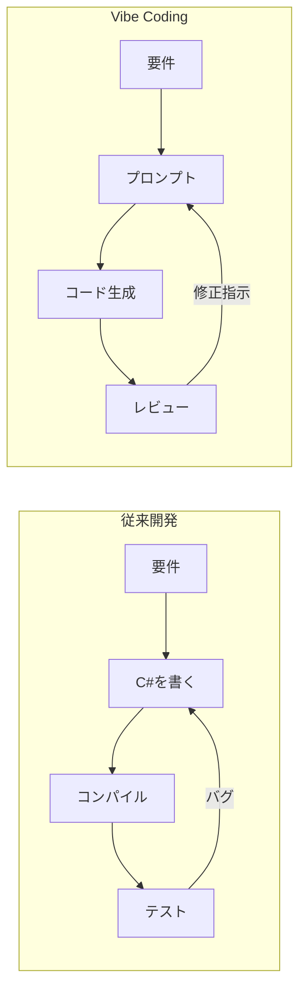

2025年2月、AI研究者のAndrej Karpathyが「Vibe Coding」という言葉をX（旧Twitter）に投稿した。自然言語プロンプトでLLMにコードを生成させ、開発者は「ガイド・テスト・フィードバック」へ役割をシフトする開発スタイルを指す。Merriam-Websterに収録され、Collins Dictionaryが「2025年の単語」に選出するほど急速に普及した概念だ。

しかし実際に試すと、モデル選定でつまずくケースが多い。コンテキストが長くなるとモデルが指示を取りこぼす、複雑なロジックで精度が落ちる――こうした問題が発生したとき、モデルを変えるだけで状況が大きく変わることがある。

:::message
**Gemini 2.5 のスペック（2025年時点）**
- コンテキストウィンドウ: [1,048,576トークン（約100万）](https://ai.google.dev/gemini-api/docs/models)
- LMArenaランキング: [1位](https://ai.google.dev/gemini-api/docs/models)
- Thinking機能搭載（coding・数学・科学タスク向け）
:::

**100万トークンのコンテキストウィンドウは、Vibe Codingの「取りこぼし」問題を構造的に解決する**。長い会話履歴、複数ファイルの参照、反復的なフィードバックループ――これらを一度のセッション内に収められる。

この記事では、Firebase AI Logic SDKとGemini 2.5を組み合わせてUnityプロトタイプを作る入門手順を扱う。SDKのセットアップからシーン上での動作確認まで、ゼロから再現できる手順として整理した。

## Unity開発のハードルとVibe Codingの登場

Unity開発を始めようとした多くの開発者が、最初の壁として挙げるのがC#の学習コストだ。構文の習得だけでなく、`MonoBehaviour` の継承、`Start` / `Update` / `Awake` の実行サイクル、`SerializeField` などのエンジン固有APIを体系的に理解しなければ、意図通りのコードは書けない。さらに、オブジェクトプール、シングルトンパターン、イベント管理といった**反復的なボイラープレートが毎プロジェクトで要求される**。

この学習コストの高さが、プロトタイプを試したい段階で開発を止めてしまう原因になっていた。

Vibe Codingはこの構造を変える。「何を作りたいか」をプロンプトで伝え、生成されたコードをレビューしてフィードバックする——このサイクルが開発の主軸になる。



従来はコードを「書く」ことが中心だったが、Vibe Codingでは生成コードを「判断・評価する」役割に移行する。この変化を整理すると次のとおりだ。

| 観点 | 従来開発 | Vibe Coding |
|------|---------|------------|
| 主な作業 | C#構文・APIを記述 | プロンプト設計・コードレビュー |
| 必要な前提知識 | MonoBehaviourの詳細仕様 | 要件の言語化と意図の整理 |
| ボイラープレート | 毎回手実装 | 生成後に検証・調整 |
| 試行サイクル | コンパイル→デバッグ | フィードバック→再生成 |

:::message
**Vibe CodingにGemini 2.5を選ぶ理由**

Gemini 2.5は最大100万トークンのコンテキストウィンドウを持ち、中規模Unityプロジェクト全体のコードを一度に把握できる。[公式ドキュメント](https://ai.google.dev/gemini-api/docs/long-context)によると53万トークンまで100%リコール精度、100万トークンでも99.7%を維持する。複数シーンをまたいだ依存関係やスクリプト間の参照を文脈ごと保持できるため、Vibe Codingのフィードバックサイクルで生じる「前の会話を忘れる」問題が起きにくい。
:::

## セットアップ：Firebase AI Logic SDKを導入する

:::message alert
**UGeminiは新規プロジェクトに使用しないでください。** Uralstech製の `UGemini` は2026年2月にアーカイブ済みです。本記事では公式のFirebase AI Logic SDKを使用します。
:::

### Step 1: Firebase AI Logic SDKのインストール

[Firebase Unity SDK](https://firebase.google.com/products/firebase-ai-logic)のページから最新版をダウンロードし、以下の手順でインポートします。

1. Unityメニューの `Assets > Import Package > Custom Package` を選択
2. ダウンロードした `.unitypackage` ファイルから `FirebaseAI` を選択してインポート

**Firebase Unity SDKはPreview状態（2025年時点）のため、本番運用では破壊的変更に注意が必要です。** Unity 2021 LTS以降が必須です（netstandard2.0対応のため）。

### Step 2: Firebaseプロジェクト設定

[Firebaseコンソール](https://firebase.google.com/docs/ai-logic/get-started)でプロジェクトを作成し、アプリを登録します。

1. コンソールでAndroidまたはiOSアプリを追加
2. 設定ファイル（`google-services.json` / `GoogleService-Info.plist`）をダウンロード
3. ダウンロードしたファイルを `Assets/` 直下に配置

:::details google-services.json 配置手順の詳細
1. Firebaseコンソール左上の歯車アイコン → 「プロジェクトの設定」を開く
2. 「マイアプリ」セクションから対象アプリを選択
3. `google-services.json`（Android）または `GoogleService-Info.plist`（iOS）をダウンロード
4. Unityプロジェクトの `Assets/` フォルダに直接配置する（サブフォルダ不可）
5. Unityエディタ上でファイルが認識されていることを確認する
:::

APIキーはコードに直接記述しないでください。認証情報はFirebase経由で管理されるため、設定ファイルを正しく配置するだけで安全に利用できます。

### Step 3: GeminiAgent.cs の実装

```csharp:Assets/Scripts/GeminiAgent.cs
using System.Threading.Tasks;
using Firebase;
using Firebase.AI;
using UnityEngine;

public class GeminiAgent : MonoBehaviour
{
    private const string ModelName = "gemini-2.5-flash";

    private GenerativeModel _model;
    private bool _isReady = false;

    async void Start()
    {
        try
        {
            await FirebaseApp.CheckAndFixDependenciesAsync();
            var ai = FirebaseAI.GetInstance(FirebaseAI.Backend.GoogleAI());
            _model = ai.GetGenerativeModel(modelName: ModelName);
            _isReady = true;
            Debug.Log("Gemini 2.5 初期化完了");
        }
        catch (System.Exception e)
        {
            Debug.LogError($"Firebase初期化失敗: {e.Message}");
        }
    }

    public async Task<string> AskAsync(string prompt)
    {
        if (!_isReady)
        {
            Debug.LogWarning("モデル未初期化。Start()の完了を待ってから呼び出してください");
            return "初期化中です";
        }
        try
        {
            var response = await _model.GenerateContentAsync(prompt);
            return response.Text ?? "応答なし";
        }
        catch (System.Exception e)
        {
            Debug.LogError($"Gemini API エラー: {e.Message}");
            return "エラーが発生しました";
        }
    }
}
```

`_isReady` フラグで初期化完了を管理しています。`Start()` の非同期処理が完了する前に `AskAsync()` が呼ばれた場合の null 参照エラーを防止するためです。

## 実践：Vibe Codingのワークフロー

Vibe Codingで品質を保つ鍵は**制約を明示したプロンプト設計**にある。曖昧な指示はAIの自由裁量を広げ、意図と乖離したコードを生む。

```diff
- 「プレイヤーを動かすスクリプトを書いて」
+ 「Unity 6対応。MonoBehaviour継承。Input Systemを使用。
+  Rigidbodyで移動。50行以内のメソッドに分割。
+  他スクリプトへの直接参照は持たない設計で。
+  C#:PlayerController.cs」
```

制約を明示したプロンプトから生成されるコードは、設計意図が反映された状態になる。

```csharp:Assets/Scripts/PlayerController.cs
using UnityEngine;
using UnityEngine.InputSystem;

[RequireComponent(typeof(Rigidbody))]
public class PlayerController : MonoBehaviour
{
    [SerializeField] private float moveSpeed = 5f;

    private Rigidbody _rb;
    private Vector2 _moveInput;

    void Awake() => _rb = GetComponent<Rigidbody>();

    public void OnMove(InputAction.CallbackContext context)
        => _moveInput = context.ReadValue<Vector2>();

    void FixedUpdate()
    {
        var direction = new Vector3(_moveInput.x, 0, _moveInput.y);
        _rb.MovePosition(_rb.position + direction * moveSpeed * Time.fixedDeltaTime);
    }
}
```

`[RequireComponent]` による依存コンポーネントの宣言、`Rigidbody.MovePosition()` による物理エンジン準拠の移動実装など、設計の意図がコードに表れている。

### 落とし穴3選

:::message alert
**落とし穴1: Unity APIのハルシネーション**

AIは存在しないメソッドや廃止済みAPIを自信満々に生成する。コンパイルエラーで気づけるケースは良いが、実行時エラーになるものは発見が遅れる。

**対策**: 生成コードのAPI呼び出しは必ずUnity公式ドキュメントと照合する。見慣れないメソッドは使用前に検索する習慣をつけること。
:::

:::message alert
**落とし穴2: スクリプト肥大化**

デバッグログや防御的コードを過剰生成し、1,000行超のファイルになりやすい。可読性の低下だけでなく、次のプロンプト入力時のコンテキスト圧迫にもつながる。

**対策**: プロンプトに「50行以内のメソッドに分割」を明記する。
:::

:::message alert
**落とし穴3: コンテキスト喪失**

Gemini 2.5の100万トークンでも大規模プロジェクト全体は入り切らない。セッション後半になるほど設計意図と乖離したコードが生成される傾向がある。

**対策**: 機能単位でモジュール化し、AIに渡すファイルを関連スクリプトのみに絞る。
:::

## Vibe Codingで求められるのは「書く力」ではなく「読む力」

:::message
「LLMが全行を書いたとしても、レビュー・テスト・理解済みならVibe Codingではない。それはLLMをタイピングアシスタントとして使っているだけだ」— Simon Willison
:::

**Vibe Codingの本質は「書かないこと」ではなく「正しく導くこと」にある。** C#を自分で書く機会は減っても、生成されたコードを読んで判断する力はむしろ重要になる。プロンプト設計の巧拙が成果物の品質を左右する以上、Unityの基礎知識はなくなるどころか、より直接的に問われる。

次の一手として、Unity MCP（Model Context Protocol）との組み合わせが注目されている。uLoopMCPのようなツールを使えば、AIがUnityエディタを直接操作できるようになり、Vibe Codingの自動化はさらに深い領域へと進む。

知識がある人ほど的確なプロンプトが書け、的確なプロンプトが書ける人ほどAIを使いこなせる。Vibe Codingはあくまで補助だが、その補助を最大限に活かせるかどうかは、あなたのUnity理解にかかっている。
