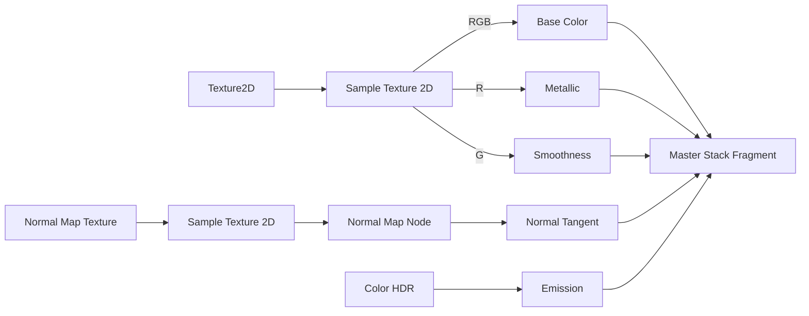

## シェーダーはもう怖くない——Shader Graphで始めるビジュアルシェーダー入門

「シェーダーを書いてみたい、でも GLSL や HLSL の呪文みたいなコードを見た瞬間に諦めた」という経験はありませんか。

実は Unity には **Shader Graph** というビジュアルエディターが用意されており、コードを一行も書かずにシェーダーを作れます。ノードと呼ばれるブロックを線でつなぐだけで、プロが使うような PBR（物理ベースレンダリング）シェーダーが完成します。

この記事では次の 5 ステップで、動作する PBR シェーダーを一緒に作っていきます。

1. URP プロジェクトに Shader Graph をセットアップする
2. Lit Shader Graph の基本ノード構造を理解する
3. テクスチャ・法線マップを接続する
4. パラメーターを C# スクリプトから制御する
5. 完成シェーダーをマテリアルに適用して動作確認する

C# は書けるけどシェーダーは未経験、という方を主な対象としています。最後まで読み進めれば、**自分でカスタマイズできる PBR シェーダーが手元で動く状態**になります。

---

## Step 1: URP プロジェクトに Shader Graph をセットアップする

### 前提条件

- Unity **2021.3 LTS** 以降（2022.x / 2023.x でも同手順）
- Universal Render Pipeline（URP）を使用するプロジェクト

:::message
Built-in Render Pipeline（標準の 3D テンプレート）では Shader Graph の URP ノードが使えません。既存の Built-in プロジェクトを URP へ移行する手順は複雑なため、この記事ではスキップします。新規プロジェクトで始めることを強く推奨します。
:::

### 新規 URP プロジェクトの作成

Unity Hub を開き、**新しいプロジェクト** をクリックします。テンプレート一覧から **3D (URP)** を選択してください。このテンプレートを選ぶだけで URP と Shader Graph が最初から含まれた状態でプロジェクトが作られます。

### Shader Graph のインストール確認

**Window > Package Manager** を開き、左上のドロップダウンを **Packages: In Project** に切り替えます。一覧の中に `Shader Graph`（パッケージ ID: `com.unity.shadergraph`）が表示されていれば準備完了です。

表示されない場合は、ドロップダウンを **Unity Registry** に変更して `Shader Graph` を検索し、**Install** ボタンをクリックしてください。

### Shader Graph アセットの作成

Project ウィンドウの任意のフォルダーを右クリックし、次のメニューを選択します。

```
Create > Shader Graph > URP > Lit Shader Graph
```

作成されたアセットをダブルクリックすると Shader Graph エディターが開きます。画面中央に **Vertex** ブロックと **Fragment** ブロックが並んでいれば、セットアップは完了です。

:::message
`URP > Lit Shader Graph` を選ぶことで、ライティング計算が組み込まれた PBR 対応のベースが自動生成されます。ゼロから作るより遥かに効率的なので、まずはこのテンプレートを使いましょう。
:::

---

## Step 2: はじめてのShader Graph作成 — マゼンタを撃退する

Shader Graphを新規作成してマテリアルに割り当てると、最初はデフォルトのグレー表示になります。ところがシーンに配置した瞬間、オブジェクトが派手なマゼンタ（ピンク）に染まることがあります。これはShader Graphの不具合ではなく、**URPのPipeline Assetが未設定であることが原因**です。

以下の手順で設定を確認してください。

1. **Edit > Project Settings > Graphics** を開き、`Scriptable Render Pipeline Settings` にURPのPipeline Assetをセットする
2. **Edit > Project Settings > Quality** を開き、各Quality levelの `Rendering` 欄にも同じPipeline Assetをセットする

この2箇所を設定すれば、マゼンタは解消されます。

設定が完了したら、作成したShader Graphファイルをダブルクリックして **Shader Graph Editor** を開きましょう。エディタ中央には **Master Stack** と呼ばれるノードが配置されています。Master Stackは `Vertex` ブロックと `Fragment` ブロックの2つで構成されており、頂点シェーダーとフラグメントシェーダーにそれぞれ対応しています。

動作確認の第一歩として、`Fragment` ブロックの **Base Color** に固定色のColorノードを接続し、マテリアルとして3Dオブジェクトに割り当てて色が反映されることを確認しましょう。

:::message
Shader Graph EditorはCtrl+Sで明示的に保存しないと変更がマテリアルに反映されません。編集のたびに保存する習慣をつけましょう。
:::

---

## Step 3: 5つのコアノードでPBRシェーダーを組み立てる

URPのLit（PBR）シェーダーを再現するには、Master StackのFragmentブロックに接続する5つのノードを理解することが鍵になります。

| ノード | 入力型 | 役割 |
|--------|--------|------|
| Base Color | Color | 物体の基本色 |
| Metallic | Float 0〜1 | 金属度（0=非金属, 1=金属） |
| Smoothness | Float 0〜1 | 表面の滑らかさ（0=マット, 1=鏡面） |
| Normal (Tangent) | Vector3 | 法線マップによる凹凸表現 |
| Emission | Color HDR | 自発光（ブルームエフェクトとの相性が良い） |

**Base Color** はアルベドとも呼ばれ、ライティングの影響を受ける前の素の色です。テクスチャのRGBチャンネルをそのまま接続するのが基本です。

**Metallic** と **Smoothness** はPBRの核心となる2値です。Metallicが1に近いほど周囲を鏡のように映し込み、Smoothnessが1に近いほど反射がシャープになります。1枚のテクスチャのRチャンネルをMetallicに、GチャンネルをSmoothnessに割り当てるパックド形式が一般的です。

**Emission** はHDR（High Dynamic Range）カラーを受け取ります。値を1以上に設定するとポストプロセスのBloomと連携して発光表現が得られます。

### ノードの接続構成



### Normal Mapの落とし穴

法線マップを扱う際に最もはまりやすいのが、**Normal Mapノード（Normal Unpack）を経由せずにSample Texture 2DのRGBAをそのままNormal (Tangent)に接続してしまう**ミスです。法線マップのテクスチャデータはRGBをXYZ方向のベクトルとしてエンコードしているため、**必ずNormal Mapノードを通してデコード処理を挟む**必要があります。このノードを省略すると、見た目上はエラーが出ないまま法線方向がずれた不自然なライティングになるため、原因の特定が難しくなります。

:::message
NormalMapテクスチャはTextureのImport SettingsでTexture TypeをNormal Mapに設定してください。Shader Graph側のNormal Mapノードとインポート設定の両方が揃って初めて正しい法線マップが機能します。
:::

---

## Step 4: テクスチャを接続してリアルなPBRマテリアルにする

ここまでの手順で単色のPBRマテリアルが完成しました。次はテクスチャを接続して、より質感のあるリアルな見た目に仕上げます。

まずBlackboard（画面左のプロパティパネル）の **+ボタンからTexture 2Dを追加**します。追加したプロパティは参照名（Reference）を **アンダースコア始まりで命名する必要があります**。`_BaseMap`、`_NormalMap` のように設定してください。この命名規則を守らないとC#から参照できないため注意が必要です。

グラフエリアにテクスチャプロパティをドラッグすると `Sample Texture 2D` ノードが自動生成されます。各テクスチャの接続先は次のとおりです。

- **Albedo Map**: RGBAのRGBをBase Colorブロックへ接続
- **Metallic/Roughnessマップ（ORM形式）**: RチャンネルをMetallic、GチャンネルをSmoothnessへ接続
- **Normal Map**: Sample後に必ず **Normal Map Nodeを経由**させてからNormalブロックへ接続
- **Emission Map**: RGBをEmissionへ接続し、プロパティのHDRを有効にするとポストプロセスのBloomと組み合わせて発光表現が映えます

Normal Mapだけは直結禁止です。`Sample Texture 2D` → `Normal Map Node` → Fragment の `Normal` という順序を守ることで、法線ベクトルが正しくタンジェント空間に変換されます。この1ステップを省略すると陰影が不自然になる典型的な失敗例になります。

接続が完了したら必ず **Ctrl+S** で保存し、Shader Graphウィンドウを閉じてマテリアルの変化を確認してください。

---

## Step 5: C#スクリプトからシェーダーパラメータを動的に変更する

Shader GraphのプロパティはBlackboardで公開することで、C#スクリプトから実行時に変更できます。エミッションの点滅や武器のメタリック表現切り替えなど、ゲームプレイと連動した演出に活用できます。

```csharp:ShaderGraphController.cs
using UnityEngine;

public class ShaderGraphController : MonoBehaviour
{
    [SerializeField] private Color emissionColor = Color.white;
    [SerializeField] [Range(0f, 5f)] private float emissionIntensity = 1f;
    
    private Renderer _renderer;
    private MaterialPropertyBlock _block;
    
    void Awake()
    {
        _renderer = GetComponent<Renderer>();
        _block = new MaterialPropertyBlock();
    }
    
    void Update()
    {
        _renderer.GetPropertyBlock(_block);
        _block.SetColor("_EmissionColor", emissionColor * emissionIntensity);
        _renderer.SetPropertyBlock(_block);
    }
    
    // ランタイムでMetallicを変更する例
    public void SetMetallic(float value)
    {
        _renderer.GetPropertyBlock(_block);
        _block.SetFloat("_Metallic", Mathf.Clamp01(value));
        _renderer.SetPropertyBlock(_block);
    }
}
```

`MaterialPropertyBlock` は **同じマテリアルアセットを共有しつつ、オブジェクトごとに異なる値を設定できる**のが最大のメリットです。`Material.SetColor()` のようにマテリアルを直接書き換えると全インスタンスに影響しますが、`MaterialPropertyBlock` を使えば個別制御が可能です。

`SetColor` や `SetFloat` に渡す文字列は、Blackboardで設定した **Reference名と完全一致**させる必要があります。`_EmissionColor` と `_emissionColor` では別プロパティとして扱われるため、大文字・小文字を正確に合わせてください。

:::message
**URPのSRP BatcherとMaterialPropertyBlockの非互換に注意**

URP環境ではSRP Batcherが有効な場合、`MaterialPropertyBlock` による値の変更がバッチングを破壊し描画コストが増加することがあります。パフォーマンスを重視する場面では `material.SetXxx()` を使うか、Project Settings → Graphics でSRP Batcherを一時的に無効化して挙動を確認しましょう。
:::

---

## まとめ + よくある落とし穴3選

本記事では、コードを一切書かずにShader Graphで本格的なPBRシェーダーを作成する5ステップを解説しました。

1. **URPプロジェクトのセットアップ** — Render Pipeline Assetの割り当てが起点
2. **Shader Graphアセットの作成** — PBR Graphを選択してマゼンタを撃退
3. **5つのコアノードの理解** — BaseColor / Metallic / Smoothness / Normal / Emission
4. **テクスチャ接続でリアルPBR実現** — ORMマップとNormal Map Nodeが鍵
5. **C#連携で動的制御** — MaterialPropertyBlockで個別インスタンスを操作

ここで身につけた知識は、水面シェーダーや発光エフェクト、VFX Graphと組み合わせたパーティクルシェーダーへの応用に直結します。次のステップとして、カスタムノードを活用した水面の波紋表現や、VFX Graphとのパーティクルシェーダー連携にも挑戦してみてください。

### よくある落とし穴3選

:::message warning
**落とし穴1: Normal MapはNormal Map Nodeを経由しないと正しく機能しない**

`Sample Texture 2D` の出力をFragmentのNormalに直結すると法線方向が崩れ、不自然なライティングになります。必ず間に `Normal Map Node` を挟んでください。
:::

:::message warning
**落とし穴2: Shader Graph変更後はCtrl+S保存が必須**

グラフを編集してもウィンドウを閉じただけでは変更が反映されません。Shader Graphエディタ上で **Ctrl+S（Cmd+S）** を押して明示的に保存する習慣をつけましょう。
:::

:::message warning
**落とし穴3: Built-in RPプロジェクトでShader Graphを使うとマゼンタになる**

Shader GraphはURP / HDRPでのみ動作します。Built-in Render Pipelineのプロジェクトにそのまま適用するとマゼンタ表示になります。プロジェクト作成時に必ずURPテンプレートを選択してください。
:::
