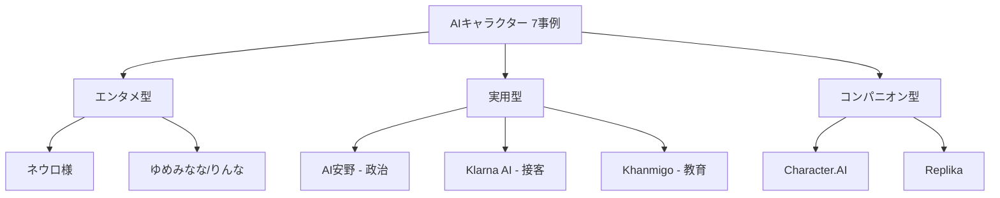

## はじめに

私はココナラでAIキャラクターの開発サービスを提供しています。接客対応や配信の自動化など、依頼は増えてきました。

ただ、自分のサービスをもっと広めるために「そもそもAIキャラクターって、世の中でどう使われてるんだろう?」というのが気になっていました。ニーズを正しく掴まないと、刺さるサービス設計ができません。

エンタメなのか、接客なのか、教育や政治の現場なのか。用途が広すぎて、全体像が掴みづらいというのが正直なところです。

そこで今回、実際に動いている7つの事例を調べて整理してみました。自分のサービス改善のための調査でもあり、純粋に「面白そうだな」と思って深掘りした結果でもあります。

みなさんは「AIキャラクター」と聞いて、どんな使い方を思い浮かべますか?

## AIキャラ市場は急成長中、だが「用途の整理」が追いついていない

生成AI市場は急速に拡大しています。総務省令和7年版情報通信白書によれば、世界の生成AI市場は361億ドル(2024)から3,561億ドル(2030予測)へ急成長が見込まれています。

https://www.soumu.go.jp/johotsusintokei/whitepaper/ja/r07/html/nd219100.html

| 地域 | 2024年市場規模 | 2030年予測 |
|------|--------------|-----------|
| 世界 | 361億ドル | 3,561億ドル |

しかし「AIキャラクター」に特化した市場統計は未確立です。矢野経済研究所の調査でも、日本キャラクタービジネス市場2兆7,773億円(2024)の一部として計上されるに留まっています。

https://www.yano.co.jp/press-release/show/press_id/3849

技術記事は豊富です。Zennには「AI VTuberの作り方」記事が複数あります。しかし**「どこで使われているか」「何が求められているか」の体系的整理が欠けています**。市場は伸びているのに、用途の全体像が掴めない状況です。

## 事例1-3: エンタメ・社会・BtoBの3領域

AIキャラクターは2024-2025年に様々な分野で実績を出しています。調べて面白かった3つの事例を紹介します。

### 事例1: ネウロ様 - 配信の世界記録を樹立したAI VTuber

個人開発者Vedalが作ったAI VTuber「Neuro-sama（ネウロ様）」が、2026年1月にTwitchで**ハイプトレインレベル126という世界記録を達成**しました。有料サブスクライバーは16万人を超え、世界最大級の配信者に。

独自のAIシステムで24時間配信を続けながら、視聴者とリアルタイムで対話できます。

https://www.gamespot.com/articles/ai-vtuber-neuro-sama-just-obliterated-her-own-massive-twitch-world-record/1100-6537146/

:::message
**注目ポイント**: 個人開発でここまでのエンゲージメントを実現した技術力と、「人間の配信者より面白い」と評価された対話設計
:::

### 事例2: AI安野 - 政治にAIキャラクターが進出

2024年の都知事選で注目された「AI安野（AIあんの）」は、YouTube・電話を合わせて約8,600件の質問に自動回答しました。2025年参院選では当選し、政党要件を満たす議席を獲得。

市民の声を**「ブロードリスニング」というAI分析手法で政策に反映**する仕組みを導入し、政治資金の可視化ツールも公開しています。

https://www.tokyo-np.co.jp/article/422570

:::message
**注目ポイント**: 単なる話題づくりではなく、当選後も継続して稼働し、政策形成にAIを活用している点
:::

### 事例3: Klarna AI - BtoB接客のリアルな成果と限界

スウェーデンのKlarnaは導入初月で230万件のカスタマー対応をAI化し、CS全体の2/3をAIが担当。年間4,000万ドルの利益改善を達成しました。

しかし2025年に人間のCSスタッフを再雇用する決定を下しています。AIだけでは複雑な問い合わせや感情的なケアに限界があると判断したためです。

:::message alert
**注目ポイント**: 成功事例だけでなく「AIだけでは足りない」と判断して人間を戻した点。AIキャラクターの現実的な活用範囲を示す好例
:::

## 事例4-7: 教育・コンパニオン・日本発の挑戦

ここまでの3事例は「エンタメ」か「業務効率化」の領域でした。残り4事例は**もう少し複雑な役割**を持つAIキャラクターです。

### 事例4: Khanmigo - 教育AIの予想外の成功

Khan Academyが開発した**AI家庭教師「Khanmigo」**は、利用者140万人を獲得しています。これは当初予測の**14倍**です。

重要なのは「答えを教える」のではなく、**ソクラテス式問答で生徒に考えさせる設計**になっている点です。「この問題の答えを教えて」と言われても、「まず何が分かっていて、何が分かっていないか整理してみよう」と問い返します。

月額4ドルという価格設定も、教育格差解消を意識したものです。

### 事例5: Character.AI / Replika - コンパニオン型の光と影

**感情的パートナーとしてのAIキャラクター**です。Character.AIは月間アクティブユーザー2,000万人、1日平均2時間利用。利用者の51.8%がZ世代（18-24歳）です。

Replikaは登録ユーザー2,500-3,000万人を抱え、85%以上が「感情的つながり」を報告しています。メンタルヘルス支援として機能する側面がある一方、**AIへの感情的依存**というリスクも指摘されています。

Character.AIは2024年に18歳未満の利用を規制強化し、チャット形式から「Stories」形式へ移行しました。

### 事例6-7: ゆめみなな / りんな - 日本市場の特殊性

最後に、日本発のAIキャラクターを2つ紹介します。

**ゆめみなな**は、KLabが開発した「ゆめかいろプロダクション」所属の完全AI VTuberで、2026年2月にデビューしたばかりです。

https://zeroichi.media/tech/34986

**りんな**はLINEフレンド860万人を獲得し、Avex所属の歌手として活動していましたが、2025年10月に休止を発表しました。

日本は「キャラクター文化」が根づいており、AIキャラクターとの親和性が高い市場です。

## 7事例から見えた3つのパターン

7つの事例を紹介してきましたが、これらを眺めていると、ある程度のパターンが見えてきます。

:::message
**3つのパターン**:
1. **エンタメ型** - 視聴者を楽しませる（ネウロ様、ゆめみなな、りんな）
2. **実用型** - 特定の課題を解決する（AI安野、Klarna AI、Khanmigo）
3. **コンパニオン型** - ユーザーの感情的パートナー（Character.AI、Replika）
:::

### エンタメ型: 視聴者を楽しませる

ネウロ様、ゆめみなな、りんなは、いずれも**視聴者との直接対話**を重視しています。24時間稼働することで、ファンとの接点を最大化している点が共通しています。

### 実用型: 特定の課題を解決する

AI安野、Klarna AI、Khanmigoは、いずれも**コスト削減 or スケーラビリティ**を目的としています。人間では対応しきれない量を処理したり、24時間体制で提供したりする役割です。

### コンパニオン型: ユーザーの感情的パートナー

Character.AIとReplikaは、いずれも**長時間利用**と**感情的つながり**が特徴です。メンタルヘルス支援として機能する一方で、依存リスクも指摘されています。

### 全事例の共通点

この3パターンを横断すると、全事例に共通する要素が3つあります。それは**「24時間対応」「パーソナライズ」「スケーラブル」**です。

ただ、この分類で合ってるのかな? という疑問も正直あります。ネウロ様はエンタメ型ですが「配信者の負担軽減」という実用面もあります。Khanmigoは実用型ですが、対話重視の点ではコンパニオン型に近い面も。

完璧な分類は難しいですが、大まかな傾向として押さえておくと、AIキャラクター市場を理解しやすくなると思います。

## まとめ: 調べてみて思ったこと

今回7つの事例を調べて分かったのは、AIキャラクターの用途が「エンタメ」「実用」「コンパニオン」の3パターンに大別できるということでした。どのパターンも**「24時間稼働」「パーソナライズ」「スケーラブル」が共通の強み**です。

自分のサービスの方向性を考える上で、この調査はかなり参考になりました。正直、調べる前は「AIキャラ = VTuberの延長」くらいの認識でした。政治（AI安野）や教育（Khanmigo）まで広がっているのは予想外です。

ただし、Klarnaが人間を再雇用したように、AIだけでは完結しない領域もあります。まだ市場は整理されきっていない、これからの領域です。だからこそ、開発者として今のうちにニーズを掴んでおきたいと感じています。

:::message
**みなさんはAIキャラクターをどんな用途で使っていますか（使いたいですか）?**

この3パターン以外の用途があれば、ぜひコメントで教えてください。次に作るサービスのヒントにさせてください。
:::

---

**AIキャラクター開発に興味がある方へ**

https://coconala.com/services/3327092

https://coconala.com/services/2610064
