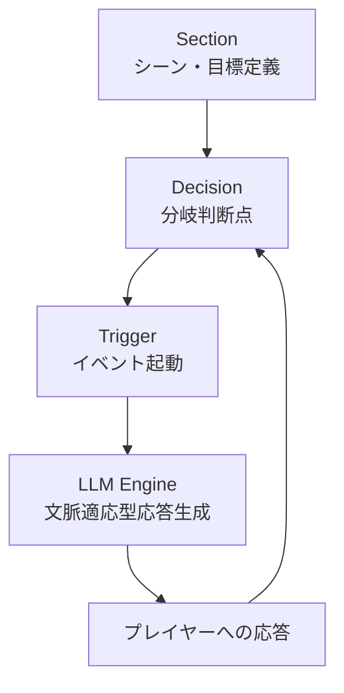
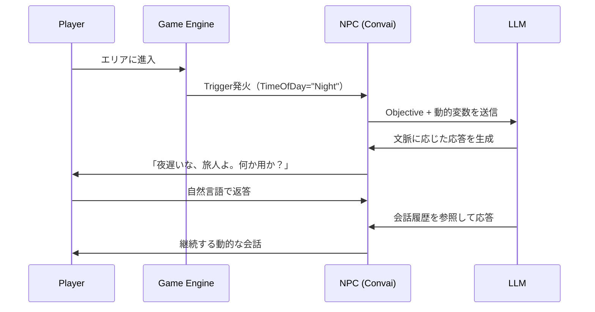
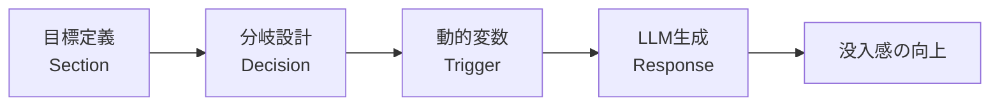

## はじめに

ゲームのNPCが毎回同じセリフを繰り返す。プレイヤーの行動に関わらず、ストーリーが一本道で進む。こうした「スクリプト型ナラティブ」の限界は、開発者なら誰もが感じてきた問題です。

LLMの登場によって、この構造が根本から変わりつつあります。**NPCがプレイヤーの発言に対してリアルタイムで文脈を理解し、物語を動的に分岐させる実装が現実的なコストで可能になりました。**

本記事では、Convaiの公式ガイドを元に、LLMベースのナラティブシステムの設計思想と、Unity/Unreal Engineでの実践的な実装方法を解説します。

## 従来のナラティブシステムの限界

従来手法を代表するのは「ダイアログツリー（分岐ツリー）」です。開発者がすべての会話パターンを事前に定義し、プレイヤーは用意された選択肢から選ぶ形式です。

この方式が抱える主な問題は3つです。

- **スケールの壁**: 分岐が増えるほど管理コストが指数関数的に増大する
- **文脈の欠如**: プレイヤーが過去に何をしたかを反映した応答が作れない
- **創造性の制限**: 用意された選択肢の外には出られないため、没入感が損なわれる

有限状態機械（FSM）ベースのシステムも同様の問題を抱えています。状態数が増えると、遷移ルールの管理が破綻します。

:::message alert
分岐ツリーで「動的に見える」ナラティブを作ろうとすると、コンテンツ量が爆発します。AAA タイトルでも、実態は「固定台詞の組み合わせ」に過ぎないケースが多いです。
:::

## LLMベースのナラティブアーキテクチャ

LLMを使ったナラティブシステムの核心は、「構造化された目標」と「自由なAI生成」の両立です。開発者は会話の方向性（何を達成すべきか）を定義し、具体的なセリフ生成はLLMに委ねます。

Convaiが採用しているNarrative Graphは、以下の3要素で構成されます。



動的変数の注入が特に強力な機能です。ゲーム状態をリアルタイムでナラティブに反映できます。

```text
Objective例:
"The time of day is {TimeOfDay}.
 Welcome the player and ask how their {TimeOfDay} is going."
```

`{TimeOfDay}` の部分にゲームエンジン側から "Morning" や "Night" を渡すことで、同じObjectiveから文脈の異なる会話が生まれます。

:::message
動的変数の記法ルール: 波括弧内にスペースを入れない。
`{CorrectFormat}` が正しく、`{Wrong Format}` はエラーになります。
:::

## 従来型 vs LLM型ナラティブシステム比較

| 項目 | 従来型（分岐ツリー） | LLM型（Narrative Graph） |
|------|---------------------|--------------------------|
| セリフ生成 | 事前定義済み | リアルタイム生成 |
| 文脈反映 | 限定的 | 会話履歴を参照 |
| 開発コスト | 分岐数に比例して増大 | 目標定義のみ |
| 一貫性 | 高い（固定） | ガイドライン設計が必要 |
| 自由度 | 選択肢内のみ | 自然言語で自由に |
| エッジケース | 定義外は対応不可 | Knowledge Bankで補完 |

## Unity × Convaiで動的ナラティブを実装する

### セットアップ手順

ConvaiのUnityプラグインをインポート後、以下の手順でNarrative Design Managerを設定します。

```text
ConvaiNPC Inspector
  → Add Components
  → Narrative Design Manager
  → Apply Changes
```

Section Triggerの設置により、プレイヤーが特定エリアに入った際にナラティブが自動起動します。

```text
GameObject（Collider必須）
  → Add Component: Narrative Design Trigger
  → Collider: Is Trigger を ON
  → ConvaiNPC フィールドにキャラクターを割り当て
  → Trigger ドロップダウンで発火条件を選択
```

### C# からの手動起動

```csharp:NarrativeTriggerExample.cs
using Convai.Scripts.Runtime.Features;
using UnityEngine;

public class NarrativeTriggerExample : MonoBehaviour
{
    [SerializeField] private ConvaiNPC targetNPC;

    // クエスト完了時などにスクリプトから呼び出す
    public void TriggerQuestComplete()
    {
        // NPCのNarrative Design Managerから
        // 指定のトリガーを手動起動する
        targetNPC.GetComponent<NarrativeDesignManager>()
                 .InvokeSelectedTrigger();
    }
}
```

### 動的変数の注入（Unreal Engine側の参考実装）

:::details Unreal Engine Blueprint側の設定例

Unreal EngineではBlueprintのMap型変数でテンプレートキーを管理します。

```text
Narrative Template Keys（Map型）:
  Key:   "TimeOfDay"    → Value: "Morning"
  Key:   "PlayerName"   → Value: "Taro"
  Key:   "QuestStatus"  → Value: "InProgress"
```

Blueprint内でゲーム状態が変わるたびに Value を更新することで、NPCの応答が自動的に変化します。Sectionに設定したObjectiveが `{TimeOfDay}` を参照していれば、同一キャラクターが朝・昼・夜で異なるセリフを話します。

:::



## AIナラティブツール比較

ConvaiはUnity/Unreal向けの代表的なツールですが、他の選択肢も知っておくことが重要です。

| ツール | 特徴 | 強み | 価格帯 |
|--------|------|------|--------|
| Convai | リアルタイム音声 + 世界認識NPC | グラフ型ナラティブ、エンジン統合 | 無料〜$99/月 |
| Inworld AI | 感情・記憶・動機を持つキャラクター | 深いキャラクター設計、専用エンジン | 使用量課金 |
| LLMUnity | Unity内でLLMをローカル実行 | オフライン動作、コスト0 | 無料（OSS） |
| Eden AI | マルチLLMチャットボット | 複数LLMの切り替え | 従量制 |

:::message
**インディーゲーム開発者へのアドバイス**: 予算が限られているなら、まずLLMUnity（ローカル実行）で実験し、品質が必要になった段階でConvaiの無料プランに移行するのが現実的なルートです。
:::

## まとめ

LLMによるナラティブデザインは、「会話ツリーを書く作業」から「キャラクターの目標と世界観を設計する作業」へのパラダイムシフトをもたらします。

本記事で解説した核心的なポイントを整理します。



次のステップとして、まずConvaiの無料プランでNarrative Graphを体験してみることを推奨します。固定スクリプトでは実現できなかった「プレイヤーの行動に応じて変化するNPC」の手応えを、小さなプロトタイプで確認できます。

技術的なチャレンジはLLMの一貫性管理とコスト設計にありますが、Knowledge Bankとキャラクター設定の丁寧な作り込みで十分にコントロール可能な領域です。

**参考資料**

- [AI-Driven Narrative Design for Lifelike Characters in Unreal Engine & Unity（Convai公式）](https://convai.com/blog/ai-narrative-design-unreal-engine-and-unity-convai-guide)
- [LLM-Driven NPCs: Cross-Platform Dialogue System（arxiv）](https://arxiv.org/html/2504.13928v1)
- [Using LLMs for NPC Dialogue in Unity（Gerard Robert Kirwin）](https://gerardrobertkirwin.com/blog/2025/10/14/using-llms-for-npc-dialogue-in-unity)
- [Unscripted AI NPCs in Unreal Engine - Origins Demo（Inworld AI）](https://inworld.ai/blog/origins-unreal-engine-demo)

---

**AIキャラクター開発に興味がある方へ**

https://coconala.com/services/3327092

https://coconala.com/services/2610064
