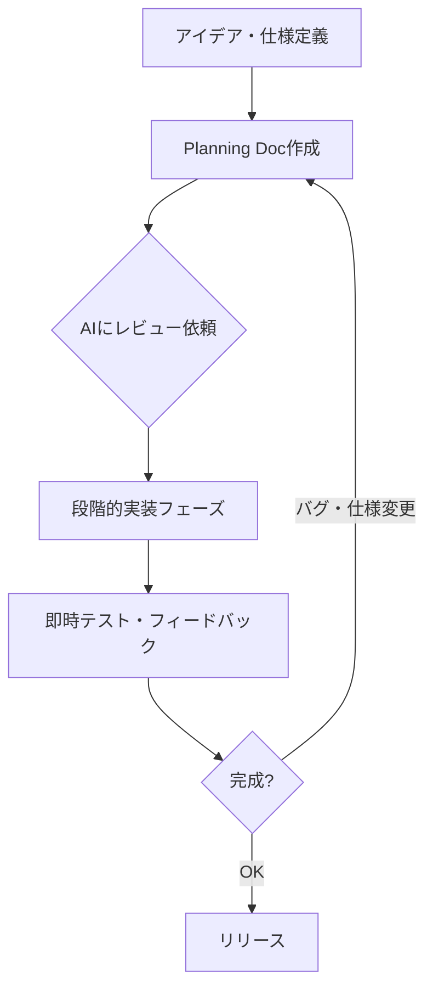
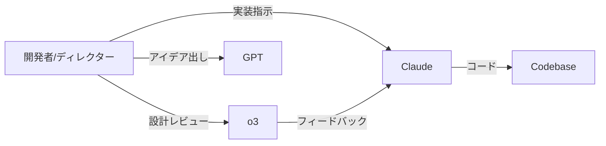
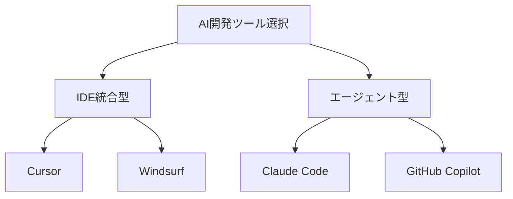

## はじめに

「ゲームを完成させられないインディー開発者」は世界中に存在する。アイデアはあるのにコード量・デバッグ・アセット作成に追われ、リリースまで辿り着けないケースは珍しくない。

2024年後半から状況が変わりつつある。**AI-firstワークフローを採用した開発者が、3ヶ月かかっていたゲームを2週間でリリース**するケースが報告されている。本記事はMark Rodseth氏の[AI-first Game Development シリーズ](https://mark-rodseth.medium.com/ai-first-game-development-levelling-up-my-ai-workflow-with-game-2-c5942ed2fccb)を起点に、日本のインディー開発者向けの実務的ワークフローを解説する。

:::message
この記事は海外の事例を元に、日本のインディー開発者向けに再構成した解説記事です。元記事での開発言語はUnity/C#を中心としています。
:::

## 従来のインディーゲーム開発の限界

個人開発者が直面する壁は共通している。

| 課題 | 具体的な症状 |
|------|-------------|
| コード実装の遅さ | 機能1つに数日かかる |
| バグ対応の泥沼 | 修正が新バグを生む連鎖 |
| アセット不足 | 絵が描けない・描く時間がない |
| モチベーション低下 | 完成が見えず途中で断念 |
| 技術的負債 | スコープ拡大で設計が崩壊 |

従来の「コードを1行ずつ書く」アプローチでは、**実装スピードが創造性のボトルネックになる**。アイデアを試すコストが高いため、リスクの高い設計変更を避け、凡庸なゲームになりがちだ。

Rodseth氏が最初のゲーム開発で直面したのも同じ問題だった。GitHubCopilotを導入しても「コードの補完」レベルにとどまり、開発速度の抜本的な改善には至らなかった。2作目の開発で彼は戦略を根本から変えた。

## AI-firstワークフローの設計思想

AI-firstとは「AIを補助ツールとして使う」のではなく、**AIが主役でエンジニアがディレクターになる**という発想の転換だ。

```text
【従来の開発フロー】
エンジニア → コードを書く → AIがサポート

【AI-firstフロー】
エンジニア → 指示・設計・判断
     ↓
   AI → コードを生成・実装
     ↓
エンジニア → レビュー・方向修正
```

この転換において重要な3つの原則がある。

**原則1: Planning Docを最初に作る**

実装を始める前に、機能・設計・制約を記述したドキュメントを作成する。AIはこのドキュメントを参照しながらコードを生成するため、コンテキストのズレが減る。別モデルにPlanning Docをレビューさせると、設計の穴が事前に発見できる。

**原則2: 「入力を直す、出力ではなく」**

同じエラーが繰り返されたとき、コードを直接修正するのは悪手だ。**AGENTS.md（ルールファイル）や型定義・ドキュメントを改善すること**で、AIが同じミスを繰り返さなくなる。「Fix inputs, not outputs」の原則はAI-first開発の核心だ。

**原則3: モデルを使い分ける**

単一モデルへの依存は避ける。AIが詰まったら即座に別モデルに切り替える判断が必要だ。

:::message
Planning Docの作成は「面倒な作業」に見えるが、実際にはAIとのやり取りを通じて自然に作れる。「このゲームの仕様をまとめてほしい」と会話しながら自動的に文書化できる。
:::

## 実践: ゲーム2作目で得た教訓

Rodseth氏が2作目でレベルアップしたワークフローは以下の構成だ。



### カスタムGPT「GameSpark」の構築

Rodseth氏が最も効果的だったと語るのが、ゲーム開発専用のカスタムGPTの構築だ。以下の情報を事前に学習させた。

- **ゲームアイデアの傾向とジャンル定義**
- **使用するSDKの最新ドキュメント**
- **自分のコーディングスタイルと命名規則**
- **過去のプロジェクトのパターン**

これにより、毎回「自分のプロジェクトの説明」をせずに済む。AIが文脈を持った状態で会話が始まるため、指示の精度が上がった。

### マルチモデル戦略

1作目ではChatGPT一択だったが、2作目では用途別にモデルを使い分けた。

| ユースケース | 推奨モデル | 理由 |
|------------|-----------|------|
| 機能実装・コード生成 | Claude | 指示追従性・コード品質 |
| 設計・アーキテクチャ | o3/o1 | 高度な推論・Chain-of-Thought |
| デバッグ・根本原因分析 | o3 | 複雑な問題解析 |
| アイデア出し・ゲームデザイン | ChatGPT | 創造的発散 |



### AIをクラッチにしない判断軸

Rodseth氏が強調する重要な警告がある。

:::message alert
AIが生成したコードを「動けばOK」で貼り付け続けると、自分では理解できないコードベースが積み上がる。後で仕様変更が必要になったとき、AIに修正指示すら出せなくなる。**理解できないコードは蓄積させない。**
:::

「インプットの質がアウトプットの質を決める」という原則は、AI-first開発では特に重要だ。AIへの質問の精度を上げるためには、**自分自身のゲームデザイン・技術知識が不可欠**だという逆説がある。

## AI開発ツール比較（2026年2月時点）



| ツール | 強み | ゲーム開発での用途 |
|--------|------|------------------|
| **Cursor** | マルチファイル編集・Composer機能 | 全体的なコード実装 |
| **Windsurf** | 高速・2026年2月現在シェア1位 | 日常的なコーディング |
| **Claude Code** | 自律エージェント・Hooks対応 | 自動ビルド・テスト自動化 |
| **GitHub Copilot** | IDE統合・企業採用実績 | コード補完・説明 |
| **ChatGPT** | 汎用性・画像生成連携 | アイデア出し・アセット生成 |

Claude Code Hooksを使うと、ファイル保存時に自動でゲームエンジンのビルドを走らせ、Itch.ioへのアップロードまで自動化できる。**ビルド→テスト→デプロイのサイクルをAIが回す**ことで、開発者はゲームデザインに集中できる。

## まとめ

AI-first開発は「コーダー」から「ディレクター」への役割転換だ。Rodseth氏が2作目で実現した教訓を3行にまとめると：

1. **Planning Docが最重要** - 実装前の設計文書がAIの精度を決める
2. **モデルは用途別に使い分ける** - 詰まったら即切り替え
3. **AIをクラッチにしない** - 理解できないコードは積み上げない

日本のインディー開発者にとって、AI-firstワークフローの最大のメリットは「アイデアを即検証できる速度」だ。失敗コストが下がることで、より実験的なゲームデザインに挑戦できる。

:::message
本記事で紹介したワークフローの出発点として、まずCursorやClaude CodeをUnityプロジェクトに導入し、1つの機能をAI指示だけで実装してみることをおすすめする。「AIに任せる感覚」をつかむことが最初のステップだ。
:::

10年の経験を持つあるインディー開発者は「かつて3ヶ月かかったゲームが、今は2週間で作れる」と語る。この変化は特別な人だけのものではなく、ワークフローを変える意志のある開発者なら誰でも手の届く場所にある。

---

**参考記事**

- [AI-first Game Development - Levelling Up My AI Workflow with Game #2 (Mark Rodseth)](https://mark-rodseth.medium.com/ai-first-game-development-levelling-up-my-ai-workflow-with-game-2-c5942ed2fccb)
- [CLI Agents Are Coming for Game Development (Rosebud AI)](https://lab.rosebud.ai/blog/cli-agents-are-coming-for-game-development)
- [A field guide to AI-first development](https://www.makingdatamistakes.com/ai-first-development/)
- [AI dev tool power rankings - Feb. 2026 (LogRocket)](https://blog.logrocket.com/ai-dev-tool-power-rankings/)

---

**AIキャラクター開発に興味がある方へ**

https://coconala.com/services/3327092

https://coconala.com/services/2610064
