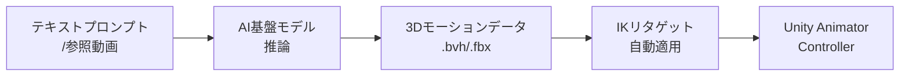
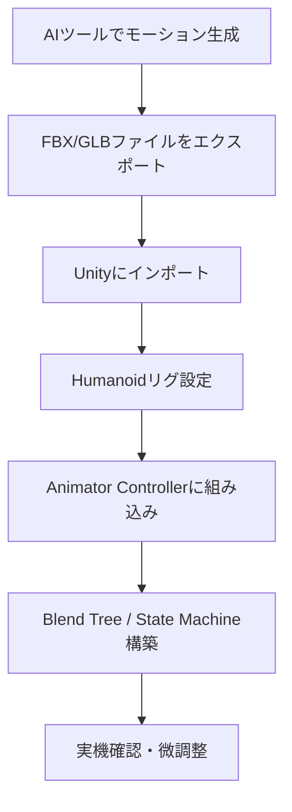
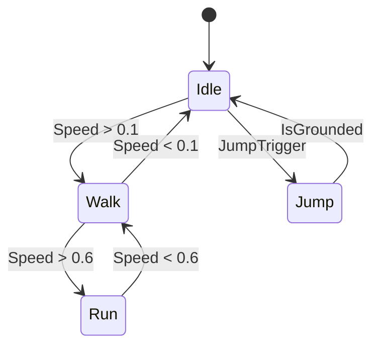

## はじめに

「このキャラクターにロコモーションを付けたい」——そう思ったとき、従来なら数日かかる作業が待っていた。

2025年以降、AIアニメーションツールの実用化が急速に進んでいる。海外メディア GameMakers が報じた事例では、**ベテランアニメーターが2日かけていた4秒のロコモーションクリップが、AIを活用することで約1時間に短縮された。** 削減率は約90%だ。

本記事では、この変化を引き起こしているツールと技術を整理し、Unity開発者が今すぐ実践できるパイプラインを解説する。

:::message
本記事は [GameMakers の記事「From 2 Days to 1 Hour」](https://www.gamemakers.com/p/from-2-days-to-1-hour-the-ai-revolution) を元に、Unity開発者向けの実践的なガイドとして再構成したものです。
:::

## ゲームアニメーション制作の現状と課題

従来の手法（手付け・モーションキャプチャ・ライブラリ流用）はいずれも時間・コスト・スキルの壁が高い。特にインディー開発者にとって、フルボディのロコモーションセットを自前で用意するのは現実的でないケースも多い。

```text
従来パイプライン
  撮影/手付け → クリーンアップ → リタゲット → Unity取り込み → 微調整
  　2〜3日          半日          数時間        1〜2時間        1時間
```

## AIアニメーション技術の全体像

2025〜2026年現在、利用可能なAIアニメーションツールは「テキスト/動画からモーション生成」と「ビデオからモーションキャプチャ」の2カテゴリに分かれる。

### 主要ツール比較

| ツール | 主な機能 | 価格帯 | Unity対応 | 特徴 |
|--------|----------|--------|-----------|------|
| **Uthana** | テキスト/動画→モーション、30,000+クリップライブラリ | 無料〜エンタープライズ | FBX/GLBエクスポート（SDK開発中） | リアルタイム制御、IKリタゲット自動化 |
| **Cascadeur** | 物理ベースAIアニメーション | 無料（非商用）/ 約$300/年 | FBXエクスポート | モーキャプ不要、物理挙動が自然 |
| **Rokoko Vision** | ウェブカメラ/動画→モーション | 無料プラン有り / 有料プランも有 | FBXエクスポート | 初心者向け、デュアルカメラで精度向上 |
| **Plask Motion** | 単眼カメラ→モーション | $39/月〜 | Blender/Maya/Unreal経由 | クラウドベース、チームコラボ対応 |
| **Move.ai** | マルチiPhone高精度モーション | サブスクリプション | FBXエクスポート | AAA品質、マーカーレス |
| **DeepMotion** | ウェブカメラ→モーション | $49/月〜 | FBXエクスポート | ハードウェア不要 |

:::message
インディー開発者には **Uthana（無料プラン：月20秒分ダウンロード）** か **Rokoko Vision（無料ウェブカメラ対応）** が入門として最適だ。物理的に正確なアクションが必要なら **Cascadeur** を検討したい。
:::

### AIアニメーション生成の仕組み



## 実践: Unity × AI で作るアニメーションパイプライン

### ステップ概要



### 1. Uthanaでモーションを生成する

Uthanaのウェブプラットフォームからモーションを生成し、FBX形式でエクスポートする。

テキストプロンプト例:

```text
"A character walking forward at medium pace,
arms swinging naturally, slight shoulder rotation"
```

約5秒でモーションが生成される。動画からの変換は2〜3分程度だ。

### 2. Unityにインポートしてリグ設定

インポートしたFBXファイルのAnimation TypeをHumanoidに設定する。

```text
FBXファイル選択
  → Inspector > Rig タブ
    → Animation Type: Humanoid
    → Avatar Definition: Create From This Model
    → Apply
```

Uthanaのプロプライエタリなリタゲット技術により、**骨格構造が異なるキャラクターでも自動的にモーションが適合する。** MotionBuilderでの手動マッピング作業は不要になる。

### 3. Animator ControllerでState Machineを構築

:::details Animator Controller設定の全コード例（C# / StateMachineコントローラー）

```csharp
using UnityEngine;

[RequireComponent(typeof(Animator))]
public class AIAnimationController : MonoBehaviour
{
    private Animator _animator;

    // Animator Parameter IDs（文字列よりハッシュ使用でパフォーマンス向上）
    private static readonly int SpeedHash = Animator.StringToHash("Speed");
    private static readonly int IsGroundedHash = Animator.StringToHash("IsGrounded");
    private static readonly int JumpTriggerHash = Animator.StringToHash("Jump");

    void Awake()
    {
        _animator = GetComponent<Animator>();
    }

    void Update()
    {
        // 移動速度をBlend Treeに渡す
        float speed = GetCurrentSpeed();
        _animator.SetFloat(SpeedHash, speed, 0.1f, Time.deltaTime);

        // 接地判定
        _animator.SetBool(IsGroundedHash, IsGrounded());
    }

    public void TriggerJump()
    {
        _animator.SetTrigger(JumpTriggerHash);
    }

    private float GetCurrentSpeed()
    {
        // 実際の移動速度を返す実装
        return 0f;
    }

    private bool IsGrounded()
    {
        // 接地判定の実装
        return true;
    }
}
```

:::

Blend Treeの設定では、Speedパラメータに対してIdle / Walk / Runの3クリップを割り当てる。**AIで生成した各クリップを同一のBlend Tree内に配置することで、自然なトランジションが実現できる。**



### 4. AIパイプラインの時間比較

| 工程 | 従来手法 | AIツール活用 |
|------|----------|-------------|
| モーション生成 | 手付け: 4〜8時間 / モーキャプ: 撮影含め1日 | テキスト生成: 5秒〜5分 |
| リタゲット | MotionBuilderで2〜4時間 | 自動: 数秒〜数分 |
| Unityへの取り込み | 1〜2時間 | 30分 |
| 微調整 | 1〜2時間 | 30分〜1時間 |
| **合計** | **2日以上** | **約1〜2時間** |

:::message alert
AIで生成したモーションは、細部のスタイル調整や複雑な動作では人間のアニメーターによる修正が必要なケースもある。プロトタイプや量産工程には向いているが、ハイエンドな表現には最終的な手作業を組み合わせることを推奨する。
:::

## まとめ

AIアニメーションツールは2025年時点で**実用段階に入っている。**

Uthanaを例に挙げると、テキストプロンプト→モーション生成→自動リタゲット→FBXエクスポートという流れが、従来の2日から1時間程度に短縮できることが確認されている。

Unity開発者がまず試すべきステップはシンプルだ。

1. Uthanaの無料プランでテキスト→モーション生成を試す
2. FBXをUnityにインポートし、Humanoidリグで動作確認する
3. Blend Tree / State Machineに組み込み、既存プロジェクトに統合する

インディー開発者にとって、**「アニメーターがいないからキャラクターを動かせない」という制約は、もはや過去のものになりつつある。** まずは無料ツールから試してみることを勧めたい。

---

**AIキャラクター開発に興味がある方へ**

https://coconala.com/services/3327092

https://coconala.com/services/2610064
