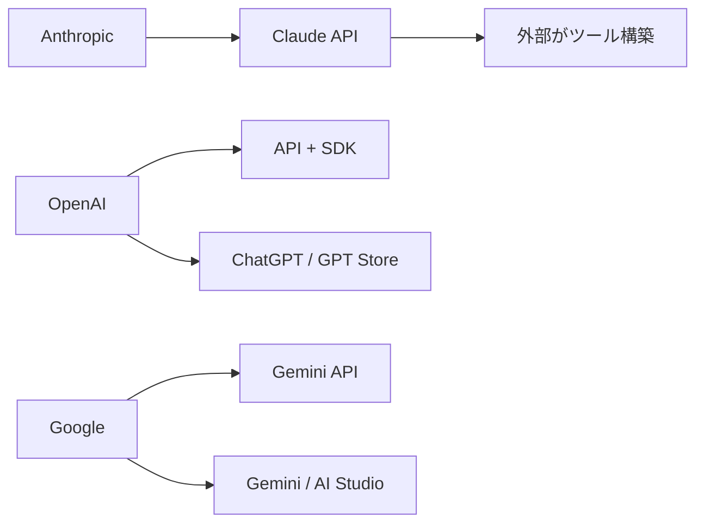

:::message
- **OpenClaw（旧Clawdbot）はClaude専用ツールとして誕生**したが、Anthropicの商標要求で2度改名
- 改名のたびにマルチモデル化が進み、作者はOpenAIに移籍した
- 「最高のモデルを持つ企業が、それを最も活かすツールを手放す」構造的パラドックスを分析する
:::

## Claudeを最も活かしたツールが「敵の手」に渡った日

2026年2月14日、OpenClawの作者Peter SteinbergerがOpenAIに入社した。

OpenClawは元々「Clawdbot」という名前だった。Claude + Botを組み合わせた名前が示す通り、**AnthropicのClaude APIを最大限に活用するために設計されたツール**だ。

しかしAnthropicは商標問題を理由に改名を要求。ClawdbotはMoltbot、そしてOpenClawへと2度の改名を経た。

改名の過程でOpenClawは変質した。Claude専用ツールから、GPT・DeepSeekにも対応するマルチモデルフレームワークへと進化していった。

結果として、GitHub 19万スター超の巨大プロジェクトが、Claudeの競合プラットフォームであるOpenAI側の人間の手に渡ることになった。

この一連の出来事は、単なる商標トラブルでは片付けられない。**AI業界におけるプラットフォーム戦略の構造的な問題**として、注目に値する。

## Clawdbot→Moltbot→OpenClaw：名前を失うたびに独立が進んだ

2025年11月、iOSエンジニアとして著名なPeter Steinbergerが「Clawdbot」を公開した。Claude APIを活用したAIエージェントだ。しかしAnthropicが「Claude」を含む名前に商標問題を提起し、Moltbotへの改名を余儀なくされた。さらに再度の指摘を受け、OpenClawへと改名した。

**名前を奪われるたびに、OpenClawはClaude依存から脱却した。**最初はClaude専用ツールだったものが、改名のたびにマルチモデルフレームワークへと進化していった。Anthropicの商標行動が、Claude依存の解消を事実上後押しした形だ。

2026年1月末にはGitHubで1日2.5万スターを獲得し、爆発的な成長を見せた。そして2026年2月14日、SteinbergerはOpenAI入社を発表。プロジェクトはオープンソース財団へ移管予定となっている。

Anthropicは自社エコシステムの最大貢献者を、自らの手で追い出した。これは皮肉な構造だが、事実の積み重ねが示す結論だ。

## なぜAnthropicは「IDE外のClaude」を作れなかったのか

Anthropicの製品ラインナップを見ると、**空白地帯が浮かび上がる**。

Claude.ai（チャットUI）、Claude API（開発者向け）、Claude Code（IDE内ターミナルツール）。この3つは揃っている。しかし「IDE外の常駐AIエージェント」が存在しない。WhatsApp/Discord/Telegram連携、24/7自動実行パイプライン、スキルマーケットプレイス。OpenClawはまさにこの穴を埋めていた。

競合との戦略差は明確だ。

OpenAIとGoogleはAPIに加え、エンドユーザー向けプロダクトとエコシステムを自社で構築した。Anthropicは「最高品質のモデルを作る」ことに集中し、プロダクトレイヤーは外部に委ねた。この戦略は「モデルが最強なら勝てる」という前提に依存している。

そして商標管理が、皮肉な結果をもたらした。「Claude」を含む名前を排除した結果、OpenClawはClaude非依存に進化した。改名を迫る行為が、マルチモデル化を促進した。19万人のコミュニティが「Claude以外でも動く」ことを体験した。

:::message
Anthropicの商標保護は法的には正当だ。しかし戦略的には、最大のエコシステム貢献者を自ら手放す結果になった。
:::

## LLM時代のプラットフォーム戦略に必要な3つの視点

LLM開発競争は「モデル性能」から「エコシステム」へと主戦場が移りつつある。この変化を3つの視点で整理する。

### 視点1: モデルの優位性は永続しない

2025年、Claude Opusはベンチマークで圧倒的な優位を誇っていた。しかし2026年には、GPT-4oシリーズやDeepSeekが急速に追い上げ、性能差は急速に縮小している。**「最強モデルを持てば勝てる」という戦略は、賞味期限付きの優位性に依存している。**モデル性能だけで差別化できる期間は、かつてより大幅に短くなった。

### 視点2: エコシステムは「許可」ではなく「参加」で育てる

OpenClawのClawHubには、5,000以上のコミュニティスキルが公開されている。OpenAIのGPT Storeも同様の構造だ。どちらも「開発者が作り、開発者が使う」という循環を公式に支援している。**Anthropicにはこれに相当するマーケットプレイスが存在しない。**商標で外部ツールを排除するアプローチより、公式SDKやテンプレートで共創を促す設計のほうが、長期的な競争力につながる。

### 視点3: 開発者の「居場所」を確保する

OpenClawコミュニティには19万人の開発者が集まっている。彼らがOpenAIプラットフォームへ移行することは、単なるユーザー減少ではない。**それはAnthropicのエコシステム形成力そのものを他社に渡すことを意味する。**Claude Codeのサブエージェント設計は技術的に優れている。しかし「作ったスキルを共有・配布・発見する」仕組みが未整備なままでは、その優位性は個人の範囲を超えない。Anthropicが「Claude Agent Hub」のような場を早急に構築することを、一開発者として提案したい。

:::message
これは批判ではない。Claudeのモデル品質は依然として最高水準だ。問題は「最高のモデルを持っているのに、それを最も活かすツールが他社のもの」という構造にある。
:::

## 最高のモデルを作るだけでは、エコシステムは育たない

Anthropicパラドックスの本質は一文で言い表せる。**Claudeは最高品質のLLMだが、それを最も活かすツールは外部で生まれ、競合に渡った。**

OpenClawの物語は「モデル品質 ≠ プラットフォーム勝利」を証明する一例だ。優れたLLMが存在しても、開発者が使いやすい環境がなければ、エコシステムは他社のものになる。

開発者として正直に言う。Claude Codeの設計思想は素晴らしい。SubAgent設計は最先端だ。だからこそ、エコシステムの整備で一歩踏み出してほしいと感じる。

AI業界全体への問いとして残したいのはこれだ。LLM時代のプラットフォーム戦略は「モデル性能」ではなく「開発者体験」で決まるのではないか。

Anthropicにはまだ挽回の時間がある。MCPの標準化推進とエージェントマーケットプレイスの構築が、その鍵を握っている。

本シリーズ全4記事を通じて、現場の実践から業界構造まで、一貫したテーマを追ってきた。

1. Unity×OpenClaw実践レポート
2. 7つの自動化テクニック
3. SubAgent vs OpenClaw比較
4. 本記事（Anthropicパラドックス）

:::message
関連記事（同シリーズ）:
- 記事1: Unity×OpenClaw実践
- 記事2: OpenClaw自動化テクニック7選
- 記事3: SubAgent vs OpenClaw比較
:::

---

**AIキャラクター開発に興味がある方へ**

https://coconala.com/services/3327092

https://coconala.com/services/2610064
