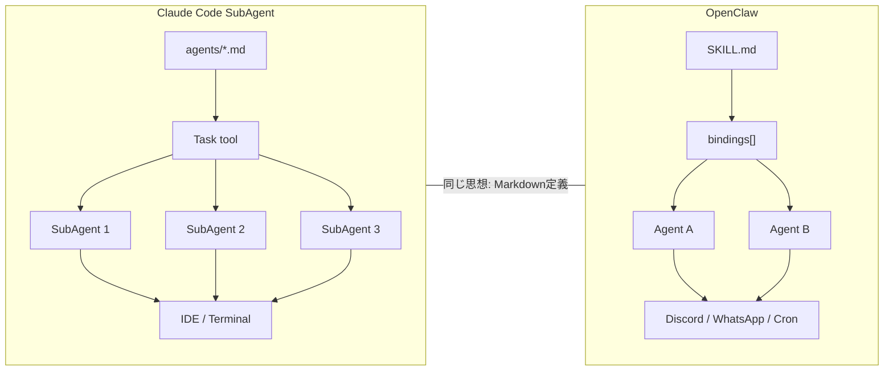
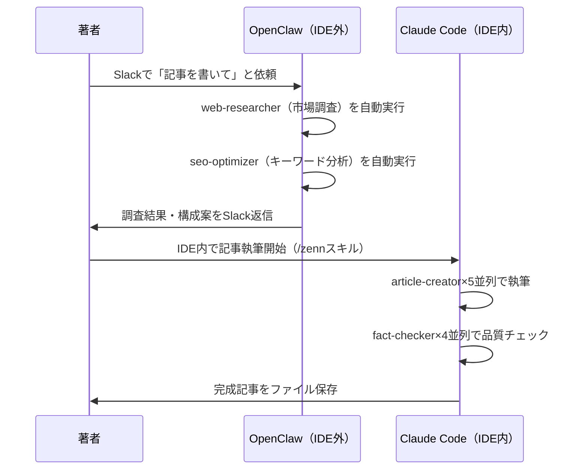

## TL;DR

:::message
IDE内の開発タスクは Claude Code SubAgent、IDE外の運用タスクは OpenClaw。
設計思想は同一で「AIを組織として設計する」メタパターンに収束している。
将来は MCPプロトコルで統合される可能性がある。
:::

## 61エージェントを運用して気づいた「もう一つの自分」の存在

筆者は Claude Code SubAgent を61個運用する環境を構築してきた。

`agents/*.md` でエージェントを定義し、Task tool で並列実行する。`skills/*/SKILL.md` でワークフローを定義し、複数の AIエージェント を組み合わせて業務を自動化する。

この構造を持った状態で OpenClaw を触ったとき、強い既視感に驚いた。

OpenClaw も `SKILL.md` でスキルを定義し、`bindings[]` でエージェントをルーティングする。名前も構造もほぼ同じだった。独立した2つのプラットフォームが、同じ設計パターンに収束していたのだ。

本記事では Claude Code SubAgent と OpenClaw を8つの比較軸で解剖する。「AIを組織として使う」設計思想の本質を明らかにしたい。

## 2つのシステムが「AIを組織として設計する」同じ解に辿り着いた理由

LLM単体で全てを処理しようとすると、必ず壁にぶつかる。コンテキスト枯渇、精度低下、コスト爆発。これらは規模が大きくなるほど避けられない。

Claude CodeとOpenClawは、この問題に対して「役割分担」という同じ解を出した。

Claude Codeでは、Task toolで専門エージェントを並列起動する。メインエージェントは計画と統合のみを担当し、実作業は各エージェントに委譲する。実際に私がこの設計を運用してみて分かったのは、**「考える役割」と「実行する役割」を分けることで、全体の精度が劇的に上がる**という事実だ。

OpenClawもbindings[]でメッセージをエージェントにルーティングし、モデルと権限をエージェントごとに分離する。構造を俯瞰すれば、「部署と専門家」という組織メタファーが両システムに自然と成立する。

これは偶然の一致ではない。LLMの能力が一定水準を超えた時点で、「組織として使う」設計は必然的に発生する。

次のセクションでは、8つの比較軸から両者の構造を詳細に分析する。

## 8軸で解剖する：同じ思想、異なる戦場

| 比較軸 | Claude Code SubAgent | OpenClaw |
|--------|---------------------|----------|
| 定義方法 | agents/*.md（Markdown） | SKILL.md（Markdown） |
| スコープ | IDE内（ターミナル） | IDE外（Discord/WhatsApp等） |
| メモリ管理 | .claude/プロジェクト内 | ~/clawd/（Markdownファイル） |
| マルチエージェント | Task tool（並列起動） | bindings[]（メッセージルーティング） |
| スキルマーケット | なし（エコシステム未確立） | ClawHub（5,000+スキル） |
| セキュリティ | permissions.deny、hooks | tools.deny、Docker sandbox |
| 常駐性 | オンデマンド実行 | 24/7常駐（Cronジョブ対応） |
| コスト構造 | API直接課金 | マルチモデルルーティング |

**両者の設計哲学は「Markdownで定義する」という点で完全に一致している。** プログラマーでなくても読めるシンプルさが共通の強みだ。

スコープの違いは用途の違いに直結する。Claude CodeはIDEに密結合しており、コーディング文脈での高速処理が得意だ。OpenClawはDiscordやWhatsApp経由で動作し、「いつでもどこでも」という常駐性を実現する。

メモリ管理もアーキテクチャが異なる。Claude Codeはプロジェクト単位で閉じた管理をする。OpenClawは`~/clawd/`にグローバル保存し、git管理も可能だ。

マルチエージェントの実装方式は対照的だ。Claude CodeはTask toolで並列起動する。OpenClawはbindings[]で常駐ルーティングを行う。

:::message alert
OpenClawのClawHub（5,000+スキル）は強力なエコシステムだ。
ただし341本の悪意スキルが確認されており、セキュリティリスクも存在する。
:::

セキュリティ面ではアプローチが分かれる。OpenClawはDockerサンドボックスで実行環境を隔離する。Claude Codeはhooksによるリアルタイム検閲で機密情報の漏洩を防ぐ。

常駐性の差は運用コストに直結する。OpenClawは24/7稼働が前提設計だ。Claude Codeはセッションベースのオンデマンド実行となる。

**OpenClawのマルチモデルルーティングによるコスト50〜80%削減は、Claude Codeにない機能だ。** 用途に応じたモデル選択でAPIコストを最適化できる。

## Claude CodeとOpenClawを使い分ける具体的なワークフロー

筆者の実際の運用パターンを例示する。

### 例: 技術記事作成フロー

このフローで重要なのは「OpenClawが非同期に調査を完了させ、著者がIDEを開いた時点で材料が揃っている」という点だ。待ち時間ゼロで執筆に入れる。

### 使い分けの判断基準

| 判断軸 | Claude Code | OpenClaw |
|--------|------------|----------|
| タスクの場所 | IDE内・コードベース | IDE外・サービス連携 |
| 実行タイミング | 開発者がIDEを開いている時 | 24/7いつでも |
| 得意なこと | コード生成・レビュー・ファイル操作 | 通知・監視・定期実行・外部API連携 |
| 苦手なこと | 常駐・外部サービス連携 | IDE密結合の高速コード操作 |

:::message
**「開発中はClaude Code、運用中はOpenClaw」** という棲み分けが現時点での最適解だ。
:::

### MCPによる統合の展望

MCP（Model Context Protocol）は両者が共通でサポートするプロトコルだ。OpenClawはMCPサーバー/クライアントの両方に対応しており、Claude CodeもMCPサーバー接続に対応している。

将来的には「OpenClawが常駐監視し、異常検知時にClaude Codeが自動修正する」というパイプラインが実現する可能性がある。**2つのAIエージェントフレームワークがMCP経由で連携する世界**は、開発体験を根本から変えるだろう。

## AIエージェント設計は「組織設計」であり、プラットフォームは問わない

Claude Code SubAgentとOpenClawを8軸で比較して見えた本質は、**「AIを組織として設計する」メタパターンはプラットフォームに依存しない**という事実だ。

定義はMarkdown、構造は階層的、セキュリティは最小権限原則。両フレームワークの設計思想は完全に一致している。違いは「どこで動かすか」だけだ。使い分けはシンプルで、IDE内ならClaude Code、IDE外ならOpenClawを選べばいい。

MCPが両者の橋渡しとなり、将来は2つのフレームワークが1つのパイプラインとして動く世界が来る。次回はMCP経由でClaude Code × OpenClawを実際に連携させるハンズオン記事を書く予定だ。

まずはどちらか1つを「組織として設計する」ことから始めてほしい。ツールの選択より、設計思想の習得が先だ。

:::message
Claude Code公式: https://docs.anthropic.com/en/docs/claude-code
OpenClaw公式: https://docs.openclaw.ai/
MCP仕様: https://modelcontextprotocol.io/
:::

---

**AIキャラクター開発に興味がある方へ**

https://coconala.com/services/3327092

https://coconala.com/services/2610064
