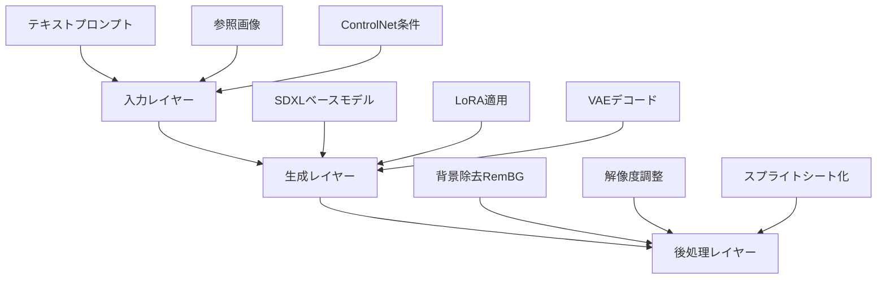
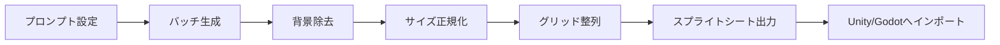
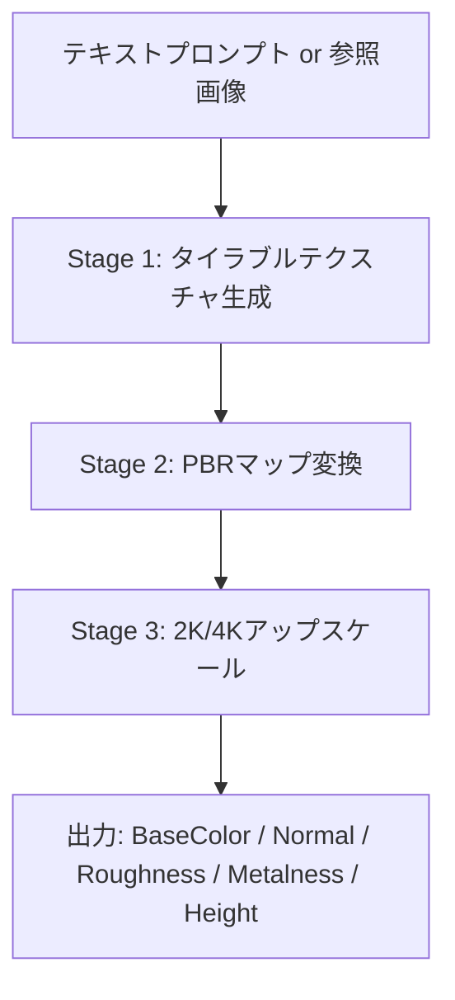

## はじめに

インディーゲーム開発において、アート制作コストは最大の壁の一つです。
プロクオリティのキャラクタースプライトやテクスチャを揃えるには、膨大な時間と費用がかかります。

ComfyUIはこの問題を根本から変えるツールです。
ノードベースのビジュアルプログラミングでAI画像生成パイプラインを組み、**再現性のある素材量産ワークフローを構築できます**。

本記事では、ComfyUIを使ったゲーム素材の実践的な量産手法を解説します。
海外の開発コミュニティで積み重ねられた知見をもとに、日本のインディー開発者向けにまとめました。

## インディー開発者のアセット問題

### 従来手法が抱えるコストの壁

従来のゲーム素材制作は、専門アーティストへの依頼が前提です。
単一のキャラクタースプライトで40〜60時間、環境テクスチャセットでは80〜120時間かかることも珍しくありません。

| 素材種別 | 従来の作業時間 | ComfyUI活用後 | 削減率 |
|---------|-------------|-------------|------|
| キャラクタースプライト | 40〜60時間 | 2〜4時間 | 約90% |
| 環境テクスチャセット | 80〜120時間 | 4〜8時間 | 約90% |
| タイルセット（16種） | 30〜50時間 | 2〜3時間 | 約92% |

**コストを90%削減しながらプロクオリティを維持できる**のが、ComfyUIの最大の強みです。

### 一発生成ツールとの違い

Midjourney等のワンショット生成ツールとComfyUIの違いは「再現性」にあります。
一発生成では同じスタイルで複数素材を揃えることが難しく、ゲームの世界観統一に苦労します。

ComfyUIはワークフローとして保存・再利用できるため、キャラクター違いや表情バリエーションも同一パイプラインで量産可能です。

## ComfyUIワークフローの設計

### 基本アーキテクチャ

ComfyUIのゲーム素材ワークフローは、以下の3層構造で設計します。



### 使用する主要コンポーネント

ゲーム素材生成に必要なノード・モデルの構成です。

| コンポーネント | 役割 | 用途 |
|-------------|------|------|
| SDXL Base | 基盤モデル | 高品質な2D/3D素材生成 |
| Pixel Art XL LoRA | スタイル制御 | ドット絵素材の品質向上 |
| ControlNet (Canny/Depth) | 構図・形状制御 | ポーズや輪郭の一貫性維持 |
| SpriteSheetMaker Node | シート化 | 複数スプライトの自動整列 |
| RemBG Node | 背景除去 | ゲームエンジン取り込み前処理 |
| Hunyuan3D-2 | 3Dメッシュ生成 | 2D画像から3Dモデルへの変換 |

:::message
ComfyUIのカスタムノードはComfyUI Managerから一括インストールできます。
`SpriteSheetMaker`や`RemBG`は標準搭載ではないため、個別にインストールしてください。
:::

### スタイル統一のキー戦略

ゲーム全体で素材スタイルを統一するには、**共通のベーススタイルプロンプトをテキストエンコーダーノードで一元管理する**ことが重要です。

```text
# ベーススタイルプロンプト（共通化する部分）
pixel art, 16-bit style, limited color palette,
clean outlines, game sprite, transparent background,
[CHARACTER_PLACEHOLDER] doing [ACTION_PLACEHOLDER]
```

プレースホルダー部分のみを切り替えることで、世界観を崩さずに多様な素材を生成できます。

## 実践: ゲーム素材の量産パイプライン

### スプライトシート生成フロー

キャラクタースプライトシートの生成パイプラインを示します。



SpriteSheetMakerノードの基本設定例です。

```json
{
  "images_directory": "./output/sprites/",
  "row_count": 5,
  "column_count": 8,
  "output_width": 1024,
  "output_height": 640,
  "sprite_size": 128
}
```

この設定で40枚のスプライトを5行8列、各128×128pxのシートとして出力します。
Unityのスプライトスライス機能に合わせた2のべき乗サイズが推奨です。

### UbisoftのCHORDモデルを活用したPBRマテリアル生成

2025年12月、UbisoftがCHORD（Chain of Rendering Decomposition）モデルをオープンソース化しました。
ComfyUIカスタムノードとして提供され、エンドツーエンドのPBRマテリアル生成が可能になっています。



CHORDの出力マップ構成です。

| マップ種別 | 用途 |
|----------|------|
| Base Color | 基本カラーテクスチャ |
| Normal Map | 法線情報（凹凸表現） |
| Roughness | 粗さ（光沢コントロール） |
| Metalness | 金属度 |
| Height Map | ディスプレイスメント用 |

:::message alert
CHORDモデルのライセンスは **Research-Only** です。
商業プロジェクトへの利用前に必ずライセンスを確認してください。
モデルはHugging Face (`Ubisoft/ubisoft-laforge-chord`) からダウンロードできます。
:::

### Unityへの取り込み手順

生成した素材のUnityへのインポートフローです。

```text
1. ComfyUIでスプライトシート出力（PNG, 透過背景）
2. Unity ProjectにDrag & Drop
3. Texture Type: Sprite (2D and UI)
4. Sprite Mode: Multiple
5. Sprite Editor でSlice → Grid By Cell Size
6. Cell Size: 128 x 128 に設定
7. Apply → Animator Controllerで使用
```

## まとめ

ComfyUIはインディー開発者にとって、アート制作の制約を取り除く強力なツールです。
ワークフロー設計に初期投資が必要ですが、一度構築すれば同一スタイルの素材を際限なく量産できます。

**ComfyUIの最大の価値は「再現性」と「拡張性」の組み合わせ**にあります。
スタイルを固定したまま何百もの素材バリエーションを生成できる点は、他のAIツールにない強みです。

次のステップとして以下をおすすめします。

- SpriteSheetMakerで2Dスプライトパイプラインを構築する
- CHORDモデルで3D環境テクスチャを試作する
- Hunyuan3D-2でコンセプトアートから3Dモデルを生成する

ComfyUIコミュニティは活発で、新しいワークフローやモデルが日々公開されています。
ゲーム開発における素材制作の常識が、今まさに塗り替えられています。

---

**AIキャラクター開発に興味がある方へ**

https://coconala.com/services/3327092

https://coconala.com/services/2610064
