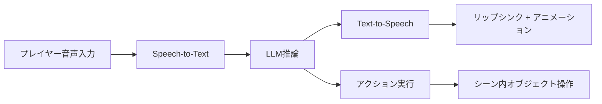
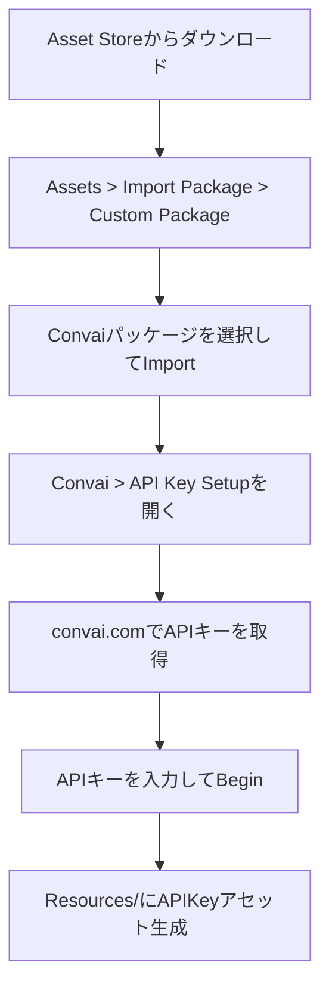
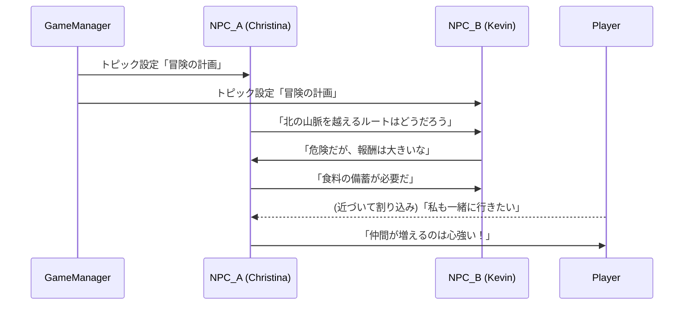

## はじめに

ゲーム内のNPC（Non-Player Character）が、台本通りの定型セリフではなく、プレイヤーの発言に応じて自然言語で受け答えする。そんな体験が、もはや研究段階の話ではなくなっています。

[Convai](https://convai.com/) は、LLM（大規模言語モデル）・TTS（テキスト音声合成）・リップシンク・シーン知覚を統合した会話AIプラットフォームです。Unity / Unreal Engine向けのSDKを無料で提供しており、 **コードをほとんど書かずにAI NPCをシーンに配置できる** のが大きな特徴です。

さらに2024年後半のアップデートで「NPC2NPC」機能がリリースされ、NPC同士がトピックに沿って自律的に会話するデモが注目を集めました。本記事では、Convaiの技術的な仕組みからUnityへの導入手順、NPC間会話の実装までを解説します。

## Convaiの仕組み

Convaiは単なるチャットボットではなく、ゲーム向けに最適化されたマルチモーダルAIパイプラインです。



主要コンポーネントは以下のとおりです。

| コンポーネント | 役割 | 技術スタック |
|--------------|------|-------------|
| Speech-to-Text | プレイヤー音声をテキスト化 | NVIDIA Riva / Google GCP / Deepgram |
| LLM推論 | 文脈を踏まえた応答生成 | GPT-4o / Claude 3.5 Sonnet / Gemini 1.5 Pro（選択可） |
| Text-to-Speech | 応答テキストを音声化 | 内蔵エンジン + ElevenLabs連携 |
| リップシンク | 音声に合わせた口の動き | Convai独自エンジン |
| Actions | NPCの行動制御 | Move To / Pick Up 等のプリセット |
| Narrative Design | ストーリー分岐・進行管理 | Convai独自機能 |

:::message
Convaiはクラウドベースのサービスです。LLM推論・音声合成はすべてConvaiサーバー側で処理され、Unityクライアントにはストリーミングで返却されます。オフライン環境では動作しない点に注意してください。
:::

65以上の言語に対応しており、520種類以上のAIボイスが利用可能です。 **日本語の音声入出力にも対応** しており、キャラクターのバックストーリーを日本語で記述すれば日本語で応答を返します。

## Unity導入手順

### 1. SDKのインストール

[Unity Asset Store](https://assetstore.unity.com/packages/tools/behavior-ai/npc-ai-engine-dialog-actions-voice-and-lipsync-convai-235621) から「NPC AI Engine」（無料）をダウンロードします。Unity 2022.3.0以降が必要です。



### 2. APIキーの設定

Unityメニューバーから **Convai > API Key Setup** を選択し、[convai.com](https://convai.com/) のダッシュボードで取得したAPIキーを入力します。Beginをクリックすると `/Resources/` フォルダにAPIKeyアセットが自動生成されます。

:::message alert
APIキーはプロジェクトの `/Resources/` フォルダに平文で保存されます。Gitリポジトリにコミットしないよう `.gitignore` に追加してください。
:::

### 3. NPCキャラクターの配置

:::details ConvaiNPCコンポーネントの基本設定手順

1. シーンに3Dキャラクターモデルを配置
2. InspectorでConvaiNPCスクリプトをアタッチ
3. Convaiダッシュボードで作成したCharacter IDを入力
4. Animatorコンポーネントを設定（アイドル・会話アニメーション）
5. 必要に応じてHead/Eye Trackingを有効化

:::

ConvaiNPCスクリプトはSDKに同梱されています。 **直接修正せず、継承して拡張することが推奨** されています。

```csharp:CustomNPC.cs
using Convai.Scripts;
using UnityEngine;

public class CustomNPC : ConvaiNPC
{
    // ConvaiNPCを継承して独自ロジックを追加
    // SDKアップデート時の互換性を維持できる

    protected override void OnConvaiResponse(string response)
    {
        base.OnConvaiResponse(response);
        Debug.Log($"NPC応答: {response}");
        // ゲーム固有の処理を追加
    }
}
```

プレイモードで実行すると、NPCに近づくだけで会話が可能になります。Convaiの対話はProximityベース（近接トリガー）で開始されます。

## NPC同士の会話実装

Convaiの「NPC2NPC」機能を使うと、 **複数のAI NPCが与えられたトピックについて自律的に会話** します。プレイヤーは途中から割り込んで会話に参加することもできます。



### セットアップ手順

NPCの基本設定（リップシンク、アニメーション、Head/Eye Tracking）が完了した後、以下の3ステップで実装します。

**Step 1: NPC Conversation Managerの追加**

シーン内のGameObjectに、Convai SDKが提供する **NPC Conversation Manager** コンポーネントを追加します。

**Step 2: 会話するキャラクターの選択**

NPC Conversation Managerのインスペクターから、会話に参加させるConvaiNPCキャラクターを選択します。

**Step 3: トピックの設定**

会話のトピック（例: 「王国の防衛戦略について議論する」）をテキストで入力します。LLMがトピックに沿った自然な対話を自動生成します。

:::message
NPC同士の会話はセッション同時接続数を消費します。Freeプランでは同時接続が1セッションに制限されるため、NPC2NPC機能のテストにはIndie Dev以上のプランが実質的に必要です。
:::

### Narrative Designとの連携

[Narrative Design](https://convai.com/blog/ai-narrative-design-unreal-engine-and-unity-convai-guide) 機能と組み合わせることで、NPC間の会話にストーリー分岐を持たせることも可能です。ConvaiNPCコンポーネントのInspectorから「Add Components」で **Narrative Design Manager** を追加し、Convaiダッシュボード側でセクション（分岐ノード）を定義します。

## まとめ

Convaiの導入に必要な作業をまとめます。

| 項目 | 内容 |
|------|------|
| SDK | Unity Asset Store「NPC AI Engine」（無料） |
| 動作要件 | Unity 2022.3.0以降 + インターネット接続 |
| 日本語対応 | 音声入出力ともに対応（65言語以上） |
| NPC間会話 | NPC Conversation Managerで3ステップ設定 |
| 料金 | Freeプラン: 月100インタラクション / Indie Dev: $29/月で3,000回 |

**Convaiは「コードを最小限に抑えてAI NPCを実現する」最も手軽な選択肢の一つ** です。特にNPC2NPC機能は、オープンワールドの酒場でNPC同士が噂話をしている、といった演出をローコードで実現できる点が魅力です。

一方で、クラウド依存であること、インタラクション課金であることから、大量のNPCが常時会話するような設計にはコスト面の検討が必要です。プロトタイプやインディーゲームでの活用から始めてみるのが現実的でしょう。

Convaiの詳細なドキュメントは [公式ドキュメント](https://docs.convai.com/api-docs/plugins-and-integrations/unity-plugin) から、NPC2NPCのサンプルプロジェクトは [チュートリアルページ](https://docs.convai.com/api-docs/plugins-and-integrations/unity-plugin/tutorials/npc2npc) から取得できます。

---

**AIキャラクター開発に興味がある方へ**

https://coconala.com/services/3327092

https://coconala.com/services/2610064
