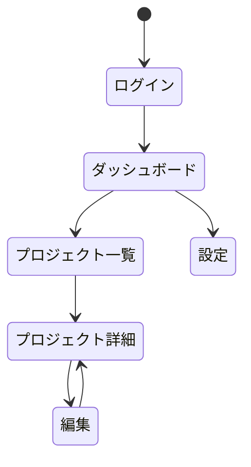
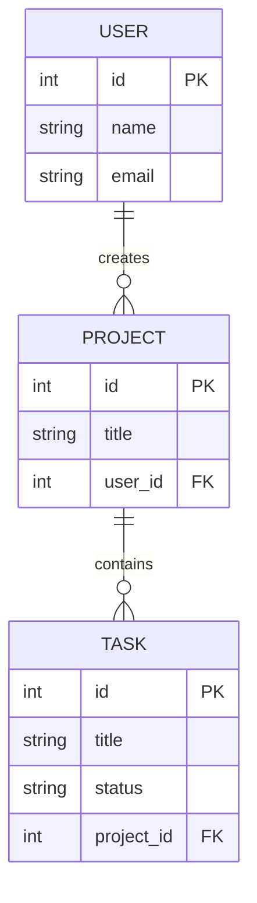
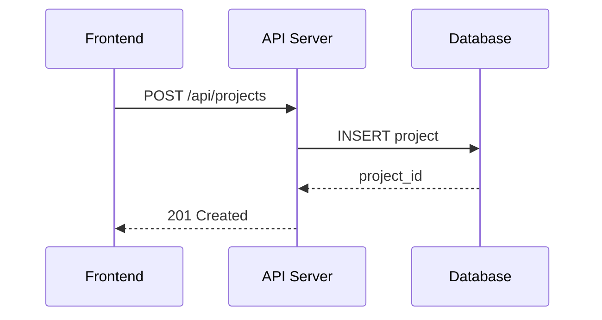

## はじめに

「設計なんて後でいいや、まずコードを書こう」

個人開発でありがちなこの判断が、数日後の手戻りを生みます。途中で「このデータどこに持たせるんだっけ」と迷子になる。画面遷移の設計も曖昧なまま進んでしまう。

僕はココナラで260件の開発案件を受注してきました。その経験から断言できるのは、 **最低限の要件定義があるだけで手戻りが激減する** ということです。

「でも要件定義って面倒だし、時間かかるでしょ?」

安心してください。テンプレートとMermaidを組み合わせれば、30分で完了します。この記事では、個人開発で用意すべき5つのドキュメントと、Mermaidによる効率的な設計手法を紹介します。

## 個人開発で必要な5つのドキュメント

### 1. PRD（Product Requirements Document）- 1ページでOK

PRDは「何を、誰のために、なぜ作るか」を明文化するドキュメントです。企業では数十ページになることもありますが、個人開発では1ページで十分です。

:::details PRDテンプレート（コピペして使えます）

```markdown:prd-template.md
# PRD: [プロダクト名]

## 概要
[1-2文でプロダクトの説明]

## 解決する課題
[ユーザーが抱える問題]

## ターゲットユーザー
[誰のために作るか]

## 主要機能（MVP）
1. [機能1]
2. [機能2]
3. [機能3]

## 成功指標
[KPI: DAU、売上、DL数など]

## 技術選定
[使用するフレームワーク・言語]
```

:::

重要なのはMVP（Minimum Viable Product）の絞り込みです。 **最初のリリースに必要な機能を3つ以内に絞る** ことで、開発のスコープが明確になります（筆者の経験則です。検証したい仮説に応じて調整してください）。

### 2. 画面遷移図（Mermaid stateDiagram）

ユーザーがどの画面をどう辿るかを図示します。MermaidのstateDiagram-v2が最適です。



画面遷移図があると「この画面からあの画面に戻れるっけ?」という疑問が事前に解消されます。後からの画面追加も、図を更新するだけで影響範囲がひと目で分かります。

### 3. ER図（Mermaid erDiagram）

データベースの設計図です。テーブル間の関係を明示することで、「このデータはどのテーブルに持たせるか」の判断が楽になります。



個人開発の場合、テーブル数は3〜5程度になることが多いです。この段階でリレーションを整理しておけば、 **実装時にテーブル設計で悩む時間がほぼゼロになります** 。

### 4. API設計書（Mermaid sequenceDiagram + エンドポイント一覧）

フロントエンドとバックエンドの通信フローを整理します。



エンドポイント一覧はテーブル形式でまとめます。

| メソッド | パス | 説明 |
|---------|------|------|
| GET | /api/projects | プロジェクト一覧 |
| POST | /api/projects | プロジェクト作成 |
| GET | /api/projects/:id | プロジェクト詳細 |
| PUT | /api/projects/:id | プロジェクト更新 |
| DELETE | /api/projects/:id | プロジェクト削除 |

RESTful APIの基本に沿って設計すれば、5〜10個のエンドポイントで大半のアプリはカバーできます。

### 5. 用語集（Glossary）

プロジェクト固有の用語を定義するドキュメントです。3〜10個程度でOK。

| 用語 | 定義 |
|------|------|
| プロジェクト | ユーザーが作成するタスクの集合体 |
| タスク | プロジェクト内の個別作業項目 |
| ダッシュボード | ログイン後に表示されるメイン画面 |

「自分しか使わないのに用語集?」と思うかもしれません。しかし、3ヶ月後の自分は他人です。 **コードを読み返したときに「この変数名、何を指してたっけ」と悩む時間を削減できます** 。将来チーム開発に移行する際にも、そのまま引き継ぎ資料になります。

## Mermaid活用のコツ

### コツ1: 図の種類を使い分ける

Mermaidには複数の図が用意されています。表現したい内容に応じて使い分けましょう。

| 表現したいこと | Mermaid図 | 例 |
|--------------|----------|---|
| 処理の流れ | flowchart | ユーザー登録フロー |
| 画面遷移 | stateDiagram | アプリの画面遷移 |
| データ構造 | erDiagram | DB設計 |
| API通信 | sequenceDiagram | フロントバック通信 |
| スケジュール | gantt | 開発スケジュール |
| クラス設計 | classDiagram | オブジェクト設計 |

個人開発で最も使用頻度が高いのは、stateDiagram、erDiagram、sequenceDiagramの3つです。まずはこの3つを押さえておけば十分です。

### コツ2: ノード数は10個以内

:::message alert
**注意**: ノードが10個を超えると図が複雑になりすぎて、逆に分かりにくくなります。機能ごとに図を分割するのがベストです。
:::

たとえば画面が15個あるアプリなら、「認証フロー」「メイン機能フロー」「設定フロー」のように3つの図に分割します。1つの図で全体を表現しようとすると、線が絡み合って読めなくなります。

### コツ3: AI（Claude Code）との相性が抜群

Mermaidはテキストベースの図解ツールです。つまり、AIが直接読み書きできます。

CLAUDE.mdにMermaidのルールを書いておけば、Claude Codeが自動で図を生成してくれます。「このPRDからER図を作って」と指示するだけで、Mermaid図が返ってくる。設計変更時も「この図を更新して」で完了です。

:::message
**Tips**: Mermaid図はZennでそのままレンダリングされます。プレビューで確認しながら調整できるので、 **個人開発者にとって最も手軽な図解ツール** です。
:::

### コツ4: VS Code / Zennでのプレビュー

VS Code拡張「Mermaid Preview」をインストールすれば、エディタ上で即座にプレビューできます。Zennのプレビュー機能でも表示確認が可能なので、別途ツールを導入する必要はありません。

Mermaidの記法を忘れたときは、公式ドキュメント（mermaid.js.org）を参照してください。

## 実践例: タスク管理アプリの要件定義

ここまでの5つのドキュメントを使って、実際にタスク管理アプリの要件定義を行ってみます。

### 1. PRD

```markdown:prd-task-app.md
# PRD: TaskFlow

## 概要
個人向けのシンプルなタスク管理アプリ。
プロジェクト単位でタスクを整理できる。

## 解決する課題
既存のタスク管理ツールは機能が多すぎて、
個人利用には過剰。シンプルに使いたい。

## ターゲットユーザー
個人開発者、フリーランスエンジニア

## 主要機能（MVP）
1. プロジェクトのCRUD
2. タスクのCRUD（ステータス管理付き）
3. ダッシュボードでの進捗表示

## 成功指標
DAU 100人（リリース後3ヶ月）

## 技術選定
Next.js + Supabase + Vercel
```

### 2. 画面遷移

stateDiagramで5画面の遷移を定義します。ログインからダッシュボード、プロジェクト一覧、詳細、設定画面の流れです。先ほどのMermaid図がそのまま使えます。

### 3. ER図

User、Project、Taskの3テーブル構成です。先ほどのerDiagramで定義済みです。テーブルが3つなら、設計で悩む時間はほとんどありません。

### 4. API設計

CRUD 5エンドポイントで構成します。先ほどのsequenceDiagramとエンドポイント一覧テーブルがそのまま設計書になります。

### 5. 用語集

```markdown:glossary.md
| 用語 | 定義 |
|------|------|
| TaskFlow | 本プロダクトの名称 |
| プロジェクト | タスクの集合体。案件単位で作成 |
| タスク | 個別の作業項目。ステータスを持つ |
| ダッシュボード | ログイン後のメイン画面 |
| MVP | 最小限の実用可能プロダクト |
```

:::message
**ポイント**: この5つのドキュメントは合計30分で作れます。いきなりコーディングするより、 **この30分の投資で数時間の手戻りを防げます** 。
:::

## まとめ

個人開発でも最低限の要件定義は必要です。用意すべきドキュメントは5つ。

1. **PRD** - 何を、誰のために、なぜ作るか（1ページ）
2. **画面遷移図** - stateDiagramでユーザーの動線を可視化
3. **ER図** - erDiagramでデータ構造を設計
4. **API設計書** - sequenceDiagram + エンドポイント一覧
5. **用語集** - プロジェクト固有の言葉を定義（3〜10個）

MermaidならZennでそのままレンダリングされるので、図を画像として管理する手間がありません。AIとの相性も抜群で、テキストベースだからこそ生成も更新も一瞬です。

「30分の投資」が数時間の手戻りを防ぎます。次にアプリを作るとき、コードを書く前にまずこの5つのドキュメントを用意してみてください。 **設計に使った30分が、開発全体の最大の時短になります** 。

---

**AIキャラクター開発に興味がある方へ**

https://coconala.com/services/3327092

https://coconala.com/services/2610064
