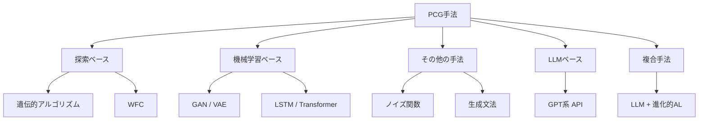
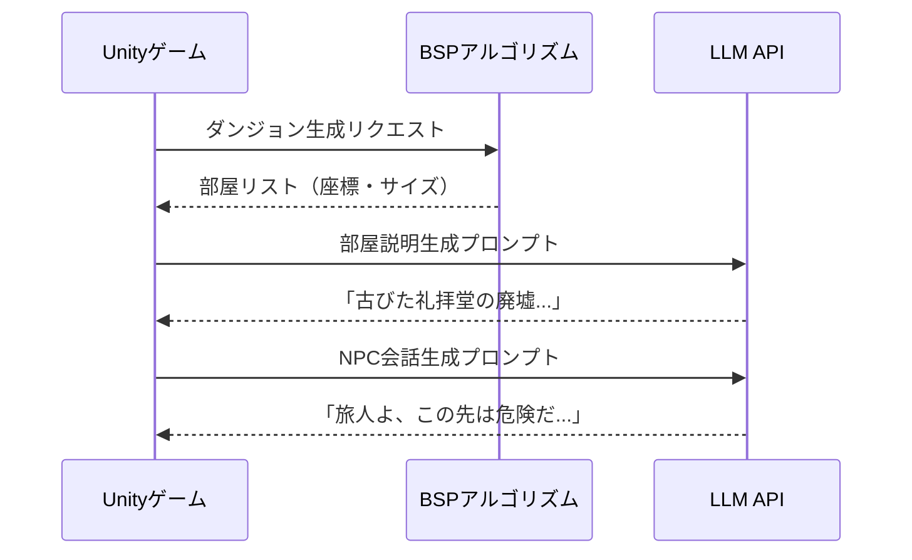

## はじめに

ゲームにランダム生成ダンジョンやNPCが「自然な言葉で話せる」ようになった背景には、PCG（Procedural Content Generation）技術の急速な進化があります。

AAAI AIIDE 2024で発表されたサーベイ論文「[Procedural Content Generation in Games: A Survey with Insights on Emerging LLM Integration](https://arxiv.org/abs/2410.15644)」は、2019〜2023年の207本の論文を体系的に分析しました。著者のMaleki & Zhao（カルガリー大学）は、LLMの登場がPCGの発展軌跡を「truly disrupted（根本から変えた）」と表現しています。

本記事はこのサーベイをゲーム開発者向けに噛み砕いて解説し、Unity × LLMによる実践例も紹介します。

:::message
この記事の対象読者：Unity・Unrealでゲーム開発をしている方、AIやLLMをゲームに活用したい方
:::

## 従来PCGの限界とLLMの必要性

従来手法には共通の限界がありました。

| 手法 | 得意な生成物 | 限界 |
|------|------------|------|
| ノイズ関数（Perlin等） | テクスチャ・地形 | 文脈を理解できない |
| 進化的アルゴリズム | レベルレイアウト | 評価関数の設計が難しい |
| GAN / VAE | 画像・スプライト | 自然言語との連携が困難 |
| WFC（波動関数崩壊） | タイルマップ | 意味のある構造を保証できない |

:::message alert
LLM以前のPCGでは、ナラティブ（物語）とプロシージャル生成の統合が最大の未解決課題でした。
:::

## LLMベースPCGの分類と手法

サーベイではPCG手法を5カテゴリに整理し、生成するコンテンツの種類と対応付けています。



### ゲームコンテンツの5分類

サーベイは生成対象を5種類に分類しています。

| コンテンツ分類 | 具体例 | 最適手法 |
|-------------|--------|---------|
| ゲームビット（最小単位） | テクスチャ・サウンド・スプライト | GAN、ノイズ関数 |
| ゲーム空間（物理環境） | マップ・地形・ダンジョン | WFC、フラクタル、BSP |
| ゲームシナリオ（物語） | 会話・クエスト・ストーリー | **LLM** |
| ゲームデザイン（ルール） | メカニクス・バランス調整 | 進化的アルゴリズム |
| 派生コンテンツ（没入感） | NPCの雑談・背景世界観 | **LLM** |

### LLMが従来手法と根本的に異なる点

LLMの最大の特徴はMaaS（Model as a Service）という提供形態です。GPT-3以降、APIを通じてクラウドモデルを利用するスタイルが主流になりました。2023年以前にLLMを使ったPCG論文はわずか5本でしたが、2023年だけで13本が発表されています。

LLMがPCGにもたらした革新は主に3点です。

1. **自然言語でコンテンツを指定できる**（「暗く危険な洞窟」のような指示が通じる）
2. **事前学習済み知識を活用できる**（ゲーム世界観の常識を学習済み）
3. **対話的なコンテンツ生成が可能**（プレイヤーの行動に動的に応答できる）

### 注目の実装事例

:::message
**MarioGPT**: GPT-2をファインチューニングし、テキストプロンプトからスーパーマリオのレベルを自動生成。「敵が多い」「土管が並ぶ」などの指示に対応します。
:::

**SCENECRAFT**は自然言語の指示をNPC感情・ジェスチャー・セリフを含む動的ゲームシーンに変換するフレームワークです。**CALYPSO**はLLMをテーブルトップRPGのダンジョンマスターアシスタントとして活用した事例で、ゲームマスターの作業負荷を大幅に削減しました。

## 実践例: Unity × LLMでダンジョン自動生成

サーベイが「最も将来性が高い」と位置付けた複合手法の実装例です。BSPでダンジョン構造を生成し、LLMで部屋の説明・イベントを動的生成します。



:::details DungeonRoomDescriber.cs（LLM連携スクリプト全文）

```csharp:DungeonRoomDescriber.cs
using UnityEngine;
using UnityEngine.Networking;
using System.Collections;
using System.Text;

[System.Serializable]
public class RoomContext
{
    public string roomType;   // "boss", "treasure", "corridor", "start"
    public int enemyCount;
    public bool hasTrap;
}

public class DungeonRoomDescriber : MonoBehaviour
{
    [SerializeField] private string apiEndpoint = "https://api.openai.com/v1/chat/completions";
    [SerializeField] private string apiKey;
    [SerializeField] private string modelName = "gpt-4o-mini";

    // 部屋の説明をLLMから取得
    public IEnumerator GetRoomDescription(RoomContext context, System.Action<string> onComplete)
    {
        string prompt = BuildPrompt(context);
        string requestBody = BuildRequestBody(prompt);

        using var request = new UnityWebRequest(apiEndpoint, "POST");
        byte[] bodyRaw = Encoding.UTF8.GetBytes(requestBody);
        request.uploadHandler = new UploadHandlerRaw(bodyRaw);
        request.downloadHandler = new DownloadHandlerBuffer();
        request.SetRequestHeader("Content-Type", "application/json");
        request.SetRequestHeader("Authorization", $"Bearer {apiKey}");

        yield return request.SendWebRequest();

        if (request.result == UnityWebRequest.Result.Success)
        {
            string description = ParseResponse(request.downloadHandler.text);
            onComplete?.Invoke(description);
        }
        else
        {
            onComplete?.Invoke("薄暗い部屋。何かが潜んでいる気配がする。");
        }
    }

    private string BuildPrompt(RoomContext ctx)
    {
        return $"ダンジョンの部屋を1文で描写してください。" +
               $"部屋の種類: {ctx.roomType}, " +
               $"敵の数: {ctx.enemyCount}, " +
               $"罠あり: {ctx.hasTrap}。" +
               "ゲーム的な緊張感を持たせた日本語で答えてください。";
    }

    private string BuildRequestBody(string prompt)
    {
        return $@"{{
            ""model"": ""{modelName}"",
            ""messages"": [
                {{""role"": ""user"", ""content"": ""{prompt}""}}
            ],
            ""max_tokens"": 100
        }}";
    }

    private string ParseResponse(string json)
    {
        // 簡易パース（本番ではJsonUtilityやNewtonsoft.Jsonを推奨）
        int start = json.IndexOf("\"content\":\"") + 11;
        int end = json.IndexOf("\"", start);
        return start > 10 ? json.Substring(start, end - start) : "不気味な部屋だ。";
    }
}
```

:::

このアプローチの要点は2つです。

- **BSPがダンジョンの構造（骨格）を担保する**：迷路として成立する保証は従来アルゴリズムが行う
- **LLMが意味（肉付け）を担当する**：部屋の雰囲気・NPCセリフ・アイテム説明を動的生成

コスト面では、gpt-4o-miniを使えば1000部屋の説明生成でも数十円程度に収まります。

## まとめ

サーベイの分析からわかる最大の示唆は **「LLMは従来PCGを置き換えるのではなく、組み合わせることで価値が最大化する」** という点です。

レベル構造の生成には実績ある探索ベース・機械学習ベースの手法が依然として有効で、そこにLLMがナラティブと意味を付与する「複合手法」がPCGの未来形です。

### 今後の注目領域

| 課題 | 現状 | 次のステップ |
|-----|------|------------|
| 3Dレベル生成 | 2Dが主流、3Dは研究少 | 3D対応のPCGアルゴリズム開発 |
| 評価手法の整備 | 客観的な品質指標が不足 | プレイヤー体験と紐付けた評価系 |
| オープンソースLLM | GPT依存が強い | Llama・Gemmaでのローカル実行 |
| 倫理・著作権 | 議論が不十分 | LLM生成コンテンツのガイドライン策定 |

サーベイ論文はオープンアクセスで公開されています。詳細は [arxiv.org/abs/2410.15644](https://arxiv.org/abs/2410.15644) を参照してください。

---

**AIキャラクター開発に興味がある方へ**

https://coconala.com/services/3327092

https://coconala.com/services/2610064
