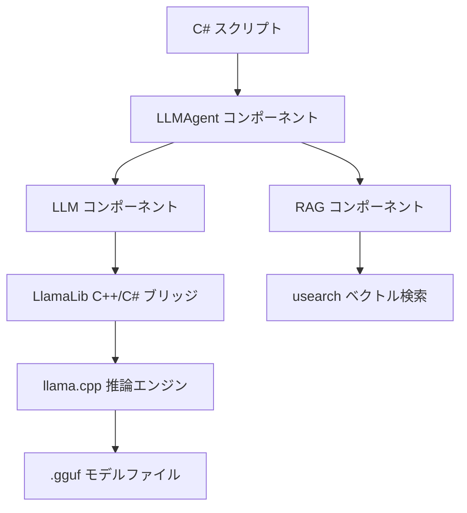
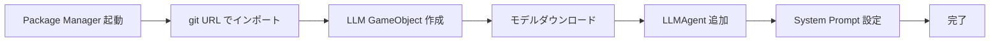
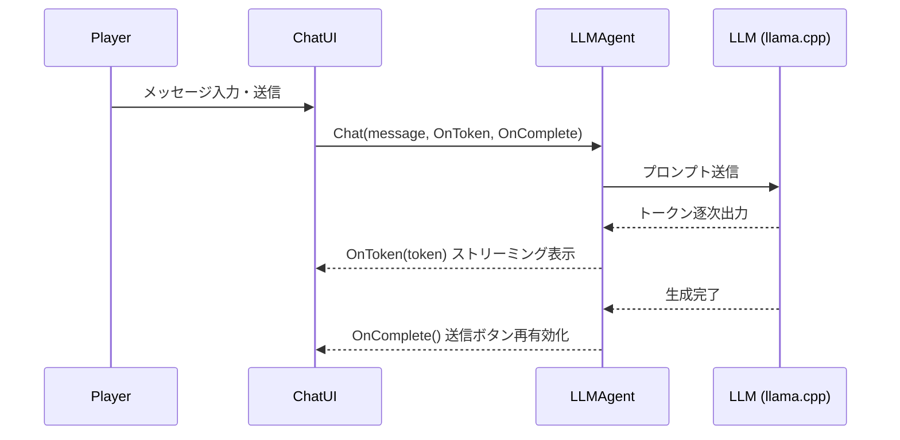

## はじめに

ゲームにAIキャラクターを実装したいとき、最初に浮かぶのはOpenAI APIの利用です。しかしクラウドAPIにはレイテンシ・通信コスト・インターネット依存という課題があります。**ローカルLLMはこれらをすべてデバイス上で解決できます**。

LLMUnityはllama.cppをUnityに統合するOSSパッケージです。量子化モデルをエディタから直接ダウンロードし、数行のC#コードでAIキャラクターとの対話を実現できます。本記事ではセットアップから実装例までを解説します。

:::message
LLMUnityはApache 2.0ライセンスのOSSです。個人・商用プロジェクトいずれにも無償で利用できます。
:::

## LLMUnityとは

LLMUnityはundreamaiが開発するUnity向けローカルLLM統合パッケージです。内部バックエンドのLlamaLibがllama.cppをラップし、C#から透過的に呼び出せる構造になっています。



主要コンポーネントは以下の3つです。

| コンポーネント | 役割 |
|---|---|
| LLM | モデル管理・llama.cppサーバー制御 |
| LLMAgent | キャラクター定義・会話履歴管理 |
| RAG | 埋め込み生成・類似テキスト検索 |

**対応プラットフォームの広さがこのパッケージの強みです**。PC・Android・iOS・VRに対応し、CPU推論に加えてNvidia / AMD / Apple MetalのGPUアクセラレーションも利用できます。

| プラットフォーム | CPU | GPU |
|---|---|---|
| Windows / Linux / macOS | ○ | Nvidia / AMD |
| Android (ARM64) | ○ | - |
| iOS | ○ | - |
| VR (Quest等) | ○ | - |
| Unity 2021 LTS〜Unity 6 | ○ | ○ |

## セットアップ手順



### 1. パッケージのインストール

Unity Package Managerを開き、「Add package from git URL」から以下を入力します。

```text
https://github.com/undreamai/LLMUnity.git
```

Asset Storeからのインポートも可能です。

:::message alert
Androidビルドを行う場合、Player SettingsでScripting BackendをIL2CPP・ターゲットアーキテクチャをARM64に設定する必要があります。
:::

### 2. LLM コンポーネントのセットアップ

シーンに空のGameObjectを作成し、`LLM`コンポーネントをAdd Componentで追加します。InspectorのDownload Modelボタンから量子化モデルを取得します。

推奨モデルは用途に応じて選択します。

| 用途 | 推奨モデル | サイズ目安 |
|---|---|---|
| PC ゲーム | Llama-3.1-8B Q4_K_M | 約5GB |
| モバイル | Qwen2.5-1.5B Q4_K_M | 約1GB |
| 高品質応答 | Mistral-7B-Instruct Q8 | 約8GB |

HuggingFaceの非gguf形式モデルは、公式のオンラインコンバーターでgguf変換が可能です。

### 3. LLMAgent コンポーネントのセットアップ

キャラクター用の別GameObjectを作成し、`LLMAgent`コンポーネントを追加します。LLMフィールドに先ほどのLLMオブジェクトを参照させ、System PromptにNPCの役割を記述します。

```text
あなたは中世ファンタジーの宿屋の主人です。
旅人に宿と食事を提供し、地域の情報を教えます。
口調は親しみやすく、簡潔に答えてください。
```

## 実装例: AIチャットNPCを作る

プレイヤーが話しかけるとNPCがリアルタイムで返答するシステムを実装します。



```csharp:NPCChatController.cs
using UnityEngine;
using UnityEngine.UI;
using TMPro;
using LLMUnity;

public class NPCChatController : MonoBehaviour
{
    [SerializeField] private LLMAgent llmAgent;
    [SerializeField] private TMP_InputField inputField;
    [SerializeField] private TextMeshProUGUI responseText;
    [SerializeField] private Button sendButton;

    private void Start()
    {
        // 初回推論を事前実行してレスポンスを高速化
        _ = llmAgent.Warmup();
        sendButton.onClick.AddListener(OnSendClicked);
    }

    private void OnSendClicked()
    {
        string message = inputField.text;
        if (string.IsNullOrWhiteSpace(message)) return;

        sendButton.interactable = false;
        responseText.text = "";

        // ストリーミングで逐次表示
        _ = llmAgent.Chat(message, OnTokenReceived, OnReplyComplete);
        inputField.text = "";
    }

    // トークンを受信するたびに呼ばれる
    private void OnTokenReceived(string token)
    {
        responseText.text += token;
    }

    // 生成完了時に呼ばれる
    private void OnReplyComplete()
    {
        sendButton.interactable = true;
    }

    private void OnDestroy()
    {
        // キャラクター破棄時にリクエストをキャンセル
        llmAgent.CancelRequests();
    }
}
```

上記のスクリプトをNPC用GameObjectにアタッチし、InspectorでLLMAgentを参照します。**`Warmup()`を呼ぶことで初回応答が大幅に速くなります**。

チャット履歴の保存・読み込みにはJSON形式のシリアライズAPIが用意されています。会話の継続性が必要なシナリオにも対応できます。

:::message
Grammar設定を使うと出力をJSON形式や選択肢形式に制限できます。分岐イベントや関数呼び出しとの連携に有効です。
:::

## まとめ

LLMUnityを使うことで、llama.cppベースのローカルLLM推論をUnityに手軽に統合できます。

- パッケージインポートからモデルダウンロードまでエディタ完結
- 数行のC#コードでNPCの対話ロジックを実装
- ストリーミング応答でゲームのUXを損なわない設計

**次のステップとしてRAGの活用を検討してください**。ゲームのロア（世界観設定）やアイテムデータをベクトルDBに格納し、文脈に応じた回答を生成することで、よりリッチなNPC体験を構築できます。

ローカルLLMはモデルサイズとハードウェアの制約がありますが、オフライン動作・プライバシー保護・低コストという点でクラウドAPIにない価値を提供します。Unityのゲーム開発にAIキャラクターを取り入れる第一歩として、ぜひLLMUnityを試してみてください。

---

**AIキャラクター開発に興味がある方へ**

https://coconala.com/services/3327092

https://coconala.com/services/2610064
