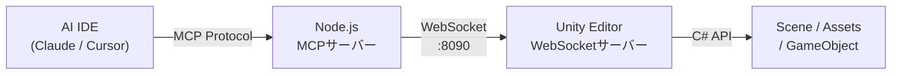
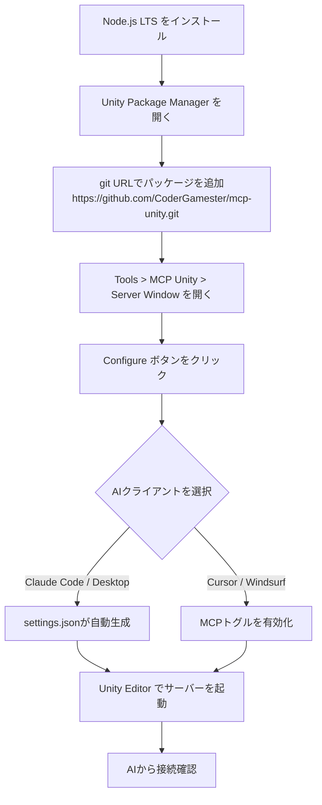
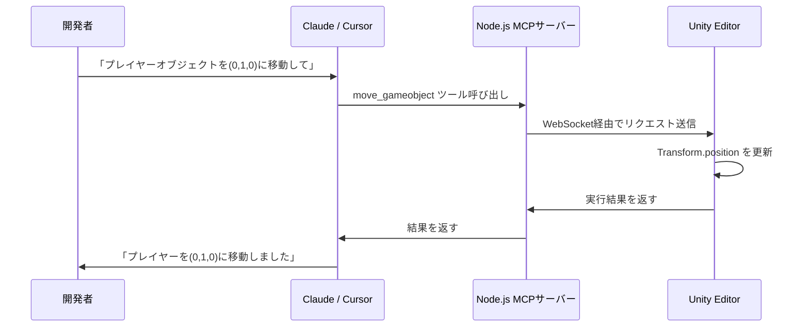

## はじめに

AIアシスタントがコードを書くだけでなく、エディターそのものを操作できたら開発体験はどう変わるか。

**mcp-unityは「AIからUnityを直接操作する」を現実にするOSSプロジェクトです。** Claude CodeやCursorからGameObjectの配置、シーンの作成、テストの実行まで、自然言語で指示できます。

MCP（Model Context Protocol）はAIとツールをつなぐ標準プロトコルです。mcp-unityはそのUnity実装であり、ゲーム開発の自動化における新しいアプローチを提示しています。

:::message
本記事はmcp-unityのv1.x系（2025年時点）を対象としています。最新情報は[公式リポジトリ](https://github.com/CoderGamester/mcp-unity)を確認してください。
:::

## mcp-unityとは

mcp-unityはUnity Editor向けのMCP実装です。Unity内部にWebSocketサーバーを立て、Node.jsのMCPサーバーを中継することで、AI IDEからUnity操作を可能にします。



Unity側はC#で実装された `McpToolBase` 継承クラス群がツールを提供します。Node.js側はTypeScript製サーバーがMCPプロトコルを処理し、AIクライアントとWebSocketをブリッジします。

対応AIクライアントは以下のとおりです。

| クライアント | 接続方式 |
|------------|---------|
| Claude Code | 設定ファイルで自動接続 |
| Claude Desktop | 設定ファイルで自動接続 |
| Cursor | MCPトグルを有効化 |
| Windsurf | MCPトグルを有効化 |
| GitHub Copilot | 設定ファイルで自動接続 |
| Codex CLI | TOMLで設定 |

ライセンスはMITで、商用・個人利用ともに無料です。

## セットアップ手順

必要環境を確認してからインストールを進めます。

| 項目 | バージョン |
|------|-----------|
| Unity | 6以降 |
| Node.js | 18以降 |
| npm | 9以降 |



### Unityパッケージの追加

`Window > Package Manager` を開き、`+` ボタンから「Add package from git URL...」を選択します。

```text
https://github.com/CoderGamester/mcp-unity.git
```

### AIクライアントの設定

`Tools > MCP Unity > Server Window` を開き、「Configure」をクリックすると設定が自動生成されます。手動設定が必要な場合は以下のJSONを使用してください。

```json
{
  "mcpServers": {
    "mcp-unity": {
      "command": "node",
      "args": ["/ABSOLUTE/PATH/TO/mcp-unity/Server~/build/index.js"]
    }
  }
}
```

:::message alert
パスは必ず絶対パスを指定してください。相対パスでは接続に失敗します。パスにスペースが含まれる場合は、プロジェクトをスペースなしのパスに移動することを推奨します。
:::

### サーバーの起動

`Tools > MCP Unity > Server Window` で「Start Server」をクリックします。緑のボックスが表示されれば接続成功です。

## 実践: AIからUnityを操作してみる

サーバーが起動した状態でAI IDEからUnity操作を試せます。



### 主要ツール一覧

mcp-unityが提供するツールは4カテゴリに分類されます。

**GameObject操作**

| ツール | 機能 |
|--------|------|
| `update_gameobject` | 名前・タグ変更、存在しなければ作成 |
| `move_gameobject` | 位置をローカル/ワールド空間で変更 |
| `update_component` | コンポーネントのフィールドを更新 |
| `duplicate_gameobject` | 複製・リネーム・再親子化 |

**シーン管理**

| ツール | 機能 |
|--------|------|
| `create_scene` | 新規シーン作成・保存 |
| `load_scene` | シーンをロード（加算対応） |
| `save_scene` | 現在のシーンを保存 |

**エディター操作**

| ツール | 機能 |
|--------|------|
| `execute_menu_item` | メニュー項目を実行 |
| `run_tests` | Test Runnerでテスト実行 |
| `batch_execute` | 複数ツールをバッチ実行（ロールバック対応） |

### 活用例

以下はClaude Codeへの実際の指示例です。

```text
「Playerという名前のGameObjectを作成して、
Rigidbodyコンポーネントを追加してmassを2に設定してください」
```

```text
「現在のシーンのすべてのGameObjectの情報を取得して、
ライトが不足していれば追加してください」
```

```text
「GameTests.csのすべてのテストを実行して結果を教えてください」
```

**`batch_execute` を使えば複数操作をアトミックに実行でき、途中でエラーが発生した場合はロールバックされます。** 複雑なシーン構築をAIに一括依頼する場合に有効です。

## まとめ

mcp-unityは以下を実現するOSSです。

- Claude/CursorなどのAI IDEからUnityを自然言語で操作
- GameObject・シーン・アセット・テストの自動化
- WebSocket + MCPによる標準化されたブリッジアーキテクチャ

**繰り返しの多いシーン構築やコンポーネント設定をAIに委譲することで、開発者はゲームデザインとロジック設計に集中できます。**

次のステップとして、`McpToolBase` を継承したカスタムツールを実装すれば、プロジェクト固有のエディター操作もAIから呼び出せるようになります。MCP自体がゲーム開発ツールと連携する標準になりつつある今、mcp-unityはその入口として機能します。

:::message
類似OSSとして [CoplayDev/unity-mcp](https://github.com/CoplayDev/unity-mcp) や [IvanMurzak/Unity-MCP](https://github.com/IvanMurzak/Unity-MCP) もあります。カスタムツール拡張の柔軟性を重視するならIvanMurzak版が参考になります。
:::

---

**AIキャラクター開発に興味がある方へ**

https://coconala.com/services/3327092

https://coconala.com/services/2610064
