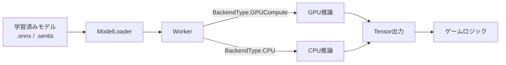
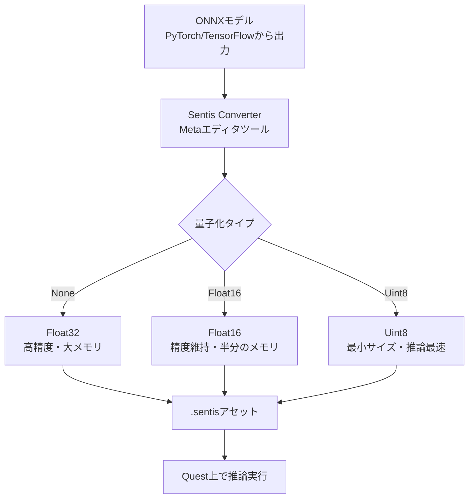

## はじめに

VR/MRヘッドセット上でAIモデルをリアルタイム実行する。数年前なら非現実的だったこの要件が、Meta Quest 3のハードウェア進化とUnityのランタイム推論ライブラリによって現実のものになりつつあります。

ユースケースは多岐にわたります。パススルーカメラ映像からの物体認識、ハンドジェスチャーの意図推定、NPCの表情生成、環境メッシュのセマンティック分類。いずれもクラウドへのラウンドトリップなしに、 **デバイス上で数ミリ秒のレイテンシで推論を完結させる** ことが求められるシナリオです。

本記事では、Unity Inference Engine（旧Sentis）を使ってMeta Quest上でONNXモデルを動かすまでのセットアップと、パフォーマンス最適化のポイントを解説します。

## Unity Inference Engine（旧Sentis）概要

[Unity Inference Engine](https://docs.unity3d.com/Packages/com.unity.ai.inference@2.4/manual/index.html) は、Unityが提供するニューラルネットワーク推論ライブラリです。パッケージ名は `com.unity.ai.inference` で、v2.4が最新安定版（2025年時点）です。以前は「Sentis」というブランド名でしたが、現在はInference Engineに統一されています。



### 主要な特徴

| 項目 | 内容 |
|------|------|
| 対応フォーマット | ONNX（opset 7-15）、LiteRT（旧TensorFlow Lite） |
| バックエンド | GPUCompute（ComputeShader）、CPU（Burstマルチスレッド） |
| 対応プラットフォーム | Unityがサポートする全ランタイム（Quest含む） |
| 名前空間 | `Unity.InferenceEngine` |
| パッケージ | `com.unity.ai.inference@2.4` |

:::message
Inference EngineはSentisからのリネームです。v2.2以降で `using Unity.InferenceEngine;` が正式な名前空間となります。旧 `using Unity.Sentis;` からの移行が必要な場合は、名前空間の置換だけで対応できます。
:::

Workerの生成はシンプルで、`ModelLoader.Load()` でモデルを読み込み、`new Worker(model, BackendType.GPUCompute)` で推論エンジンを作成します。Quest 3ではGPUComputeバックエンドが推奨です。

## Meta Quest環境でのセットアップ

### Quest 3のAI処理能力

Quest 3搭載のSnapdragon XR2 Gen 2は、4nmプロセスのAdreno 740 GPUと専用NPUを搭載。**INT8性能が前世代比4倍（電力効率は8倍）** で、メモリは8GBです。

### モデル変換と量子化

Quest上で効率的に推論を実行するには、ONNXモデルを `.sentis` 形式に変換・最適化する必要があります。Metaが提供するエディタツールで変換できます。

**Unity Editor内の変換手順:**

1. メニューから **Meta > Tools > Unity Inference Engine > ONNX > Sentis Converter** を開く
2. `.onnx` モデルファイルをインポート
3. クリーンアップオプションを設定（Softmax除去、NMS除去など）
4. **量子化タイプを選択**（None / Float16 / Uint8）
5. 出力パスを指定して **Convert to Sentis** を実行



:::message alert
Quest 3のメモリは8GBで、OS・ランタイム・レンダリングと共有されます。Float32のままだと大きなモデルはメモリ不足に陥りやすいため、 **Float16量子化を基本** とし、精度要件が緩い用途ではUint8を検討してください。
:::

### GPU NMS最適化

YOLOXなどの物体検出モデルには、CPU上で実行されるNon-Max Suppression（NMS）レイヤーが含まれています。GPUバックエンドを指定しても、このNMS処理はCPUで実行されるためGPU→CPUの同期待ちが発生し、深刻なフレームドロップの原因になります。

Metaが提供するGPU NMS実装を利用すると、 **NMS処理全体をGPU上で完結** させ、同期ストールを回避できます。Sentis Converterで **Remove NMS** オプションを有効にするだけで自動的に適用されます。

### モデルウォームアップ

初回推論時にはバッファ確保・GPUカーネルコンパイル・重みアップロードで数秒のスパイクが発生します。ローディングシーンでダミー入力による推論を1回実行しておくのが定番の対処法です。

```csharp:ModelWarmUp.cs
void Start()
{
    var model = ModelLoader.Load(modelAsset);
    worker = new Worker(model, BackendType.GPUCompute);
    // ダミー入力でウォームアップ（モデルの入力形状に合わせる）
    using var dummyInput = new Tensor<float>(new TensorShape(1, 3, 224, 224));
    worker.Schedule(dummyInput);
}
```

## 実装例

### Passthrough Camera API × 物体検出

[Passthrough Camera API](https://developers.meta.com/horizon/blog/new-era-mixed-reality-passthrough-camera-api-machine-learning-computer-vision/) は、Quest 3/3Sの前面RGBカメラ映像にアクセスするAPIです（HorizonOS v74以降、Unity 6推奨）。この映像をInference Engineに入力することで、MR空間内での物体認識が実現します。

Metaの公式サンプル [Unity-PassthroughCameraApiSamples](https://github.com/oculus-samples/Unity-PassthroughCameraApiSamples) に、カメラ映像→推論→3Dバウンディングボックス描画までの一連のパイプラインが実装されています。基本的な流れは `TextureConverter.ToTensor()` でカメラ映像をテンソルに変換し、`worker.Schedule()` で推論、`PeekOutput()` で結果を取得して3D空間にマッピングします。

### Provider アーキテクチャ

Metaの [AI Building Blocks](https://developers.meta.com/horizon/documentation/unity/unity-ai-providers/) では、「何を実行するか（Agent）」と「どこで実行するか（Provider）」を分離する設計です。Cloud / Local Server / On-Device（Unity Inference Engine）の3種類のProviderを切り替え可能で、開発時はCloudで高精度モデルを使い、リリース時はOn-Deviceに切り替える運用ができます。

:::message
Quest向けのパフォーマンスTipsをまとめると: (1) Float16量子化を基本にする (2) GPU NMSを有効化する (3) ローディング画面でウォームアップを実行する (4) `Split Over Frames` で推論を複数フレームに分散させる。この4点を押さえるだけでフレームドロップを大幅に抑制できます。
:::

## まとめ

**XRデバイス上でのオンデバイスAI推論は、Quest 3のSnapdragon XR2 Gen 2によって実用的な性能に到達** しています。パフォーマンスの要点は (1) Float16量子化を基本 (2) GPU NMSの有効化 (3) ウォームアップ実行 (4) フレーム分割スケジューリング の4点です。

公式ドキュメントは [Unity Inference Engine](https://docs.unity3d.com/Packages/com.unity.ai.inference@2.4/manual/index.html)、Quest向け統合ガイドは [Meta Horizon OS Developers](https://developers.meta.com/horizon/documentation/unity/unity-ai-unity-inference-engine/)、サンプルは [sentis-samples](https://github.com/Unity-Technologies/sentis-samples) を参照してください。

---

**AIキャラクター開発に興味がある方へ**

https://coconala.com/services/3327092

https://coconala.com/services/2610064
