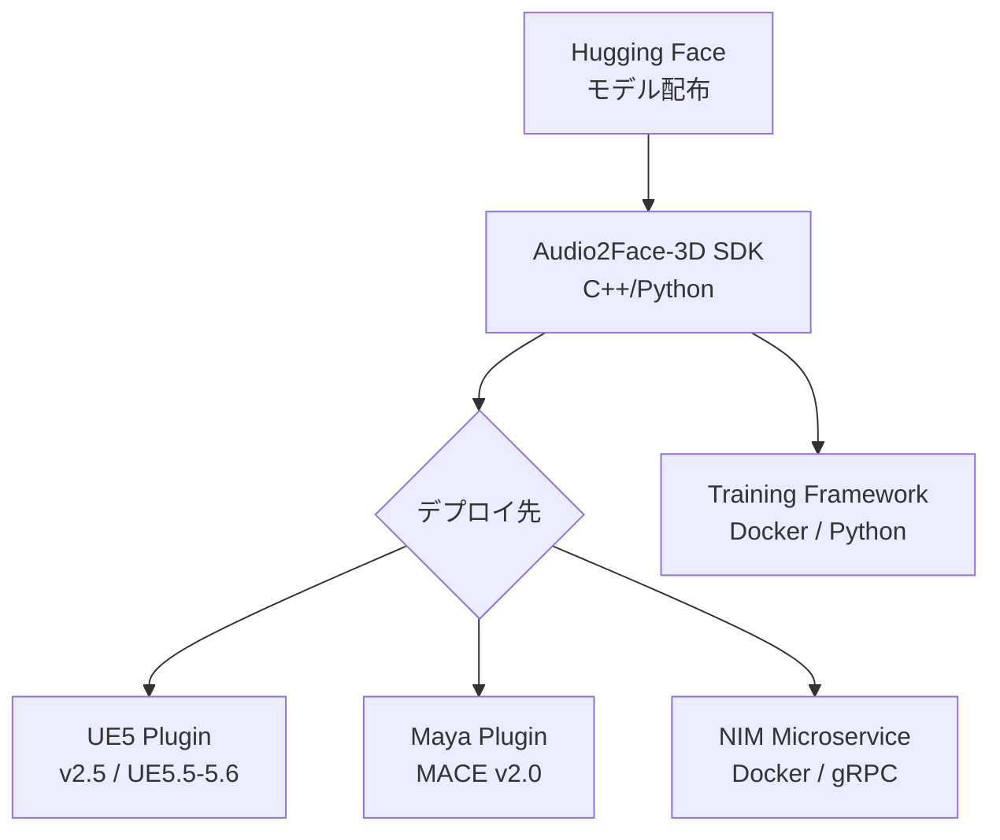
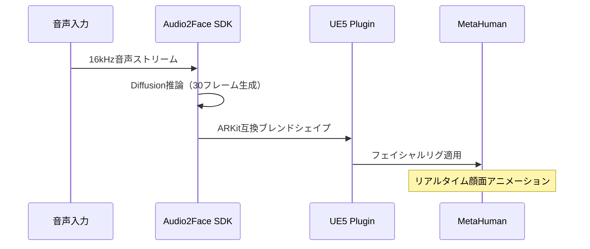

## はじめに

NVIDIA が、音声からリアルタイムに3D顔面アニメーションを生成するAIモデル「Audio2Face-3D」を **オープンソースとして公開** しました。これまでNVIDIA ACE（Avatar Cloud Engine）の商用サービスとして提供されてきた技術が、[GitHub](https://github.com/NVIDIA/Audio2Face-3D) と [Hugging Face](https://huggingface.co/collections/nvidia/audio2face-3d) で誰でも利用可能になっています。

Audio2Face-3Dは、音声データから音素（Phoneme）やイントネーションを解析し、キャラクターの顔面ポーズをリアルタイムにストリーミング生成します。ゲーム、バーチャルプロダクション、デジタルヒューマンなど、 **AAAタイトル品質のリップシンクが無料で手に入る** という点で、個人開発者にとっても大きなインパクトがあります。

この記事では、v3.0のアーキテクチャから実際のセットアップ手順、UE5 MetaHuman連携までを解説します。

## Audio2Face-3Dの技術概要

### v3.0のアーキテクチャ

v3.0は **Transformer + Diffusion** のハイブリッドアーキテクチャを採用しています。音声エンコーダにはHuBERTを使用し、パラメータ数は約1.8億（180M）です。


### v2.3との比較

v2.3（Regression型）からv3.0（Diffusion型）への進化で、品質と柔軟性が大幅に向上しています。

| 項目 | v2.3（Regression） | v3.0（Diffusion） |
|------|-------------------|-------------------|
| アーキテクチャ | Transformer + CNN | Transformer + Diffusion |
| エンコーダ | Wav2Vec2.0 | HuBERT |
| パラメータ数 | 約3,980万 | 約1.8億 |
| 出力単位 | 1フレーム（PCA圧縮） | 30フレーム（生頂点データ） |
| マルチID対応 | アクター別に個別モデル | **1モデルで複数ID対応** |
| 感情制御 | 非対応 | キーフレーム補間で遷移可能 |

:::message
v3.0の最大の強みは「1つのモデルで複数キャラクターに対応できる」点です。v2.3ではJames、Claire等のアクターごとにモデルが必要でしたが、v3.0ではIDコンディションを切り替えるだけで済みます。
:::

## 対応環境と要件

### GPU要件

Audio2Face-3Dは、Pascal世代以降のNVIDIA GPUに対応しています。ローカル推論に必要なVRAMは **約2.9〜4.4 GiB** です。

| GPU世代 | 対応カード例 | 備考 |
|---------|------------|------|
| Ampere | RTX 3080/3090, A100 | 動作確認済み |
| Ada Lovelace | RTX 4080/4090, L4/L40S | 推奨環境 |
| Blackwell | RTX 5090, Pro 6000 | 最新世代対応 |
| Pascal/Turing | GTX 10xx, RTX 20xx | 動作可能（非推奨） |

### ソフトウェアスタック



推論エンジンには **TensorRT** を使用し、60FPS以上のリアルタイム処理を実現しています。SDKはMIT、Training FrameworkはApacheライセンスで配布されており、 **商用・非商用問わず利用可能** です。

:::message
Audio2Emotion（感情推論）モデルはゲーテッド配布です。[Hugging Faceのモデルページ](https://huggingface.co/nvidia/Audio2Emotion-v3.0)でライセンスに同意する必要があります。
:::

## 実装手順

### 1. モデルのダウンロード

Hugging Faceからモデルをダウンロードします。

```bash:setup.sh
# Hugging Face CLIでモデル取得
pip install huggingface_hub
huggingface-cli download nvidia/Audio2Face-3D-v3.0 --local-dir ./models/a2f-v3.0

# Audio2Emotion（オプション、要ライセンス同意）
huggingface-cli download nvidia/Audio2Emotion-v3.0 --local-dir ./models/a2e-v3.0
```

### 2. SDKのビルドとセットアップ

[Audio2Face-3D SDK](https://github.com/NVIDIA/Audio2Face-3D-SDK)はC++ライブラリとして提供されています。TensorRTによるGPUアクセラレーションに対応し、CPUフォールバックも備えています。

```bash:build.sh
# SDKリポジトリのクローン
git clone https://github.com/NVIDIA/Audio2Face-3D-SDK.git
cd Audio2Face-3D-SDK

# ビルド（CMake + CUDA環境が必要）
mkdir build && cd build
cmake .. -DCMAKE_BUILD_TYPE=Release
make -j$(nproc)
```

:::message alert
SDKのビルドにはCUDA Toolkit、TensorRT、CMakeが必要です。Docker環境でのビルドも[Training Framework](https://github.com/NVIDIA/Audio2Face-3D-training-framework)側で提供されています。
:::

### 3. UE5 MetaHuman連携

UE5プラグインを使えば、MetaHumanキャラクターにAudio2Faceアニメーションを直接適用できます。



UE5プラグインのセットアップ手順は以下の通りです。

1. [NVIDIA開発者サイト](https://github.com/NVIDIA/Audio2Face-3D)からUE5プラグイン（`nv_ace_reference`）をダウンロード
2. ACE Unreal Pluginとモデルプラグインの2つをプロジェクトに配置
3. Blueprintノードで音声入力とMetaHumanのフェイシャルリグを接続
4. ローカル推論またはNIM経由のリモート推論を選択して実行

:::details サンプルプロジェクトの構成
プラグインにはMetaHumanキャラクターの設定済みサンプルプロジェクトが含まれており、`aceunrealsample-1.0.0.7z`としてダウンロード可能です。C++ソースコードも公開されているため、プラグインの機能拡張やカスタマイズも行えます。
:::

対応UE5バージョンは **5.4、5.5、5.6** です。オフラインレンダリング用のUSDエクスポートにも対応しており、プリスクリプトのカットシーンにも利用できます。

## まとめ

Audio2Face-3Dのオープンソース化により、AAA品質の顔面アニメーション技術が個人開発者にも開放されました。

- **v3.0**: Transformer + Diffusion、約1.8億パラメータ、1モデルで複数キャラクター対応
- **要件**: VRAM 2.9〜4.4 GiB、NVIDIA Pascal世代以降
- **ライセンス**: SDK（MIT）、Training Framework（Apache）で商用利用可能
- **エコシステム**: UE5/Mayaプラグイン、NIMマイクロサービス、トレーニングフレームワーク一式公開

NPCの会話演出やバーチャルキャラクター開発のコストを大幅に下げる技術として、まずはローカル推論環境の構築から試してみてください。

公式: [GitHub](https://github.com/NVIDIA/Audio2Face-3D) / [Hugging Face](https://huggingface.co/collections/nvidia/audio2face-3d) / [論文](https://arxiv.org/abs/2508.16401)

---

**AIキャラクター開発に興味がある方へ**

https://coconala.com/services/3327092

https://coconala.com/services/2610064
