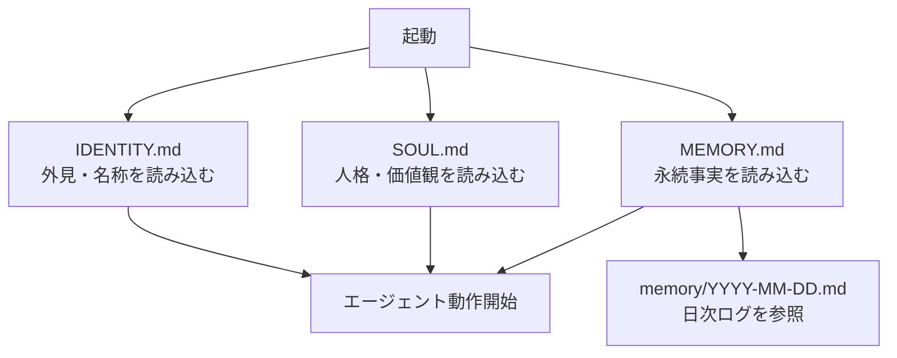
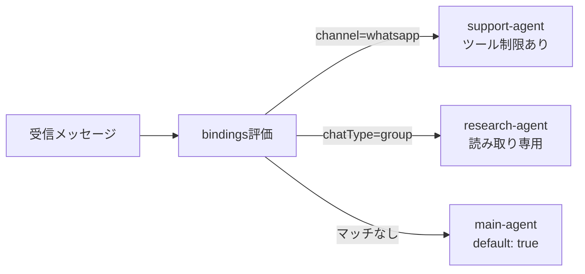

## TL;DR

:::message
- **AGENTS.mdは全会話に注入**されるため、2KB以下の管理が必須
- SOUL.md / MEMORY.md / 日次ログの3階層でメモリを分離管理する
- マルチモデルルーティングを使えばコストを50〜80%削減できる
:::

## OpenClawを「とりあえず動かす」で終わらせていないか

OpenClawのGitHubスターが19万を超えた。**多くの人が「インストールして会話する」だけで止まっている。**

https://medium.com/@rentierdigital/21-openclaw-automations-nobody-talks-about-because-the-obvious-ones-already-broke-the-internet-3f881b9e0018

本記事では、OpenClawの自動化を「使いこなす側」に引き上げる7つのテクニックを紹介する。

:::message
**対象読者**: OpenClaw導入済み、または導入を検討中の開発者
:::

## コンテキスト予算の枯渇がすべての自動化障害の根本原因だ

OpenClawを使い始めて最初に躓くのが、「設定を増やすほど動作が不安定になる」という逆説だ。

**AGENTS.mdは全会話に自動注入されるため、トークンコストが最も高い領域を占有する。** 上限は20,000文字で、超過時は以下の比率で切り詰められる。

https://docs.openclaw.ai/concepts/memory

| ファイル | 切り詰め優先度 | 役割 |
|---------|-------------|------|
| AGENTS.md | 70% | エージェント設定 |
| SOUL.md | 20% | 人格・スタイル |
| 日次ログ | 10% | 直近の文脈 |

AGENTS.mdが肥大化すると指示が曖昧になり、自動化タスクが失敗する。SOUL.mdは2ページを超えると逆効果との知見が海外コミュニティでも一致している。

https://github.com/CodeAlive-AI/awesome-openclaw/blob/main/OPENCLAW_BEST_PRACTICES.md

根本解決策は、**メモリを用途別に3階層へ分離する設計**だ。

## 実装：3階層メモリと最小権限マルチエージェント

### テクニック1-3: メモリ3階層設計

まずファイル構造から確認する。

```text
~/clawd/
├── IDENTITY.md → エージェントの外見・名称
├── SOUL.md → 人格・価値観（2ページ以下厳守）
├── MEMORY.md → 永続事実・嗜好（キュレーション済み）
└── memory/
    └── YYYY-MM-DD.md → 日次ログ・一時メモ
```



**テクニック1**: SOUL.mdは2ページ以下に抑える。起動時に毎回読み込まれるため、肥大化するとコスト増と精度低下に直結する。

**テクニック2**: MEMORY.mdとmemory/*.mdの役割を明確に分離する。永続事実（ユーザー嗜好など）と日次ログを混在させないことが重要だ。

**テクニック3**: IDENTITY.mdとSOUL.mdを別ファイルで管理する。**外見（IDENTITY）と思考（SOUL）を分離することで**、フォーマルなSOULにカジュアルな表示名を自由に組み合わせられる。

https://learnopenclaw.com/core-concepts/soul-md

### テクニック4-5: マルチエージェント最小権限設計



**テクニック4**: bindings[]で受信メッセージを自動ルーティングする。

https://docs.openclaw.ai/concepts/multi-agent

```yaml
bindings:
  - filter: { channel: "whatsapp" }
    agent: support-agent
  - filter: { chatType: "group" }
    agent: research-agent
  - default: true
    agent: main-agent
```

**テクニック5**: tools.denyでエージェント別にツール使用を制限する。サポートエージェントからexec/browserを剥奪し、**リサーチエージェントには読み取り専用ツールのみ許可する**。

:::message
最小権限の原則はセキュリティの基本だ。各エージェントに必要最低限のツールのみ与えることで、誤操作・悪用リスクを大幅に下げられる。
:::

## セットアップ：Cronジョブ・コスト最適化・セキュリティ

### テクニック6: Cronジョブで定時自動化

OpenClawのCronジョブは `~/.openclaw/cron/` に永続化される。**再起動後も消えない設計**が、24/7常時稼働の基盤だ。

https://docs.openclaw.ai/automation/cron-jobs

スケジュール指定はevery形式と5フィールドcron式の両方に対応している。

```yaml
# every形式（インターバル指定）
schedule: "every 30m"

# cron式（特定時刻指定）
schedule: "0 9 * * 1-5"
```

失敗時のリトライは指数バックオフで自動処理される。30秒→1分→5分→15分→60分と間隔が広がり、成功後に自動リセットされる。

実用上のジョブ数は5〜20が現実的な上限だ。同一時刻への集中を避けるスタガリングも忘れずに設定したい。月$15のVPSで24/7常時稼働が実現できる。

### テクニック7: マルチモデルルーティングでコスト50-80%削減

全リクエストをOpusに流すのはコストの無駄だ。**タスクの複雑さに応じたモデル振り分け**が、コスト削減の核心になる。

| モデル | コスト | 用途 |
|--------|--------|------|
| Claude Opus | 基準（最高） | 複雑な推論・アーキテクチャ判断 |
| DeepSeek R1 | Opusの1/10 | 日常業務・コード生成 |
| Gemini Flash-Lite | $0.50/M | ハートビート・分類 |

`agents.defaults.model.fallbacks` でフォールバック順を設定する。`openclaw.json` はホットリロード対応のため、設定変更時に再起動は不要だ。

https://velvetshark.com/openclaw-multi-model-routing

## 「とりあえず動かす」から「設計して使いこなす」へ

:::message alert
**セキュリティ注意**: ClawHubでは悪意あるスキルが発見されている（CVE-2026-25253）。`bind: "loopback"`設定、Dockerサンドボックス隔離、SKILL.md内シェルコマンドの目視確認を必ず実施すること。
:::


7つのテクニックを振り返ると、共通する思想が見えてくる。

| # | テクニック | 効果 |
|---|-----------|------|
| 1 | SOUL.md 2ページ制限 | コスト削減 + 精度向上 |
| 2 | MEMORY.md / 日次ログ分離 | 長期記憶の品質維持 |
| 3 | IDENTITY / SOUL分離 | 柔軟なペルソナ管理 |
| 4 | bindings[]ルーティング | メッセージ自動振り分け |
| 5 | ツール制限（最小権限） | セキュリティ強化 |
| 6 | Cronジョブ定時実行 | 24/7自動化パイプライン |
| 7 | マルチモデルルーティング | コスト50-80%削減 |

**「AIを組織として設計する」** という考え方は、Claude Code SubAgentとも共鳴する。どちらも「1つのモデルに全てを任せない」原則を貫いている。

まずは公式ドキュメントでOpenClawの全体像を確認してほしい。

:::message
公式ドキュメント: https://docs.openclaw.ai/
ClawHub: https://clawhub.ai/
:::

---

**AIキャラクター開発に興味がある方へ**

https://coconala.com/services/3327092

https://coconala.com/services/2610064
