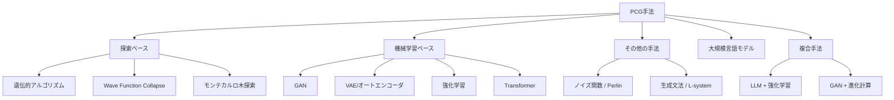
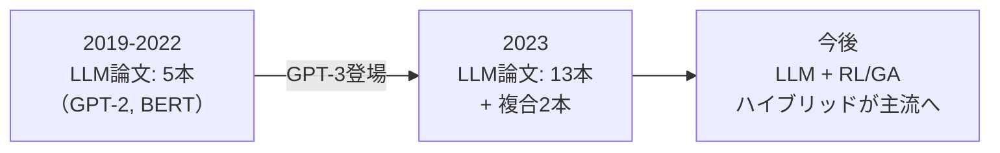
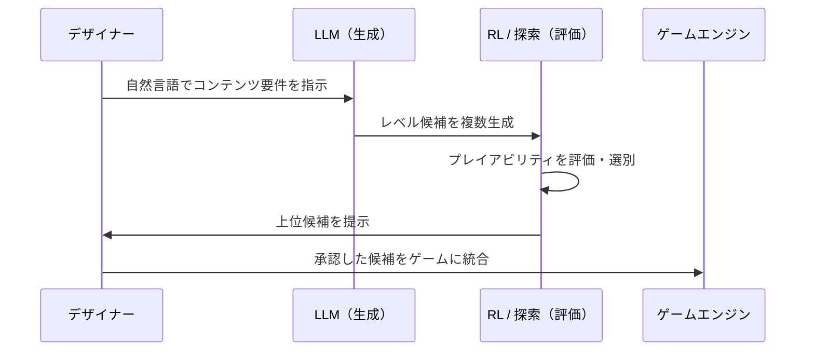

## はじめに

PCG（Procedural Content Generation / プロシージャルコンテンツ生成）とは、アルゴリズムによってゲームコンテンツを自動生成する技術です。レベル設計、テクスチャ、ナラティブ、NPC行動など、あらゆるゲーム要素が対象になります。

Maleki & Zhao（2024）が発表した[サーベイ論文](https://arxiv.org/abs/2410.15644)は、2019年から2023年の5年間に発表された207本の論文・629名の著者をカバーし、PCG手法の全体像を体系的に整理しました。本記事はこのサーベイを日本のゲーム開発者向けに翻訳・解説したものです。

特筆すべきは、 **2023年にLLM関連のPCG論文が爆発的に増加し、従来の深層学習ベースのアプローチを根本から変えつつある** という指摘です。PCGの過去と現在、そしてLLM統合がもたらす未来を見ていきましょう。

## PCGの全手法分類

サーベイでは、PCG手法を5つの大分類に整理しています。

各カテゴリの特徴を比較すると以下の通りです。

| カテゴリ | 代表手法 | 強み | 弱み |
|---------|---------|------|------|
| 探索ベース | GA, WFC, MCTS | 品質関数で制御可能、大規模データ不要 | 計算コストが高い、適合度関数の設計にドメイン知識が必要 |
| 機械学習 | GAN, VAE, RL | 2Dレベル生成に強い、潜在空間の補間が可能 | プレイアビリティの保証が困難（GANは画像として学習するため） |
| その他 | Perlin, L-system, フラクタル | 軽量、再現性が高い、自然な地形生成に適する | 構造化されたコンテンツには不向き |
| LLM | GPT-2/3, ChatGPT | 学習不要、自然言語UIでデザイナーの参入障壁が低い | ブラックボックス、APIポリシーに依存 |
| 複合手法 | LLM+RL, GAN+EA | 生成と評価を分離し補完し合える | システムの複雑性が増す |

:::message
最も研究されているコンテンツタイプは「レベル生成」で、全207本中102本（約49%）を占めます。中でもSuper Mario Brosが18本の論文で使われており、事実上のベンチマーク環境になっています。
:::

## LLMがPCGに与えたインパクト

### MaaS（Model as a Service）パラダイムの登場

従来のML手法は「モデルを自分で学習する」ことが前提でした。しかしGPT-3以降、 **API経由で事前学習済みモデルを呼び出すMaaS方式が主流となり、PCGの研究スタイルそのものが変化しました** 。研究の焦点がモデルアーキテクチャからプロンプトエンジニアリングへ移行したのです。

### 時系列でみるLLM論文の急増

2023年以前は全てオープンソースのGPT-2やBERTを使ったファインチューニング研究でした。2023年に入るとクローズドなGPT-3/3.5のAPI呼び出しが主流となり、論文数が約3倍に跳ね上がりました。

### 代表的なLLM統合事例

| プロジェクト | 手法 | 生成対象 | 特徴 |
|------------|------|---------|------|
| [MarioGPT](https://arxiv.org/abs/2305.06462)（Sudhakaran et al. 2024） | GPT-2ファインチューニング | Super Mario Brosレベル | テキストプロンプトからレベルをシーケンス生成 |
| SCENECRAFT（Kumaran et al. 2023b） | LLM | ゲームシーン・NPC行動 | 自然言語指示からシーン・感情・ジェスチャーを動的生成 |
| Dungeon 2（Schrum et al. 2020） | GPT-2ファインチューニング | テキストアドベンチャー | 「終わらないテキスト冒険」の物語自動生成 |
| CALYPSO（Zhu et al. 2023） | LLM | テーブルトップRPG | ダンジョンマスター支援ツール |
| Kumaran et al. 2023a | GPT-3.5 + 深層RL | レベル生成 | LLMで生成しRLで選別する二段構成 |

:::message
LLMの最大の強みは「自然言語インターフェース」です。「敵が多い高難度ステージ」とテキストで指示するだけでレベルが生成される世界が実現しつつあります。これはゲームデザイナーの参入障壁を劇的に下げます。
:::

## 実装例・OSSツール

実際に試せるツールとライブラリを紹介します。

| ツール/モデル | 種別 | 用途 | 入手先 |
|-------------|------|------|--------|
| [WaveFunctionCollapse](https://github.com/mxgmn/WaveFunctionCollapse) | アルゴリズム | タイル/テクスチャベースのレベル生成 | GitHub（MIT） |
| GPT-2 | オープンソースLLM | テキスト→レベル生成のファインチューニング基盤 | Hugging Face |
| MarioGPT | GPT-2ベース | Mario Brosレベルのテキスト制御生成 | 論文のリポジトリ |
| BERT | オープンソースLLM | 文法ベースPCGとの組み合わせ | Hugging Face |

### 複合手法の実装パターン

論文で繰り返し登場する有効な実装パターンは以下の3つです。

**パターン1: LLM + RL（生成と評価の分離）**
LLMがレベル候補を生成し、RLエージェントがプレイアビリティを評価・選別します。Kumaran et al.（2023a）はGPT-3.5で生成、深層RLで選別する構成で有効性を実証しました。

**パターン2: GAN/VAE + 進化計算（潜在空間探索）**
Bontrager et al.（2018）が提案した「潜在変数進化（Latent Variable Evolution）」は、GANやVAEの潜在空間上で進化アルゴリズムを走らせることで、MarioとZeldaのレベル生成に成功しています。

**パターン3: コンテンツ修復（Content Repair）**
生成モデルの出力をそのまま使うのではなく、RLや探索ベース手法で「修復」するアプローチです。Davoodi et al.（2022）はオートエンコーダで生成し、GANのDiscriminatorを停止条件として修復を行いました。

## まとめ

このサーベイから見えてくる重要なポイントは3つです。

**1. LLMはPCGのゲームチェンジャーだが万能ではない**
自然言語インターフェースは革新的ですが、クローズドモデルへの依存とプレイアビリティ保証の欠如が課題として残ります。

**2. 複合手法が最も有望**
LLM単体ではなく、LLM + RLやLLM + 遺伝的アルゴリズムのように、 **生成と評価を分離するハイブリッド構成が今後の主流になる** と論文は指摘しています。

**3. 未開拓領域が広大**
3Dレベル生成、オープンソースLLMの活用、生成コンテンツの評価手法、そして倫理面の議論がまだ不足しています。特に3Dは2Dと比べて圧倒的に研究が少なく、UnityやUnreal Engineとの統合を含めて大きな可能性が眠っています。

PCGとLLMの融合はまだ始まったばかりです。次の5年で、プロンプト一つでゲーム世界が生まれる時代がさらに近づくでしょう。

---

**AIキャラクター開発に興味がある方へ**

https://coconala.com/services/3327092

https://coconala.com/services/2610064
