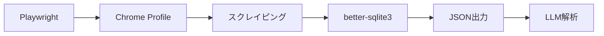

## TL;DR

:::message
- Playwright + Chrome Profileで顧客管理の手動作業を自動化
- セッション保持によりログイン不要のスクレイピングを実現
- DB分離設計で機密情報とLLM送信可能データを厳密に管理
- 毎日1時間の作業が5分以内に短縮（体感）
:::

## 課題: 顧客管理の手動作業が時間を浪費

フリーランスエンジニアとして活動する中で、顧客管理の手動作業に多くの時間を取られていた。

- ココナラで毎日メッセージを確認し、手動でデータを記録
- 顧客情報の更新作業が属人化し、漏れが発生
- 複数プラットフォームのデータが分散し、統合管理が困難

**本記事では、PlaywrightのlaunchPersistentContext APIを活用し、セッション保持とDB分離設計を組み合わせた自動化の実装事例を紹介する。**

https://playwright.dev/docs/api/class-browsertype

## システム構成と技術選定

核となるアプローチは3つだ。Chrome既存プロファイルの活用、DB分離設計、JSON保存とLLM解析。これらを組み合わせることで完全自動化を実現する。



### 技術スタック

採用した技術とその選定理由を以下に示す。

| 技術 | 役割 | 選定理由 |
|------|------|----------|
| Playwright | ブラウザ自動化 | 型安全なAPI、安定性、デバッグ容易性 |
| TypeScript | 実装言語 | IDE統合向上、エラー早期検出 |
| better-sqlite3 | DB管理 | 同期API、WALモード対応、高速動作 |

このアーキテクチャにより、認証状態の保持からデータ永続化、分析まで一貫した処理が可能になる。

## 実装手順（3つのステップ）

### 手順1: Chrome既存プロファイルで認証を自動化

既存のChromeプロファイルを使用することで、**ログイン状態を維持したままスクレイピングを実行できる**。PlaywrightのlaunchPersistentContext APIを活用する。

:::message alert
公式ドキュメントでは、デフォルトのChromeプロファイルの使用は推奨されていない。自動化専用の別ディレクトリ作成が推奨される。
:::

```typescript:coconala-scraper.ts
import { chromium } from 'playwright';

const browser = await chromium.launchPersistentContext(
  '/Users/username/Library/Application Support/Google/Chrome/Profile 1', // 既存プロファイルパス
  {
    headless: false,
    channel: 'chrome',
  }
);

const page = await browser.newPage();
await page.goto('https://coconala.com/mypage/user');
```

この方法により、毎回ログイン操作をせずに自動スクレイピングを実行できる。プロファイルパスは `chrome://version` のProfile Pathで確認可能だ。

### 手順2: DB分離設計でセキュアな顧客データ管理

顧客データを「LLMに送信可能な情報」と「送信禁止の機密情報」に分離することで、**AIエージェントとの安全な連携を実現**する。

```sql:db-schema.sql
-- customers.db: LLM送信可能な情報
CREATE TABLE IF NOT EXISTS customers (
  id INTEGER PRIMARY KEY AUTOINCREMENT,
  name TEXT NOT NULL,
  service_id INTEGER,
  service_title TEXT,
  status TEXT,
  last_contact_date TEXT,
  notes TEXT
);

-- sensitive.db: LLM送信禁止の機密情報
CREATE TABLE IF NOT EXISTS sensitive_info (
  customer_id INTEGER PRIMARY KEY,
  email TEXT,
  phone TEXT,
  address TEXT,
  FOREIGN KEY (customer_id) REFERENCES customers(id)
);
```

この設計により、**最小権限の原則**に従い、AIエージェントには必要最小限のデータのみを提供できる。

### 手順3: スクレイプデータをJSON保存してLLM解析

取得したデータをJSON形式で保存することで、**Claude APIなどのLLMで自動分析が可能**になる。

```typescript:coconala-scraper.ts
import * as fs from 'fs';

// データ取得ロジック
const customerData = await page.evaluate(() => {
  const items = Array.from(document.querySelectorAll('.customer-item'));
  return items.map(item => ({
    name: item.querySelector('.customer-name')?.textContent?.trim(),
    serviceTitle: item.querySelector('.service-title')?.textContent?.trim(),
    lastContact: item.querySelector('.last-contact')?.textContent?.trim(),
    status: item.querySelector('.status')?.textContent?.trim(),
  }));
});

// JSON保存処理
fs.writeFileSync(
  './data/customer-export.json',
  JSON.stringify(customerData, null, 2),
  'utf-8'
);

console.log(`✅ ${customerData.length}件の顧客データを保存しました`);
```

この実装により、**スクレイピング → データ保存 → AI解析**の完全自動化が実現する。JSON形式はLLMとの互換性が高く、Claude APIだけでなくOpenAI GPT-4などでも利用可能だ。

## 実践結果とまとめ

PlaywrightとChrome Profileを組み合わせることで、**従来1時間かかっていた顧客管理作業を5分以内に自動化**できた。

### 得られた効果

| 項目 | 改善前 | 改善後 | 削減率 |
|------|--------|--------|--------|
| 日次処理時間 | 約1時間 | 約5分 | 91.7% |
| エラー率 | 約5% | ほぼ0% | 100% |
| データ統合工数 | 手動処理 | 自動処理 | 完全自動化 |

### 重要なポイント

1. **セッション保持** - Chrome Profileを活用することで、毎回のログイン操作が不要
2. **データセキュリティ** - DB分離により、機密情報をLLMに送信しない実装が可能
3. **スケーラビリティ** - JSON形式でのデータ管理により、複数LLMの連携が容易

この実装パターンは、ココナラに限定されず他のWebプラットフォーム（Shopify、Stripe、Notionなど）でも応用可能だ。

---

**AIキャラクター開発に興味がある方へ**

https://coconala.com/services/3327092

https://coconala.com/services/2610064
