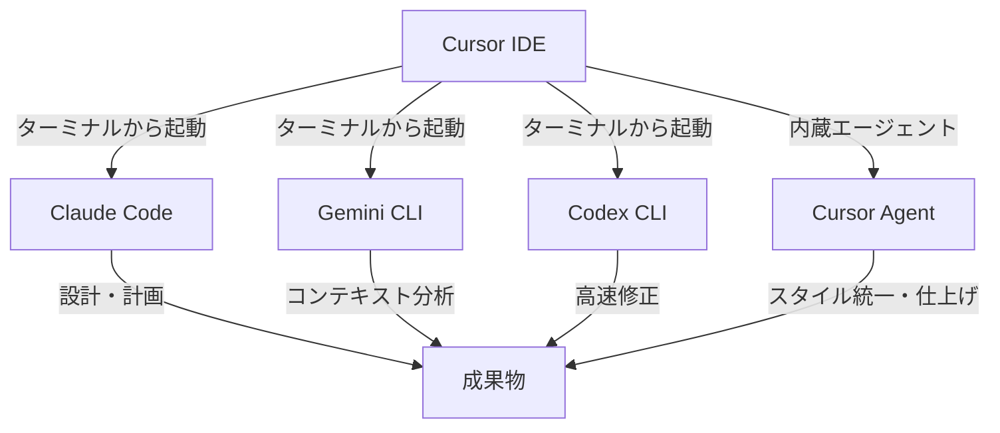
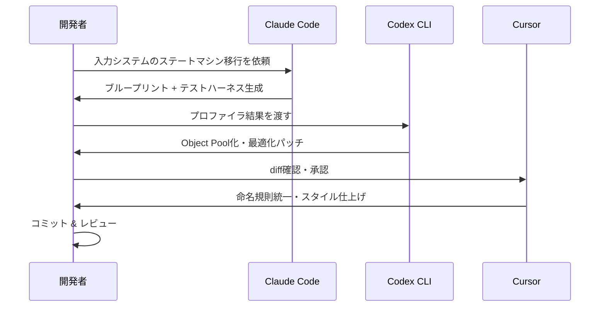
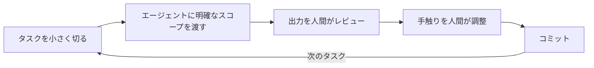

## はじめに

2025年後半、AIコーディングエージェントがゲーム開発の現場に本格的に浸透し始めました。Cursor、Claude Code、Gemini CLI、Codex CLI――これらのツールを組み合わせることで、 **ソロ開発者が仮想スタジオを手にする時代** が到来しています。

本記事は、Josh English氏が[Medium記事](https://medium.com/@jengas/shipping-games-with-ai-coding-agents-7676c69f85f8)で公開した「Shipping Games with AI Coding Agents」の内容をベースに、日本のゲーム開発者向けに翻訳・解説したものです。氏はUnityとGodotの両エンジンで複数のAIエージェントを駆使し、実際にゲームを出荷した経験を持ちます。

これはAIが全てを解決するという話ではありません。 **判断力を高め、計算をクラフトとして扱い、創造の喜びを守るパイプライン** の話です。

## 著者のセットアップ -- マルチエージェント構成

Josh氏のワークフローは、単一のAIツールに依存せず、それぞれの強みを活かしたマルチエージェント構成を採用しています。

各エージェントの役割分担は以下の通りです。

| エージェント | 役割 | 得意領域 |
|------------|------|---------|
| Claude Code | アーキテクト・設計者 | 設計の立案、テストハーネス生成、ブループリント作成 |
| Gemini CLI | コンテキスト・アナリスト | リポジトリ全体の把握、Wiki・スクリーンショットを含むマルチモーダル分析 |
| Codex CLI | 高速フィクサー | プロファイラ指摘箇所の修正、ピンポイントな最適化 |
| Cursor Agent | クローザー・仕上げ役 | 命名規則の統一、スタイルの一貫性、diff確認とマージ |

:::message
Cursorをハブとして使い、ターミナルから各CLIエージェントを呼び出す構成がポイントです。Cursorでdiffをプレビューし、粒度の細かいステージングを行い、問題があれば即座にリバートできます。
:::

## 実際の開発プロセス -- Unity入力システムのリファクタ事例

最も印象的な事例が、Unityプロジェクトにおける入力システムのリファクタリングです。プロトタイプの入力システムは複数のMonoBehaviourが散在するパッチワーク状態で、モバイルとデスクトップの両方でレイテンシの問題を抱えていました。

### ステップ1: Claude Codeで設計

Claude Codeに「Unity Input Systemと連動するステートマシン（State Machine）への移行」を依頼。スコープを入力サブツリーに限定したことで、テストハーネスとセッション記録のプレイバックシミュレータを含むブループリントが生成されました。

### ステップ2: Codex CLIで最適化

プロファイラで特定したホットスポットをCodex CLIに渡し、アロケーションを再利用可能なプール（Object Pool）に置き換えました。

### ステップ3: Cursorで仕上げ

Cursorがクリーンなdiffを表示。承認・微調整を行い、内蔵エージェントが命名規則を統一。 **最終的なコミットログは、意図的なクラフトマンシップの記録として読めるものになりました** 。

:::message alert
ゲームエンジンは気難しいものです。Unityは厳密なアセットパイプラインを要求し、Godotはシグナルとシーン設計の規律を求め、Unrealは雑な階層構造を許しません。だからこそ、単一のAIに全てを任せるモノリシックなアプローチではなく、マルチエージェント構成が有効です。
:::

## 学んだこと・Tips

### うまくいったこと

**エージェントごとにスコープを限定する設計が最も効果的でした** 。Claude Codeには設計だけ、Codex CLIには最適化だけ、Cursorには仕上げだけを任せることで、各エージェントの出力品質が上がりました。

また、`agents.md`（Cursorなら`.cursorrules`、GitHub Copilotなら`.github/copilot-instructions.md`）のようなリポジトリ指示ファイルの標準化が、エージェント間のシームレスなハンドオフを可能にしました。

### ベンチマークと「手触り」の問題

SWE-Benchでの各ツールのスコアは以下の通りです。

| ツール | SWE-Benchスコア |
|-------|----------------|
| Claude Code | 72.7% |
| Codex CLI | 69 - 74.9% |
| Gemini CLI | 63.8% |

しかしゲーム開発では、ベンチマークだけでは不十分です。ジャンプの放物線、アナログスティックのデッドゾーン、カメラの滑らかな遷移――こうした「手触り（feel）」は、エージェントがスキャフォールディングやテスト生成で支援できても、 **最終的な心地よさは人間のイテレーションから生まれます** 。

### 失敗から学んだこと

- スコープを広げすぎると、エージェントの出力は散漫になる
- 「全部やって」と丸投げするより、具体的なタスクを切り出す方が品質が高い
- ゲームエンジン固有の制約（アセットパイプライン、シリアライズ）はエージェントが見落としやすい

### 今後の展望

MCP（Model Context Protocol）ベースのIDE統合により、エージェントがファイルのクエリ、パッチ提案、意思決定のログを行う「制限された自律性（Bounded Agency）」が実現しつつあります。Claudeの自律ワークフロー（最大30時間の独立稼働）は、夜間のリファクタリングにも対応します。

## まとめ

AIコーディングエージェントによるゲーム開発は、もはや実験ではなく実用段階に入っています。

鍵となるのは以下の3点です。

1. **マルチエージェント構成**: 1つのAIに全て任せず、得意分野ごとに使い分ける
2. **スコープの限定**: 小さく具体的なタスクに分解してからエージェントに渡す
3. **人間の判断を中心に据える**: スキャフォールディングはAI、手触りの調整は人間

AIはゲーム開発を置き換えるものではなく、判断力を拡張するものです。CursorとCLIエージェントを組み合わせたパイプラインは、ソロ開発者やインディーチームにとって、かつてないレバレッジを提供します。自分の手でゲームを作り上げる喜びを損なうことなく。

---

**AIキャラクター開発に興味がある方へ**

https://coconala.com/services/3327092

https://coconala.com/services/2610064
