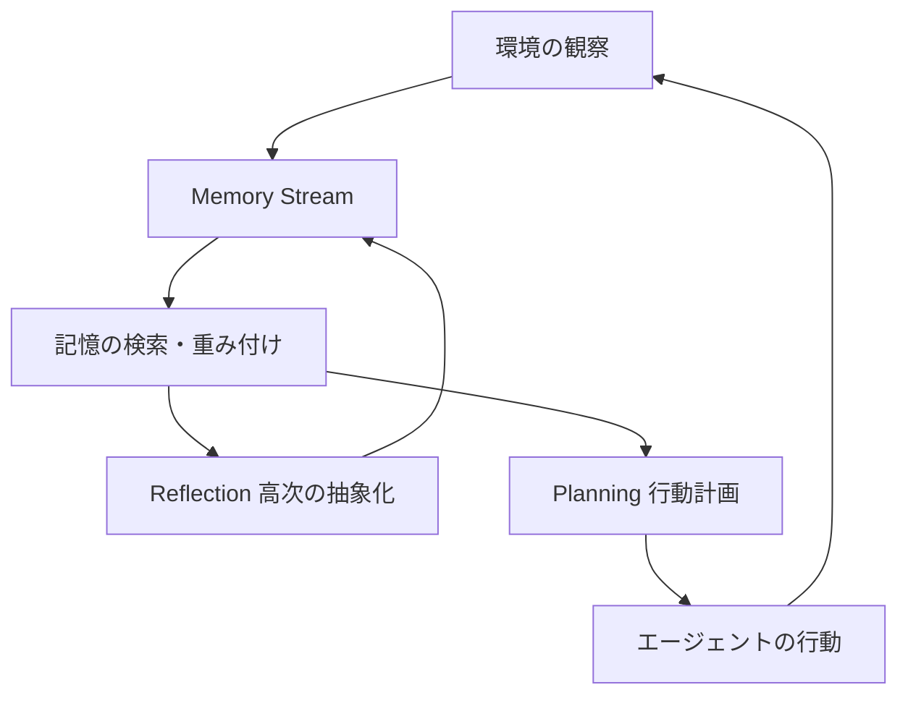
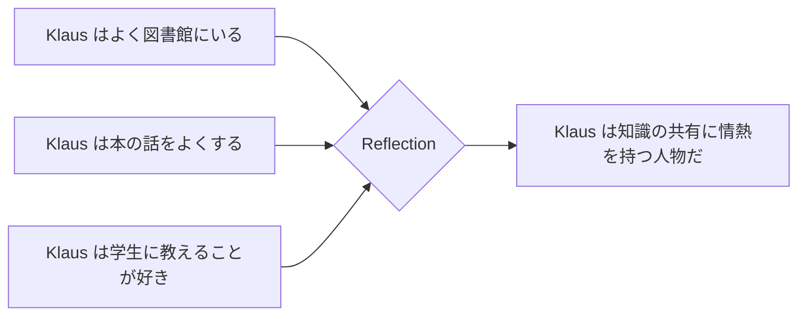
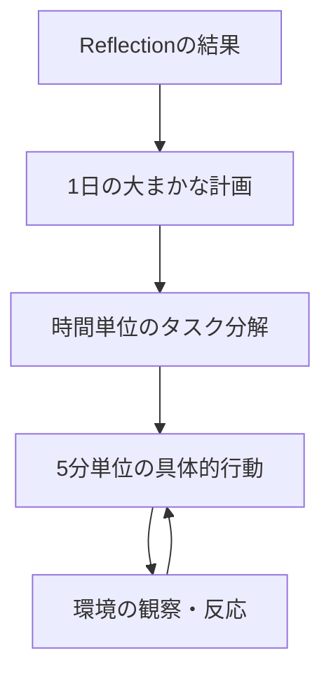

## はじめに

2023年、StanfordとGoogleの研究チームが発表した論文「Generative Agents: Interactive Simulacra of Human Behavior」は、ゲームAI開発の常識を塗り替えました。

25体のエージェントが住む仮想タウン「Smallville」で、NPCが自律的に会話し、関係を築き、イベントを企画する様子が実証されました。**行動ツリーもスクリプトも持たないNPCが、人間らしい判断を自律的に行う**ことが初めて示されたのです。

この記事では、論文の核心である3つのアーキテクチャ要素を解説し、Unity実装への応用アイデアを紹介します。

:::message
論文: "Generative Agents: Interactive Simulacra of Human Behavior" (Park et al., 2023)
arXiv: https://arxiv.org/abs/2304.03442
UIST 2023（ACM Symposium on User Interface Software and Technology）採択論文
:::

## 従来のNPCシステムの限界

ゲームNPCの制御には、長年にわたってFSM（有限状態機械）と行動ツリーが使われてきました。これらの手法は高速で予測可能ですが、根本的な制約を抱えています。

| 手法 | 特徴 | 限界 |
|------|------|------|
| FSM（有限状態機械） | 状態遷移を明示的に定義 | 状態数の爆発、文脈無視 |
| 行動ツリー | 階層的なタスク分解 | スクリプト外の対応不可 |
| ルールベースAI | 条件分岐の組み合わせ | 想定外の入力に脆弱 |
| LLM単体 | 自然な対話 | 長期記憶がない、一貫性が崩れる |

FSMや行動ツリーでは、プログラマーが「全ての状況」を事前に定義しなければなりません。**開発者が想定していない状況が発生すると、NPCは不自然な行動を取るか、動作を停止します。**

LLM単体の利用も問題を抱えています。APIを直接叩いてNPCに応答させると、会話のたびに文脈がリセットされ、NPCが昨日の出来事を「覚えていない」状態になります。長期的な一貫性の維持が難しいのです。

## Generative Agentsのアーキテクチャ

論文が提案するアーキテクチャは、3つの要素で構成されています。



### Memory Stream - 経験の永続的な記録

Memory Streamは、エージェントの全経験を自然言語で記録するデータベースです。

```text
[2023-02-13 09:00] Klaus Mueller is at home
[2023-02-13 09:15] Klaus ate breakfast
[2023-02-13 10:30] Klaus talked with Maria about the community event
```

各記憶エントリは3つのスコアで重み付けされ、検索時に優先度が決まります。

| スコア | 意味 | 例 |
|--------|------|-----|
| Recency | 直近の記憶を優先 | 今日の出来事は高スコア |
| Importance | 重要度（LLMが評価） | 友人の誕生日は高スコア |
| Relevance | 現在の文脈との関連度 | 今の質問と関係ある記憶を優先 |

**3つのスコアの加重和で記憶を検索することで、LLMに渡すコンテキストを動的に絞り込みます。** トークン数の制約内で、最も意味のある記憶を選択できるのがポイントです。

### Reflection - 記憶から洞察を生成する

記憶が一定量蓄積されると、Reflectionが起動します。低レベルの観察記録を、より抽象的な洞察へと変換するプロセスです。



Reflectionによって生成された洞察は、再びMemory Streamに格納されます。つまり、**記憶が再帰的に処理されることで、エージェントは「人格」を形成していきます。**

実験では、このReflectionがなかった場合、エージェントの行動の一貫性が著しく低下することが確認されています（アブレーション実験による）。

### Planning - 長期的な行動計画

Planningは、当日の行動スケジュールを自律的に生成する機能です。



計画も記憶の一部としてMemory Streamに格納されます。観察や他エージェントとのインタラクションが発生すると、計画は動的に修正されます。

バレンタインデーパーティーの事例では、単一の「パーティーを開きたい」という初期条件から、エージェントが自律的に招待状を配布し、他のエージェントとデートの約束を交わし、時間通りに集合しました。**開発者は1行もイベントスクリプトを書いていません。**

:::message alert
アブレーション実験の結果、Memory Stream・Reflection・Planningの3要素はいずれも欠かすことができないことが確認されています。1つでも欠けると、エージェントの行動の信頼性が大幅に低下します。
:::

## Unity/ゲームエンジンへの応用

論文の実装はPhaserフレームワークで構築されましたが、同アーキテクチャはUnityでも実装できます。2024年以降、複数の実装例が登場しています。

### 実装アーキテクチャの概要

```csharp
// Memory Streamの基本構造例
[System.Serializable]
public class MemoryEntry
{
    public string content;       // 自然言語での記憶内容
    public float timestamp;      // 記録時刻
    public float importance;     // 重要度スコア（0-1）
    public string[] keywords;    // 検索用キーワード
}

public class NPCMemoryStream : MonoBehaviour
{
    private List<MemoryEntry> memories = new List<MemoryEntry>();

    // 重要度・新しさ・関連度で上位k件を返す
    public List<MemoryEntry> RetrieveRelevant(string query, int topK = 10)
    {
        // スコアリングと検索ロジック
    }
}
```

### 実装の選択肢

| アプローチ | ライブラリ・ツール | 特徴 |
|-----------|-----------------|------|
| OpenAI API連携 | UnityWebRequest | 高品質、通信コスト発生 |
| ローカルLLM | LLMUnity（llama.cpp） | オフライン動作可、品質は中程度 |
| RAG + ベクトルDB | LLMUnity RAGシステム | 長期記憶の効率的な管理 |
| クラウド同期 | LeanCloud + DeepSeek | クロスプラットフォーム対応 |

**実用上の重要なポイントは、Memory Streamの検索にRAG（Retrieval-Augmented Generation）を活用することです。** 全記憶をLLMに渡すのはトークン数的に非現実的なため、関連性の高い記憶のみを動的に選択する仕組みが必要です。

### 音声NPC実装の注意点

Agoraなどを使った音声NPC実装では、レスポンスを1〜2文（15〜30語）に制限することが推奨されています。長い応答はTTS生成のレイテンシが増加し、プレイヤー体験を損ないます。

また、「全知のNPC」は避けるべきです。NPCに2〜3の専門領域を設定し、それ以外の話題はキャラクターとして自然にかわすよう設計することで、よりリアルな人格が演出できます。

## まとめ

Stanford Generative Agentsの核心は、**LLMを単体で使うのではなく、Memory Stream・Reflection・Planningの3層構造でラップすることで、長期的な一貫性と人格の形成を可能にした点**にあります。

この設計思想は、ゲームNPC開発に直接応用できます。FSMや行動ツリーの「全ての状況を事前定義する」パラダイムから、「記憶と計画を持つ自律エージェント」へのシフトが、次世代のゲームAIの方向性です。

次のステップとして、以下を試してみることをおすすめします。

- LLMUnityを使ってUnityでシンプルなMemory Streamを実装する
- 小規模なSmalville再現実験（エージェント3〜5体）を行う
- RAGシステムで長期記憶の管理コストを最適化する

論文のGitHubリポジトリ（https://github.com/joonspk-research/generative_agents）にはSmallvilleのコードが公開されており、動作確認から始められます。ゲームAIの次世代アーキテクチャを、ぜひ自分のプロジェクトで試してみてください。

---

**AIキャラクター開発に興味がある方へ**

https://coconala.com/services/3327092

https://coconala.com/services/2610064
