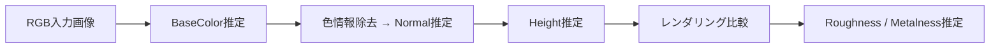
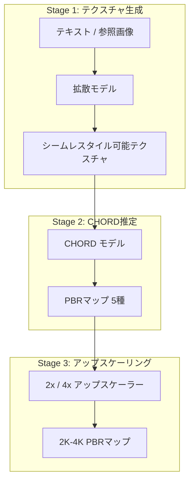
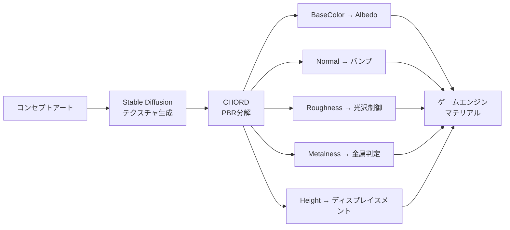

## はじめに

Ubisoft La Forgeが、SIGGRAPH Asia 2025で発表した **PBRマテリアル推定AI「CHORD」をオープンソースで公開** しました。

CHORD（Chain-of-Rendering Decomposition）は、1枚のRGBテクスチャ画像から、BaseColor・Normal・Height・Roughness・Metalnessの5種類のPBRマップを自動生成するAIモデルです。

従来、PBRマテリアルの作成にはSubstance Designerなどの専門ツールで数時間かける必要がありました。CHORDを使えば、テキストや参照画像から生成したテクスチャを入力するだけで、ゲームエンジンに投入可能なPBRマップ一式が数秒で得られます。

ComfyUIのカスタムノードとして提供されており、既存のワークフローに組み込める点も実用的です。本記事では、CHORDの技術的な仕組みから実際の導入方法までを解説します。

## CHORDの技術概要

CHORDの核心は、名前の通り「レンダリングの逆分解をチェーン（連鎖）的に行う」アプローチにあります。



処理は以下の順序で連鎖的に進みます。

1. **BaseColor（基本色）** を最初に推定
2. 入力画像から色情報を除去し、放射照度（Irradiance）を近似して **Normalマップ** を推定
3. Normalマップを統合して **Heightマップ** を推定
4. 推定済みマップを使ってレンダリングした合成画像と元画像を比較し、残差を最小化することで **RoughnessとMetalness** を復元

:::message
CHORDの特徴は、一括推定ではなく **物理レンダリングの逆過程を順序立てて分解する** 点にあります。これにより、各マップ間の物理的整合性が保たれます。
:::

マルチモーダル予測における重みの競合を解決するため、LEGO-Conditioningという手法を採用しています。これはCLIPテキスト埋め込み（"Basecolor"、"Normal"等のキーワード）をモダリティスイッチとして使い、共有バックボーン内で出力を切り替える仕組みです。

学習データには [MatSynth](https://huggingface.co/datasets/gvecchio/MatSynth) の約5,700種のオープンソースPBRマテリアルを使用し、4角度回転で22,800サンプルに拡張しています。

## ComfyUIでの使い方

CHORDはComfyUIのカスタムノードとして提供されています。以下の手順で導入できます。

### インストール手順

:::details インストールコマンド（ComfyUI環境前提）
```bash:terminal
# 1. ComfyUIを最新版にアップデート
cd ComfyUI
git pull

# 2. カスタムノードをクローン
cd custom_nodes
git clone https://github.com/ubisoft/ComfyUI-Chord.git

# 3. 依存パッケージをインストール
cd ComfyUI-Chord
pip install -r requirements.txt

# 4. モデルをダウンロード（checkpointsディレクトリに配置）
# chord_v1.safetensors を以下に配置:
# ./ComfyUI/models/checkpoints/chord_v1.safetensors
```
:::

モデルの重みファイル `chord_v1.safetensors` は、[GitHubリポジトリ](https://github.com/ubisoft/ubisoft-laforge-chord) からダウンロードできます。

### ワークフロー構成

CHORDは3ステージのパイプラインとして動作します。



リポジトリにはサンプルワークフローJSONが2種類付属しています。

| ワークフロー | 用途 |
|------------|------|
| `chord_zimage_turbo_t2i_image_to_material.json` | 高速テスト向け |
| `chord_sdxl_t2i_image_to_material.json` | タイル可能テクスチャ生成向け |

各ステージは独立して使用することも、パイプライン全体を通して使うことも可能です。Stage 1ではControlNet（線画、高さマップ）やImage-to-Image、インペインティングにも対応しています。

:::message alert
モデルの推奨解像度は **1024x1024** です。ゲーム用の2K-4Kテクスチャが必要な場合は、Stage 3のアップスケーリングを必ず通してください。
:::

## ゲーム開発での活用例

CHORDの出力は、UnityやUnreal Engineのマテリアルシステムに直接適用できます。

### テクスチャ生成パイプラインへの組み込み



**実用的な活用シーン** は以下の通りです。

- **プロトタイピング**: コンセプト段階で「それらしい」PBRマテリアルを即座に生成し、ルック開発を高速化
- **プレースホルダー素材**: 本番アセット完成前の仮マテリアルとして使用
- **バリエーション生成**: 1つのベーステクスチャから複数のPBRバリエーションを自動生成

### 現時点での制約

ベンチマーク（PSNR・LPIPS）では既存手法を上回る精度を示していますが、いくつかの制約があります。

- **有機系マテリアル**（木材、石、布など）は高精度だが、 **金属・高スペキュラ素材** は推定が難しい
- Metalnessマップの精度は他のマップに比べて低い傾向
- パイプラインのアップスケーリング段階でエラーが蓄積する可能性がある

Ubisoft側も「プロダクション品質にはまだ達していないが、確かな第一歩」と位置づけています。

:::message
ライセンスは **Research-Only（研究用途限定）** です。商用利用を検討する場合は、ライセンス条件を必ず確認してください。論文は [arXiv:2509.09952](https://arxiv.org/abs/2509.09952) で公開されています。
:::

## まとめ

CHORDは、 **AAA開発スタジオの研究成果が無料で使えるPBRマテリアル生成AI** です。

1枚のRGB画像から5種類のPBRマップを物理的に整合性のある形で推定できる点は、インディーからAAA開発まで幅広い恩恵をもたらします。ComfyUIベースのため導入の敷居が低く、既存のAI画像生成ワークフローとの連携も容易です。

現時点ではResearch-Onlyライセンスであり、金属系素材の精度にも改善の余地がありますが、PBRマテリアル制作の自動化に向けた大きな一歩です。テクスチャ制作のボトルネックを感じているチームは、まずプロトタイピング用途から試してみる価値があるでしょう。

- CHORD GitHub: [github.com/ubisoft/ubisoft-laforge-chord](https://github.com/ubisoft/ubisoft-laforge-chord)
- ComfyUIノード: [github.com/ubisoft/ComfyUI-Chord](https://github.com/ubisoft/ComfyUI-Chord)
- プロジェクトページ: [ubisoft-laforge.github.io/world/chord/](https://ubisoft-laforge.github.io/world/chord/)

---

**AIキャラクター開発に興味がある方へ**

https://coconala.com/services/3327092

https://coconala.com/services/2610064
