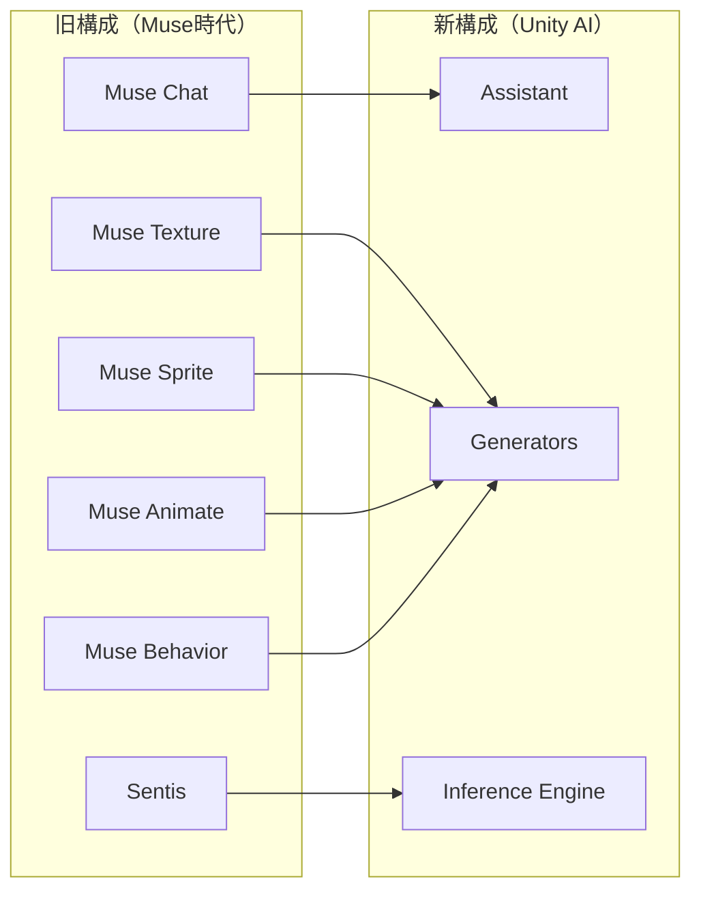
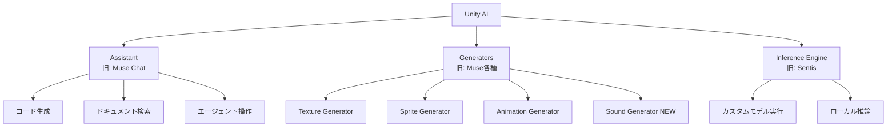

## はじめに

Unity 6.2（2025年8月リリース）は、ゲーム開発におけるAI活用の大きな転換点となりました。

これまで「Unity Muse」として提供されていたAIツール群が「Unity AI」として統合・刷新されました。**単なる名称変更にとどまらず、アーキテクチャ・価格体系・機能の三点で根本的に再設計されています。**

本記事ではUnity Muse → Unity AIへの移行内容を整理し、実際の開発ワークフローへの組み込み方を解説します。

:::message
本記事はCG Channel（2025年8月）の記事および公式ドキュメントをもとに執筆しています。
価格・機能詳細は2026年2月時点の情報です。
:::

## Unity Muse から Unity AI への進化

### 廃止と刷新の背景

Unity Museは2023年に登場し、AIによるテクスチャ・スプライト生成やチャット機能を提供していました。しかし、以下の課題が指摘されていました。

- Unityエディターとの統合が浅く、ワークフローから外れる
- 使用できるAIモデルがUnity独自モデルのみに限定
- 月額$30の固定課金制が開発規模を問わず一律だった

Unity AIはこれらを解消するために設計されました。**サードパーティモデルのAPI連携により、開発者は最新モデルを柔軟に選択できるようになっています。**

### Museとの主な違い

| 比較項目 | Unity Muse（旧） | Unity AI（新） |
|---------|-----------------|----------------|
| リリース | 2023年 | 2025年8月（Unity 6.2） |
| エディター統合 | 別ウィンドウ | Inspector統合 |
| AIモデル | Unity独自のみ | Unity独自＋サードパーティ |
| 価格 | 月額$30 | Unity Pointsポイント制 |
| Sentis/Muse | 別製品 | 統合（3コンポーネント） |
| データ移行 | — | なし（移行不可） |

:::message alert
Museのポイント・生成アセット・ユーザーデータはUnity AIに移行されません。
Unity 6.2 GA（一般提供）後にMuseサブスクリプションは自動終了します。
:::

### システム構成の変化

## Unity 6.2 のAI機能一覧

Unity AIは3つのコンポーネントで構成されています。

### コンポーネント概要

### 1. Assistant（旧: Muse Chat）

プロジェクトのコンテキストを理解するAIアシスタントです。

OpenAIのGPTシリーズとMetaのLlamaシリーズを内部で活用しています。**単なる質問応答にとどまらず、エディター内でのアセット操作や自律的なコード実行（エージェント機能）まで対応しています。**

主なできること：

- C#コードの生成・デバッグ
- ドキュメント・APIリファレンスへの質問
- アセットの一括リネーム
- NPCバリアントの自動生成

### 2. Generators（旧: Muse各種）

ゲームアセットをAIで生成するツール群です。Unity独自モデルとサードパーティモデルの両方を利用できます。

| Generator | 使用モデル | 入力形式 | 主な機能 |
|-----------|-----------|---------|---------|
| **Texture** | Unity独自モデル | テキスト／画像参照 | タイル対応テクスチャ生成 |
| **Sprite** | Scenario・Layer LoRA（SD/Fluxベース） | テキストプロンプト | 2Dスプライト生成・背景除去 |
| **Animation** | Unity独自モデル＋Kinetix | テキスト／動画 | キャラクターアニメーション生成 |
| **Sound** | 非公開 | テキストプロンプト | サウンドエフェクト生成（新規） |

各Generatorには後処理エフェクトが用意されており、生成後の調整も可能です。

- Sprite: 背景除去・ピクセル化・アップスケール・リカラー
- Texture: タイル設定・テクスチャマップ変換
- Animation: ループ調整
- Sound: エンベロープ編集

**Behavior機能についての補足**: 旧Museが提供していたビヘイビアツリー生成機能（Muse Behavior）はUnity AI Generatorsには統合されていません。現在はUnityの別パッケージ「Unity Behavior（v1.0.x）」として提供されています。

### 3. Inference Engine（旧: Sentis）

名称変更のみで機能は実質同一です。**カスタムAIモデルをエディター内またはゲームランタイム上でローカル実行できる唯一のコンポーネントで、Unity Pointsを消費しません。**

活用例：

- 学習済みモデルのゲームAIへの組み込み
- リアルタイム推論（オフライン対応）
- 独自モデルによるNPC行動制御

## Unity Pointsの考え方

Unity AIのAssistantとGeneratorsはUnity Pointsを消費します。

| プラン | 年収条件 | 価格 | Unity Points |
|--------|---------|------|-------------|
| Personal | $200,000未満 | 無料 | 別途購入 |
| Pro | 中規模スタジオ向け | $2,200/年 | 含む |
| Enterprise | 年収$2,500万超 | 要相談 | 含む |

**Inference Engineはポイント消費なしで利用できるため、カスタムモデル運用はコスト面でも有利です。**

:::message alert
Generatorsで生成したアセットの著作権・商用利用可否は、使用モデルのライセンスに依存します。Unity AIはデフォルトでユーザーデータをAI学習に使用しません（オプトイン制）が、サードパーティモデルのポリシーは各自で確認してください。
:::

## まとめ

Unity AIはMuseの反省を踏まえ、エディター統合・モデル選択の柔軟性・価格体系の三点を抜本的に見直したツールスイートです。

まず着手すべき優先順位は次の通りです。

1. **Inference Engine** : ポイント不要・ローカル実行のため即日導入可能
2. **Assistant** : コード生成・デバッグで開発速度を上げる
3. **Generators** : テクスチャ・スプライト・アニメーションのプロトタイプ高速化

2026年1月にはUnity AI Beta 2026が公開され、Assistantのエージェント機能がさらに強化されています。Unity 6.2へのアップグレードを検討している方は、Museとの機能差分（特にBehavior機能の扱い）を確認した上で移行計画を立ててください。

## 参考リンク

- [CG Channel: Unity rolls out Unity AI in Unity 6.2](https://www.cgchannel.com/2025/08/unity-rolls-out-unity-ai-in-unity-6-2/)
- [Unity公式: Unity AI Features](https://unity.com/features/ai)
- [Unity Discussions: Unity AI Beta 2026](https://discussions.unity.com/t/unity-ai-beta-2026-is-here/1703625)

---

**AIキャラクター開発に興味がある方へ**

https://coconala.com/services/3327092

https://coconala.com/services/2610064
