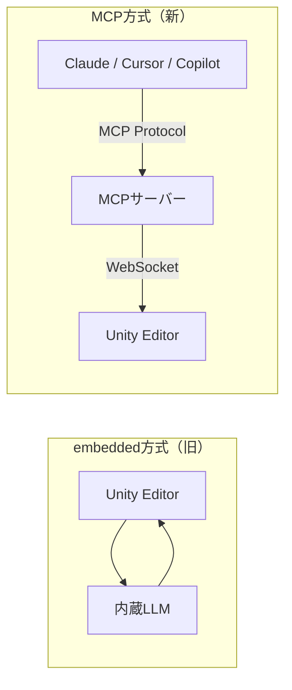
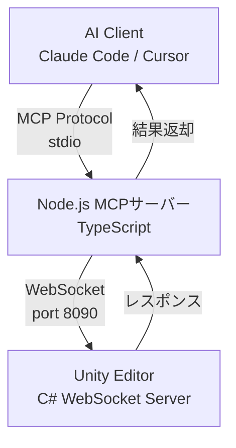

## はじめに

「UnityにLLMを組み込んで、AIキャラクターと自然な会話ができるゲームを作りたい」。ゲーム開発者なら一度は抱く夢ではないでしょうか。

2025年、多くの開発者がこの夢に挑みました。ローカルLLMをUnityに直接埋め込むembedded client方式で、チャットUIからシーンを操作したり、NPCに知性を与えたり。筆者自身もその一人です。

しかし1年間の試行錯誤の末、たどり着いた結論は意外なものでした。 **Unityは「AIのホスト」ではなく「AIが使うツール」であるべきだ** という発想の転換です。本記事では、Vladyslav Panchenko氏の[実体験記事](https://medium.com/@vladsk.panchenko.97/integrating-llm-in-unity-why-i-moved-from-embedded-clients-to-the-mcp-tools-24bb920f7e85)をベースに、embedded clientからMCP（Model Context Protocol）への移行がなぜ必要だったのかを解説します。

## embedded client方式の限界

### リソースの奪い合い問題

UnityとローカルLLMを同時に動かすと、深刻なリソース競合が発生します。

- Unity自体が8〜16GBのRAMを消費し、LLMの推論にはさらに8GB以上が必要
- まともなコンテキスト長（32K+トークン）を確保するには最低16GBのVRAMが必要
- シェーダーコンパイルとLLM推論がGPUを奪い合い、RTX 4070（12GB VRAM）クラスでは厳しい

### ローカルLLMの精度問題

さらに致命的なのが、ローカルモデルの推論精度です。Llama 3 8BやMistral、Qwenなどのローカルモデルでは、Unity開発に求められる推論の深さが足りません。

**コードは生成できるが、正しいコードが生成できない** 。見た目は正しそうなC#コードを出力するものの、微妙なバグが埋め込まれているケースが頻発します。結果として、AI出力のデバッグに自分でコードを書く以上の時間がかかるという本末転倒な事態に陥ります。

### プロトコル解析の壁

MCP や JSON-RPC 2.0のフォーマットをローカルLLMに正しく出力させることも困難でした。小さな構文エラー1つでUnity側のパースが失敗し、簡略版プロトコルを自作しても根本的な解決にはなりません。

:::message alert
Panchenko氏は1年間の実験を経て「ローカルLLMでのUnity開発は、プライバシー上のメリットより生産性の損失のほうが大きい」と結論づけています。
:::

## 解決策: MCPアーキテクチャ

### MCPとは何か

MCP（Model Context Protocol）は、Anthropicが提唱したオープンプロトコルです。一言でいえば **「AI版のUSB Type-C」** 。LLMが外部ツール（この場合はUnity Engine）とやり取りするための標準規格です。

JSON-RPC 2.0ベースで、以下の3つの概念を定義しています。

| 概念 | 役割 | Unity での例 |
|------|------|-------------|
| Tools | LLMが呼び出せる関数 | GameObjectの作成、コンポーネント追加 |
| Resources | LLMが読み取れるデータ | シーン階層、コンソールログ |
| Prompts | 定型の指示テンプレート | デバッグ手順、コード生成パターン |

### なぜMCPに移行するのか

発想の転換がポイントです。embedded方式は「UnityにAIを載せる」アプローチでした。MCP方式は「AIがUnityを道具として使う」アプローチです。



この移行で得られるメリットは明確です。

- LLMはクラウド側の最新モデル（GPT-4o、Claude Opus 4等）を利用できる
- Unityのリソースを圧迫しない
- AIクライアントを自由に切り替え可能
- プロトコルが標準化されているため、エコシステムが成長する

:::message
MCPの本質は「Unityをツール提供者にする」ことです。最新のLLMの推論能力をフル活用しながら、Unityの全機能にアクセスできる構成が実現します。
:::

## 実装例: mcp-unityの構成

現在、主要なオープンソース実装として[CoderGamester/mcp-unity](https://github.com/CoderGamester/mcp-unity)と[IvanMurzak/Unity-MCP](https://github.com/IvanMurzak/Unity-MCP)があります。ここではmcp-unityの構成を紹介します。

### アーキテクチャ



Unity側にC#のWebSocketサーバーが内蔵され、Node.js側のMCPサーバーがブリッジとして機能します。AIクライアントからの指示はNode.jsを経由してUnityに届き、結果が逆順で返却されます。

### 利用可能なツール例

:::details 主要なMCPツール一覧

| ツール名 | 機能 |
|---------|------|
| `update_gameobject` | GameObjectのプロパティ更新・作成 |
| `update_component` | コンポーネントの追加・更新 |
| `create_prefab` | プレハブ作成 |
| `run_tests` | Unity Test Runner実行 |
| `execute_menu_item` | メニュー項目の実行 |
| `add_package` | パッケージ追加 |
| `batch_execute` | 複数操作の一括実行 |

:::

### セットアップ手順

:::details セットアップ（Unity 6 + Node.js 18以降）

1. Unity Package Managerから `https://github.com/CoderGamester/mcp-unity.git` を追加
2. AIクライアントのMCP設定にサーバーを登録

```json:mcp_config.json
{
  "mcpServers": {
    "mcp-unity": {
      "command": "node",
      "args": ["/path/to/mcp-unity/Server~/build/index.js"]
    }
  }
}
```

3. Unity側で `Tools > MCP Unity > Server Window` からサーバーを起動

:::

### カスタムツールの追加

IvanMurzak/Unity-MCPでは、C#の属性ベースでカスタムツールを定義できます。`[McpPluginTool]` と `[Description]` 属性でLLMに関数の用途を伝え、`MainThread.Instance.Run()` 内でUnity APIを呼び出す設計です。

## まとめ

Panchenko氏が1年間かけてたどり着いた教訓は、多くのUnity開発者にとって示唆に富んでいます。

**避けるべきアプローチ:**
- ローカルLLMでのUnity開発（生産性損失 > プライバシー利得）
- Unity内のチャットUI（既存ツールの劣化コピー）
- AI推論を内蔵する「AI-first」プラグイン（数ヶ月で陳腐化）

**推奨されるアプローチ:**
- MCPによる標準化されたプロトコルで外部LLMと接続
- Unityを「ツール提供者」として位置づける
- オープンソースのMCPプラグイン（[mcp-unity](https://github.com/CoderGamester/mcp-unity)、[Unity-MCP](https://github.com/IvanMurzak/Unity-MCP)）を活用

理想的にはUnity Technologies自身が公式のエディタAPIを整備すべきですが、現状ではオープンソースコミュニティが最も実用的な選択肢です。 **「AIをUnityに埋め込む」のではなく「UnityをAIネイティブにする」** 。この発想の転換が、次世代のゲーム開発体験を切り拓いていくのではないでしょうか。

:::message
本記事はVladyslav Panchenko氏の[原文記事](https://medium.com/@vladsk.panchenko.97/integrating-llm-in-unity-why-i-moved-from-embedded-clients-to-the-mcp-tools-24bb920f7e85)をベースに、日本の開発者向けに再構成・加筆したものです。
:::

---

**AIキャラクター開発に興味がある方へ**

https://coconala.com/services/3327092

https://coconala.com/services/2610064
