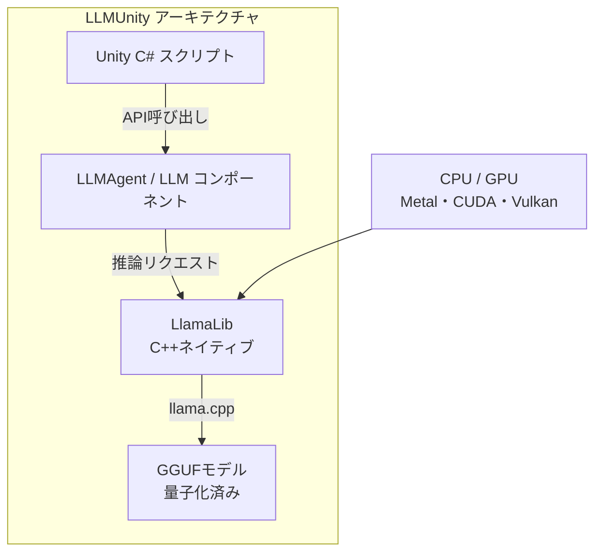
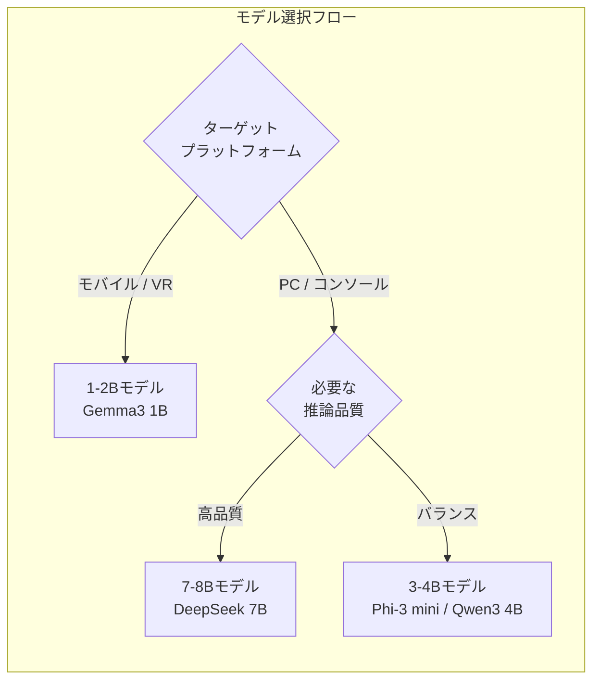

## はじめに

UnityでAIキャラクターと自然な会話ができるゲームを作りたい。そう考えたとき、まず思いつくのはChatGPT APIの呼び出しでしょう。しかしクラウドAPIには課題があります。通信コスト、レイテンシ、プライバシー、そしてオフライン非対応。

ローカルLLMなら、これらの課題を一気に解決できます。

- APIコスト: 完全無料（推論はすべてローカル）
- レイテンシ: ネットワーク往復なしで即座に応答
- プライバシー: プレイヤーの入力データが外部に出ない
- オフライン: インターネット接続不要で動作

本記事では、[LLM for Unity（LLMUnity）](https://github.com/undreamai/LLMUnity)を使い、Gemma 3やDeepSeek、Phi-3などのモデルをUnity上で動かす方法を解説します。 **クラウドAPIに頼らず、ゲーム内で完結するAI会話システムを構築できます** 。

## LLMUnityの概要

### llama.cppベースのUnityパッケージ

LLMUnityは、C/C++製の高速LLM推論エンジン[llama.cpp](https://github.com/ggml-org/llama.cpp)をUnity向けにラップしたパッケージです。Unity Asset Storeで無料配布されており、個人・商用問わず利用できます。



主要な特徴は以下の通りです。

| 機能 | 説明 |
|------|------|
| マルチプラットフォーム | PC、iOS、Android、VR対応 |
| GPU高速推論 | NVIDIA CUDA、AMD ROCm、Apple Metal |
| RAGシステム | ANN検索ベースの知識拡張 |
| LoRAサポート | ファインチューニング済みアダプタの適用 |
| 文法制約 | GBNF文法による出力フォーマット制御 |
| リモートサーバー | 別マシンへの推論オフロード |

:::message
LLMUnityは1,200人以上のコントリビュータを持つllama.cppエコシステムの上に構築されています。GGUF形式のモデルであれば、Gemma 3、DeepSeek、Phi-3、Llama 3、Mistral、Qwenなどほぼすべての主要モデルが動作します。
:::

## セットアップ手順

### 1. パッケージのインストール

2つの方法があります。

**Asset Store経由（推奨）:**
1. Unity Asset Storeの[LLM for Unity](https://assetstore.unity.com/packages/tools/ai-ml-integration/llm-for-unity-273604)ページで「Add to My Assets」
2. Unity Editor で `Window > Package Manager` → `Packages: My Assets` から Import

**Git URL経由:**
`Window > Package Manager` → `+` → `Add package from git URL` に以下を入力:
```text
https://github.com/undreamai/LLMUnity.git
```

### 2. モデルの選択とダウンロード

LLMUnityのインスペクタからモデルをダウンロードできます。用途別の推奨モデルは以下の通りです。



### 3. 量子化レベルの選択

量子化（Quantization）はモデルの精度を下げてサイズと速度を最適化する手法です。

| 量子化 | サイズ削減 | 品質 | 7Bモデル目安RAM |
|--------|----------|------|----------------|
| Q8_0 | 約50% | 最高 | 約8GB |
| Q6_K | 約58% | 高 | 約6GB |
| Q5_K_M | 約65% | 良好 | 約5.5GB |
| Q4_K_M | 約70-75% | 実用的 | 約5GB |
| Q3_K_M | 約80% | やや劣化 | 約4GB |

補足: モバイル向けには1-2Bパラメータのモデルが現実的です。7B以上のモデルはモバイルのメモリ制約でほぼ動作しません。

:::message alert
AndroidビルドではIL2CPPスクリプティングバックエンドとARM64ターゲットアーキテクチャが必須です。`Edit > Project Settings > Player > Other Settings` から設定してください。
:::

## 実装例

### 基本的なチャットの実装

LLMUnityでは `LLM` コンポーネントがモデル管理を、`LLMAgent` コンポーネントがキャラクター別の会話を担当します。

```csharp:AICharacterChat.cs
using LLMUnity;
using UnityEngine;

public class AICharacterChat : MonoBehaviour
{
    public LLMAgent llmAgent;

    async void Start()
    {
        // システムプロンプトでキャラクター設定
        llmAgent.systemPrompt =
            "あなたは冒険者ギルドの受付嬢リリアです。" +
            "丁寧だが少しおっちょこちょいな性格で、" +
            "冒険者に依頼を紹介する役割を担っています。";
        llmAgent.assistantRole = "リリア";
        llmAgent.userRole = "冒険者";

        // 初回レスポンス高速化のためウォームアップ
        await llmAgent.Warmup();
    }

    public async void SendMessage(string playerInput)
    {
        // 非同期で応答を取得（ストリーミング）
        string reply = await llmAgent.Chat(playerInput);
        Debug.Log($"リリア: {reply}");
    }
}
```

### ストリーミング応答とUI連携

1文字ずつUIに表示するストリーミング方式も簡単に実装できます。

```csharp:StreamingChat.cs
using LLMUnity;
using TMPro;
using UnityEngine;

public class StreamingChat : MonoBehaviour
{
    public LLMAgent llmAgent;
    public TMP_Text responseText;

    public void OnSendClicked(string message)
    {
        responseText.text = "";
        // トークン単位のコールバックでストリーミング表示
        _ = llmAgent.Chat(message, OnTokenReceived, OnReplyComplete);
    }

    void OnTokenReceived(string token)
    {
        responseText.text += token;
    }

    void OnReplyComplete()
    {
        Debug.Log("応答完了");
    }
}
```

### メモリ管理の注意点

- `Warmup()` でシステムプロンプトを事前処理し、初回応答の遅延を回避する
- シーン遷移時には `CancelRequests()` で推論を確実に停止する
- 会話履歴は `SaveHistory()` / `LoadHistory()` でJSON永続化できる
- 複数キャラクターは1つの `LLM` コンポーネントに複数の `LLMAgent` を紐づけて管理する

:::message
`numGPULayers` の値を増やすとGPUオフロード量が増えて高速化しますが、VRAMの消費も増えます。ターゲット環境のVRAM容量に応じて調整してください。
:::

## まとめ

### モデル比較と用途別推奨

| モデル | パラメータ | 推奨用途 | 特徴 |
|--------|----------|---------|------|
| Gemma 3 1B | 1B | モバイル・VR | 軽量で高品質、Google製 |
| Phi-3 mini | 3.8B | PC（軽量） | Microsoft製、推論効率が高い |
| Qwen3 4B | 4B | PC（バランス） | 多言語対応、日本語性能良好 |
| DeepSeek 7B | 7B | PC（高品質） | コード生成にも強い |
| Llama 3 8B | 8B | PC（最高品質） | Meta製、汎用性が高い |

補足: 日本語での会話品質を重視するなら、Qwen3系が比較的良好な結果を返します。ただしローカルモデルの日本語性能はクラウドAPIに比べると限定的である点は留意してください。

LLMUnityは、ローカルLLMをUnityに統合するための最も手軽な選択肢です。llama.cppの高速推論エンジンを数行のコードで呼び出せるため、プロトタイピングから製品開発まで幅広く活用できます。 **まずは1-2Bの軽量モデルで試し、ターゲットプラットフォームに合わせてモデルサイズを調整するアプローチが確実です** 。

興味がある方は[LLMUnity公式リポジトリ](https://github.com/undreamai/LLMUnity)からすぐに試すことができます。

---

**AIキャラクター開発に興味がある方へ**

https://coconala.com/services/3327092

https://coconala.com/services/2610064
