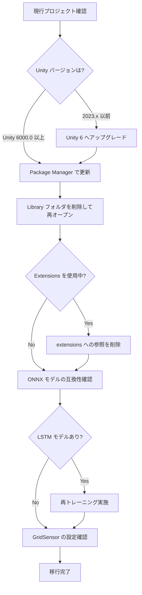

## はじめに

Unity ML-Agents Toolkitは、ゲームや環境を深層強化学習・模倣学習のトレーニング環境として使用できるオープンソースのフレームワークです。2025年8月28日にリリースされた **Release 23（パッケージバージョン 4.0.0）** は、推論エンジンの刷新と最小サポートバージョンの引き上げを中心とした、大きな節目となるリリースです。

本記事では、Release 22（v3.0.0）からの主要変更点と実際の移行手順を解説します。Unity 6への移行を検討している開発者に特に参考になる内容です。

## Release 23の主要変更点

Release 23の変更は「依存関係の近代化」と「パッケージ統合」の2軸で整理できます。

### バージョン対照表

| 項目 | Release 22 (v3.0.0) | Release 23 (v4.0.0) |
|------|---------------------|---------------------|
| C# パッケージ | com.unity.ml-agents 3.x | com.unity.ml-agents 4.0.0 |
| Python パッケージ | ml-agents 3.0.0 | ml-agents 4.0.0 |
| 推論エンジン | Sentis 2.0.0 | Inference Engine 2.2.1 |
| 最小 Unity バージョン | 2023.2 | 6000.0（Unity 6） |
| 拡張パッケージ | 独立（extensions別途） | メインに統合済み |
| grpcio | 旧バージョン | >=1.11.0, <=1.53.2 |

### 推論エンジンの Inference Engine 2.2.1 への移行

Release 22 で使用していた Sentis から **Inference Engine 2.2.1** へアップグレードされました。Inference Engine はコンピュートシェーダーを用いてニューラルネットワークを Unity ランタイム内で実行します。 **Unity がサポートするすべてのランタイムプラットフォームで動作する** ことが特徴です。

### 拡張パッケージのメイン統合

これまで別途インストールが必要だった `com.unity.ml-agents.extensions` が、メインパッケージに統合されました。GridSensor などの拡張機能が追加の依存管理なしで利用できるようになっています。

### ドキュメントの移行

開発者向け一次ドキュメントが GitHub Web ドキュメントから Unity Package Documentation（`docs.unity3d.com`）へ移行されました。**GitHubのドキュメントは今後非推奨**となるため、参照先の変更が必要です。

## 破壊的変更と移行ガイド

:::message alert
Release 23 では最小サポート Unity バージョンが **Unity 6000.0** に引き上げられました。Unity 2023.x 以前のプロジェクトは Release 22 のまま据え置くか、Unity 6 へのアップグレードが必要です。
:::

### 移行フロー



### Python 環境の更新

Python の最小サポートバージョンも変更されています。

```bash
# Python バージョン確認
python --version
# 3.10.12 以上が必要

# ml-agents パッケージの更新
pip install mlagents==4.0.0

# grpcio の更新（バージョン制約に注意）
pip install "grpcio>=1.11.0,<=1.53.2"
```

### ONNX モデルの互換性

:::message alert
LSTM（メモリ設定）を使用してトレーニングされた旧バージョンのモデルは **Release 23 で推論に使用できません**。再トレーニングが必要です。
:::

モデル入力名の変更点は以下の通りです。

| 変更前 | 変更後 |
|--------|--------|
| visual_observation_N | obs_N |
| vector_observation | obs_N |
| LSTM 入力/出力 | 構造変更（再トレーニング必須） |

### GridSensor の移行手順

拡張パッケージのメイン統合に伴い、GridSensor のインターフェースが変更されています。

主な変更点は、`GridSensor` → `GridSensorBase` への継承元変更、`GetObjectData()` の `tagIndex` が1始まりから0始まりに変更されたことです。

| 旧パラメータ名 | 新パラメータ名 |
|--------------|--------------|
| GridNumSide | GridSize |
| RotateToAgent | RotateWithAgent |
| DepthType | 削除（one-hot統一） |
| ChannelDepth | 削除 |

### Unity Package Manager での更新

`manifest.json` で `com.unity.ml-agents` を `4.0.0` に変更し、`com.unity.ml-agents.extensions` への参照は削除してください（統合済み）。

:::message
移行後に問題が発生した場合は、`Library` フォルダを削除して Unity を再起動してください。
:::

## 実践: 新機能を使ったトレーニング例

Inference Engine 2.2.1 への移行後も、基本的なトレーニングの流れは変わりません。以下に Release 23 で動作する設定例を示します。

### 基本的なトレーニングの流れ

Release 23でも `Agent` クラスを継承し、`CollectObservations` / `OnActionReceived` / `Heuristic` をオーバーライドする基本構造は変わりません。ActionBuffers APIも変更なしです（旧 `float[]` APIは削除済み）。

```bash
# Release 23 対応の ml-agents でトレーニング開始
mlagents-learn config/my_config.yaml --run-id=run01
```

推論エンジンは Barracuda → Sentis 2.0.0 → **Inference Engine 2.2.1** と進化し、コンピュートシェーダー実行と全プラットフォーム対応を実現しています。

## まとめ

Release 23 は Unity ML-Agents の **モダン化を完成させるリリース** と位置づけられます。Inference Engine 2.2.1 への移行、Unity 6 の必須化、拡張パッケージの統合という3つの変更が核心です。

既存プロジェクトの移行では、LSTM モデルの再トレーニングと GridSensor の再実装が最も工数のかかるポイントになります。一方で拡張パッケージ統合により、新規プロジェクトの依存管理はシンプルになりました。

### 次のステップ

- Unity 6000.0 へのアップグレードが未実施なら最優先で対応
- LSTM モデルを使用している場合は早期に再トレーニングを計画
- 公式ドキュメントは `docs.unity3d.com/Packages/com.unity.ml-agents@4.0` を参照
- `com.unity.ml-agents.extensions` の参照はパッケージマネージャから削除

Release 22 から Release 23 への移行は一定の手間がかかりますが、**Unity 6 を基盤とした長期サポートへの布石**です。早めに対応しておくことで、今後のアップデートを安定して追えるようになります。

---

**AIキャラクター開発に興味がある方へ**

https://coconala.com/services/3327092

https://coconala.com/services/2610064
