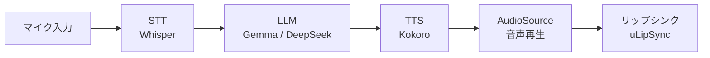
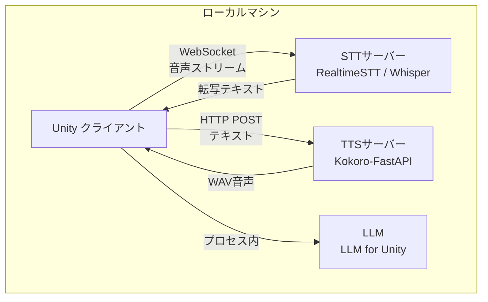

## はじめに

ゲームやXRアプリで「AIキャラクターと会話できる」体験を作りたいとき、真っ先に思い浮かぶのはChatGPTなどのクラウドAPIでしょう。しかしクラウド依存には3つの問題があります。プライバシー（音声データの外部送信）、コスト（大量ユーザーでのAPI課金）、レイテンシ（ネットワーク往復遅延）です。

Tianyu Songが公開した[ローカルLLM会話エージェントのチュートリアル](https://tianyusong.com/create-your-own-locally-run-llm-conversational-virtual-agent-in-unity-part-1-backend/)は、これらの課題を解決するアプローチとして **STT→LLM→TTSの3段パイプラインをすべてローカルマシン上で完結させる** 構成を提案しています。彼はXR医療アプリケーションの研究（IEEE TVCG 2025, MICCAI 2025掲載）を通じて、この構成の有効性を実証してきました。

本記事では、この構成をベースに各コンポーネントの選定理由からUnity側の実装までを解説します。

## アーキテクチャ概要

全体の処理フローは「音声入力→テキスト化→応答生成→音声出力」の3段構成です。



各コンポーネントの役割と推奨ツールは以下の通りです。

| 役割 | ツール | 特徴 |
|------|--------|------|
| STT（音声認識） | [RealtimeSTT](https://tianyusong.com/create-your-own-locally-run-llm-conversational-virtual-agent-in-unity-part-1-backend/) + Whisper | WebSocket経由でリアルタイム転写 |
| LLM（応答生成） | [LLM for Unity](https://github.com/undreamai/LLMUnity) | llama.cpp基盤、Unity内でGGUF実行 |
| TTS（音声合成） | [Kokoro-FastAPI](https://github.com/remsky/Kokoro-FastAPI) | 82Mパラメータ、OpenAI互換API |

:::message
この構成の最大のメリットは **全コンポーネントがApacheまたはMITライセンスで商用利用可能** な点です。クラウドAPIのように従量課金が発生せず、サービス停止リスクもありません。
:::

## バックエンド構築

バックエンドは「STTサーバー」と「TTSサーバー」の2つのPythonプロセスで構成します。LLMはUnity内で直接実行するため、バックエンド側には含めません。



### STTサーバー（RealtimeSTT + Whisper）

RealtimeSTTはWhisperをラップしたPythonサーバーで、WebSocket経由でリアルタイム音声転写を提供します。VAD（Voice Activity Detection）を内蔵しており、発話区間の自動検出が可能です。

```bash:setup_stt.sh
# RealtimeSTTのインストール
pip install RealtimeSTT

# サーバー起動（WebSocket: ws://localhost:8011）
python -m RealtimeSTT.server
```

音声は16kHz/16bit PCMでストリーミングし、Whisperのtinyモデルであれば **RTF（Real-Time Factor）0.2以下** での処理が可能です。精度を優先する場合はsmallやmediumモデルを選択できます。

### TTSサーバー（Kokoro-FastAPI）

[Kokoro](https://huggingface.co/hexgrad/Kokoro-82M)は82Mパラメータながら、TTS Arenaで上位にランクインした高品質な音声合成モデルです。FastAPIラッパーを使えば、OpenAI互換のAPIエンドポイントとして動作します。

```bash:setup_tts.sh
# Docker で起動（GPU版）
docker run --gpus all -p 8880:8880 ghcr.io/remsky/kokoro-fastapi-gpu:latest

# CPU版（Apple Silicon等）
docker run -p 8880:8880 ghcr.io/remsky/kokoro-fastapi-cpu:latest
```

:::message alert
Apple SiliconではCUDA非対応のためCPU版を使用してください。MPSサポートは今後対応予定です。GPUメモリは2GB程度で動作し、レイテンシも十分リアルタイム向きです。
:::

起動後は `http://localhost:8880/v1/audio/speech` にPOSTリクエストを送るだけで音声が返ります。

```python:test_tts.py
import requests

response = requests.post(
    "http://localhost:8880/v1/audio/speech",
    json={
        "model": "kokoro",
        "input": "こんにちは、私はAIキャラクターです。",
        "voice": "af_bella",
        "response_format": "wav",
        "speed": 1.0
    }
)
with open("output.wav", "wb") as f:
    f.write(response.content)
```

## Unity側の実装

### LLMの組み込み（LLM for Unity）

[LLM for Unity](https://github.com/undreamai/LLMUnity)は、llama.cppをUnityネイティブで実行するパッケージです。GGUFフォーマットのモデルを直接ロードできます。

セットアップは3ステップです。

1. Unity Package Managerから `LLM for Unity` をインストール
2. 空のGameObjectに `LLM` コンポーネントを追加し、GGUFモデルをロード
3. 別のGameObjectに `LLMCharacter` コンポーネントを追加し、System Promptでキャラクター設定を記述

モバイル向けには1-2Bパラメータの軽量モデル、PC向けにはGemma3やDeepSeekの7-8Bモデル（INT4量子化で約4.8GB VRAM）が推奨されます。

### WebSocketクライアント（STT接続）

Unity側からRealtimeSTTサーバーへの接続には[NativeWebSocket](https://github.com/endel/NativeWebSocket)が最適です。外部DLL不要で、WebGL含む全プラットフォームに対応しています。

```csharp:SttClient.cs
using NativeWebSocket;
using UnityEngine;

public class SttClient : MonoBehaviour
{
    WebSocket ws;

    async void Start()
    {
        ws = new WebSocket("ws://localhost:8011");
        ws.OnMessage += (bytes) =>
        {
            var transcript = System.Text.Encoding.UTF8.GetString(bytes);
            Debug.Log($"認識結果: {transcript}");
            // LLMCharacterに転写テキストを送信
        };
        await ws.Connect();
    }

    void Update()
    {
        ws?.DispatchMessageQueue();
    }
}
```

### TTS音声再生

TTSサーバーから返されたWAVデータをUnityのAudioSourceで再生します。

```csharp:TtsPlayer.cs
using UnityEngine;
using UnityEngine.Networking;
using System.Collections;

public class TtsPlayer : MonoBehaviour
{
    [SerializeField] AudioSource audioSource;

    public IEnumerator Speak(string text)
    {
        var form = new WWWForm();
        // Kokoro-FastAPI にリクエスト送信
        using var request = UnityWebRequestMultimedia.GetAudioClip(
            $"http://localhost:8880/v1/audio/speech?input={text}&voice=af_bella",
            AudioType.WAV);
        yield return request.SendWebRequest();

        var clip = DownloadHandlerAudioClip.GetContent(request);
        audioSource.clip = clip;
        audioSource.Play();
    }
}
```

### リップシンク連携

音声再生と同期したリップシンクには [uLipSync](https://github.com/hecomi/uLipSync) が定番です。MFCCベースでAudioSourceの出力をリアルタイム解析し、ブレンドシェイプを駆動します。Job System + Burst Compiler最適化済みで、 **追加のGPU負荷なしにリップシンクが実現** できます。

## まとめ

STT（Whisper）→ LLM（llama.cpp）→ TTS（Kokoro）の3段パイプラインにより、 **クラウドAPI不要で会話AIキャラクターを構築** できます。

| 項目 | 推奨構成 |
|------|---------|
| STT | RealtimeSTT（Whisper tiny/small） |
| LLM | LLM for Unity（Gemma3 / DeepSeek 7-8B, INT4） |
| TTS | Kokoro-FastAPI（Docker） |
| リップシンク | uLipSync（MFCC解析） |
| VRAM目安 | LLM: 4-5GB + TTS: 2GB = 合計6-7GB |

今後の拡張として、RAGによる長期記憶の実装や、[whisper.unity](https://github.com/Macoron/whisper.unity)を使ったSTTの完全Unity内統合が考えられます。 **ローカル完結のAIキャラクターは、プライバシーとコストの両立を実現する現実的な選択肢** です。

---

**AIキャラクター開発に興味がある方へ**

https://coconala.com/services/3327092

https://coconala.com/services/2610064
