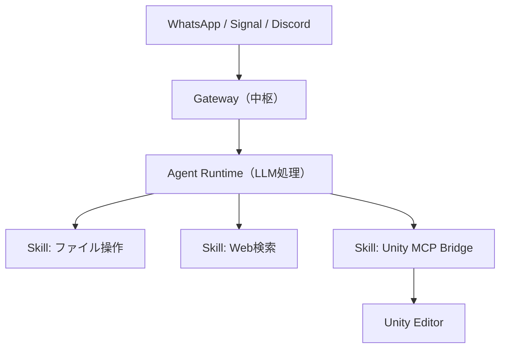
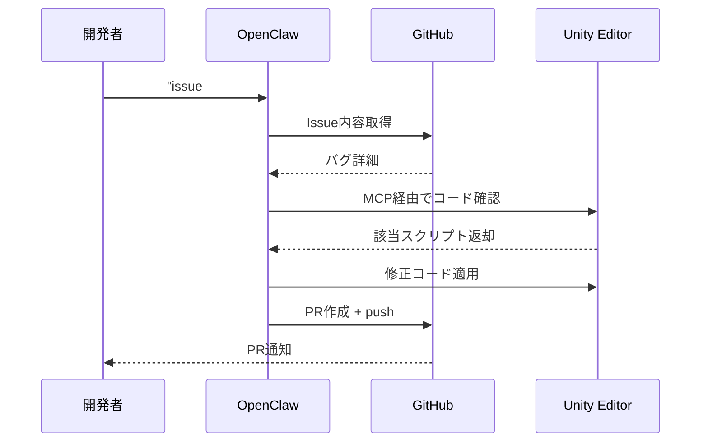

## TL;DR

:::message
- **OpenClaw**はGitHub 19万スター超（2026年2月上旬時点）のオープンソースAIエージェントフレームワーク
- **Unity MCP Bridge**と組み合わせることで、Unity EditorをAIが外部から直接操作できる
- ゲーム開発の繰り返し作業を「AIチームメイト」に委任できる時代が始まっている
:::

## Unity EditorがAIに操作されたとき、開発者の仕事が変わった

「4Kテクスチャを全部ダウンスケールしてモバイルビルド回して」とDiscordに書いたら、AIが勝手にUnity Editorを操作してビルドまで完了していた。そんな世界が、もう来ている。

**OpenClaw**はPeter Steinberger（ペター・シュタインベルガー）が開発した、LLMを活用したオープンソースAIエージェントフレームワークで、GitHubスター数は19万を超える（2026年2月上旬時点）。

https://en.wikipedia.org/wiki/OpenClaw

WhatsApp・Signal・Telegram・Discordといったメッセージングアプリを「ターミナル」として使い、LLMに自然言語でタスクを指示できるのが最大の特徴だ。2026年1月末に爆発的な注目を集め、2月にはSteinberger本人がOpenAIに入社した。

https://techcrunch.com/2026/02/15/openclaw-creator-peter-steinberger-joins-openai/

本記事は、海外で急速に広まるOpenClawを **「ゲーム開発者の視点」** で掘り下げる日本語初レポートだ。Unity MCP Bridgeとの組み合わせによって、繰り返し作業の何がどう変わるのかを具体的に解説する。

## 手作業の繰り返しが、AIを「組織」として使う発想を生んだ

ゲーム開発者の日常はシンプルな繰り返しで成り立っている。ビルドが通ったと思えばテクスチャの最適化漏れが発覚し、プラットフォーム別のビルド設定を整えて、また走らせる。バグ報告のissueを消化しながら、次のスプリントの準備も並行する。**作業そのものは難しくない。ただ、時間だけが確実に消えていく。**

インディー開発者や小規模チームはとくにきつい。エンジニアもデザイナーもQAも、全部自分ひとりでこなすしかない状況で、GitHub CopilotやCursorのコード補完はたしかに助かる。でも「次の一手を提案してくれる」だけでは、作業の流れ全体は変わらない。

そこで私が試みたのが、**AIを1つの道具としてではなく、チームとして扱う設計**だった。Claude Codeの3層SubAgent構成で、複数のAIエージェントに役割を分担させ、並列実行させる手法を実践してきた。記事にもまとめたし、手応えもあった。

ただ、Claude CodeはIDE内で完結する世界だ。「Discordでコマンドを送ったら、UnityEditorが自動で動いて、ビルドまで走る」という体験は、まだ届いていなかった。そのギャップを埋めてくれたのが、OpenClawとの出会いだった。

## OpenClawが3層構造で「組織的AIチーム」を実現する理由

OpenClawの内部構造は「Gateway」「Agent Runtime」「Skills」の3層で構成されている。



- **Gateway**: WebSocketサーバーとして機能し、複数プラットフォームからの同時接続を管理する
- **Agent Runtime**: LLM呼び出し、タスク分解、ツール実行を担当する中核層だ
- **Skills**: `SKILL.md`（Markdown）で定義するため再コンパイル不要。ClawHubには5,000以上のコミュニティスキルが公開されている

https://docs.openclaw.ai/tools/skills

:::message
OpenClawの思想はClaude Code SubAgentと本質的に共通している。どちらも「AIを単体ツールではなくチームとして運用する」同じ思想に基づいている。
:::

## セットアップ手順と実際に動いた3つのユースケース

### 手順1: 環境構築

OpenClawのインストールはワンラインコマンドで完了する。

```bash
npm install -g openclaw
```

起動後のオンボーディングフローで、**通知チャンネル（Discord等）とLLMプロバイダを設定するだけで即座に使用可能**になる。

### 手順2: Unity MCP Bridgeの導入

AIがUnity Editorを外部から操作するために、Unity MCP Bridgeを導入する。

https://github.com/CoplayDev/unity-mcp

```bash
# Unityプロジェクトのルートで実行
git clone https://github.com/CoplayDev/unity-mcp
```

**Unity MCP Bridgeにより、AIがアセット管理・シーン制御・スクリプト編集・タスク自動化を直接実行できる。**

### 手順3: 実際に動いた3つのユースケース

### ユースケースA: テクスチャ自動最適化

Discordに以下のように指示するだけで、最適化からビルドまで自動化される。

> 「モバイルフォルダの4Kテクスチャを全部ダウンスケールしてAndroidビルド回して」

**OpenClawがUnity MCP経由でテクスチャリサイズとビルドを連続実行する**ため、手動作業が不要になる。

https://www.techedubyte.com/openclaw-game-development-ai-agent-framework/

### ユースケースB: GitHub Issue自動修正

issueの読み込みからコード確認・修正・PR作成まで、一切の手動操作なしに完結する。



https://dev.to/guardingpearsoftware/is-openclaw-an-opportunity-for-game-developers-and-studios-5d1

### ユースケースC: NPC意思決定システム

**複数のAIエージェントが連携することで、従来の状態機械では実現不可能だった動的なNPC挙動が実現できる。** 戦略ゲームのAI対戦相手やRPGのコンパニオンなど、プレイヤーの行動に適応するNPCの構築が視野に入る。

### セキュリティ注意事項

:::message alert
**既知の脆弱性・悪意あるスキルに注意**

- **CVE-2026-25253（CVSS 8.8）**: 悪意あるリンクを1クリックするだけでリモートコード実行が可能
  https://thehackernews.com/2026/02/openclaw-bug-enables-one-click-remote.html

- **ClawHubで341本の悪意あるスキルが発見**: 暗号通貨窃取マルウェアを含むスキルが流通していた
  https://thehackernews.com/2026/02/researchers-find-341-malicious-clawhub.html

**対策:**
- サンドボックスモードの使用を推奨
- 公式・信頼できるスキルのみインストールする
:::

## AIは道具ではなくチームメイトになった

OpenClawが示すのは「AIを補助ツールとして使う」時代の終わりだ。Discordに一言打ち込むだけで、ビルド・デバッグ・PR作成まで完了する世界は、もう実験室の中にある。

正直な体感として、**今はまだ「技術に自信のあるチーム向けの実験段階」だ**。ガバナンス設定とサンドボックス構成を正しく理解していないと、怖くて本番には使えない。しかし今日その基礎を学んだチームが、明日のAI駆動パイプラインを構築することになる。

Claude CodeのSubAgent設計とOpenClawのSkillシステム、思想の根っこは同じだ。「AIを組織として動かす」発想が、複数のプラットフォームで同時に加速している。

次のステップとして、実際にUnity × OpenClawの環境を手元に構築し、**ハンズオン形式の続編記事を執筆予定**だ。「動かない」「詰まった」も含めてリアルに書く。フォローしておくと続報が届く。

まずは公式ドキュメントで全体像を確認してほしい。

:::message
公式ドキュメント: https://docs.openclaw.ai/
開発者ブログ（Steinberger）: https://steipete.me/posts/2026/openclaw
:::

---

**AIキャラクター開発に興味がある方へ**

https://coconala.com/services/3327092

https://coconala.com/services/2610064
