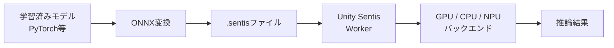
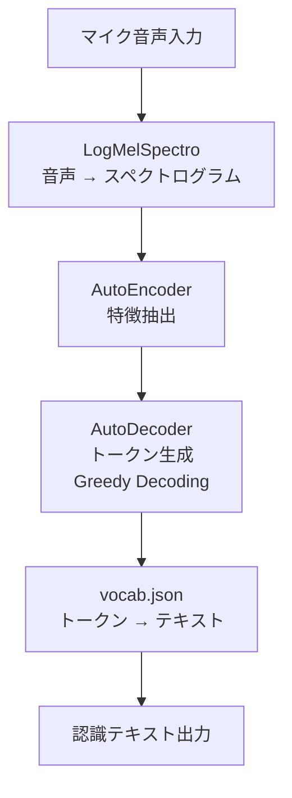
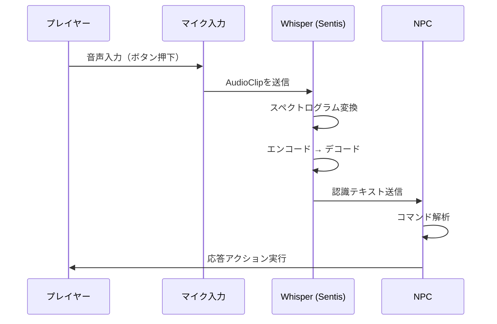

## はじめに

「声でNPCに話しかけて、NPCが応答する」。これはゲームにおける没入感を大きく向上させる体験です。

従来、音声認識をゲームに組み込むには外部APIへのリクエストが必要でした。Google Speech-to-TextやWhisper APIなど、サーバーサイドの音声認識サービスを呼び出す方式です。しかしこの方法には、インターネット接続の依存、APIコール毎の課金、レイテンシの問題がつきまといます。

Unity Sentisを使えば、OpenAIのWhisperモデルを **Unity内でローカル実行し、オフラインで音声認識を完結** できます。本記事では、[Thomas Simonini氏の実装ガイド](https://thomassimonini.substack.com/p/building-ai-driven-voice-recognition)をベースに、Sentis上でWhisper tinyモデルを動かし、音声入力でNPCを制御する方法を解説します。

## Unity Sentisとは

[Unity Sentis](https://docs.unity3d.com/Packages/com.unity.sentis@1.3/manual/understand-sentis-workflow.html)は、Unityが提供するニューラルネットワーク推論ライブラリです。旧称はBarracuda / Unity Inference Engineで、現在はSentisに統合されています。

**ONNXフォーマットのAIモデルをUnityランタイム内で直接実行** できる点が最大の特徴です。



Sentisでは「Worker」というコンセプトが中心にあります。Workerはモデルを実行可能なタスクに分解し、GPU・CPU・NPUのいずれかのバックエンドで各タスクを実行して結果を出力します。

:::message
Sentisの最大の利点は **外部サーバーが不要** なことです。ネットワーク遅延ゼロ、APIコスト不要、オフライン動作が実現できるため、ゲームへのAI組み込みに特に適しています。
:::

対応するUnityバージョンはUnity 2022.3以降です。パッケージマネージャーから `com.unity.sentis` を追加するだけで導入できます。

## Whisper tinyモデルのセットアップ

### モデルの構成

Whisperモデルは、Sentis向けに3つのコンポーネントに分割されています。Hugging Face Hub（[unity/sentis-whisper-tiny](https://huggingface.co/unity/sentis-whisper-tiny)）でUnity公式の最適化済みモデルが公開されています。

| ファイル | 役割 |
|---------|------|
| `LogMelSpectro.sentis` | 音声の前処理（メルスペクトログラム変換） |
| `AutoEncoder_Tiny.sentis` | エンコーダー（音声特徴抽出） |
| `AutoDecoder_Tiny.sentis` | デコーダー（トークン生成） |
| `vocab.json` | トークンIDからテキストへの変換辞書 |

### インストール手順

:::details パッケージのインストールと配置
```bash:terminal
# 必要パッケージ（Unity Package Managerで追加）
# 1. com.unity.sentis
# 2. com.unity.nuget.newtonsoft-json
```

1. Unity Package Managerを開き、「Add package by name」から `com.unity.sentis` を追加
2. 同様に `com.unity.nuget.newtonsoft-json` を追加
3. Hugging Face Hubから4ファイルをダウンロード
4. すべて `Assets/StreamingAssets/` に配置
:::

ファイル配置後、Sentisがモデルを自動認識します。

### 推論パイプライン

Whisperの推論は以下の4ステップで進行します。



デコード方式はGreedy Decodingを採用しています。Beam Searchと比較すると精度は劣りますが、 **リアルタイム性が求められるゲーム用途では速度面のメリットが大きい** 選択です。

## NPCへのリアルタイム音声入力実装

実装は主に2つのスクリプトで構成されます。

### SpeechRecognitionController（マイク制御）

マイクの選択、録音の開始・停止、音声データのWhisperへの受け渡しを担当します。

```csharp:SpeechRecognitionController.cs
using UnityEngine;

public class SpeechRecognitionController : MonoBehaviour
{
    private AudioClip _recording;
    private string _selectedDevice;

    void Start()
    {
        // 利用可能なマイクデバイスを取得
        if (Microphone.devices.Length > 0)
            _selectedDevice = Microphone.devices[0];
    }

    public void StartRecording()
    {
        // 16kHz, 30秒間のモノラル録音を開始
        _recording = Microphone.Start(_selectedDevice, false, 30, 16000);
    }

    public void StopRecording()
    {
        Microphone.End(_selectedDevice);
        // 録音データをWhisperに送信
        SendRecording(_recording);
    }

    private void SendRecording(AudioClip clip)
    {
        // RunWhisperコンポーネントに音声データを渡す
        GetComponent<RunWhisper>().ProcessAudio(clip);
    }
}
```

### RunWhisper（モデル推論）

ゲーム起動時に3つのモデルコンポーネントを読み込み、Workerを生成します。

```csharp:RunWhisper.cs
using Unity.Sentis;
using UnityEngine;

public class RunWhisper : MonoBehaviour
{
    private Worker _logMelWorker;
    private Worker _encoderWorker;
    private Worker _decoderWorker;

    void Start()
    {
        // StreamingAssetsからモデルをロード
        var logMelModel = ModelLoader.Load(
            Application.streamingAssetsPath + "/LogMelSpectro.sentis");
        var encoderModel = ModelLoader.Load(
            Application.streamingAssetsPath + "/AutoEncoder_Tiny.sentis");
        var decoderModel = ModelLoader.Load(
            Application.streamingAssetsPath + "/AutoDecoder_Tiny.sentis");

        // GPU/CPUバックエンドでWorkerを生成
        _logMelWorker = new Worker(logMelModel, BackendType.GPUCompute);
        _encoderWorker = new Worker(encoderModel, BackendType.GPUCompute);
        _decoderWorker = new Worker(decoderModel, BackendType.GPUCompute);
    }

    public void ProcessAudio(AudioClip clip)
    {
        // 音声 → スペクトログラム → エンコード → デコード → テキスト
        // 各Workerを順次実行して音声認識を完了
    }
}
```

:::message alert
Whisper tinyモデルは高速ですが、アクセントの強い英語や騒がしい環境では精度が低下します。日本語認識にはWhisper small以上のモデルが推奨されますが、モデルサイズとパフォーマンスのトレードオフを考慮してください。
:::

### NPC応答フロー

音声認識の結果をNPCの行動に接続する全体フローは以下の通りです。



元記事のデモでは、ロボットキャラクター「Jammo」がテキスト入力の代わりに音声コマンドで動作する実装が紹介されています。このパターンを応用すれば、音声によるNPCとの自然な対話システムを構築できます。

## まとめ

Unity Sentis × Whisperの組み合わせにより、 **外部API不要・オフライン完結の音声認識をゲームに組み込む** ことが可能になりました。

日本語を扱う場合の注意点として、Whisper tinyは多言語対応ですが日本語精度はsmall以上と比較すると限定的です。プロトタイプにはtiny、本番にはsmall以上を検討してください。GPUComputeバックエンドを優先し、モバイル向けにはCPUフォールバックを用意するのが推奨です。

音声駆動のNPC対話は、テキスト入力では得られない没入感をプレイヤーに提供します。まずはサンプルプロジェクトを動かして、音声AIの可能性を体験してみてください。

---

**AIキャラクター開発に興味がある方へ**

https://coconala.com/services/3327092

https://coconala.com/services/2610064
