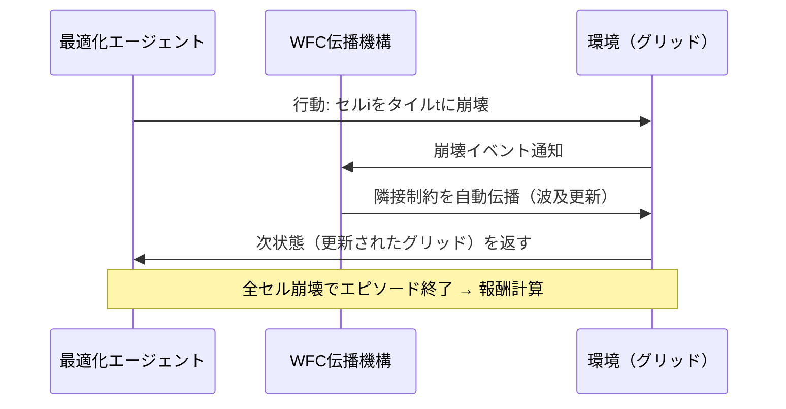
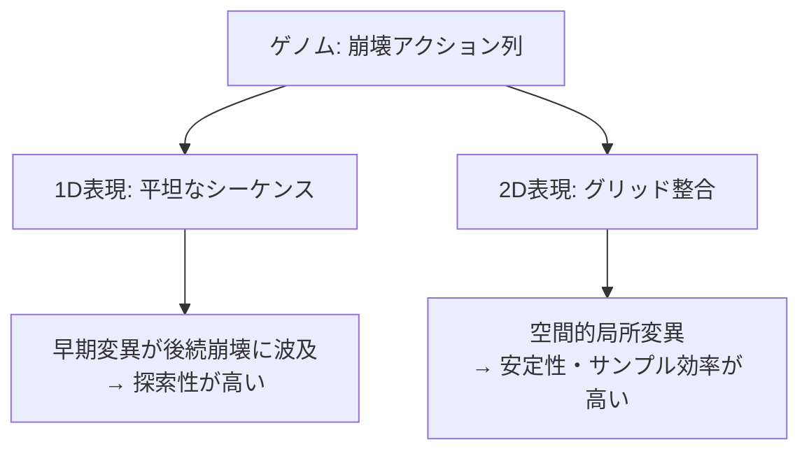
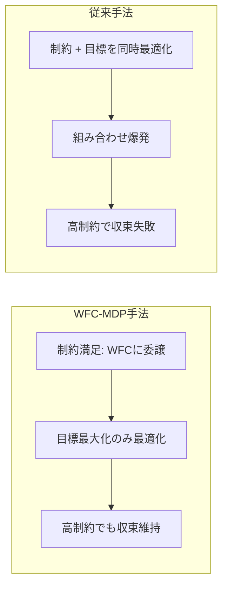

## はじめに

WaveFunctionCollapse（WFC）は、タイルセットの隣接制約をサンプル画像から自動学習し、視覚的に一貫したマップを生成するアルゴリズムです。
ゲーム開発では「見た目の良さ」と「ゲームプレイとしての正しさ」を両立させる必要があります。
しかし従来のWFCは、後者のグローバルな目標最適化が苦手です。

NYUの研究チームが2025年にEXAG（AIIDE Workshop）で発表した論文 ["A Markovian Framing of WaveFunctionCollapse"](https://arxiv.org/abs/2509.09919) は、WFCをMDP（マルコフ決定過程）として再定式化することでこの課題を解決しました。
**制約満足と目標最適化を明示的に分離する**というシンプルな原理が、収束信頼性とサンプル効率を劇的に改善します。

## WFCの課題: 制約ベース手法の限界

WFCは局所的な隣接制約の維持に優れています。
一方で、「パスの長さをPにする」「特定バイオームの面積を確保する」といったグローバル目標の最適化は非常に困難です。

従来のアプローチは、最適化アルゴリズム（進化計算など）にタイルの隣接制約も一緒に学習させようとしていました。
これが根本的な問題です。制約空間と目標空間を同時に探索しようとすると、組み合わせ爆発が起きます。

```text
【従来アプローチの問題】

最適化アルゴリズム
    ↓ 両方を同時に担当
    ├─ 隣接制約の学習（指数的に複雑）
    └─ グローバル目標の最大化

→ タスクが複雑になるほど収束率が急落
```

実験でも、目標パス長P≥70の高制約ドメインでは、従来の直接マップ進化（Baseline）の収束率はほぼ0%まで低下することが確認されています。

:::message alert
WFCに隣接制約を学習させることは、「すでに得意なことをもう一度やらせる」という二重の無駄です。WFC自体が伝播メカニズムで制約を自動的に保持できます。
:::

## MDP再定式化: WFCを強化学習で解く

論文のコアアイデアは、WFCの崩壊プロセスをMDPとして捉え直すことです。
最適化アルゴリズムは「どのセルをどのタイルに崩壊させるか」という行動列のみを担当します。
隣接制約の整合性維持はWFCの伝播機構に完全に委ねます。

### MDP定式化

$$
\mathcal{M} = (\mathcal{S}, \mathcal{A}, \mathcal{T}, \mathcal{R})
$$

| 要素 | 定義 | 詳細 |
|------|------|------|
| 状態空間 $\mathcal{S}$ | $\ell \times w$ のグリッド行列 | 崩壊済みセルはタイルインデックス $t_i$、未崩壊は $-1$ |
| 行動空間 $\mathcal{A}$ | $n_t$ 次元のロジットベクトル | 無効タイルはゼロマスク → argmaxで選択 |
| 遷移 $\mathcal{T}$ | WFC伝播メカニズム | 行動後にWFCが隣接制約を自動伝播 |
| 報酬 $\mathcal{R}$ | スパース報酬 | 終端状態のみ評価、矛盾発生時は $-1000$ |

全 $\ell \times w$ セルの崩壊でエピソード終了。これにより1エピソード = 1マップ生成となります。



### 2種類のゲノム表現

最適化には標準的な $\mu + \lambda$ 進化計算を使用します。
ゲノム（崩壊アクション列）の表現方法として2つのアプローチが提案されています。



:::message
1D表現は探索性に優れ、2D表現はサンプル効率に優れます。タスクの難易度に応じて使い分けることが推奨されています。
:::

## 実験結果: 分離戦略の有効性

論文では3つのドメインで実験が行われました。

### バイナリドメイン（パス長最適化）

目標パス長Pに対する収束率の比較です。

| 手法 | P=40 | P=60 | P=70 |
|------|------|------|------|
| **Evo 1D（MDP）** | **1.00** | **0.84** | **0.35** |
| Evo 2D（MDP） | 0.98 | 0.72 | 0.15 |
| Baseline（直接進化） | 0.95 | 0.16 | 0.01 |
| FI-2Pop | 0.84 | 0.08 | 0.00 |

P=60以上になると、MDP手法と非MDP手法の差は歴然です。
高制約ドメインほどMDP再定式化の優位性が際立ちます。

### ハイブリッドドメイン（最難タスク）

フィールド/バイナリの複合ドメインでは、非MDP手法はほぼ全てのターゲットパス長で収束に完全失敗しました。
一方、MDP-1Dはパス長60でも5%の収束を達成しています。



## 実装のポイントとUnityへの応用

論文ではOpenAI Gym互換の環境も提供されています。
Unityへの応用を考える場合、ML-Agentsと組み合わせた実装が現実的です。

### Unityでの実装方針

```csharp
// WFC-MDP環境の概念実装
public class WFCEnvironment : MonoBehaviour
{
    // 状態: グリッドの現在の崩壊状態
    private int[,] grid; // -1 = 未崩壊, >= 0 = タイルインデックス

    // 行動: エージェントからの崩壊指示を受け取る
    public void CollapseCell(int x, int y, int tileIndex)
    {
        // 1. 指定セルを崩壊
        grid[x, y] = tileIndex;

        // 2. WFC伝播: 隣接セルの候補を更新
        PropagateConstraints(x, y);

        // 3. 矛盾チェック（有効タイルが0のセルが存在するか）
        if (HasContradiction())
        {
            // 報酬: -1000 でエピソード終了
            EndEpisode(reward: -1000f);
        }
    }

    // 報酬はエピソード終了時のみ計算（スパース報酬）
    private float ComputeReward()
    {
        int pathLength = CalculateLongestPath();
        return -Mathf.Abs(pathLength - targetPathLength);
    }
}
```

### 実装上の注意点

| 項目 | 推奨設定 | 理由 |
|------|---------|------|
| 報酬設計 | スパース報酬 | 中間報酬は学習を不安定化させる |
| ゲノム表現 | 2D（安定重視）→1D（探索重視）| タスク難易度に応じて選択 |
| 矛盾時のペナルティ | $-1000$ | 早期終了を強く抑制 |
| エピソード長 | $\ell \times w$ ステップ固定 | 全セルが崩壊するまで |

:::message
WFCの矛盾（Contradiction）は学習の大きな障壁です。タイルセット設計段階で矛盾が起きにくい制約設計を行うことが、MDP実装成功の前提条件です。
:::

## まとめ

本論文の核心的な知見は「制約満足と目標最適化の明示的分離」です。

WFCが得意とする隣接制約の維持はWFCに任せ、最適化アルゴリズムはグローバル目標の最大化のみに集中する。
このシンプルな分離原理が、高制約ドメインでの収束信頼性とサンプル効率を劇的に改善します。

ゲーム開発の観点では、次のステップとして以下が考えられます。

- Unity ML-AgentsとWFCを組み合わせたプロトタイプ実装
- 進化計算に加えてPPO・SAC等のRLアルゴリズムとの比較
- 3Dボクセル空間への拡張（グリッドサイズの増大への対応）

PCGとRLの融合は2025年に急速に発展している分野です。
WFC-MDPフレームワークは、ゲームデザイナーの意図をグローバル目標として定式化し、AIに学習させるための有力な基盤となるでしょう。

---

**AIキャラクター開発に興味がある方へ**

https://coconala.com/services/3327092

https://coconala.com/services/2610064
