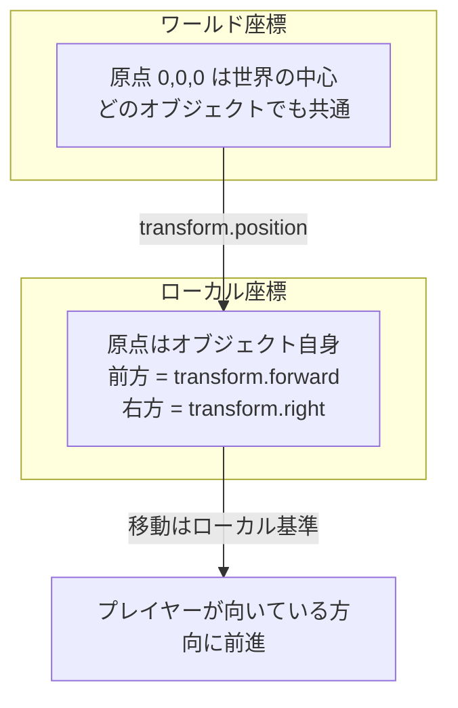
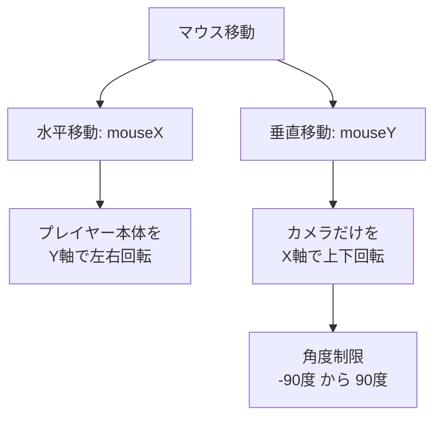

# Unityでつくる

## PlayerControllerスクリプトの更新

::: details PlayerController (コピペ用)

まず、PlayerControllerを以下のコードに更新します。

```csharp:PlayerController
using UnityEngine;
using UnityEngine.InputSystem;

public class PlayerController : MonoBehaviour
{
    private Vector2 moveInput;   // 移動の入力値
    private Vector2 lookInput;   // 視点操作の入力値

    public float speedForward = 5f;  // 前後移動の速度
    public float speedSideways = 5f; // 左右移動の速度

    public float minX = -20f;       // カメラの上下回転の最小角度
    public float maxX = 40f;        // カメラの上下回転の最大角度
    public float sensitivityX = 1f; // 水平方向の感度
    public float sensitivityY = 1f; // 垂直方向の感度

    public Camera camera;           // プレイヤーのカメラ

    void Update()
    {
        HandlePlayerMovement();  // プレイヤーの移動
        HandleCameraRotation();  // カメラの回転
    }

    // InputActionの移動入力を取得
    public void OnMove(InputAction.CallbackContext context)
    {
        moveInput = context.ReadValue<Vector2>();
    }

    // InputActionの視点入力を取得
    public void OnLook(InputAction.CallbackContext context)
    {
        lookInput = context.ReadValue<Vector2>();
    }

    // プレイヤーの移動処理
    private void HandlePlayerMovement()
    {
        // プレイヤーの移動量を計算
        Vector3 direction = transform.forward * moveInput.y * speedForward + transform.right * moveInput.x * speedSideways;

        // プレイヤーの移動を実行
        transform.position += direction * Time.deltaTime;
    }

    // カメラの回転処理
    private void HandleCameraRotation()
    {
        // 入力値をもとに回転量を計算
        float yRot = lookInput.y * sensitivityY;
        float xRot = lookInput.x * sensitivityX;

        // プレイヤーとカメラの回転を計算
        Quaternion playerRot = transform.localRotation;
        Quaternion cameraRot = camera.transform.localRotation;

        playerRot *= Quaternion.Euler(0, xRot, 0);        // 水平回転
        cameraRot *= Quaternion.Euler(-yRot, 0, 0);       // 垂直回転
        cameraRot = ClampRotation(cameraRot);             // 上下角度を制限

        transform.localRotation = playerRot;
        camera.transform.localRotation = cameraRot;
    }

    // カメラの回転を制限する
    private Quaternion ClampRotation(Quaternion q)
    {
        q.x /= q.w;
        q.y /= q.w;
        q.z /= q.w;
        q.w = 1;

        float angleX = 2 * Mathf.Rad2Deg * Mathf.Atan(q.x);
        angleX = Mathf.Clamp(angleX, minX, maxX);
        q.x = Mathf.Tan(0.5f * Mathf.Deg2Rad * angleX);

        return new Quaternion(q.x, 0, 0, 1);
    }
}
```
:::

## PlayerControllerスクリプトの変数の設定

次に、PLAYERゲームオブジェクトを選択し、インスペクターで以下の手順を行います。**これは、キー入力があった際にPlayerControllerスクリプトのOnMoveメソッドが呼び出されるように設定するためです**。


# Unityで動かす


# Unityを理解する

続いて、先ほど実装したプログラムを順を追って解説します。とりあえず完成させたい方は、この部分をスキップしていただいても問題ありません！

## Playerに必要なことをまとめる

まず、Playerに必要な要素を整理します。Playerキャラクターには以下の機能が必要です。
- **移動**：方向キーやジョイスティックでの移動操作
- **視点**：マウスやジョイスティックでの視点操作

これらの機能をPlayerControllerスクリプトに実装します。

## PlayerControllerスクリプトの記述

Playerの移動操作・視点操作を実装するためのスクリプトを作成します。

## 1.移動操作

前回は、以下のコードでプレイヤーの移動量を計算しました。

```csharp:PlayerController
Vector3 direction = new Vector3(moveInput.x, 0, moveInput.y);
Debug.Log($"{direction}の方向へ移動します");
```

このコードでは、移動入力（W、A、S、Dキーやスティック操作）に応じてプレイヤーが移動するように見えますが、**視点の方向を考慮していないため、以下のような問題が発生します**。

### 問題例

**1.レイヤーが後ろを向いている状態で「前入力」を押すと、視点に関係なく「前方向」に進む。
2.本来であれば、後ろを向いているときに「前入力」を押した場合は、プレイヤー視点で前方向＝後ろ方向（絶対座標での後ろ方向）に進むべきです。**

:::message
この問題を解決するために、「Transform」について理解して、「ローカル座標(相対座標)」を使用してプレイヤーの視点に基づいた移動を実現します。
:::

### Transformについて

**座標を理解するためには、UnityのTransformコンポーネントについて学ぶことが重要です**

Transformコンポーネントは、UnityにおけるすべてのGameObjectに必ず付属している重要なコンポーネントです。主に、オブジェクトの位置 (Position)、回転 (Rotation)、スケール (Scale) を管理します。

**この情報を操作することで、オブジェクトの動きや形状の変化を実現できます。**

•	位置 (Position): オブジェクトのワールド空間またはローカル空間での座標を表します。
•	回転 (Rotation): オブジェクトの向きを表します。QuaternionまたはEuler角度で操作可能です。
•	スケール (Scale): オブジェクトのサイズを表します。通常はVector3で管理されます。

#### もっと具体的に説明！

以下のコードは、Transformコンポーネントを利用してオブジェクトの位置、回転、スケールを操作する例です。

```csharp:Day4
using UnityEngine;

public class Day4 : MonoBehaviour
{
    void Start()
    {
        // オブジェクトの位置を設定
        transform.position = new Vector3(0, 1, 0); // ワールド座標(0, 1, 0)に移動

        // オブジェクトの回転を設定
        transform.rotation = Quaternion.Euler(0, 45, 0); // ワールド空間でY軸に45度回転

        // オブジェクトのスケールを設定
        transform.localScale = new Vector3(2, 2, 2); // サイズを2倍に拡大
    }
}
```

### ワールド座標(絶対座標)とローカル座標(相対座標)

#### ワールド座標(絶対座標)

**ワールド座標は、シーン全体の基準となる座標系を指します**。シーン内での絶対的な位置を表現し、シーンに存在するすべてのオブジェクトがこの基準に基づいて配置されます。
•	基準点: シーンの中心 (0, 0, 0)
•	用途: オブジェクトがシーン内でどの位置にあるかを決定するために使用
•	例: プレイヤーが (10, 5, 0) の位置にいる場合、これはシーン全体に対しての位置を指します。

```csharp:ワールド座標
Vector3 worldPosition = transform.position;
Debug.Log("ワールド座標: " + worldPosition);
```

#### ローカル座標(相対座標)

**ローカル座標は、親オブジェクトを基準にした相対的な位置を指します**。オブジェクトが親オブジェクトを持つ場合、その位置は親オブジェクトの座標系に基づいて表現されます。
•	基準点: 親オブジェクトの位置 (0, 0, 0 として扱われる)
•	用途: 親オブジェクトに対する子オブジェクトの相対的な配置を管理
•	例: プレイヤーが車の中にいる場合、車を基準としたプレイヤーの位置がローカル座標です。

```csharp:ローカル座標
Vector3 localPosition = transform.localPosition;
Debug.Log("ローカル座標: " + localPosition);
```

:::message
FPSゲームでは、プレイヤー視点に基づいた移動（相対座標）を用いる必要があります。
:::



### ローカル座標(相対座標)を用いた移動計算

ローカル座標(相対座標)を用いた移動を実現するには、以下の計算を行います。

```csharp
Vector3 direction = プレイヤー前方向 * 前後入力値 + プレイヤー横方向 * 左右入力値;
```

これをコードで表すと以下のようになります。

```csharp
Vector3 direction = transform.forward * moveInput.y + transform.right * moveInput.x;
```

> transform.forward: プレイヤーが向いている前方向（相対座標の前方向）。
> transform.right: プレイヤーが向いている横方向（相対座標の右方向）。
> moveInput: 入力値（W、A、S、Dキーやスティック操作）。

### スピード設定を加えた移動計算

**さらに、移動速度を加えて調整可能にします。**

```csharp
Vector3 direction = transform.forward * moveInput.y * speedForward + transform.right * moveInput.x * speedSideways;
```

>speedForward: 前後方向の移動速度。
>speedSideways: 左右方向の移動速度。

走る（Shiftキー）やしゃがむ（Cキー）など、速度を変化させる操作を実装する際も、これらの変数を動的に変更することで対応可能です。**例えば、しゃがむ動作では、speedForwardやspeedSidewaysを低い値に設定することでスピードを抑えることができます**。

### プレイヤーの位置に反映

**計算した移動量を現在の座標に加算して、プレイヤーの位置を更新します。**

```csharp
transform.position += direction * Time.deltaTime;
```

>Time.deltaTime: フレームレートに依存しない移動を実現するための調整。

### 完成したコード

以下は、上記を組み合わせた移動処理のコードです。

```csharp:PlayerController
private Vector2 moveInput;

public float speedForward = 5f;  // 前後移動の速度

public float speedSideways = 5f; // 左右移動の速度

void Update()
{
    HandlePlayerMovement();
}

// プレイヤーの移動処理
private void HandlePlayerMovement()
{
    // プレイヤーの移動方向を計算（相対座標を使用）
    Vector3 direction = transform.forward * moveInput.y * speedForward + transform.right * moveInput.x * speedSideways;

    // 現在の位置に移動量を加算して更新
    transform.position += direction * Time.deltaTime;
}
```

### 実行例

プレイヤーが現在座標(1, 0, 2)にいて、移動量が計算されると以下のように位置が更新されます。

•	現在の座標: (1, 0, 2)
•	計算された移動量: (1, 0, 1)

次のフレームでは、新しい座標は(2, 0, 3)になります。

## 2.視点操作

視点操作は移動操作よりも複雑です。少し数学が絡みますが、詳しい仕組みを理解しなくても、コードをそのままコピーして実装するだけで動かすことができます。

### 入力値を取得

移動操作と同様に、context.ReadValue<Vector2>()を使用して視点操作の入力値を取得します。この値をlookInputとして保持し、Updateメソッドで回転処理を行います。

```csharp:PlayerController
using UnityEngine;
using UnityEngine.InputSystem;

public class PlayerController : MonoBehaviour
{
    private Vector2 lookInput;   // 視点操作の入力値

    // 視点操作の入力を取得
    public void OnLook(InputAction.CallbackContext context)
    {
        lookInput = context.ReadValue<Vector2>();
    }

    private void Update()
    {
        // 視点操作
    }
}
```

### 入力値をもとに回転量を計算

視点操作の入力値（lookInput）を基に、水平方向と垂直方向の回転量を計算します。この際、感度を調整するための変数を使用します。

さらに、Updateメソッド内に視点操作のコードを直接記述すると、コードの可読性が低下するため、視点操作専用の関数を新たに作成し、その中に記述するようにします。

>例：感度が高いほど、マウスを少し動かすだけで大きく回転します。

```diff csharp
using UnityEngine;
using UnityEngine.InputSystem;

public class PlayerController : MonoBehaviour
{
    private Vector2 lookInput;   // 視点操作の入力値

    public float sensitivityX = 1f; // 水平方向の感度
    public float sensitivityY = 1f; // 垂直方向の感度

    // 視点操作の入力を取得
    public void OnLook(InputAction.CallbackContext context)
    {
        lookInput = context.ReadValue<Vector2>();
    }

    private void Update()
    {
+        HandleCameraRotation();  // カメラの回転
    }

    // カメラの回転処理
    private void HandleCameraRotation()
    {
        // 入力値をもとに回転量を計算
+        float yRot = lookInput.y * sensitivityY;
+        float xRot = lookInput.x * sensitivityX;
    }
}
```

### 現在の回転状態を取得

次に、現在のプレイヤーとカメラの回転状態を取得します。この情報を基に、プレイヤーとカメラの回転を計算します。

```csharp
Quaternion playerRot = transform.localRotation; // プレイヤーの回転状態を取得
Quaternion cameraRot = camera.transform.localRotation; // カメラの回転情報を取得
```

これらの情報を基に次の回転を計算します。

### 回転量の計算と適用

Quaternion.Eulerを使用して回転量を計算し、現在の回転に加算します。最後に、各々の回転値を更新して、視点操作完了です。

```csharp
playerRot *= Quaternion.Euler(0, xRot, 0);        // 水平方向の回転
cameraRot *= Quaternion.Euler(-yRot, 0, 0);       // 垂直方向の回転

transform.localRotation = playerRot; // 水平方向の回転の適用
camera.transform.localRotation = cameraRot; // 垂直方向の回転の適用
```

ここで、プレイヤーを垂直方向に回転させない理由について疑問に思うかもしれませんが、垂直方向にプレイヤー全体を回転させると、キャラクターが倒れるような不自然な動きになってしまいます。

現実世界での動きを考えると、水平方向の回転では体全体を回しますが、垂直方向の回転は首を動かして視点を調整します。これに倣い、プレイヤーの回転は水平方向のみ、垂直方向の回転はプレイヤーの子オブジェクトであるカメラを動かす形で実装します。



```diff csharp:PlayerController
using UnityEngine;
using UnityEngine.InputSystem;

public class PlayerController : MonoBehaviour
{
    private Vector2 lookInput;   // 視点操作の入力値

    public float sensitivityX = 1f; // 水平方向の感度
    public float sensitivityY = 1f; // 垂直方向の感度

+   public Camera camera; // プレイヤーのカメラ

    // 視点操作の入力を取得
    public void OnLook(InputAction.CallbackContext context)
    {
        lookInput = context.ReadValue<Vector2>();
    }

    private void Update()
    {
+        HandleCameraRotation();  // カメラの回転
    }

    // カメラの回転処理
    private void HandleCameraRotation()
    {
        // 入力値をもとに回転量を計算
        float yRot = lookInput.y * sensitivityY;
        float xRot = lookInput.x * sensitivityX;

        // プレイヤーとカメラの回転を計算
+        Quaternion playerRot = transform.localRotation;
+        Quaternion cameraRot = camera.transform.localRotation;

+        playerRot *= Quaternion.Euler(0, xRot, 0);         // 水平回転
+        cameraRot *= Quaternion.Euler(-yRot, 0, 0);       // 垂直回転

+        transform.localRotation = playerRot;
+        camera.transform.localRotation = cameraRot;
    }
}
```

### 垂直方向の回転を制限

ここで、完成としたいところですが、一つだけ問題点があります。それは、現実世界では、垂直方向に首が一回転することはありません。そのため、回転する角度に制限をつける必要性があります。

ここは、数学の部分になるため、詳細は割愛致しますが、下記のClampRotation関数の引数に垂直方向の回転を渡すことで、返り値として、制限された角度を取得できます。

```csharp
cameraRot = ClampRotation(cameraRot);
```

### 完成したコード

```diff csharp
using UnityEngine;
using UnityEngine.InputSystem;

public class PlayerController : MonoBehaviour
{
    private Vector2 lookInput;   // 視点操作の入力値

    public float speedForward = 5f;  // 前後移動の速度

    public float speedSideways = 5f; // 左右移動の速度
    
+    public float minX = -20f;       // カメラの上下回転の最小角度

+    public float maxX = 40f;        // カメラの上下回転の最大角度

    public float sensitivityX = 1f; // 水平方向の感度

    public float sensitivityY = 1f; // 垂直方向の感度

    public Camera camera;           // プレイヤーのカメラ

    // 視点操作の入力を取得
    public void OnLook(InputAction.CallbackContext context)
    {
        lookInput = context.ReadValue<Vector2>();
    }

    void Update()
    {
        HandleCameraRotation();  // カメラの回転
    }

    // カメラの回転処理
    private void HandleCameraRotation()
    {
        // 入力値をもとに回転量を計算
        float yRot = lookInput.y * sensitivityY;
        float xRot = lookInput.x * sensitivityX;

        // プレイヤーとカメラの回転を計算
        Quaternion playerRot = transform.localRotation;
        Quaternion cameraRot = camera.transform.localRotation;

        playerRot *= Quaternion.Euler(0, xRot, 0);        // 水平回転
        cameraRot *= Quaternion.Euler(-yRot, 0, 0);       // 垂直回転
+        cameraRot = ClampRotation(cameraRot);            // 上下角度を制限

        transform.localRotation = playerRot;
        camera.transform.localRotation = cameraRot;
    }

    // カメラの回転を制限する
+    private Quaternion ClampRotation(Quaternion q)
+    {
+        q.x /= q.w;
+        q.y /= q.w;
+        q.z /= q.w;
+        q.w = 1;

+        float angleX = 2 * Mathf.Rad2Deg * Mathf.Atan(q.x);
+        angleX = Mathf.Clamp(angleX, minX, maxX);
+        q.x = Mathf.Tan(0.5f * Mathf.Deg2Rad * angleX);

+        return new Quaternion(q.x, 0, 0, 1);
+    }
}
```

## 完成したコード

以下は、視点操作と移動操作を組み合わせたスクリプトです。

```csharp:PlayerController
using UnityEngine;
using UnityEngine.InputSystem;

public class PlayerController : MonoBehaviour
{
    private Vector2 moveInput;   // 移動の入力値
    private Vector2 lookInput;   // 視点操作の入力値

    public float speedForward = 5f;  // 前後移動の速度
    public float speedSideways = 5f; // 左右移動の速度

    public float minX = -20f;       // カメラの上下回転の最小角度
    public float maxX = 40f;        // カメラの上下回転の最大角度
    public float sensitivityX = 1f; // 水平方向の感度
    public float sensitivityY = 1f; // 垂直方向の感度

    public Camera camera;           // プレイヤーのカメラ

    void Update()
    {
        HandlePlayerMovement();  // プレイヤーの移動
        HandleCameraRotation();  // カメラの回転
    }

    // InputActionの移動入力を取得
    public void OnMove(InputAction.CallbackContext context)
    {
        moveInput = context.ReadValue<Vector2>();
    }

    // InputActionの視点入力を取得
    public void OnLook(InputAction.CallbackContext context)
    {
        lookInput = context.ReadValue<Vector2>();
    }

    // プレイヤーの移動処理
    private void HandlePlayerMovement()
    {
        // プレイヤーの移動量を計算
        Vector3 direction = transform.forward * moveInput.y * speedForward + transform.right * moveInput.x * speedSideways;

        // プレイヤーの移動を実行
        transform.position += direction * Time.deltaTime;
    }

    // カメラの回転処理
    private void HandleCameraRotation()
    {
        // 入力値をもとに回転量を計算
        float yRot = lookInput.y * sensitivityY;
        float xRot = lookInput.x * sensitivityX;

        // プレイヤーとカメラの回転を計算
        Quaternion playerRot = transform.localRotation;
        Quaternion cameraRot = camera.transform.localRotation;

        playerRot *= Quaternion.Euler(0, xRot, 0);        // 水平回転
        cameraRot *= Quaternion.Euler(-yRot, 0, 0);       // 垂直回転
        cameraRot = ClampRotation(cameraRot);             // 上下角度を制限

        transform.localRotation = playerRot;
        camera.transform.localRotation = cameraRot;
    }

    // カメラの回転を制限する
    private Quaternion ClampRotation(Quaternion q)
    {
        q.x /= q.w;
        q.y /= q.w;
        q.z /= q.w;
        q.w = 1;

        float angleX = 2 * Mathf.Rad2Deg * Mathf.Atan(q.x);
        angleX = Mathf.Clamp(angleX, minX, maxX);
        q.x = Mathf.Tan(0.5f * Mathf.Deg2Rad * angleX);

        return new Quaternion(q.x, 0, 0, 1);
    }
}
```
:::message
**注意点**
カメラ操作がカクつく場合は、Update関数ではなく、FixedUpdate関数を使うことで、物理演算や滑らかなカメラ移動が実現しやすくなります。

FixedUpdateは一定間隔で呼ばれるため、キャラクターの移動やカメラの追従など物理的な処理との同期が取りやすく、結果的に映像が安定します。

```csharp
void FixedUpdate()
{
    HandleCameraRotation();  // カメラの回転
}
```
:::