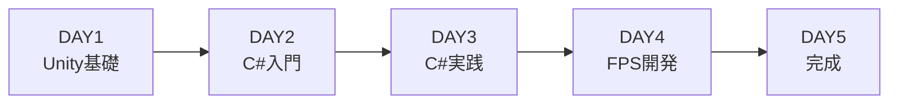

## 「Unityで”自分だけのゲーム”を完成させたい人へ」最短5日でゲームが作れる超実践書、できました。

こんにちは、ゲーム開発所RYURYUのりゅうやです。

## いきなりですが、独学でUnityをマスターしたいと思いませんか？

**「自分でゲームを作ってみたい！」**
**「プログラミングスキルを本格的に身につけたい！」**
そう思って始めても、独学だと続けるのが意外と難しいものです。

## どうして独学が難しく感じるのでしょう？ それは…

1. **目標や方向性がはっきりしていない**
2. **分からない部分をそのままにしちゃう**
3. **最初からハードルが高すぎる目標に挑んでしまう**

## 実は、私もまったく同じ壁にぶつかっていました。

Webや書籍、YouTubeなどをつまみ食い的に調べては挫折の繰り返し…

情報がバラバラで体系的に理解できず、頼れるメンターもいない
結果的に「どこから手をつければいいんだろう？」と迷走し、時間だけが過ぎていった…

## でも——その試行錯誤を乗り越えたからこそ。

私は今、Unityのプロ講師として実績を積み、
短期間で成果を出すためのポイントを体系化できるようになりました

## そして、その経験を”1冊”に凝縮しました！

ここまでの学習法や実践ノウハウを、
初心者でもわかりやすくまとめた書籍を作成しました。

「体系的に学びたい！」
「遠回りせず最短でスキルを身につけたい！」

そんなあなたに、この機会にUnity習得へチャレンジしてもらえたら嬉しいです

:::details 目次
01　5日後、あなたのPCでFPSゲームが動く

02　Unity6 -- 無料で使える世界最強のゲームエンジン

03　ゲームで稼ぐ4つの方法

04　Unity6を10分でセットアップ

05　まず日本語に -- 3クリックで完了

06　完成版FPSを先に動かしてみよう

07　DAY1 基礎 | Unityエディタの全体像をつかむ

08　DAY1 確認テスト | ここまでの理解度チェック

09　DAY1 ハンズオン | 3Dオブジェクトを自在に操る

10　DAY1 チャレンジ | 自分だけの3Dシーンを作れ

11　DAY2 基礎 | ポケモンで覚えるC#の考え方

12　DAY2 確認テスト | 変数・型・関数を総ざらい

13　DAY2 ハンズオン | 初めてのスクリプトをUnityで動かす

14　DAY2 チャレンジ | ポケモンの動きをコードで再現しろ

15　応用 | 命名だけで差がつく！変数名のルール

16　DAY3 基礎 | if文・ループ・Raycastで戦闘の土台を組む

17　DAY3 確認テスト | 条件分岐と繰り返しのおさらい

18　DAY3 ハンズオン | WASDで歩くプレイヤーを作る

19　DAY3 チャレンジ | 当たり判定とアイテム収集を実装しろ

20　DAY4 ハンズオン | FPS視点カメラとマウス操作

21　DAY4 チャレンジ1 | ダッシュとジャンプを追加しろ

22　DAY4 ハンズオン | 銃を撃て！Raycastで射撃システム

23　DAY4 チャレンジ2 | フィールドを自分好みに改造しろ

24　DAY5 ハンズオン | 撃って壊せるターゲットとスコア表示

25　DAY5 チャレンジ | ターゲットをゾンビに差し替えろ

26　DAY5 ハンズオン | GameManagerでゲーム全体を制御する

27　おわりに -- ここからがスタートライン

28　応用 | 現場で使えるC#テクニック14選

29　あとがき
:::
https://zenn.dev/ryuryu_game/books/fd28de9d8e963a

## 書籍の”ここがスゴい！”5つのポイント

#### ① 経験をまるっと凝縮！
Unityを勉強する中で「こういう順番でやればよかった…」って後悔、ありませんか？
この書籍では、そんな実体験から得たベストな流れを、ムダなくギュッと詰め込んでます。最短ルートでスキルを身につけたい人にはめちゃくちゃおすすめです。

#### ② 圧倒的な情報量（だけど、読みやすい）
なんと総文字数14万字超え！
といっても、ただ量が多いだけじゃなくて、深く・わかりやすく・本質的な解説を意識しています。「ここが知りたかった！」ってところに手が届く感じ。

#### ③ 手順が直感でわかる！GIFでの解説
「文字だけだと、イマイチ動きがイメージできない…」
そんな声に応えて、要所でGIFアニメを使って直感的に説明しています。読んで → 見て → すぐやってみる、の流れが超スムーズです。

## 書籍を買うとついてくる！2つの豪華特典
### 特典①：完成プロジェクトのサンプル付き！

### 特典②：みんなで進捗共有できるDiscordコミュニティに参加OK！

#### 【▼ 書籍のご購入はこちら ▼】  
https://zenn.dev/ryuryu_game/books/fd28de9d8e963a

## 教えるのは、実績のある現役講師！

## 実際の受講者の声もご紹介！
※ 以下はココナラのUnityサポートのレビューです。

## チュートリアルも”ずっと進化中”です！

Unityのバージョンアップや受講者の声をもとに、教材もどんどんアップデートしています。
流行りの技術や現場の視点を取り入れて、常に「今のUnity学習」にフィットした内容に。

## こんな方におすすめ！

初心者から中級者まで幅広く対応！  
**難しすぎず、でも浅くもない内容で、確かな実力を身につけましょう。**

- 将来、ゲーム開発を目指す中高生
- 趣味で制作を楽しみたい大学生
- リスキリングやスキルアップを狙う学生・社会人

「やってみたいけど、何から始めたらいいかわからない」
そんな気持ちがあれば、この書籍が最短ルートになります！

## スタートを切るなら、”今”がベスト！

「また途中でやめちゃうかも…」って思ってても大丈夫。
一人じゃない環境なら、前に進めるし、ちゃんとやり切れます。
この一歩が、未来のあなたを作る第一歩です。

#### 今こそ「自分にもゲームが作れた！」という感動を。Unity学習の最初の一歩、一緒に踏み出しましょう！  
https://zenn.dev/ryuryu_game/books/fd28de9d8e963a