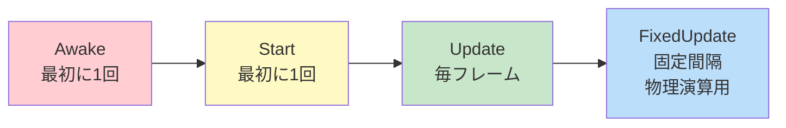

#### Unityでよく使われるC#プログラム14選です。オリジナルのゲーム開発にぜひ活用してみてください！

下記では、Unity初心者が学習を進める中で特に役立つ14個のコード例を、ジャンル別に紹介します。

オブジェクトの生成と破壊、シーンの切り替えやコルーチンを使った待機処理など、定番の機能を一つひとつ押さえることで、

あなたのゲーム制作がぐっとスムーズになるはずです。ぜひ、コードを参考にしながら実際のプロジェクトで試してみてください。

:::message
本記事で掲載しているサンプルコードは、解説の明快さを重視するため、Unityの新しいInputSystemではなく、従来のInputManagerを使用しています。
:::

:::details InputManagerとは？
**InputManagerは、Unityで古くから利用されてきた標準の入力管理システムです。**

キーボードやマウス、ゲームパッドなどからの入力を、「Horizontal」や「Vertical」など、あらかじめ設定した軸名（Axis）やボタン名を使って取得する仕組みを採用しています。
:::

## 1.ライフサイクル・イベント関連

### `Awake()` / `Start()` / `Update()` / `FixedUpdate()`

これらはMonoBehaviourを継承したスクリプトで使える基本的なイベントメソッドです。



```csharp
using UnityEngine;

public class LifeCycleExample : MonoBehaviour
{
    void Awake()
    {
        Debug.Log("Awake: オブジェクト有効化直後1回");
    }

    void Start()
    {
        Debug.Log("Start: 初フレーム前1回");
    }

    void Update()
    {
        Debug.Log("毎フレーム");
    }

    void FixedUpdate()
    {
        // 一定時間間隔で呼ばれ、物理演算に適している
        // 物理オブジェクト更新など
    }
}
```

### `OnTriggerEnter()`での衝突検知

```csharp
using UnityEngine;

public class TriggerExample : MonoBehaviour
{
    private void OnTriggerEnter(Collider other)
    {
        if (other.CompareTag("Item"))
        {
            Debug.Log("アイテム取得！");
            Destroy(other.gameObject); // アイテムを消去
        }
    }
}
```

## 2.オブジェクト生成・破壊・取得

### `Instantiate()`と`Destroy()`

```csharp
using UnityEngine;

public class SpawnExample : MonoBehaviour
{
    public GameObject enemyPrefab; 
    public Transform spawnPoint;

    void Start()
    {
        // ゲーム開始時に敵を生成
        GameObject enemy = Instantiate(enemyPrefab, spawnPoint.position, spawnPoint.rotation);
        
        // 5秒後に敵を破壊する例
        Destroy(enemy, 5f);
    }
}
```

### `GetComponent<T>()`でコンポーネント取得

```csharp
using UnityEngine;

public class GetComponentExample : MonoBehaviour
{
    void Start()
    {
        Rigidbody rb = GetComponent<Rigidbody>();
        if (rb != null)
        {
            rb.useGravity = false;
        }
    }
}
```

## 3.トランスフォーム操作・移動・回転

```csharp
using UnityEngine;

public class MoveRotateExample : MonoBehaviour
{
    public float moveSpeed = 5f;

    void Update()
    {
        // 前方へ移動
        transform.Translate(Vector3.forward * moveSpeed * Time.deltaTime);

        // Y軸回りに1度ずつ回転
        transform.Rotate(0f, 1f, 0f);
    }
}
```

## 4.時間関連：`Time.deltaTime`

```csharp
using UnityEngine;

public class DeltaTimeExample : MonoBehaviour
{
    public float speed = 3f;

    void Update()
    {
        // deltaTimeを掛けてフレームレートに依存しない速度に
        transform.Translate(Vector3.right * speed * Time.deltaTime);
    }
}
```

## 5.物理・Raycast・Rigidbody

### Raycastで前方に光線判定

```csharp
using UnityEngine;

public class RaycastExample : MonoBehaviour
{
    void Update()
    {
        Ray ray = new Ray(transform.position, transform.forward);
        RaycastHit hit;

        if (Physics.Raycast(ray, out hit, 100f))
        {
            Debug.Log("前方に" + hit.collider.gameObject.name + "がある");
        }
    }
}
```

### `Rigidbody`で物理的な動き

```csharp
using UnityEngine;

public class RigidbodyExample : MonoBehaviour
{
    public float force = 500f;
    Rigidbody rb;

    void Start()
    {
        rb = GetComponent<Rigidbody>();
    }

    void Update()
    {
        if (Input.GetKeyDown(KeyCode.F))
        {
            // 前方へ力を加えてオブジェクトを動かす
            rb.AddForce(transform.forward * force);
        }
    }
}
```

## 6.シーン管理：`SceneManager.LoadScene()`

```csharp
using UnityEngine;
using UnityEngine.SceneManagement;

public class SceneChangeExample : MonoBehaviour
{
    void Update()
    {
        // "GameScene" というシーン名に切り替え
        if (Input.GetKeyDown(KeyCode.Return))
        {
            SceneManager.LoadScene("GameScene");
        }
    }
}
```

## 7.コルーチン・待機処理：`StartCoroutine()` / `WaitForSeconds()`

```csharp
using UnityEngine;
using System.Collections;

public class CoroutineExample : MonoBehaviour
{
    void Start()
    {
        StartCoroutine(SpawnEnemies());
    }

    IEnumerator SpawnEnemies()
    {
        while (true)
        {
            // 敵を生成（仮）
            Debug.Log("敵生成!");
            yield return new WaitForSeconds(3f); // 3秒待つ
        }
    }
}
```

## 8.カメラ・座標変換：`Camera.main` / `Camera.ScreenToWorldPoint()`

```csharp
using UnityEngine;

public class CameraExample : MonoBehaviour
{
    void Update()
    {
        // マウスのスクリーン座標を取得
        Vector3 mouseScreenPos = Input.mousePosition;

        // カメラを通じてワールド座標へ変換
        Vector3 mouseWorldPos = Camera.main.ScreenToWorldPoint(new Vector3(mouseScreenPos.x, mouseScreenPos.y, 10f));
        Debug.Log("マウスワールド座標:" + mouseWorldPos);
    }
}
```

## 9.数学・補助機能：`Mathf.Lerp()` / `Random.Range()`

```csharp
using UnityEngine;

public class MathExample : MonoBehaviour
{
    public Vector3 pointA = Vector3.zero;
    public Vector3 pointB = new Vector3(10, 0, 0);
    float t = 0f;

    void Update()
    {
        t += Time.deltaTime * 0.5f; // 0～1間でゆっくり増える
        Vector3 currentPos = Vector3.Lerp(pointA, pointB, t);
        transform.position = currentPos;

        if (Input.GetKeyDown(KeyCode.R))
        {
            float rand = Random.Range(0f, 1f);
            Debug.Log("ランダム値:" + rand);
        }
    }
}
```

## 10.簡易的データ保存：`PlayerPrefs`

```csharp
using UnityEngine;

public class PlayerPrefsExample : MonoBehaviour
{
    void Start()
    {
        // スコア保存
        PlayerPrefs.SetInt("HighScore", 100);
        PlayerPrefs.Save();

        // スコア読込
        int score = PlayerPrefs.GetInt("HighScore", 0);
        Debug.Log("保存されたスコア:" + score);
    }
}
```

## 11.状態管理・タグ利用：`SetActive()` / `CompareTag()`

```csharp
using UnityEngine;

public class TagActiveExample : MonoBehaviour
{
    public GameObject uiPanel;

    void Update()
    {
        // PキーでUIの表示/非表示を切り替え
        if (Input.GetKeyDown(KeyCode.P))
        {
            uiPanel.SetActive(!uiPanel.activeSelf);
        }
    }

    void OnTriggerEnter(Collider other)
    {
        if (other.CompareTag("Enemy"))
        {
            Debug.Log("敵が範囲に入った!");
        }
    }
}
```