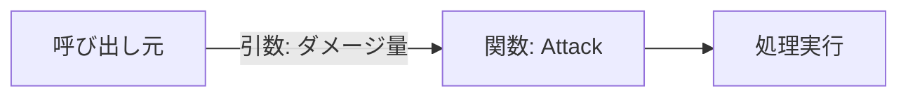
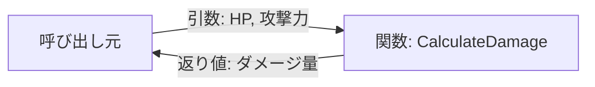
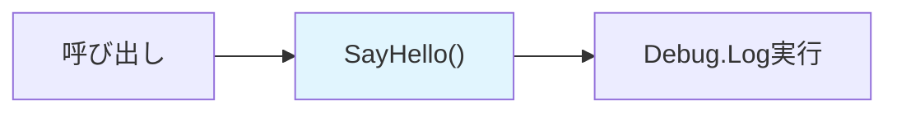
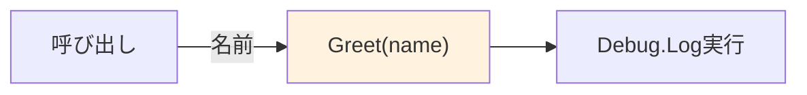
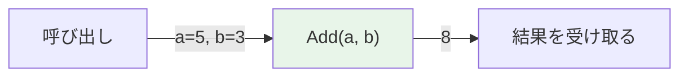
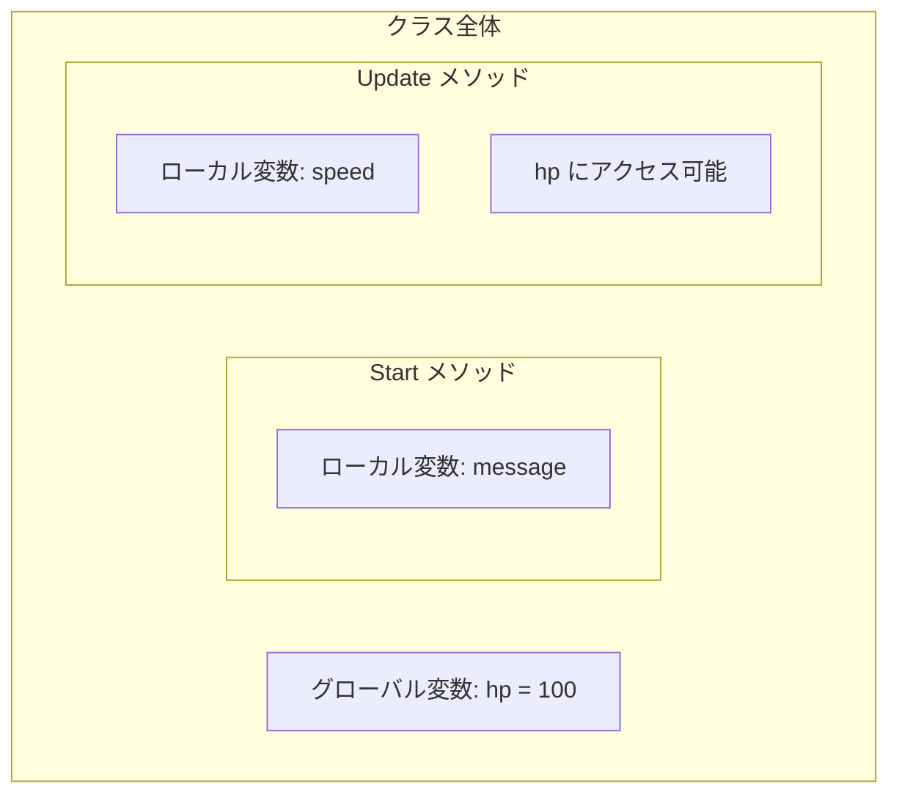

# スクリプトを楽しく学ぼう！ポケモンの世界で実践解説

プログラミングやスクリプトという言葉を聞くと、「難しそう」「専門的すぎる」と感じるかもしれません。ですが、実は私たちの身近なゲームや日常生活に、スクリプトの考え方がたくさん使われています。

今回は、人気ゲーム「ポケモン」を例に挙げて、スクリプトを 「いつ」「どうしたら」「何をするのか?」 の3つの要素に分けて解説します。これにより、スクリプトの仕組みがより理解しやすくなるでしょう！

# プログラムの基本！『いつ・どうしたら・何をするのか』をポケモンで解説

スクリプトは次の3つの要素に分けて考えると分かりやすくなります。

**1.「いつ」 - 何かが起こったとき**
スクリプトが実行されるタイミングやきっかけを指します。これを「トリガー」と呼びます。

**2.「どうしたら」 - 状況や条件**
その時に特定の条件を満たしているかどうかを確認し、次に進むべきかを判断します。

**3.「何をするのか?」 - 実行される処理**
条件が満たされた場合に行われる具体的なアクションや動作です。

#### ポケモンの例として「ピカチュウのバトルでの行動」を考えてみましょう。

| **要素**            | **説明**                                                                                   |
|--------------------|---------------------------------------------------------------------------------------|
| **「いつ」**       | トレーナーが「技を使って！」と指示を出したとき                                                |
| **「どうしたら」** | 敵ポケモンが見えている、または技を使える体力が残っている場合                                      |
| **「何をするのか?」** | ピカチュウが「10万ボルト」を使って攻撃する                                                   |

## いつ - トリガー：スクリプトが動き出す『きっかけ』

**スクリプトが実行されるきっかけとなるタイミングを指します。**

| **トリガーの種類**       | **例**                                           |
|--------------------------|-------------------------------------------------|
| **キーボード入力**       | スペースキーを押したとき                         |
| **ゲーム内イベント**     | バトルが始まる                                   |
| **画面上のボタンをクリック** | 「技を使う」ボタンを押す                         |
| **時間経過**             | ゲームタイマーが特定の値に達したとき             |

> 「いつ」の部分は、ゲーム内で「何をきっかけに動き出すか」を考えるのが大切です。
    
## どうしたら - 条件チェック：スクリプトを動かす『判断ポイント』

**スクリプトが実行されるかどうかを判断するための条件を定義します。**

| **条件の種類**           | **例**                                           |
|--------------------------|-------------------------------------------------|
| **プレイヤーの体力**      | 体力が0以下ならゲームオーバー                    |
| **スコア**               | スコアが100以上なら次のステージへ                 |
| **ステータス**           | 自分が炎タイプかつ敵が草タイプなら技を使う         |
| **場所**                 | 沼地に入ったら速度を遅くする                      |

>条件があることで、スクリプトが無駄に動作せず、適切なタイミングで正しい処理を実行します。

## 何をするのか？ - アクション：スクリプトが実行する『動作

**条件が満たされた場合に実際に行われる処理や動作です。**

| **アクションの種類**       | **例**                                           |
|--------------------------|-------------------------------------------------|
| **オブジェクトの移動**    | ピカチュウが敵に向かってジャンプする              |
| **アニメーションの再生**  | 「10万ボルト」の攻撃モーションを再生              |
| **音声やエフェクトの再生** | 雷の音と光を再現                                 |
| **ゲームの状態変更**      | 敵ポケモンの体力を減らす                          |

> 「何をするのか」を明確にすることで、スクリプトがゲーム内での具体的な行動に直結します。

# はじめてのスクリプト！C#テンプレートを理解しよう

UnityでC#スクリプトを新規作成した場合、次のような基本的なテンプレートが提供されます。これはプログラムを記述するためのスケルトンコードです。

:::message
C#プログラムでは、コメントを記述することが可能です。コメントはプログラムに影響を与えず、メモや説明書きとして活用できます。

コメントの記述方法は以下の通りです：
```csharp:1行
// コメント
```
```csharp:複数行
/*
コメント
*/
```

**以降のコードでは、`// コメント`を使用して、適宜解説を記載しています。**
:::

```diff csharp:Test
using System.Collections;
using System.Collections.Generic;
using UnityEngine;

public class 〇〇〇〇 : MonoBehaviour
{
    // ゲーム開始時に1回だけ実行される。
    void Start()
    {
        // プログラムを記述...
    }

    // ゲーム開始以降、毎フレーム実行される。
    void Update()
    {
        // プログラムを記述...
    }
}
```
::: message
**〇〇〇〇には、好きなクラス名を付けられます！**
クラス名は、そのクラスが何を表すか分かりやすい名前にするのが一般的です。

例えば、ピカチュウの動きをプログラムする場合は Pikachu、ゲーム全体を管理する場合は GameManager といった名前を付けます。
:::

:::details クラス名の付け方のコツ！
| **ルール**                  | **良くない例**                                          | **適切な例**                  |
|-----------------------------|-------------------------------------------------------|-------------------------------|
| **短すぎても、長すぎてもダメ** | `P`（短すぎて意味不明）<br>`TheClassThatRepresentsPikachuInTheGame`（長すぎる） | `Pikachu`                     |
| **スペースや記号は使わない**  | `Pikachu-Class`（記号 `-` はNG）<br>`Pikachu & Moves`（記号 `&` はNG） | `PikachuClass`                |
| **パスカルケースを使う**      | `pikachu`（単語の小文字始まりはNG）                          | `Pikachu`<br>`PikachuActions` |
:::

## using文の秘密：名前空間を使って簡潔に書こう

**using は、プログラムで「名前空間」や「便利な機能」を簡単に使うための魔法の言葉です。**

```csharp:名前空間
using System.Collections;        // 配列やコルーチンを使うため
using System.Collections.Generic; // 型を指定できるリストなどを使うため
using UnityEngine;               // Unityの機能を使うため
```

## もっと簡単に説明！

ポケモンの世界で、「ピカチュウの技」を使いたいとします。

毎回「ポケモンのピカチュウの10万ボルト！」と言うのは大変ですよね。

**でも、「ピカチュウを使います！」 と最初に宣言すれば、「10万ボルト！」とだけ言えば済むようになります。**

```csharp:usingを使わない場合
Pokemon.Pikachu.Thunderbolt(); // 10万ボルト
Pokemon.Pikachu.IronTail();    // アイアンテール
Pokemon.Pikachu.QuickAttack(); // 電光石火
```

```csharp:usingを使う場合
using Pokemon;
Pikachu.Thunderbolt(); // 10万ボルト
Pikachu.IronTail();    // アイアンテール
Pikachu.QuickAttack(); // 電光石火
```

## クラスって何？ゲームを作る設計図を理解しよう

**Unityでゲームを作るとき、C#で記述するクラス（class）は、ゲームに登場するキャラクターや仕組みを作るための「設計図」のようなものです。**

```csharp
public class 〇〇
```

## クラスとは?

**「ゲームに登場するキャラクターや仕組みを作るための設計図」**

クラスを使えば、キャラクターの動きや特性、ゲーム内のルールなどをプログラムで表現できます。

## もっと簡単に説明！

「ポケモン」というクラス（設計図）があったとします。

このクラスには、「名前」「体力」などの情報（変数）や、「攻撃する」などの動き（メソッド）が含まれています。

その設計図をもとに「ピカチュウ」や「イーブイ」といった個別のポケモンを作ることができます。

```csharp:Pikachu
using Pokemon;

public class Pikachu : MonoBehaviour
{
    // 変数 : ピカチュウの情報 （詳しい説明は後で学びます）
    public string Name = "ピカチュウ";
    public int HP = 100;

    // メソッド : 10まんボルト（詳しい説明は後で学びます）
    public void Thunderbolt()
    {
        // ここに技の処理を書きます
    }
}
```

## Unityの基礎：MonoBehaviourを使ってスクリプトを実行しよう

Unityで作成するスクリプトのクラスは、MonoBehaviour という特別なクラスを「基準」にして作られます。この「基準」を使うことで、Unityのゲームオブジェクトにスクリプトを追加して動きを設定できるようになります。

::: message
MonoBehaviourを継承しないとUnityのコンポーネントとしてスクリプトが動作しない。
:::

## 親から子へ！継承の仕組みをポケモンで理解

継承 とは、既存のクラスの機能を受け継いで新しいクラスを作る仕組みのことです。

## もっと簡単に説明！

たとえば、ゲームの中で「ポケモン」という基本的なクラスを作り、それを基に「ピカチュウ」や「イーブイ」などのクラスを作るときに使われます。

**継承のイメージ**
>•	親クラス（基になるクラス）
基本的な機能を持った設計図。
例: Pokemon（ポケモン全般を表す設計図）

>•	子クラス（継承したクラス）
親クラスの機能をそのまま受け継ぎ、さらに独自の機能を追加できる設計図。
例: Pikachu（ポケモンを基にしたピカチュウ専用の設計図）

```csharp
// 親クラス
public class Pokemon
{
    public string Name;
    public int HP;

    public void Attack()
    {
        // 攻撃
    }
}

// 子クラス
public class Pikachu : Pokemon
{
    public void Thunderbolt()
    {
        // 10万ボルト
    }
}
```

## Unityスクリプトの生命線！StartとUpdateの役割

Unityで作成されたスクリプトのクラスは、ゲーム開始時に1回だけ実行されるStart関数と、ゲーム中に毎フレーム繰り返し実行されるUpdate関数があります。

Start関数は初期設定に使い、たとえばキャラクターの体力を設定する処理を記述します。

Update関数はリアルタイムの処理に使い、キャラクターの動きや継続的なアクションを管理します。

```csharp:Example
using System.Collections;
using System.Collections.Generic;
using UnityEngine;

public class Example : MonoBehaviour
{
    // ゲーム開始時に1回だけ実行される。
    void Start()
    {
        // プログラムを記述...
    }

    // ゲーム開始以降、毎フレーム実行される。
    void Update()
    {
        // プログラムを記述...
    }
}
```

## 関数とは？プログラムの指示を整理する仕組み

**関数は、プログラムの処理をひとまとまりにする仕組みです。**

たとえば、**Unityが提供する「Start()」はゲーム開始時に実行され、「Update()」はゲーム開始後に毎フレーム実行される関数です**。

# クラスの構成要素

クラスは、「変数」「定数」「関数」などの要素で構成されています。

| 項目       | 概要                                                                                                   |
|------------|--------------------------------------------------------------------------------------------------------|
| **変数**     | データを格納するコンテナで、プログラム実行中に変更が可能です。                                       |
| **定数**     | 一度設定された値を変更できないデータで、固定された情報を格納します。                                  |
| **関数**     | 特定の処理や機能を実行するためのコードのまとまり。アクセス修飾子、戻り値、名前、引数で構成されます。 |

# 変数と定数ってなに？

変数や定数は、データをしまうための「箱」みたいなものです。
データの種類や名前を決めて「宣言」し、その箱にデータを入れる「代入」や「初期化」を行います。
- 変数：中身が変えられる箱
- 定数：中身が変えられない箱（最初に入れたデータだけ！）


# データ型：箱の中身はどんな種類？

プログラムでは、データの種類によって箱（変数）の型を指定します。

```csharp:変数(1)
データ型 変数名 // 宣言
変数名 = 入れるデータ // 代入
```
```csharp:変数(2)
データ型 変数名 = 入れるデータ // 宣言・代入を同時に行う。
```
```csharp:定数
const データ型 変数名 = 入れるデータ // 宣言・代入を同時に行う。
```

## もっと簡単に説明！

以下は「ポケモン」というデータ型を使った例です。

データの種類「ポケモン」、名前「好きなポケモン」、入れるデータ「ピカチュウ」の場合

```diff csharp
Pokemon favoritePokemon
+ favoritePokemon = pikachu; // 正しい
- favoritePokemon = satoshi; // エラー
```


※ この場合、「ポケモン」型の箱に入れられるのはポケモンのみです。そのため、「サトシ」のようなデータはエラーとなります。

## 実践例：スクリプトを活用する方法

しかし、**プログラムで実際に扱うデータは「ポケモン」ではなく、「文字」「整数」「小数」などのデータです**。下記に主なデータ型を表でまとめましたので、参考にしてください。

### 主要なデータ型

| データ型           | 説明                                                                                          | サンプルコード                                         |
|--------------------|-----------------------------------------------------------------------------------------------|--------------------------------------------------------|
| **int型**          | 整数を格納するデータ型。スコアやカウントに使用します。                                         | `int score = 100;`                                     |
| **float型**        | 浮動小数点数を格納するデータ型。精密な数値が必要な場合に使用します。                             | `float speed = 5.5f;`                                  |
| **string型**       | テキストデータを格納するデータ型。プレイヤー名やゲーム内テキストの表示に使用されます。         | `string playerName = "John";`                          |
| **bool型**       | 真（`true`）または偽（`false`）の値を格納するデータ型。条件分岐やフラグ管理に使用されます。 | `bool isGameOver = false;`                            |
| **Vector3型**      | 3次元空間のポイントを表現するデータ型。位置、速度、方向などを格納します。                      | `Vector3 position = new Vector3(10, 0, 5);`           |
| **GameObject型**   | Unityのエンティティを参照し、操作するためのデータ型です。                                      | `GameObject player = GameObject.Find("Player");`       |
| **Transform型**    | すべてのGameObjectが持つコンポーネントで、位置、回転、スケールを操作するために使用されます。    | `Transform playerTransform = GameObject.Find("Player").transform;` |

### 変数の宣言

**データの種類「数字」、名前「現在の体力」、入れるデータ「100」の場合**

```csharp:変数の宣言
int currentHealth; // 宣言 (currentHealtという名前の整数(int)型の箱)
currentHealth = 100; // 代入 (currentHealtに100を入れる)
```

### 変数の宣言と初期化

宣言・代入を同時に行い、初期化をすることもできます。

**データの種類「数字」、名前「現在の体力」、入れるデータ「100」の場合**
```csharp:変数の宣言・初期化
int currentHealth = 100;
```

### 変数の更新

データの種類「数字」、名前「現在の体力」、入れるデータ「100」の場合

```csharp:変数の更新
currentHealth = 60; // 変数の更新時には、データ型は書きません。
```

::: message
データ型を再び書くと、新しい変数を宣言したと認識されてしまうため注意が必要です。
:::

### 定数の宣言

**定数（const）は宣言と初期化を同時に行う必要があります**。宣言だけを行い、後から値を代入することはできません。(※ 定数のため、後に変更できないためです)

データの種類「数字」、名前「最大体力」、入れるデータ「100」の場合
```csharp
const int maxHealth = 100; // 宣言と初期化を同時に行う
```

# アクセス修飾子ってなに？

**アクセス修飾子には主に`public`と`private`の2種類があります**。他にもいくつか種類がありますが、最初のうちはこの2つを覚えておけば問題ありません。

| 修飾子   | 説明                       | 例                                  |
|----------|----------------------------|-------------------------------------|
| `public` | みんなから見えるアイテム    | `public int potionStock = 10;`     |
| `private`| 自分だけが持つ秘密アイテム  | `private int personalPotion = 3;`  |

```csharp
publicな変数はインスペクターで表示がされ、変更することが可能です。利便性もある一方で、データが不適切に変更される可能性もあります。
```

## もっと簡単に説明！

`public`な変数は、誰でもアクセスできる「**ポケモンセンターで売っているアイテム**」として考えられます。ポケモンセンターに行けば、どのトレーナーでもアイテムを購入したり確認したりできます。

```csharp:public
public int potionStock = 10; // ポケモンセンターにある「きずぐすり」の在庫
```

`private`な変数は、特定のトレーナーだけが持つ「**個人の道具袋**」として考えられます。この道具袋の中身は他のトレーナーからは見えず、変更もできません。

```csharp:private(1)
private int personalPotionCount = 3; // トレーナー個人が持っている「きずぐすり」の数
```

または、アクセス修飾子を省略した場合もprivate扱いとなります

```csharp:private(2)
int personalPotionCount = 3;
```

# 「=」で値を入れる！代入演算子

変数に値を入れるときは「=」を使います。最初はちょっと戸惑うかもしれないけど、「xは5になる」って感じで考えるとわかりやすいです。

```csharp
int x = 5; // xに5を代入
```
>この場合、xという変数の中に5が入ります。

# 数字をいじろう！算術演算子

足し算、引き算、掛け算、割り算など、数字の計算に使う記号が「算術演算子」です。

| 演算子 | やること   | 例       | 結果               |
|--------|------------|----------|--------------------|
| `+`    | 足し算     | `3 + 5`  | `8`                |
| `-`    | 引き算     | `10 - 2` | `8`                |
| `*`    | 掛け算     | `4 * 3`  | `12`               |
| `/`    | 割り算     | `8 / 2`  | `4`                |
| `%`    | 割った余り | `10 % 3` | `1` (10÷3の余り)   |

```csharp:足し算
using UnityEngine;

public class PikachuBattleExample : MonoBehaviour
{
    void Start()
    {
        int pikachuHealth = 50; // ピカチュウの現在の体力
        int healingAmount = 20; // 回復量

        // 回復処理 (50 + 20 = 70)
        pikachuHealth = pikachuHealth + healingAmount;
    }
}
```

```csharp:引き算
using UnityEngine;

public class PikachuBattleExample : MonoBehaviour
{
    void Start()
    {
        int pikachuHealth = 50; // ピカチュウの現在の体力
        int damageAmount = 15;  // 受けたダメージ

        // ダメージ処理 (70 - 15 = 55)
        pikachuHealth = pikachuHealth - damageAmount;
    }
}
```

```csharp:掛け算
using UnityEngine;

public class PikachuBattleExample : MonoBehaviour
{
    void Start()
    {
        int pikachuAttack = 10; // ピカチュウの初期攻撃力
        int attackBuffMultiplier = 2; // 攻撃力バフの倍率

        // 攻撃力のバフ (10 * 2 = 20)
        pikachuAttack = pikachuAttack * attackBuffMultiplier;
    }
}
```

```csharp:割り算
using UnityEngine;

public class PikachuBattleExample : MonoBehaviour
{
    void Start()
    {
        int pikachuAttack = 10; // ピカチュウの初期攻撃力
        int attackDebuffDivider = 2;  // 攻撃力デバフの除数

        // 攻撃力のデバフ (20 / 2 = 10)
        pikachuAttack = pikachuAttack / attackDebuffDivider;
    }
}
```

# スッキリ書ける！複合代入演算子

**「+=」や「-=」などを使えば、計算と代入をまとめて書けます。**

| 演算子 | 説明                 | 例               | 結果          |
|--------|----------------------|------------------|---------------|
| `+=`   | 加算して代入         | `x += 5`         | `x = x + 5`   |
| `-=`   | 減算して代入         | `x -= 3`         | `x = x - 3`   |
| `*=`   | 乗算して代入         | `x *= 2`         | `x = x * 2`   |
| `/=`   | 除算して代入         | `x /= 4`         | `x = x / 4`   |
| `%=`   | 剰余を計算して代入   | `x %= 3`         | `x = x % 3`   |

```csharp:足し算
pikachuHealth += healingAmount;
```

```csharp:引き算
pikachuHealth -= damageAmount;
```

```csharp:掛け算
pikachuAttack *= attackBuffMultiplier;
```

```csharp:割り算
pikachuAttack /= attackDebuffDivider;
```

# 値を比べて判断！比較演算子

「==」や「!=」などを使って、2つの値が等しいか、どちらが大きいかを判定します。結果は「true」か「false」で返ってくるので、「もしこれがtrueなら～」みたいな条件分岐で使えます。

| 演算子 | 説明                 | 例       | 結果    |
|--------|----------------------|----------|---------|
| `==`   | 等しい              | `5 == 5` | `true`  |
| `!=`   | 等しくない          | `5 != 3` | `true`  |
| `>`    | より大きい          | `10 > 2` | `true`  |
| `<`    | より小さい          | `2 < 10` | `true`  |
| `>=`   | 以上(または等しい)  | `5 >= 5` | `true`  |
| `<=`   | 以下(または等しい)  | `3 <= 3` | `true`  |

>たとえば、x == 10 は「xが10と等しいか？」を問う式です。この式は xが本当に10ならtrue、そうでなければfalseを返します。

:::message
**注意**
比較演算子は、if文と組み合わせて利用することが多いです。if文については、後日詳しくご説明します！
:::

# スクリプトの動きが見える！デバッグログの使い方

**デバッグログは、プログラムがどう動いているかを確認するためのツールです**。 例えば、プログラムの途中で「現在の値」や「処理の進行状況」を確認したいときに役立ちます。C#では、Debug.Log() を使ってログを表示します。

```csharp:文字列を出力する場合
Debug.Log("回復"); // 出力結果 : 回復
```

```csharp:変数を出力する場合
int pikachuHealth = 50; // ピカチュウの現在の体力
Debug.Log(pikachuHealth); // 出力結果 : 50
```

```csharp:文字列・変数を合わせて出力する場合
int pikachuHealth = 50; // ピカチュウの現在の体力
int healingAmount = 20; // 回復量

pikachuHealth = pikachuHealth + healingAmount;

Debug.Log($"ピカチュウは{healingAmount}回復した"); // 出力結果 : ピカチュウは20回復した
Debug.Log($"現在の体力は" + pikachuHealth); // 出力結果 : 現在の体力は70
```

:::message
**注意**
以下では、Debug.Log内で文字列と変数を組み合わせて出力する際によく使われる2つの方法、「文字列連結」と「文字列補間」について、解説します。

## 1. 文字列連結
```csharp
int healAmount = 20;
Debug.Log("ピカチュウは" + healAmount + "回復した");
```
この方法は文字列（“ピカチュウは”、“回復した”）と変数（healAmount）を「+」演算子で繋げて、ひとつの文字列として出力するものです。C#では昔から使えるオーソドックスな手法で、どのバージョンでも動作します。

## 2. 文字列補間
```csharp
int healAmount = 20;
Debug.Log($"ピカチュウは{healAmount}回復した");
```
この方法は、C# 6.0以降でサポートされている書き方です。$記号を先頭につけた文字列中に{変数名}と書くことで、変数の値を直接文字列に埋め込むことができます。
:::

# 関数の構成要素

>関数の構成要素は以下の通りです。それぞれ順番に解説していきます。  

**`アクセス修飾子` `戻り値` `関数名` `引数`**

| 関数の構成要素             | よく使われる種類                       |
|------------------|----------------------------------------|
| **アクセス修飾子** | `public`, `private`                   |
| **返り値 (戻り値)**       | `void`, `int`, `float`, `string`, bool               |
| **関数名**       | `Start`, `Update`                      |
| **引数**         | `int`, `float`, `string`, bool               |

## 引数

**引数は、関数に渡す情報やデータのことです**。関数が動作する際に必要な値を外部から渡して、処理に利用します。



## 返り値 (戻り値)

**返り値は、関数が処理を終えた後に返す情報やデータのことです**。関数を呼び出した場所で、その結果を受け取って利用します。



# 関数について理解を深める
関数は自分で作ることもでき、たとえばプレイヤーを移動させる処理、HPを増減させる処理、銃を発射して敵にダメージを与える処理などをまとめられます。

**その際、引数や返り値を使いこなすことで、より柔軟で再利用可能な関数を作成できます**。抽象的な例と具体的なコードを通して、理解を深めていきましょう。

## 1. 引数なし・返り値なしの関数

**このタイプの関数は、外部からの情報を受け取らず、処理を行い、結果も返しません。**

**引数も返り値もないため、「指示のみで完結する処理」を実行するものです。**



```csharp
アクセス修飾子 データ型 Example() : MonoBehaviour
{
    // 処理内容
}
```

## もっと簡単に説明！

ポケモンで例えると、引数なし・返り値なしの関数は「特定の指示を受けなくてもポケモンが自分の役割として自然に行う行動」のようなものです。

**ピカチュウが充電する場合**
**引数なし： 外部から特定の情報（例：「どのくらい充電するか」など）を受け取る必要はありません。
返り値なし： 充電が完了したからといって、トレーナーに何か特定の結果を返す必要もありません。**

```csharp
using UnityEngine;

public class Pikachu : MonoBehaviour
{
    void Start()
    {
        ChargeElectricity();
    }

    // 引数なし・返り値なしのルーティン関数
    public void ChargeElectricity()
    {
        Debug.Log("ピカチュウが電気をチャージしています...");
    }
}
```

このように、引数なし・返り値なしの関数は、特定の情報も結果も不要なシンプルな処理を行う際に使用されます。

## 2. 引数あり・返り値なしの関数

**このタイプの関数は、外部からの情報を受け取り、処理を行いますが、結果は返しません。**

「引数」=「渡す情報(値)」のみを受け取り、処理を実行するものです。



```csharp
アクセス修飾子 データ型 Example(引数)
{
    // 処理内容
}
```

## もっと簡単に説明！

ポケモンで例えると、引数あり・返り値なしの関数は「トレーナーがポケモンに特定の指示を出して行動させる」ようなものです。

**ピカチュウに技を指示する場合 ( 引数が1つの場合 )**
**引数あり：外部から特定の情報（例：「どの技を使うか」など）を受け取る必要があります。
返り値なし：技を使った結果をトレーナーに返す必要はありません。ただし、技は実行されます。**

```csharp
using UnityEngine;

public class Pikachu : MonoBehaviour
{
    void Start()
    {
        UseSkills("10万ボルト");
    }

    // 引数あり・返り値なしの関数
    public void UseSkills(string skillName)
    {
        Debug.Log($"ピカチュウは {skillName} を使った！");
    }
}
```

**ピカチュウに技を指示する場合（引数が2つの場合）**

::: message
引数は必要に応じて何個でも追加できます。
:::

**引数あり：外部から複数の情報（例：「どの技を使うか」と「攻撃力」など）を受け取る必要があります。
返り値なし：技を使った結果をトレーナーに返す必要はありません。ただし、技は実行され、渡された情報に基づいて行動します。**

```csharp
using UnityEngine;

public class Pikachu : MonoBehaviour
{
    void Start()
    {
        UseSkills("10万ボルト", 50);
    }

    // 引数が2つ・返り値なしの関数
    public void UseSkills(string skillName, int power)
    {
        Debug.Log($"ピカチュウは {skillName} を使った！攻撃力は {power} です！");
    }
}
```

## 3. 引数あり・返り値ありの関数

**このタイプの関数は、外部からの情報を受け取り、その情報を基に処理を行い、結果を返します。**

「引数」=「渡す情報(値)」を受け取り、処理の結果として「返り値」=「返す情報」を返すものです。



```csharp
アクセス修飾子 データ型 Example(引数)
{
    // 処理内容
    return 返す値
}
```

## もっと簡単に説明！

ポケモンで例えると、引数あり・返り値ありの関数は「トレーナーがポケモンやポケモンセンターなどに具体的な指示を出し、その結果を受け取る」ようなものです。

**ポケモンセンターで回復を計算する場合**
**引数あり：外部から複数の情報（例：「技の攻撃力」と「相手の防御力」など）を受け取る必要がありま返り値あり：処理の結果として「与えたダメージの値」を返します。**

```csharp
using UnityEngine;

public class PokemonCenter : MonoBehaviour
{
    void Start()
    {
        int healedHealth = HealPokemon(50, 20); // 現在の体力50、回復量20 : 返り値(int)があるため、計算結果を受け取れる
        Debug.Log($"回復後の体力は {healedHealth} です！");
    }

    // 引数あり・返り値ありの関数
    public int HealPokemon(int currentHealth, int healAmount)
    {
        int newHealth = currentHealth + healAmount;

        return newHealth; // 回復後の体力を返す (returnが必須)
    }
}
```

# 変数の範囲を理解しよう！グローバルとローカルの違い

## グローバル変数
グローバル変数は、スクリプト全体からアクセスできる変数です。クラスレベルで宣言されており、どの関数からもアクセスが可能です。

## ローカル変数
ローカル変数は、関数内でのみ有効な変数で、関数の外部からはアクセスできません。関数が終了すると、そのスコープから消えて利用できなくなります。



## もっと簡単に説明！

**ポケモンの体力管理をする場合**

**`hp`（グローバル変数）**
体力を全体で共有し、どの関数からもアクセス可能です。バトル中に体力が減っていく様子を全体で管理できます。

**`damage`（ローカル変数）**
ターンごとに計算され、そのターンでのみ使います。次のターンが始まると、この変数は消えてしまい、新しいダメージが計算されます。

```diff csharp:ポケモンバトル
using UnityEngine;

public class PokemonBattle : MonoBehaviour
{
+    public int hp = 100;  // グローバル変数: ポケモンの体力

    void Start()
    {
        // バトル開始時の体力を表示
        Debug.Log($"バトル開始！ピカチュウの体力は {hp} です！");
    }

    void Update()
    {
+       int damage = Random.Range(10, 20);  // ローカル変数: このターンのダメージ (10~20の乱数)

        hp = hp - damage;  // グローバル変数hpを更新

        Debug.Log($"相手から {damage} のダメージを受けた！");
        Debug.Log($"ピカチュウの現在の体力は {hp} です！");
    }
}
```

:::message
グローバル変数の乱用はコードの可読性と保守性を低下させる。ローカル変数を優先して使用するのが推奨。
:::