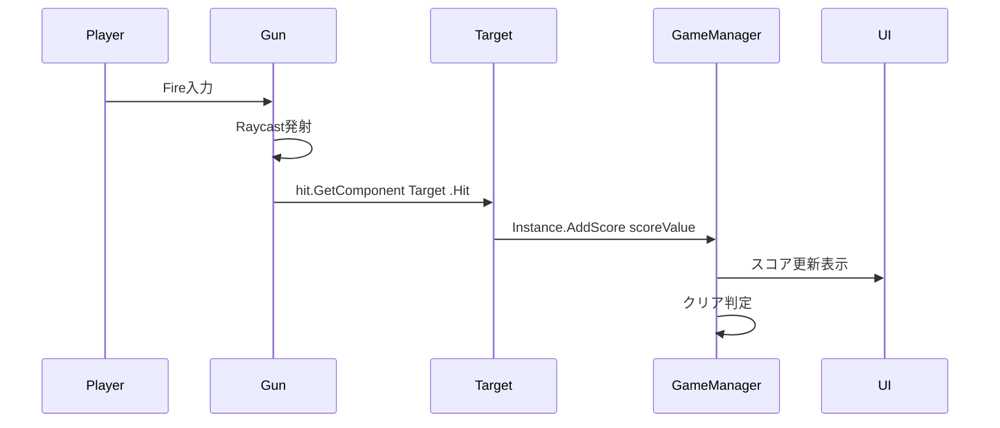

# Unityでつくる

## Unity初心者必見！クリア画面の簡単な作成手順

1.	画像を生成
Canvas内にImageを作成して、クリア画面用の画像を追加します。

2.	テキストを生成
Canvas内にText - TextMeshProを作成し、クリアメッセージ用のテキストを追加します。

3.	親オブジェクトを作成
Create Emptyで空のオブジェクトを生成し、GameClearUIと名前を付けます。

4.	子オブジェクトとして設定
作成した画像とテキストをGameClearUIの子オブジェクトとして配置します。


>オブジェクト名は自由に設定していただいて問題ありません。


:::message
Canvasを使用してUI（画像・テキスト・ボタン）を作成すると、自動的にCanvasとEventSystemが生成されます。
:::

5.	デザインを調整
ゲームビューを確認しながら、画像やテキストの大きさや内容を編集し、クリア画面を完成させます。


:::message
**注意点**
- 同じ階層内では、ヒエラルキー上で上にあるオブジェクトほど後ろに表示されます。
    - 例: ボタンが背景画像の後ろに隠れる場合があります。
- UI要素は位置座標によって画面に表示されないことがあります。
    - 対策: Canvas Scalerの設定を確認しましょう。
:::

## スコアを管理するGameManagerスクリプトを作成する！

```csharp:GameManager
using System.Collections;
using System.Collections.Generic;
using UnityEngine;

public class GameManager : MonoBehaviour
{
    public static GameManager Instance { get; private set; } // シングルトンインスタンス
    public GameObject gameClearUI;      // ゲームクリアのUI
    public int scoreValue;              // スコアの値
    public int scoreThreshold = 100;    // ゲームクリアのスコア閾値

    private int score;                  // 現在のスコア

    private void Awake()
    {
        if (Instance == null)
        {
            Instance = this;
            DontDestroyOnLoad(gameObject);  // シーン変更時に破棄されないようにする
        }
        else
        {
            Destroy(gameObject);            // 既にインスタンスがあれば新たなインスタンスを破棄
        }
    }

    private void Start()
    {
        gameClearUI.SetActive(false);            // ゲームクリアのUIを非表示
        Cursor.visible = false;                   // カーソルを非表示
        Cursor.lockState = CursorLockMode.Locked; // カーソルをロック
    }

    // スコアを追加するメソッド
    public void AddScore(int value)
    {
        score += value;                           // スコアを加算
        if (score >= scoreThreshold)              // スコアが閾値を超えた場合
        {
            ShowGameClearUI();                    // ゲームクリアのUIを表示
        }
    }

    // ゲームクリアのUIを表示するメソッド
    private void ShowGameClearUI()
    {
        gameClearUI.SetActive(true);               // ゲームクリアのUIを表示
        Cursor.visible = true;                     // カーソルを表示
        Cursor.lockState = CursorLockMode.None;    // カーソルのロックを解除
    }
}
```

## スコアを管理するGameManagerを実装する！

1.	親オブジェクトを作成
`Create Empty`で空のゲームオブジェクトを作成し、名前を`GameManager`に設定します。

2.	スクリプトをアタッチ
作成した`GameManager`オブジェクトに、管理用のスクリプトをアタッチします。

3.	スコア条件を設定
スクリプト内で`scoreValue`が`scoreThreshold`を超えたときに、ゲームクリアの処理が実行されるよう設定します。

>scoreValueは、ターゲットを撃破するたびに増加するため、初期値は0で問題ありません。


4. UIを設定
作成したクリア画面を`GameManager`のインスペクターの変数に割り当てます。


# Unityで動かす


# Unityを理解する

## UnityでGameManagerに必要なことをまとめる

本講座では、プレイヤーが一定のスコアを獲得した際にゲームクリアとします。GameManager は以下の主要な役割を担います。
•	ゲームの開始と終了の制御
•	スコアの管理



## GameManagerスクリプトの記述

### ゲーム開始

FPSゲームでは、ゲーム中にカーソルが不要なため、ゲーム開始時にカーソルを非表示にしてロックします。

```diff csharp:GameManager
using System.Collections;
using System.Collections.Generic;
using UnityEngine;

public class GameManager : MonoBehaviour
{
    public GameObject gameClearUI;      // ゲームクリアのUI

    private void Start()
    {
        gameClearUI.SetActive(false);             // ゲームクリアのUIを非表示
        Cursor.visible = false;                   // カーソルを非表示
        Cursor.lockState = CursorLockMode.Locked; // カーソルをロック
    }
}
```

### スコア管理

この関数は、ターゲットが撃たれた際に呼び出されます。以下の処理を行います。

1.	スコア変数に得点を加算。
2.	スコアがクリア条件（スコア閾値）を超えた場合に、クリア画面を表示する ShowGameClearUI 関数を呼び出します。

```diff csharp:GameManager
using System.Collections;
using System.Collections.Generic;
using UnityEngine;

public class GameManager : MonoBehaviour
{
    public GameObject gameClearUI;      // ゲームクリアのUI
+   public int scoreValue;              // スコアの値
+   public int scoreThreshold = 100;    // ゲームクリアのスコア閾値

+   private int score;                  // 現在のスコア

    private void Start()
    {
        // ...(省略)...
    }

+   // スコアを追加するメソッド
+   public void AddScore(int value)
+   {
+       score += value;                           // スコアを加算
+       if (score >= scoreThreshold)              // スコアが閾値を超えた場合
+       {
+           ShowGameClearUI();                    // ゲームクリアのUIを表示
+       }
+   }
}
```

### ゲーム終了

ゲーム終了時には、ゲームクリア画面を表示して、カーソルを再表示し、ロックを解除します。

```diff csharp:GameManager
using System.Collections;
using System.Collections.Generic;
using UnityEngine;

public class GameManager : MonoBehaviour
{
    public GameObject gameClearUI;      // ゲームクリアのUI
    public int scoreValue;              // スコアの値
    public int scoreThreshold = 100;    // ゲームクリアのスコア閾値

    private int score;                  // 現在のスコア

    private void Start()
    {
        // ...(省略)...
    }

    // スコアを追加するメソッド
    public void AddScore(int value)
    {
        // ...(省略)...
    }

+   // ゲームクリアのUIを表示するメソッド
+   private void ShowGameClearUI()
+   {
+       gameClearUI.SetActive(true);               // ゲームクリアのUIを表示
+       Cursor.visible = true;                     // カーソルを表示
+       Cursor.lockState = CursorLockMode.None;    // カーソルのロックを解除
+   }
}
```

### 最後にクラスをシングルトンとして扱う

```diff csharp:GameManager
using System.Collections;
using System.Collections.Generic;
using UnityEngine;

public class GameManager : MonoBehaviour
{
+   public static GameManager Instance { get; private set; } // シングルトンインスタンス
    public GameObject gameClearUI;      // ゲームクリアのUI
    public int scoreValue;              // スコアの値
    public int scoreThreshold = 100;    // ゲームクリアのスコア閾値

    private int score;                  // 現在のスコア

+   private void Awake()
+   {
+       if (Instance == null)
+       {
+           Instance = this;
+           DontDestroyOnLoad(gameObject);  // シーン変更時に破棄されないようにする
+       }
+       else
+       {
+           Destroy(gameObject);            // 既にインスタンスがあれば新たなインスタンスを破棄
+       }
+   }

    private void Start()
    {
         // ...(省略)...
    }

    // スコアを追加するメソッド
    public void AddScore(int value)
    {
         // ...(省略)...
    }

    // ゲームクリアのUIを表示するメソッド
    private void ShowGameClearUI()
    {
       // ...(省略)...
    }
}
```

### シングルトンとは？

#### 「クラスから作れるオブジェクトを1つだけにする仕組み」

#### 具体的にどういうこと？

通常、プログラムではクラスからいくつでもオブジェクトを作れます。

でも、「そのオブジェクトは1つだけでいい」という場合があります。

>##### 例えば：
>•	ゲームで使うカメラの管理
→ カメラは1つだけで十分ですよね？
>•	音楽や効果音を管理するオブジェクト
→ 何個もあると音が重なって困る！

#### もっと簡単に説明！

**シングルトンは、「学級委員長」みたいなものです。**

- クラス（教室）の中には何人も生徒がいます。
- でも、学級委員長は1人だけ。
- 学級委員長がクラスをまとめたり、みんなの意見を代表したりします。

**もし、学級委員長が何人もいたら大混乱！** シングルトンを使えば、学級委員長（オブジェクト）を1人（1つ）だけ作ることができます。

#### Unityでのシングルトンの使い方とメリット

シングルトンを使うことで、特定のオブジェクトを1つだけ作り、どこからでも簡単にアクセスできるようになります。これにより、コードがシンプルになり、ゲームの管理が効率的になります。

```diff csharp:GameManager
using System.Collections;
using System.Collections.Generic;
using UnityEngine;

public class GameManager : MonoBehaviour
{
    public static GameManager Instance { get; private set; } // シングルトンインスタンス

    private void Awake()
    {
        if (Instance == null)
        {
           Instance = this;
           DontDestroyOnLoad(gameObject);  // シーン変更時に破棄されないようにする
        }
        else
        {
            Destroy(gameObject);            // 既にインスタンスがあれば新たなインスタンスを破棄
        }
    }
}
```

## 完成したコード

```csharp:GameManager
using System.Collections;
using System.Collections.Generic;
using UnityEngine;

public class GameManager : MonoBehaviour
{
    public static GameManager Instance { get; private set; } // シングルトンインスタンス
    public GameObject gameClearUI;      // ゲームクリアのUI
    public int scoreValue;              // スコアの値
    public int scoreThreshold = 100;    // ゲームクリアのスコア閾値

    private int score;                  // 現在のスコア

    private void Awake()
    {
        if (Instance == null)
        {
            Instance = this;
            DontDestroyOnLoad(gameObject);  // シーン変更時に破棄されないようにする
        }
        else
        {
            Destroy(gameObject);            // 既にインスタンスがあれば新たなインスタンスを破棄
        }
    }

    private void Start()
    {
        gameClearUI.SetActive(false);            // ゲームクリアのUIを非表示
        Cursor.visible = false;                   // カーソルを非表示
        Cursor.lockState = CursorLockMode.Locked; // カーソルをロック
    }

    // スコアを追加するメソッド
    public void AddScore(int value)
    {
        score += value;                           // スコアを加算
        if (score >= scoreThreshold)              // スコアが閾値を超えた場合
        {
            ShowGameClearUI();                    // ゲームクリアのUIを表示
        }
    }

    // ゲームクリアのUIを表示するメソッド
    private void ShowGameClearUI()
    {
        gameClearUI.SetActive(true);               // ゲームクリアのUIを表示
        Cursor.visible = true;                     // カーソルを表示
        Cursor.lockState = CursorLockMode.None;    // カーソルのロックを解除
    }
}
```