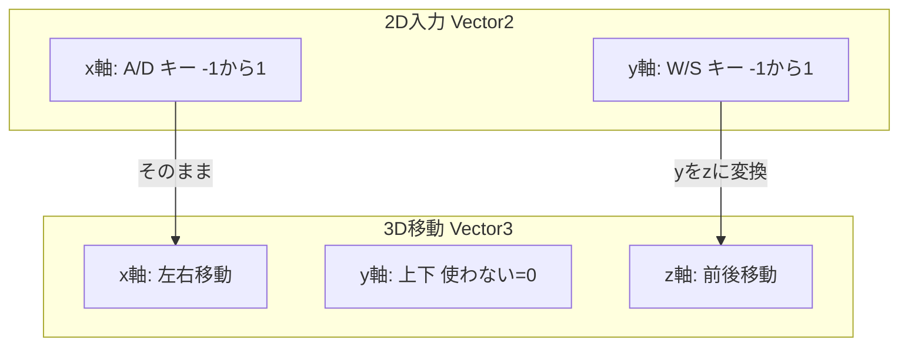

# Unityで事前準備

::: message
Unity6をご利用の場合、InputSystemはデフォルトでインストールされているため、このセクションはスルーして大丈夫です。ただし、もしインストールされていない場合は、以下の手順でインストールをお試しください。
:::

:::details InputSystemのダウンロード手順・InputActionMapの作成手順
# InputSystemのダウンロード手順
1. `Window > Package Manager`を開きます。


2. ドロップダウンメニューから`Unity Registry`を選択します。


3. 検索バーに`InputSystem`と入力して検索します。


# InputActionMapの作成手順

#### 1. Unityエディタの`Assets`メニューから`Create > Input Actions`を選択し、新しいInput Actionsファイルを作成します。


#### 2. 作成したファイルを開き、`Action Maps`セクションに新しいAction Mapを追加し、名前を付けます（例：`PlayerActions`）。


#### 3. アクションマップに以下のアクションを追加します。
•	Move: 移動操作を管理（例：W、A、S、Dキー）。
•	Look: 視点操作を管理（例：マウスやスティック入力）。
•	Shoot: 射撃を管理（例：右クリック）。
•   Reload : リロードを管理(例:Rキー)

#### 追加方法

作成したファイルを開き、`Actions`セクションに新しいActionを追加し、下記の写真を例に名前を付けます（例：`Move`）。


#### 5.	各アクションのバインドを設定
各アクションを選択し、対応する入力（キーやボタン）をバインドします。


:::

# Unityでつくる！

**詳しいコードの解説はのちに行います**

## `PlayerController`スクリプトの作成

**前回作成した`PlayerController`を以下のコードに更新してください。**

```csharp:PlayerController
using UnityEngine;
using UnityEngine.InputSystem;

public class PlayerController : MonoBehaviour
{
    private Vector2 moveInput;

    public void OnMove(InputAction.CallbackContext context)
    {
        moveInput = context.ReadValue<Vector2>();
    }

    private void Update()
    {
        Vector3 direction = new Vector3(moveInput.x, 0, moveInput.y);
        Debug.Log($"{direction}の方向へ移動します");
    }
}
```

:::details PlayerController (コメント入り)
```csharp:PlayerController
using UnityEngine;
using UnityEngine.InputSystem;

// プレイヤーを操作するクラス
public class PlayerController : MonoBehaviour
{
    // プレイヤーの移動入力を保持する変数
    private Vector2 moveInput;

    // "Player/Move"アクションが実行されたときに呼び出されるメソッド
    public void OnMove(InputAction.CallbackContext context)
    {
        // 入力された移動ベクトルを取得し、moveInputに格納
        moveInput = context.ReadValue<Vector2>();
    }

    // 毎フレーム呼び出されるメソッド
    private void Update()
    {
        // moveInputを基に3D空間での移動方向を計算
        Vector3 direction = new Vector3(moveInput.x, 0, moveInput.y);
        // 計算された移動方向をデバッグログに出力
        Debug.Log($"{direction}の方向へ移動します");
    }
}
```
:::

## コンポーネントをアタッチ・設定

**`PlayerInput`コンポーネントを追加**
Unityエディタのインスペクターで、Add Componentボタンをクリックし、Player Inputを検索して追加(アタッチ)します。

**`PlayerInput`コンポーネントの `Events`タブを開き、`Player` > `Move` に `PlayerController`スクリプトの`OnMove`関数を登録します。**

:::message
この設定によりキー入力があった際に、`PlayerController`の`OnMove`関数が呼び出されます。
:::


# Unityで動かす！


# Unityを理解する！

先ほどのプログラムを順を追って解説していきます。

## 『InputSystem』について

まずは、InputSystemについてです。

C#スクリプト内でInputSystemを利用するには、以下の形式でメソッドを作成します。
```csharp
On + アクション名(InputAction.CallbackContext context)
```
>例：OnMove、OnLook など。

### 引数`context`とは

引数のcontextには、入力情報が含まれています。この中の`context.ReadValue<Vector2>()`を使用して、入力値を取得します。

例えば、入力に対して、下記のVector2型の入力値を受け取れます。
	•	`A` + `S`キーを同時入力: Vector2(-1, -1)
	•	下矢印(↓)キーを入力: Vector2(0, -1)
	•	右上（↗︎）にスティック入力: Vector2(1, 1)
	•	前方（↑）にスティック入力: Vector2(0, 1)

### 実際のコードで理解する

以下のメソッドを使用して、入力値`context.ReadValue<Vector2>()`を取得し、`Update`で処理を実行します。

```diff csharp:PlayerController
using UnityEngine;
using UnityEngine.InputSystem;

public class PlayerController : MonoBehaviour
{
    private Vector2 moveInput;

    public void OnMove(InputAction.CallbackContext context)
    {
        moveInput = context.ReadValue<Vector2>(); // 入力値の2次元ベクトルを取得
    }

    private void Update()
    {
        // 移動操作
    }
}
```

::: message
名前空間(using)に、下記の記述が必要です。
```csharp
using UnityEngine.InputSystem;
```
:::

## 『ベクトル』をについて

### Vector2 moveInput とは。

`moveInput`（`Vector2`型）は、`W`、`A`、`S`、`D`キーやスティック入力情報を、引数のcontext.ReadValue<Vector2>()から受け取っています。

「左右・前後 にどれくらい入力しているか」を2次元ベクトルで取得します。

この2次元ベクトルは(`x`, `y`)で表され、それぞれ次のように役割があります
- `A` / `D`キー = 左右の移動
- `W` / `S`キー = 前後の移動

**2次元空間におけるベクトルは以下のように表せます**
**- (`x`, `y`) = 「左右の移動」「前後の移動」**



### 2次元ベクトルを3次元ベクトルに変換する

3Dゲーム（例：FPS）では、3次元空間での操作が必要です。

3次元ベクトルは、(`x`, `y`, `z`)の形式で表され、それぞれ以下の方向を示します：
- `A` / `D`キー = 左右の移動
- `Space`キー = 上下の移動 (ジャンプなど)
- `W` / `S`キー = 前後の移動

**3次元空間におけるベクトルは次のようになります**
**- (`x`, `y`, `z`) = 「左右の移動」「ジャンプ・しゃがみ」「前後の移動」**

したがって、2次元ベクトルを3次元ベクトルに変換する必要があります。

### 変換方法

2次元ベクトル(`x`, `y`)を3次元ベクトル(`x`, `y`, `z`)に変換する際、次のように値を割り当てます：
- 2次元ベクトルの`x`値を3次元ベクトルの`x`に設定
- 2次元ベクトルの`y`値を3次元ベクトルの`z`に設定

これで、3D空間での移動ベクトルが完成します。

```csharp
Vector3 direction = new Vector3(moveInput.x, 0, moveInput.y);
```

## 『InputSystem』と『ベクトル』で移動操作を実装する

今回は具体的な処理を実装せず、デバッグログで移動量を確認しています。
以下のコードで、移動入力の方向をログに出力します。

```csharp
Debug.Log($"{direction}の方向へ移動入力しています");
```

## 実際のコードで理解する

```csharp:PlayerController
using UnityEngine;
using UnityEngine.InputSystem;

public class PlayerController : MonoBehaviour
{
    private Vector2 moveInput;

    public void OnMove(InputAction.CallbackContext context)
    {
        moveInput = context.ReadValue<Vector2>();
    }

    private void Update()
    {
        Vector3 direction = new Vector3(moveInput.x, 0, moveInput.y);
        Debug.Log($"{direction}の方向へ移動します");
    }
}
```