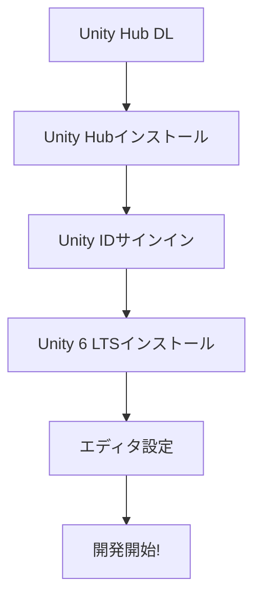

# Unityのダウンロード方法

Unityは、ゲーム・VR・シミュレーション、さらにはアプリケーション開発にも幅広く使われているリアルタイム3D開発プラットフォームです。これからUnityを始める方や、バージョンを更新したい方のために、Unityのダウンロードおよびセットアップ手順をわかりやすく紹介します。

## インストールフロー

# 1. 事前に準備するもの

- **パソコン**：Windows、macOS、Linuxで利用可能です。
- **インターネット接続**：安定したネットワーク環境が必要です。
- **最低システム要件**：[Unityシステム要件](https://unity.com/ja/download)（公式サイト）で確認してください。

# 2. Unity公式サイトへアクセス

まずはUnityの公式ダウンロードページにアクセスします。

https://unity.com/ja/download

ここでは、最新のLTS(Long Term Support)バージョンや、テックストリーム(最新機能を試せるバージョン)の情報が確認できます。最新のUnity6がオススメです！

# 3. Unity Hubのインストール

Unityをダウンロード・管理する最も簡単な方法は、「Unity Hub」という公式管理ツールを使用することです。

## Unity Hubとは？

Unity Hubは、複数のUnityバージョンやプロジェクトを一元管理できる便利なツールです。新規インストールからプロジェクト作成、サンプルプロジェクトのダウンロード、バージョン管理など、一括で行えるため、初心者から上級者まで幅広く利用されています。

## Unity Hubのダウンロード方法

1. [Unity公式ダウンロードページ](https://unity.com/ja/download)へアクセス  
2. 「Unity Hubをダウンロード」ボタンをクリック  
3. 使用中のOSに合ったインストーラーをダウンロードします（Windowsの場合は.exe、macOSの場合は.pkgなど）

## Unity Hubのインストール

- ダウンロードしたインストーラーを実行し、画面の指示に従ってインストールします。  
- インストール後、Unity Hubを起動すると、Unityアカウントへのログイン画面が表示されます。  
  - Unity ID（アカウント）を持っていない場合は、このタイミングで新規登録することができます。

# 4. Unityエディタのインストール

Unity HubからUnityエディタ本体をインストールします。

1. Unity Hubを起動し、サイドバーから「Installs（インストール）」タブを選択します。  
2. 「Install Editor（エディタをインストール）」もしくは「Add（追加）」ボタンをクリックします。  
3. インストール可能なUnityバージョンの一覧が表示されるので、安定性重視ならLTSバージョンを選びましょう。  
   （例：「Unity6 LTS」など）  
4. 「Next（次へ）」を押し、オプションモジュールを選択します。  
   - プラットフォームサポート（Windows, Mac, Linux, Android, iOS用など）  
   - Visual Studio Code（C#エディタ）  
   必要なものにチェックを入れて「Done」または「完了」をクリックします。  
5. ダウンロードとインストールが自動的に始まるので、完了するまで待ちます。

:::message
**注意**
MacOSをご利用の場合、C#エディタとしての`Visual Studio Code`サポートが終了しているため、別途`VSCode`または`Cursor`を手動でダウンロード・インストールしてください。
:::

### エディタ選択: VSCode vs Cursor

| エディタ | AI補完 | 価格 | おすすめ度 |
|---------|--------|------|----------|
| Visual Studio Code | 拡張機能で対応 | 無料 | 定番 |
| Cursor | 標準搭載 | 無料枠あり | AI時代のおすすめ |
| Visual Studio | 限定的 | 無料(Community) | Unity公式推奨 |

:::message
**AI時代のエディタ選び**: CursorはVSCodeベースでAIコード補完が標準搭載。タブキーを押すだけでコードが補完されるので、バイブコーディングの第一歩に最適です。本書のコードもCursorで写経すると、AIが次に書くべきコードを提案してくれます。
:::

#### VSCode : 定番エディタ
https://code.visualstudio.com/download

#### Cursor : 最新のAIエディタ
https://www.cursor.com/

# 5. Unityエディタの起動とプロジェクト作成

インストール完了後、Unity Hub上でインストールしたバージョンが一覧に表示されます。これでUnityエディタが使える状態になりました。

1. Unity Hubの「Projects（プロジェクト）」タブへ移動します。  
2. 「New Project（新規プロジェクト）」ボタンをクリックします。  
3. テンプレート（2D, 3D, VR, URPなど）を選択し、プロジェクト名と保存先フォルダを指定して「Create Project（プロジェクト作成）」をクリックします。  
4. 数十秒ほど待つと、Unityエディタが立ち上がり、メインウィンドウが表示され、すぐに開発を始めることができます。

:::message
**注意**
- **インストールが途中で止まる場合**：  
  ネットワークが不安定な可能性があります。Wi-Fiから有線接続へ変更する、または一時的なサーバー不具合がないかUnity公式フォーラムやTwitterを確認してください。

- **エディタが起動しない場合**：  
  グラフィックドライバやOSバージョン、ハードウェア要件を確認してください。また、Unity HubおよびUnityエディタを最新にアップデートしてみると改善することがあります。
:::

以下は、Unityエディタを日本語化する方法を紹介した記事です。Unityのバージョンによって手順や設定項目名が若干異なる場合がありますが、ここでは2021年以降の比較的新しいバージョンを想定した手順を示します。