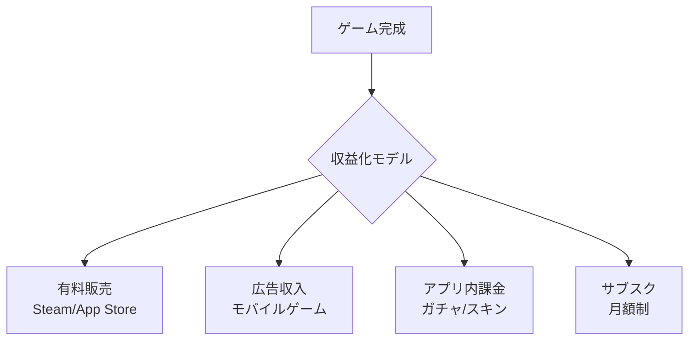

#### Unityを習得すれば、趣味としてのゲーム開発を超えて、明確な収益源を得ることが可能です。

## 自作アプリのリリースによる収益化
スマートフォン向けの2D・3Dゲームやインタラクティブなアプリを開発し、Apple App StoreやGoogle Play、あるいはWebGLを活用したブラウザ向けゲームプラットフォームで公開できます。
有料販売、広告収入、アプリ内課金、サブスクリプションなど、さまざまなマネタイズモデルを組み合わせることで、自分のアイデアを形にし、直接収益につなげることが可能です。

### 収益化フロー

### マネタイズモデル比較

| モデル | 初期収益 | 継続収益 | 難易度 | 向いているジャンル |
|--------|---------|---------|--------|------------------|
| 有料販売 | 高 | 低 | 中 | RPG, アドベンチャー |
| 広告収入 | 低 | 中 | 低 | カジュアル, パズル |
| アプリ内課金 | 中 | 高 | 高 | ソシャゲ, 対戦 |
| サブスク | 中 | 高 | 高 | MMO, サービス型 |

## AIツールで開発効率UP

2026年現在、AIの力で個人開発者でも十分に戦えます。CursorやChatGPTを使えば、コード生成・デバッグ・アセット作成のスピードが格段に上がります。**本書で学ぶ基礎 + AIツール = 最短でゲーム公開**という組み合わせが、今の時代の最強の武器です。

## Unityエンジニアとしての案件受注
さらに、Unityのスキルを身につけると、企業や個人から受託案件を得ることも視野に入ります。**筆者自身は大学2年生からゲーム・VR開発案件を受注し、平均月30万円の売上を確保してきた実績があり**、スキル次第で学習者にも同様のチャンスが巡ってきます。