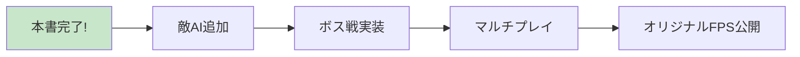

## メッセージ

これで本教材を使ったFPS開発は完了です！ですが、FPSゲームにはまだまだ多くのアレンジが可能です。たとえば、敵キャラクターの出現、射撃やリロード時の音声の追加、複雑なステージ設計などが挙げられます。**これまで学んだプログラムやアセットストアを活用して、ぜひ自分だけのオリジナルFPSゲームに挑戦してみてください！**

「どこでもUnity教室」は初心者の方でも安心してUnityを基礎から学べるよう設計されています。Unityでの学びは、ここからがスタートです。

## 次のステップ: ロードマップ

本書で学んだ基礎があれば、AIに「〇〇を実装して」と伝えるだけで新機能を追加できます。CursorやChatGPTをパートナーに、**オリジナルゲーム制作に挑戦しましょう**。バイブコーディングで、あなたのアイデアを最短でゲームに変えてください。

## アンケートのお願い

教材をより良くするため、数分程度のアンケートにご協力ください。いただいたご意見は今後のアップデートに活かします。
https://docs.google.com/forms/d/e/1FAIpQLSfkUgWppMe4MX4Wxfqx6EtzszRPr0akXoMwvw9Qw5kOdI_wtA/viewform?usp=sf_link

## ご購入者特典：Discordコミュニティへご参加ください

「どこでもUnity教室」のDiscordで不明点をお気軽に質問してください。学びの成果は #どこでもUnity教室 でシェアしていただけると嬉しいです。

## 最後までお読みいただきありがとうございました！

あなたのUnity開発の旅が、素晴らしいものとなりますように。

ゲーム開発所RYURYU 岡本 竜弥